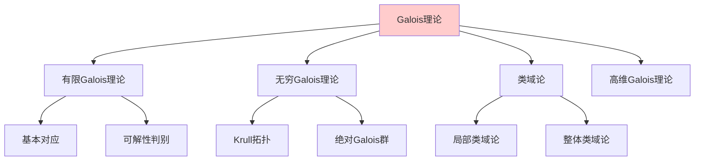
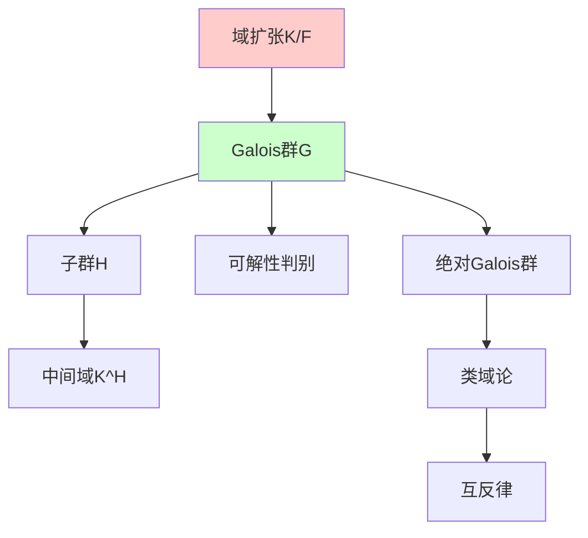

# Galois理论完整框架

---

**文档编号**: FM.L3.ALG.05  
**理论名称**: Galois理论完整框架  
**MSC分类**: 12Fxx (域扩张)  
**创建日期**: 2026年4月3日  
**版本**: 1.0

---

## 一、理论概述

### 1.1 理论定位

Galois理论建立了**域扩张**与**群论**之间的深刻联系，通过Galois群刻画多项式方程的可解性。从经典的有限Galois理论到现代的**无穷Galois理论**和**绝对Galois群**，这一理论成为数论、代数几何和算术几何的基石。

### 1.2 核心思想

| 核心思想 | 描述 | 重要性 |
|---------|------|-------|
| **对称性对应** | 域扩张 ↔ 子群 | 基本对偶 |
| **可解性** | 方程可解⇔群可解 | 代数方程 |
| **绝对Galois群** | G_Q = Gal(Q̄/Q) | 数论核心 |
| **逆Galois问题** | 哪些群是Galois群 | 开放问题 |

---

## 二、核心定义(L1)清单

| 定义名称 | 数学表述 | 层次 |
|---------|---------|-----|
| **Galois扩张** | 正规且可分的代数扩张 | L1 |
| **Galois群** | Gal(K/F) = Aut_F(K) | L1 |
| **固定子域** | K^H = {x∈K: σ(x)=x, ∀σ∈H} | L1 |
| **Krull拓扑** | 有限指数的子群为开集 | L1 |
| **绝对Galois群** | G_F = Gal(F^sep/F) | L1 |
| **范数剩余符号** | Artin映射 | L1 |
| **分圆特征** | χ: G_Q → Ẑ^× | L1 |

---

## 三、支撑定理(L2)清单

| 定理名称 | 陈述 | 重要性 |
|---------|------|-------|
| **Galois基本定理** | 中间域 ↔ 闭子群 | 核心定理 |
| **可解性定理** | 方程根式可解⇔Galois群可解 | 古典结果 |
| **Krull定理** | 无穷Galois对应的拓扑形式 | 无穷情形 |
| **局部互反律** | 局部类域论的核心 | 算术应用 |
| **Artin互反律** | 整体类域论的核心 | 全局理论 |
| **Shafarevich定理** | 可解群的实现 | 逆问题部分 |

---

## 四、理论结构图

---

## 五、向L4前沿的开放问题

| 问题/方向 | 描述 | 状态 |
|----------|------|------|
| **逆Galois问题** | 哪些有限群是Q上的Galois群 | 开放 |
| **Fontaine-Mazur** | p进Galois表示的几何性 | 研究中 |
| **Langlands纲领** | 数论-表示论对应 | L4 |
| **anabelian几何** | G_F决定F | L4 |

---

**文档信息**
- **创建日期**: 2026年4月3日
