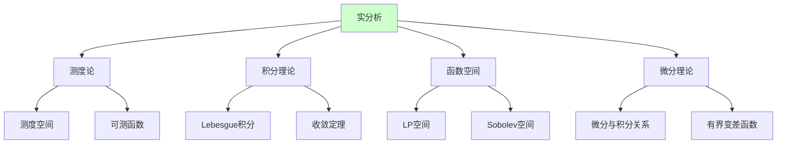
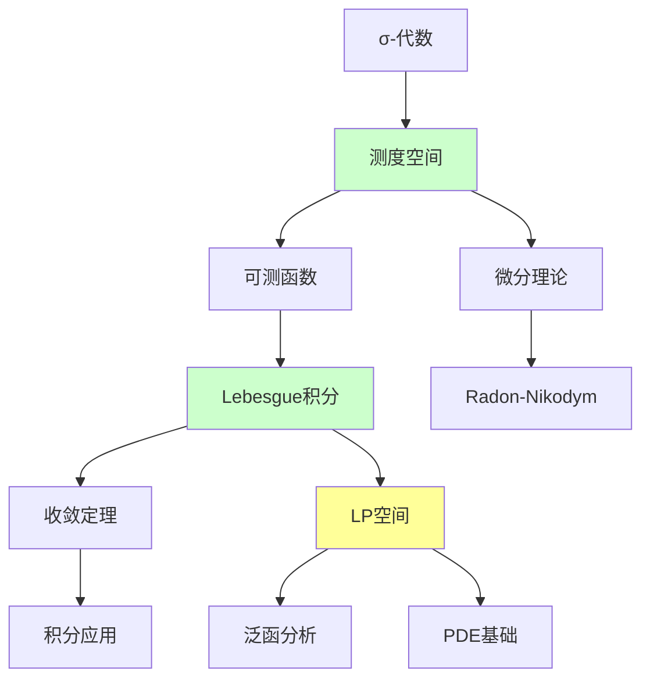

# 实分析理论框架

---

**文档编号**: FM.L3.ANA.01  
**理论名称**: 实分析理论框架  
**MSC分类**: 26-XX, 28-XX (实函数, 测度论)  
**创建日期**: 2026年4月3日  
**版本**: 1.0

---

## 📋 目录

1. [理论概述](#1-理论概述)
2. [核心定义(L1)清单](#2-核心定义l1清单)
3. [支撑定理(L2)清单](#3-支撑定理l2清单)
4. [理论结构图](#4-理论结构图)
5. [向L4前沿的开放问题](#5-向l4前沿的开放问题)

---

## 一、理论概述

### 1.1 理论定位

实分析是数学分析的**严格基础**，以**测度论**和**Lebesgue积分**为核心，建立了处理极限、积分和函数空间的严格理论框架。它是现代分析学各分支（泛函分析、偏微分方程、概率论）的共同基础。

### 1.2 核心思想

| 核心思想 | 描述 | 重要性 |
|---------|------|-------|
| **可测性** | 用σ-代数刻画"可测量"的集合 | 测度论基础 |
| **几乎处处** | 忽略零测集的影响 | 积分理论核心 |
| **极限交换** | 积分与极限何时可交换 | 收敛定理 |
| **完备化** | 不完备空间的完备化构造 | 函数空间理论 |

---

## 二、核心定义(L1)清单

### 2.1 测度论基础

| 定义名称 | 数学表述 | 层次 |
|---------|---------|-----|
| **σ-代数** | 对可数运算封闭的集族 | L1 |
| **测度** | 可数可加的集函数 μ: F → [0,∞] | L1 |
| **可测空间** | (X, F) 对 | L1 |
| **测度空间** | (X, F, μ) 三元组 | L1 |
| **完备测度** | 零测子集都可测 | L1 |
| **外测度** | 次可数可加的集函数 | L1 |
| **Caratheodory扩张** | 外测度诱导测度 | L1 |

### 2.2 可测函数与积分

| 定义名称 | 数学表述 | 层次 |
|---------|---------|-----|
| **可测函数** | 原像保持可测性 | L1 |
| **简单函数** | 有限值可测函数 | L1 |
| **Lebesgue积分** | 简单函数积分的极限 | L1 |
| **几乎处处收敛** | 除去零测集的逐点收敛 | L1 |
| **依测度收敛** | μ({|fn-f|>ε}) → 0 | L1 |

### 2.3 函数空间

| 定义名称 | 数学表述 | 层次 |
|---------|---------|-----|
| **L^p空间** | ∫|f|^p < ∞ 的函数类 | L1 |
| **本性上确界** | ess sup |f| | L1 |
| **弱收敛** | 对偶配对收敛 | L1 |
| **强收敛** | 范数收敛 | L1 |
| **分布函数** | λ_f(t) = μ({|f|>t}) | L1 |

### 2.4 微分与积分

| 定义名称 | 数学表述 | 层次 |
|---------|---------|-----|
| **绝对连续** | ε-δ定义的连续性 | L1 |
| **有界变差** | 全变差有限 | L1 |
| **Vitali覆盖** | 精细覆盖引理 | L1 |
| **Hardy-Littlewood极大函数** | Mf(x) = sup 平均 | L1 |
| **Lebesgue点** | 平均收敛点 | L1 |

---

## 三、支撑定理(L2)清单

### 3.1 测度论基本定理

| 定理名称 | 陈述 | 重要性 |
|---------|------|-------|
| **Caratheodory扩张定理** | σ-有限预测度可唯一扩张 | 测度存在性 |
| **测度唯一性** | π-系上相等则扩张相等 | 唯一性判别 |
| **正则性** | Borel测度的内外正则性 | 逼近理论 |
| **乘积测度** | Fubini定理的条件 | 重积分理论 |

### 3.2 收敛定理

| 定理名称 | 陈述 | 重要性 |
|---------|------|-------|
| **单调收敛定理** | fn ↑ f ⇒ ∫fn → ∫f | 极限与积分交换 |
| **Fatou引理** | ∫liminf ≤ liminf∫ | 不等式工具 |
| **控制收敛定理** | |fn|≤g, fn→f a.e. ⇒ ∫fn→∫f | 最常用工具 |
| **Vitali收敛定理** | 一致可积条件下的收敛 | 推广DCT |
| **Egorov定理** | a.e.收敛→几乎一致收敛 | 收敛强化 |

### 3.3 微分定理

| 定理名称 | 陈述 | 重要性 |
|---------|------|-------|
| **Lebesgue微分定理** | 不定积分的几乎处处可微 | 微积分基本定理 |
| **Lebesgue分解** | 有界变差 = 绝对连续 + 奇异 + 跳跃 | 函数分解 |
| **Radon-Nikodym定理** | μ << ν ⇒ dμ = fdν | 密度存在性 |
| **Fubini求导定理** | f = f(a) + ∫f' 的刻画 | 绝对连续特征 |

### 3.4 LP空间定理

| 定理名称 | 陈述 | 重要性 |
|---------|------|-------|
| **Riesz-Fischer** | L^p完备 | 完备性基础 |
| **Holder不等式** | ||fg||_1 ≤ ||f||_p ||g||_q | 基本不等式 |
| **Minkowski不等式** | 三角不等式 | 范数公理 |
| **对偶表示** | (L^p)* = L^q | 对偶理论 |
| **插值定理** | Riesz-Thorin插值 | 算子理论 |

---

## 四、理论结构图

---

## 五、向L4前沿的开放问题

| 方向 | 描述 | 前沿性 |
|-----|------|-------|
| **非交换积分** | von Neumann代数上的积分 | L4 |
| **自由概率** | 随机矩阵极限理论 | L4 |
| **最优输运** | Wasserstein空间几何 | L4 |
| **粗糙路径** | 非光滑驱动的微分方程 | L4 |

---

**文档信息**
- **创建日期**: 2026年4月3日
- **相关文档**: 泛函分析理论、PDE理论、概率论基础
