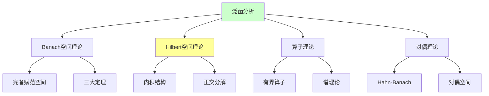
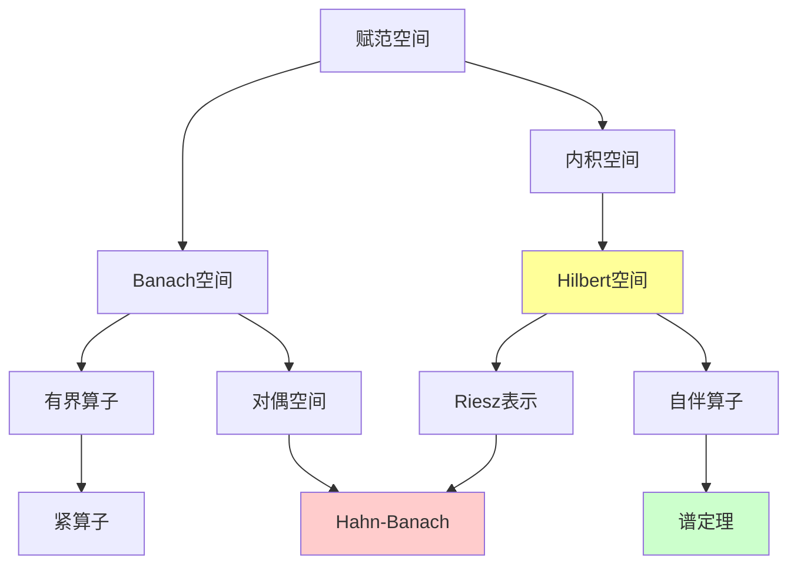

# 泛函分析理论（Banach空间、Hilbert空间）

---

**文档编号**: FM.L3.ANA.03  
**理论名称**: 泛函分析理论  
**MSC分类**: 46-XX (泛函分析)  
**创建日期**: 2026年4月3日  
**版本**: 1.0

---

## 📋 目录

1. [理论概述](#1-理论概述)
2. [核心定义(L1)清单](#2-核心定义l1清单)
3. [支撑定理(L2)清单](#3-支撑定理l2清单)
4. [理论结构图](#4-理论结构图)
5. [向L4前沿的开放问题](#5-向l4前沿的开放问题)

---

## 1. 理论概述

### 1.1 理论定位

泛函分析研究**无穷维向量空间**及其上的**线性算子**，是连接分析、代数和拓扑的桥梁。以**Banach空间**和**Hilbert空间**为核心，建立了现代数学物理和偏微分方程的严格框架。

### 1.2 核心思想

| 核心思想 | 描述 | 重要性 |
|---------|------|-------|
| **无穷维几何** | 无限维空间的几何性质 | 与有限维的本质差异 |
| **对偶性** | 空间与其对偶的配对 | 弱拓扑、表示论 |
| **谱分解** | 算子的谱分析 | 量子力学基础 |
| **紧性** | 无穷维中的有限维逼近 | 紧算子理论 |

---

## 2. 核心定义(L1)清单

### 2.1 Banach空间基础

| 定义名称 | 数学表述 | 层次 |
|---------|---------|-----|
| **Banach空间** | 完备的赋范向量空间 | L1 |
| **有界线性算子** | ||Tx|| ≤ C||x|| | L1 |
| **算子范数** | ||T|| = sup_{||x||=1} ||Tx|| | L1 |
| **等距同构** | 保持范数的线性同构 | L1 |
| **商空间** | X/M 的诱导范数 | L1 |

### 2.2 Hilbert空间结构

| 定义名称 | 数学表述 | 层次 |
|---------|---------|-----|
| **内积空间** | <x,y> 满足公理 | L1 |
| **Hilbert空间** | 完备的内积空间 | L1 |
| **正交补** | M^⊥ = {x: <x,m>=0, ∀m∈M} | L1 |
| **规范正交基** | 完备的正交规范集 | L1 |
| **正交投影** | 到闭子空间的最短距离投影 | L1 |

### 2.3 算子理论

| 定义名称 | 数学表述 | 层次 |
|---------|---------|-----|
| **紧算子** | 有界集像相对紧 | L1 |
| **Fredholm算子** | 核有限、余核有限、值域闭 | L1 |
| **谱** | σ(T) = {λ: T-λI不可逆} | L1 |
| **自伴算子** | T = T* | L1 |
| **酉算子** | U*U = UU* = I | L1 |

### 2.4 对偶与弱拓扑

| 定义名称 | 数学表述 | 层次 |
|---------|---------|-----|
| **对偶空间** | X* = B(X, K) | L1 |
| **弱收敛** | x_n ⇀ x: f(x_n) → f(x) ∀f∈X* | L1 |
| **弱*收敛** | f_n ⇀* f: f_n(x) → f(x) ∀x | L1 |
| **自反空间** | X ≅ X** | L1 |
| **一致凸性** | 中点凸性条件 | L1 |

---

## 3. 支撑定理(L2)清单

### 3.1 三大基本定理

| 定理名称 | 陈述 | 重要性 |
|---------|------|-------|
| **一致有界原理** | 点态有界⇒一致有界 | 共鸣定理 |
| **开映射定理** | 满射开映射 | 逆算子定理 |
| **闭图像定理** | 图像闭⇒连续 | 闭算子刻画 |

### 3.2 Hahn-Banach体系

| 定理名称 | 陈述 | 重要性 |
|---------|------|-------|
| **Hahn-Banach** | 子空间泛函可保范扩张 | 对偶理论基石 |
| **几何形式** | 凸集分离定理 | 优化理论 |
| **复形式** | 复空间的保范扩张 | 复分析应用 |

### 3.3 Hilbert空间定理

| 定理名称 | 陈述 | 重要性 |
|---------|------|-------|
| **Riesz表示** | 连续泛函的内积表示 | 对偶刻画 |
| **正交分解** | H = M ⊕ M^⊥ | 投影定理 |
| **Lax-Milgram** | 双线性形式的变分解 | PDE应用 |
| **谱定理** | 自伴算子的谱分解 | 量子力学 |

### 3.4 紧算子理论

| 定理名称 | 陈述 | 重要性 |
|---------|------|-------|
| **Riesz-Schauder** | 紧算子的谱理论 | 积分方程 |
| **Fredholm抉择** | 解的存在唯一性 | 线性方程 |
| **谱紧性** | 紧算子谱的可数性 | 谱理论 |

---

## 4. 理论结构图

---

## 5. 向L4前沿的开放问题

| 问题/方向 | 描述 | 前沿性 |
|----------|------|-------|
| **不变子空间问题** | 每个算子是否有非平凡不变子空间 | 开放问题 |
| **Banach空间分类** | 同构分类的完全不变量 | 研究中 |
| **量子群** | 非交换对称性 | L4 |
| **自由概率** | 随机矩阵的极限理论 | L4 |
| **非交换几何** | Connes的谱三元组 | L4 |

---

**文档信息**
- **创建日期**: 2026年4月3日
- **相关文档**: 实分析理论、算子代数、PDE理论
