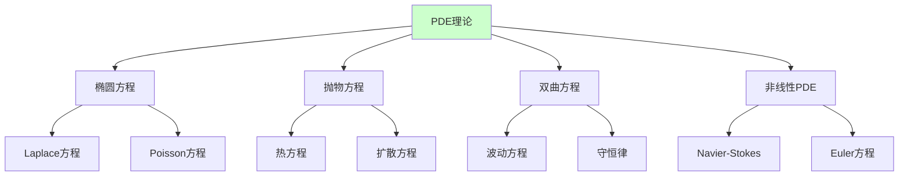
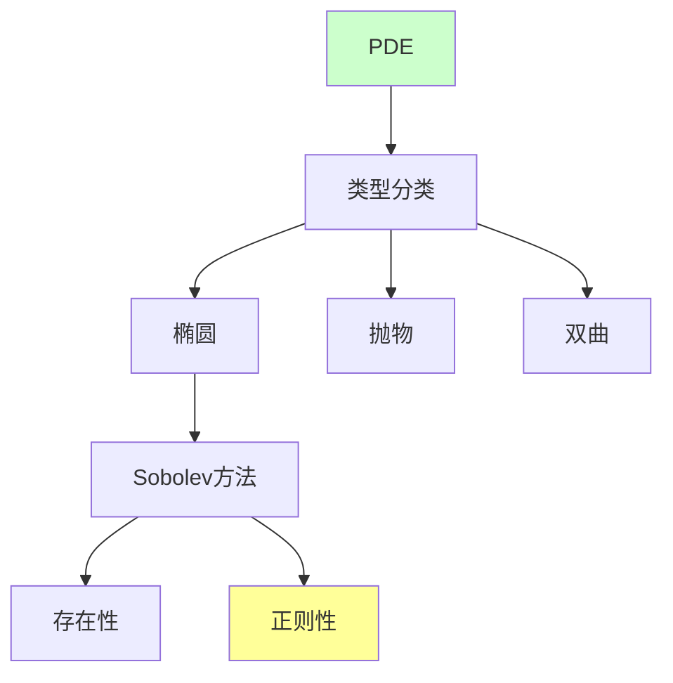

# 偏微分方程理论

---

**文档编号**: FM.L3.ANA.04  
**理论名称**: 偏微分方程理论  
**MSC分类**: 35-00 (偏微分方程)  
**创建日期**: 2026年4月3日  
**版本**: 1.0

---

## 一、理论概述

### 1.1 理论定位

偏微分方程理论研究**多元函数的微分方程**，是描述物理、工程、金融等领域现象的核心数学工具。从经典的椭圆、抛物、双曲分类到现代的**Sobolev空间**和**正则性理论**，PDE理论已成为连接分析、几何和概率的庞大体系。

### 1.2 核心思想

| 核心思想 | 描述 | 重要性 |
|---------|------|-------|
| **弱解** | 分布意义下的解 | 存在性 |
| **Sobolev空间** | 弱可微函数空间 | 函数框架 |
| **先验估计** | 解的正则性控制 | 存在性证明 |
| **正则性** | 弱解的光滑性 | 经典解 |

---

## 二、核心定义(L1)清单

| 定义名称 | 数学表述 | 层次 |
|---------|---------|-----|
| **Sobolev空间** | W^{k,p}: 弱导数在L^p | L1 |
| **H^1空间** | W^{1,2}, Hilbert结构 | L1 |
| **迹算子** | 边界值的延拓 | L1 |
| **弱解** | 分部积分后的变分形式 | L1 |
| **粘性解** | 比较原理定义的解 | L1 |
| **特征值** | Lu = λu 的非零解 | L1 |
| **主特征值** | 最小正特征值 | L1 |

---

## 三、支撑定理(L2)清单

| 定理名称 | 陈述 | 重要性 |
|---------|------|-------|
| **Lax-Milgram** | 双线性形式的变分解 | 椭圆PDE |
| **Sobolev嵌入** | W^{k,p} ↪ L^q 或 C^m | 紧性 |
| **Rellich-Kondrachov** | 有界域紧嵌入 | 紧算子 |
| **内部正则性** | 解在内部的光滑性 | 正则性 |
| **Schauder估计** | Holder范数控制 | 经典解 |
| **De Giorgi-Nash** | 散度形式方程的连续性 | 里程碑 |

---

## 四、理论结构图

---

## 五、向L4前沿的开放问题

| 问题/方向 | 描述 | 状态 |
|----------|------|------|
| **Navier-Stokes** | 3维光滑解的存在性 | 千年难题 |
| **Yang-Mills** | 规范场的质量间隙 | 千年难题 |
| **平均曲率流** | 奇点分析 | L4 |
| **波动方程** | 长时间行为 | L4 |

---

**文档信息**
- **创建日期**: 2026年4月3日
