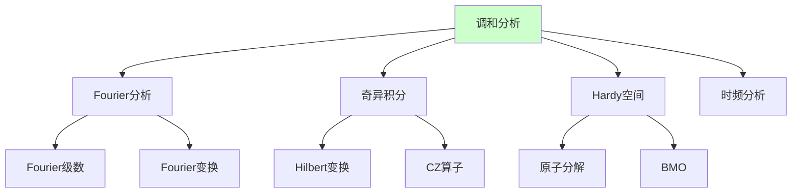

# 调和分析理论

---

**文档编号**: FM.L3.ANA.05  
**理论名称**: 调和分析理论  
**MSC分类**: 42-00 (调和分析)  
**创建日期**: 2026年4月3日  
**版本**: 1.0

---

## 一、理论概述

### 1.1 理论定位

调和分析研究**函数及其Fourier变换**的性质，以及**卷积算子**的行为。从经典的Fourier级数到现代的**Calderón-Zygmund理论**和**Hardy空间**，调和分析已成为PDE、复分析、概率论和数论的统一工具。

---

## 二、核心定义(L1)清单

| 定义名称 | 数学表述 | 层次 |
|---------|---------|-----|
| **Fourier变换** | f̂(ξ) = ∫f(x)e^{-2πix·ξ}dx | L1 |
| **卷积** | f*g(x) = ∫f(y)g(x-y)dy | L1 |
| **Hardy-Littlewood极大函数** | Mf(x) = sup (1/|B|)∫_B|f| | L1 |
| **BMO** | 有界平均振动函数 | L1 |
| **A_p权** | Muckenhoupt条件 | L1 |
| **Calderón-Zygmund核** | 标准核条件 | L1 |
| **Hardy空间** | H^p: 原子分解 | L1 |

---

## 三、支撑定理(L2)清单

| 定理名称 | 陈述 | 重要性 |
|---------|------|-------|
| **Plancherel定理** | ||f̂||_2 = ||f||_2 | 基本等式 |
| **Hausdorff-Young** | ||f̂||_q ≤ ||f||_p | 插值 |
| **Carleson定理** | Fourier级数a.e.收敛 | 里程碑 |
| **Hardy-Littlewood极大定理** | M: L^p → L^p 有界 | 基本工具 |
| **Calderón-Zygmund分解** | 好-坏函数分解 | 技术核心 |
| **T1定理** | 奇异积分有界性判别 | David-Journé |

---

## 四、向L4前沿的开放问题

| 方向 | 描述 | 前沿性 |
|-----|------|-------|
| **多线性调和分析** | 多线性算子 | L4 |
| **傅里叶限制猜想** | 流形上的Fourier变换 | L4 |
| **Kakeya问题** | 几何测度论联系 | L4 |
| **时频分析** | 小波、Gabor分析 | L4 |

---

**文档信息**
- **创建日期**: 2026年4月3日

---

## 参考文献

- Timothy Gowers (ed.), *The Princeton Companion to Mathematics*, 1st ed., Princeton University Press, 2008, ISBN: 9780691118802 / MR2467561
- Daniel J. Velleman, *How to Prove It: A Structured Approach*, 2nd ed., Cambridge University Press, 2006, ISBN: 9780521675994 / MR2448845