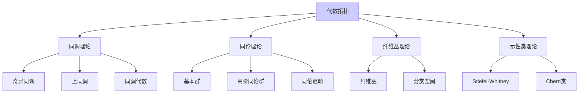
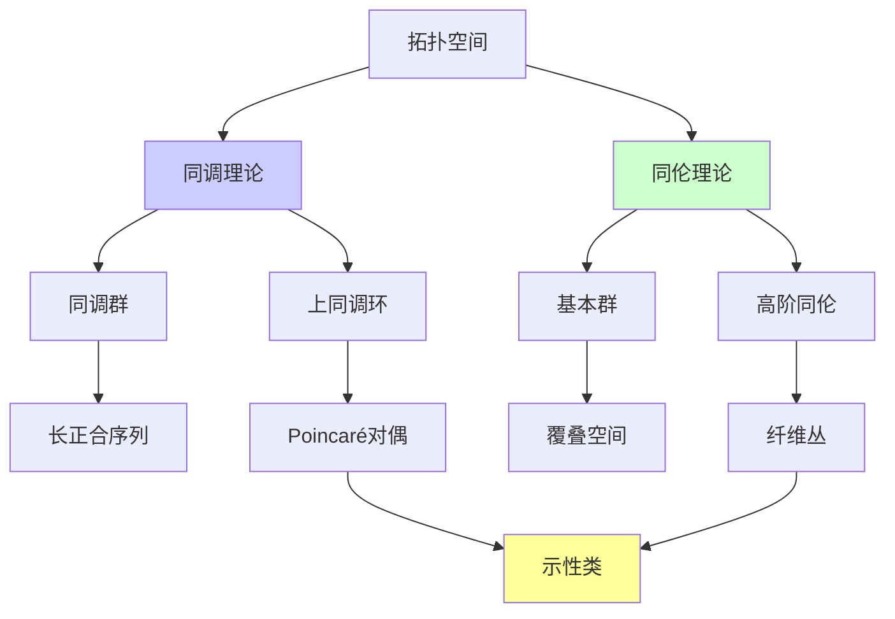

# 代数拓扑理论（同调、同伦）

---

**文档编号**: FM.L3.TOP.01  
**理论名称**: 代数拓扑理论  
**MSC分类**: 55-00 (代数拓扑)  
**创建日期**: 2026年4月3日  
**版本**: 1.0

---

## 📋 目录

1. 理论概述
2. 核心定义(L1)清单
3. 支撑定理(L2)清单
4. 理论结构图
5. 向L4前沿的开放问题

---

## 一、理论概述

### 1.1 理论定位

代数拓扑使用**代数工具**研究**拓扑空间的性质**，通过同调、同伦等不变量将几何问题转化为代数问题。它是连接拓扑学、几何学、代数学和分析学的核心桥梁。

### 1.2 核心思想

| 核心思想 | 描述 | 典型应用 |
|---------|------|---------|
| **函子不变量** | 拓扑空间的代数不变量 | 区分不同胚空间 |
| **可计算性** | 将几何转化为代数计算 | 具体计算工具 |
| **长正合序列** | 空间关系的代数反映 | 递推计算 |
| **分类空间** | 用同伦分类丛 | 示性类理论 |

---

## 二、核心定义(L1)清单

### 2.1 同调理论

| 定义名称 | 数学表述 | 层次 |
|---------|---------|-----|
| **奇异单形** | σ: Δ^n → X 连续映射 | L1 |
| **链复形** | C_n(X) = 自由Abel群 | L1 |
| **边缘算子** | ∂: C_n → C_{n-1} | L1 |
| **同调群** | H_n(X) = ker∂ / im∂ | L1 |
| **相对同调** | H_n(X, A) = H_n(C(X)/C(A)) | L1 |
| **约化同调** | 增强链复形 | L1 |

### 2.2 上同调理论

| 定义名称 | 数学表述 | 层次 |
|---------|---------|-----|
| **上链复形** | C^n(X; G) = Hom(C_n, G) | L1 |
| **上同调群** | H^n(X; G) | L1 |
| **杯积** | ∪: H^p × H^q → H^{p+q} | L1 |
| **卡积** | ∩: H^p × H_q → H_{q-p} | L1 |
| **万有系数** | H^n与H_n的关系 | L1 |

### 2.3 同伦理论

| 定义名称 | 数学表述 | 层次 |
|---------|---------|-----|
| **同伦** | f ≃ g: X × I → Y | L1 |
| **基本群** | π_1(X, x_0) | L1 |
| **高阶同伦群** | π_n(X) = [S^n, X] | L1 |
| **CW复形** | 胞腔粘附构造 | L1 |
| **覆叠空间** | 局部同胚的纤维化 | L1 |
| **道路提升** | 覆叠映射的唯一提升 | L1 |

### 2.4 纤维丛

| 定义名称 | 数学表述 | 层次 |
|---------|---------|-----|
| **纤维丛** | p: E → B 局部平凡 | L1 |
| **向量丛** | 纤维为向量空间 | L1 |
| **主丛** | 纤维为Lie群 | L1 |
| **分类空间** | BG 分类G-主丛 | L1 |
| **示性类** | 丛的不变量 | L1 |

---

## 三、支撑定理(L2)清单

### 3.1 同调基本定理

| 定理名称 | 陈述 | 重要性 |
|---------|------|-------|
| **同伦不变性** | 同伦等价诱导同调同构 | 拓扑不变量 |
| **切除定理** | 适当子集切除不改变同调 | 计算工具 |
| **Mayer-Vietoris** | 并集的MV序列 | 粘合计算 |
| **维数公理** | H_n(pt) = 0 (n>0) | Eilenberg-Steenrod |
| **Poincaré对偶** | H^i ≅ H_{n-i} (紧流形) | 流形对偶 |

### 3.2 同伦基本定理

| 定理名称 | 陈述 | 重要性 |
|---------|------|-------|
| **van Kampen定理** | 并集的基本群 | 计算工具 |
| **Hurewicz定理** | 第一个非零同伦≅同调 | 联系定理 |
| **Whitehead定理** | 弱同伦等价⇒同伦等价(CW) | 等价判别 |
| **覆叠同伦性质** | 纤维化的同伦提升 | 纤维丛工具 |

### 3.3 对偶性与乘积

| 定理名称 | 陈述 | 重要性 |
|---------|------|-------|
| **万有系数定理** | 上同调与同调的关系 | 计算工具 |
| **Künneth公式** | 乘积空间同调 | 乘积计算 |
| **Alexander对偶** | S^n子空间的对偶 | 嵌入理论 |
| **Lefschetz对偶** | 带边流形的对偶 | 流形理论 |

### 3.4 示性类

| 定理名称 | 陈述 | 重要性 |
|---------|------|-------|
| **分裂原理** | 复丛分裂为线丛 | 计算工具 |
| **Whitney和公式** | c(E⊕F) = c(E)∪c(F) | 乘性 |
| **Gauss-Bonnet-Chern** | Euler类的积分 | 几何联系 |
| **Thom同构** | 丛上同调的Thom类 | 拓扑构造 |

---

## 四、理论结构图

---

## 五、向L4前沿的开放问题

| 问题/方向 | 描述 | 前沿性 |
|----------|------|-------|
| **同伦群计算** | 球面同伦群的完整计算 | 长期开放 |
| **光滑Poincaré猜想** | 4维光滑情形 | 部分解决 |
| **拓扑K理论** | 广义上同调理论 | L4 |
| **椭圆上同调** | 形变与模形式 | L4 |
| **同伦类型论** | 类型=空间 | L4 |
| **拓扑量子场论** | 流形不变量 | L4 |

---

**文档信息**
- **创建日期**: 2026年4月3日
- **相关文档**: 微分几何理论、代数几何基础、同调代数
