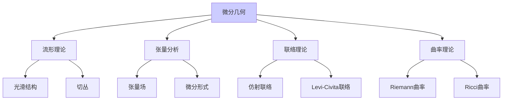
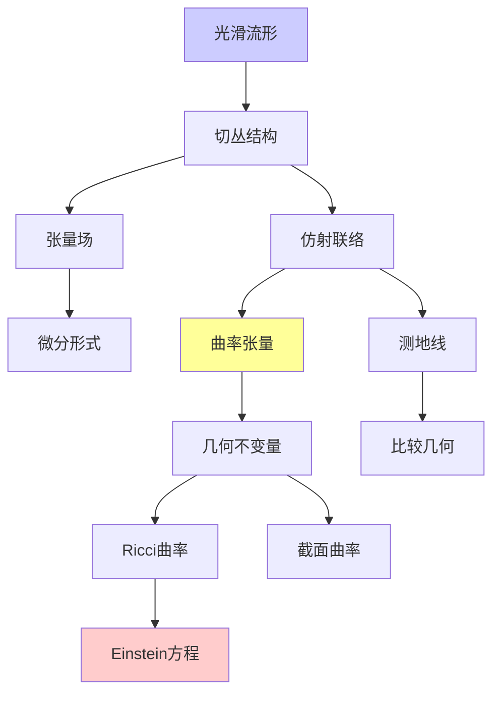

# 微分几何理论（流形、联络）

---

**文档编号**: FM.L3.TOP.02  
**理论名称**: 微分几何理论  
**MSC分类**: 53-XX (微分几何)  
**创建日期**: 2026年4月3日  
**版本**: 1.0

---

## 📋 目录

1. [理论概述](#1-理论概述)
2. [核心定义(L1)清单](#2-核心定义l1清单)
3. [支撑定理(L2)清单](#3-支撑定理l2清单)
4. [理论结构图](#4-理论结构图)
5. [向L4前沿的开放问题](#5-向l4前沿的开放问题)

---

## 一、理论概述

### 1.1 理论定位

微分几何研究**光滑流形**及其上的**几何结构**，是连接分析、代数和拓扑的核心学科。从曲线的曲率到Einstein场方程，微分几何为现代物理提供了数学语言。

### 1.2 核心思想

| 核心思想 | 描述 | 重要性 |
|---------|------|-------|
| **局部坐标** | 用欧氏空间片描述流形 | 计算基础 |
| **协变导数** | 联络给出的方向导数 | 平行移动 |
| **曲率** | 联络的不可交换性 | 几何本质 |
| **测地线** | 自平行曲线 | 最短路径 |

---

## 二、核心定义(L1)清单

### 2.1 流形基础

| 定义名称 | 数学表述 | 层次 |
|---------|---------|-----|
| **拓扑流形** | 局部同胚于R^n的Hausdorff空间 | L1 |
| **光滑结构** | 相容的极大图册 | L1 |
| **光滑映射** | 坐标表示光滑 | L1 |
| **切空间** | T_pM = 导子空间 | L1 |
| **切丛** | TM = ⨆_p T_pM | L1 |
| **向量场** | 切丛的光滑截面 | L1 |

### 2.2 张量与形式

| 定义名称 | 数学表述 | 层次 |
|---------|---------|-----|
| **张量场** | 多重线性映射场 | L1 |
| **微分形式** | 反对称张量场 | L1 |
| **外微分** | d: Ω^k → Ω^{k+1} | L1 |
| **Lie导数** | L_X 沿向量场的导数 | L1 |
| **内积** | i_X: 向量缩并形式 | L1 |

### 2.3 联络理论

| 定义名称 | 数学表述 | 层次 |
|---------|---------|-----|
| **仿射联络** | ∇: X(M) × X(M) → X(M) | L1 |
| **Levi-Civita联络** | 无挠、度量相容的唯一联络 | L1 |
| **Christoffel符号** | 联络的坐标表示 | L1 |
| **平行移动** | 沿曲线的向量保持 | L1 |
| **测地线** | ∇_{γ'}γ' = 0 | L1 |
| **指数映射** | exp_p: T_pM → M | L1 |

### 2.4 曲率理论

| 定义名称 | 数学表述 | 层次 |
|---------|---------|-----|
| **Riemann曲率** | R(X,Y)Z = ∇_X∇_YZ - ∇_Y∇_XZ - ∇_[X,Y]Z | L1 |
| **截面曲率** | 2维子空间的曲率 | L1 |
| **Ricci曲率** | Ric(X,Y) = tr(Z ↦ R(Z,X)Y) | L1 |
| **标量曲率** | S = tr(Ric) | L1 |
| **曲率形式** | Ω = dω + ω∧ω | L1 |

---

## 三、支撑定理(L2)清单

### 3.1 存在唯一性

| 定理名称 | 陈述 | 重要性 |
|---------|------|-------|
| **Frobenius定理** | 可积分布⇔对合性 | 子流形存在 |
| **Levi-Civita唯一性** | 度量确定唯一无挠相容联络 | Riemann几何基础 |
| **指数映射局部微分同胚** | exp_p在原点附近是微分同胚 | 法坐标存在 |

### 3.2 曲率与拓扑

| 定理名称 | 陈述 | 重要性 |
|---------|------|-------|
| **Gauss-Bonnet定理** | ∫KdA = 2πχ(M) | 曲率-拓扑联系 |
| **Chern-Gauss-Bonnet** | Euler类的积分 | 高维推广 |
| **Bochner技巧** | 曲率⇒调和形式消失 | 拓扑约束 |
| **Synge定理** | 正截面曲率⇒单连通/非定向 | 拓扑结果 |

### 3.3 比较几何

| 定理名称 | 陈述 | 重要性 |
|---------|------|-------|
| **Hadamard定理** | 非正曲率完备流形⇔R^n | 整体几何 |
| **Bonnet-Myers** | Ricci下界⇒直径有限 | 紧性 |
| **Rauch比较** | 曲率比较⇒Jacobi场比较 | 比较几何基础 |
| **Toponogov定理** | 三角比较定理 | 距离几何 |

### 3.4 变分理论

| 定理名称 | 陈述 | 重要性 |
|---------|------|-------|
| **第一变分公式** | 能量泛函的临界点是测地线 | 测地线刻画 |
| **第二变分公式** | 指标形式的极值性 | 共轭点理论 |
| **Morse指标定理** | Morse指标=共轭点数 | Morse理论 |
| **Jacobi场理论** | 变分向量场 | 测地线偏差 |

---

## 四、理论结构图

---

## 五、向L4前沿的开放问题

| 问题/方向 | 描述 | 前沿性 |
|----------|------|-------|
| **Poincaré猜想** | 3维情形已解决 | 历史问题 |
| **正质量猜想** | 广义相对论中的质量正性 | 已解决(2017) |
| **Ricci流** | Hamilton-Perelman理论 | L4 |
| **Yamabe问题** | 共形度量下的常标量曲率 | 研究中 |
| **特殊全纯群** | G2, Spin(7)流形 | L4 |
| **几何分析** | PDE方法在几何中的应用 | L4 |

---

**文档信息**
- **创建日期**: 2026年4月3日
- **相关文档**: 黎曼几何理论、代数拓扑、广义相对论
