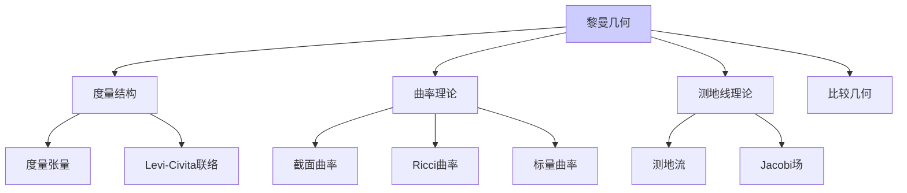

# 黎曼几何理论

---

**文档编号**: FM.L3.TOP.03  
**理论名称**: 黎曼几何理论  
**MSC分类**: 53Cxx (黎曼几何)  
**创建日期**: 2026年4月3日  
**版本**: 1.0

---

## 一、理论概述

### 1.1 理论定位

黎曼几何研究**配备度量张量的光滑流形**，是广义相对论的数学基础。从Gauss的曲面论到Einstein的时空几何，黎曼几何通过**曲率**刻画空间的弯曲程度。

---

## 二、核心定义(L1)清单

| 定义名称 | 数学表述 | 层次 |
|---------|---------|-----|
| **黎曼度量** | g_p: T_pM × T_pM → R 对称正定 | L1 |
| **Levi-Civita联络** | 无挠且度量相容的唯一联络 | L1 |
| **截面曲率** | K(σ) = <R(X,Y)Y,X>/(|X|^2|Y|^2-<X,Y>^2) | L1 |
| **Ricci曲率** | Ric(X,Y) = tr(Z ↦ R(Z,X)Y) | L1 |
| **标量曲率** | S = tr_g(Ric) | L1 |
| **测地线** | ∇_{γ'}γ' = 0 | L1 |
| **Jacobi场** | J'' + R(J,γ')γ' = 0 | L1 |
| **体积形式** | dV = √det(g) dx^1∧...∧dx^n | L1 |

---

## 三、支撑定理(L2)清单

| 定理名称 | 陈述 | 重要性 |
|---------|------|-------|
| **Hopf-Rinow** | 完备⇔测地完备 | 完备性 |
| **Bonnet-Myers** | Ricci下界⇒直径有限 | 紧性 |
| **Synge定理** | 正曲率⇒单连通/非定向 | 拓扑 |
| **球面定理** | 1/4-pinched⇔球面 | 分类 |
| **分裂定理** | Ricci≥0且含直线⇔积 | 分裂 |
| **Cheeger-Gromoll** | 非负Ricci的拓扑 | 灵魂定理 |

---

## 四、向L4前沿的开放问题

| 问题/方向 | 描述 | 前沿性 |
|----------|------|-------|
| **正截面曲率** | 高维正曲率流形分类 | 开放 |
| **Ricci流** | Hamilton-Perelman理论 | L4 |
| **Ricci下界** | Cheeger-Colding理论 | L4 |
| **Kähler-Ricci流** | 复几何应用 | L4 |

---

**文档信息**
- **创建日期**: 2026年4月3日
