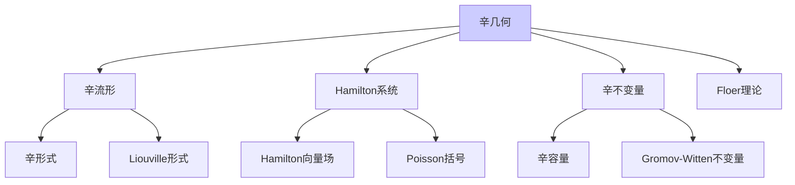

# 辛几何基础

---

**文档编号**: FM.L3.TOP.04
**理论名称**: 辛几何基础
**MSC分类**: @ (辛几何)
**创建日期**: 2026年4月3日
**版本**: 1.0

---

## 一、理论概述

### 1.1 理论定位

辛几何研究**配备闭非退化2-形式的流形**，是经典Hamilton力学的几何化。从Darboux定理的局部平凡性到Arnold猜想的整体不变量，辛几何已成为连接数学物理、代数几何和动力系统的活跃领域。

---

## 二、核心定义(L1)清单

| 定义名称 | 数学表述 | 层次 |
|---------|---------|-----|
| **辛形式** | ω: 闭的、非退化的2-形式 | L1 |
| **Hamilton向量场** | ι_Xω = dH | L1 |
| **Poisson括号** | {f,g} = ω(X_f,X_g) | L1 |
| **Lagrangian子流形** | dim=n, ω|_L = 0 | L1 |
| **辛同胚** | φ*ω = ω | L1 |
| **辛容量** | c(M,ω): 单调、共形、非平凡 | L1 |
| **moment映射** | μ: M → g* | L1 |

---

## 三、支撑定理(L2)清单

| 定理名称 | 陈述 | 重要性 |
|---------|------|-------|
| **Darboux定理** | 辛流形局部标准形式 | 局部平凡性 |
| **Moser定理** | 上同调类相同⇒辛同痕 | 稳定性 |
| **Arnold-Liouville** | 可积系统的环面纤维化 | 完全可积 |
| **Gromov非挤压** | 辛容量约束 | 刚性 |
| **Arnold猜想** | #Fix(φ) ≥ cuplength | 辛不变量 |
| **Atiyah-Guillemin-Sternberg** | moment映射像凸多面体 | 凸性 |

---

## 四、向L4前沿的开放问题

| 问题/方向 | 描述 | 前沿性 |
|----------|------|-------|
| **Arnold猜想** | 一般情形证明 | 部分解决 |
| **同调镜像对称** | Kontsevich猜想 | L4 |
| **Fukaya范畴** | Lagrangian的A∞范畴 | L4 |
| **辛场论** | 接触流形的不变量 | L4 |

---

**文档信息**

- **创建日期**: 2026年4月3日

---

## 参考文献

- Timothy Gowers (ed.), *The Princeton Companion to Mathematics*, 1st ed., Princeton University Press, 2008, ISBN: 9780691118802 / MR2467561
- Daniel J. Velleman, *How to Prove It: A Structured Approach*, 2nd ed., Cambridge University Press, 2006, ISBN: 9780521675994 / MR2448845