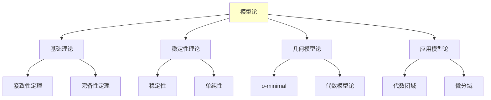
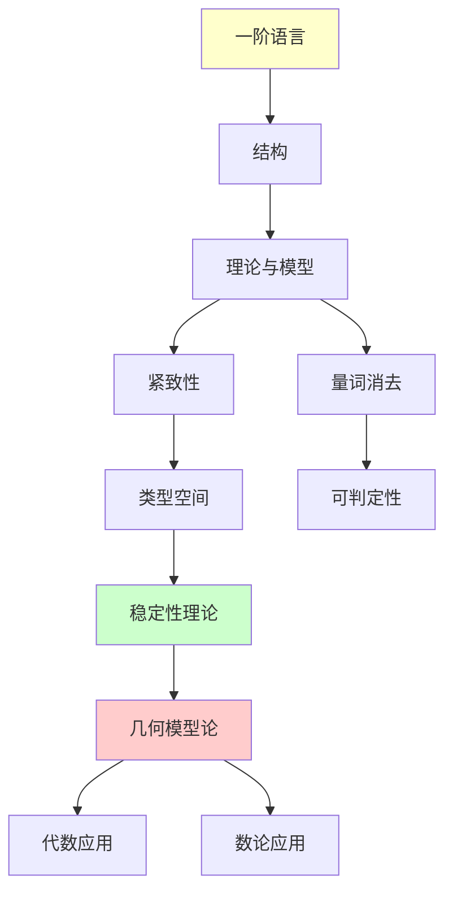

# 模型论基础

---

**文档编号**: FM.L3.LOG.01  
**理论名称**: 模型论基础  
**MSC分类**: 03Cxx (模型论)  
**创建日期**: 2026年4月3日  
**版本**: 1.0

---

## 📋 目录

1. [理论概述](#1-理论概述)
2. [核心定义(L1)清单](#2-核心定义l1清单)
3. [支撑定理(L2)清单](#3-支撑定理l2清单)
4. [理论结构图](#4-理论结构图)
5. [向L4前沿的开放问题](#5-向l4前沿的开放问题)

---

## 一、理论概述

### 1.1 理论定位

模型论研究**形式语言**与**数学结构**之间的关系，通过语义（模型）和语法（理论）的相互作用来理解数学本质。从经典的紧致性定理到现代的**稳定性理论**，模型论已成为连接逻辑、代数和几何的活跃领域。

### 1.2 核心思想

| 核心思想 | 描述 | 重要性 |
|---------|------|-------|
| **语义-语法对应** | 真理与可证性的关系 | 基础问题 |
| **范畴性** | 理论唯一确定模型 | 完全性 |
| **量词消去** | 公式简化 | 可判定性 |
| **类型空间** | 完备型的紧致空间 | 分类理论 |

---

## 二、核心定义(L1)清单

### 2.1 语言与结构

| 定义名称 | 数学表述 | 层次 |
|---------|---------|-----|
| **一阶语言** | 符号集合 L = {函数, 关系, 常数} | L1 |
| **L-结构** | 论域 + 解释函数 | L1 |
| **项** | 由函数符号和变量构成 | L1 |
| **公式** | 原子公式 + 逻辑连接词 + 量词 | L1 |
| **语句** | 闭公式（无自由变量） | L1 |
| **满足关系** | M ⊨ φ[a] | L1 |

### 2.2 理论与模型

| 定义名称 | 数学表述 | 层次 |
|---------|---------|-----|
| **理论** | 语句集合 T | L1 |
| **模型** | M ⊨ T 的结构 | L1 |
| **理论完备性** | T ⊢ φ 或 T ⊢ ¬φ | L1 |
| **范畴性** | 某基数下模型唯一 | L1 |
| **初等等价** | M ≡ N: 满足相同语句 | L1 |
| **初等嵌入** | 保持所有公式的嵌入 | L1 |

### 2.3 紧致性与类型

| 定义名称 | 数学表述 | 层次 |
|---------|---------|-----|
| **紧致性定理** | 有限可满足⇒可满足 | L1 |
| **型** | 参数集上的相容公式集 | L1 |
| **完全型** | 极大相容型 | L1 |
| **Stone空间** | S_n(A): 完全型的拓扑空间 | L1 |
| **饱和模型** | 实现所有小型的模型 | L1 |
| **齐次模型** | 初等映射可扩张 | L1 |

### 2.4 稳定性理论

| 定义名称 | 数学表述 | 层次 |
|---------|---------|-----|
| **稳定性** | |S_n(A)| ≤ |A| + ℵ₀ | L1 |
| **超稳定性** | 基于秩的稳定性 | L1 |
| **全超越性** | Morley秩有限 | L1 |
| **单纯性** | 独立性关系的公理化 | L1 |
| **forking** | 独立性关系的推广 | L1 |
| **Morley秩** | 可定义集的维数 | L1 |

---

## 三、支撑定理(L2)清单

### 3.1 基础定理

| 定理名称 | 陈述 | 重要性 |
|---------|------|-------|
| **完备性定理** | T ⊢ φ ⇔ T ⊨ φ | 语法-语义桥 |
| **紧致性定理** | 有限可满足⇒可满足 | 存在性证明 |
| **Löwenheim-Skolem** | 无穷模型有各基数模型 | 基数现象 |
| **省略类型定理** | 非孤立型可省略 | 模型构造 |

### 3.2 范畴性定理

| 定理名称 | 陈述 | 重要性 |
|---------|------|-------|
| **Morley范畴性定理** | ℵ₁-范畴⇔∀κ>ℵ₀ κ-范畴 | 范畴性判定 |
| **Baldwin-Lachlan** | ℵ₀-范畴⇔全超越+原子模型 | 可数范畴 |
| **Shelah主定理** | 每理论都有深度 | 分类纲领 |

### 3.3 量词消去

| 定理名称 | 陈述 | 重要性 |
|---------|------|-------|
| **量词消去判别** | 子结构嵌入可扩张 | QE判定 |
| **ACF量词消去** | 代数闭域量词可消 | 可判定性 |
| **Presburger算术** | (N, +, 0, 1) QE | 自动机理论 |
| **实闭域** | (R, +, ·, <) QE | 实代数几何 |

### 3.4 稳定性定理

| 定理名称 | 陈述 | 重要性 |
|---------|------|-------|
| **Shelah稳定性定理** | 不稳定性⇒随机图性质 | 二分定理 |
| **Morley秩可定义性** | 全超越理论中可定义 | 几何性质 |
| **Zilber三角猜想** | 全超越群的分类 | 几何模型论 |
| **Hrushovski构造** | 强极小集的分类 | 新几何 |

---

## 四、理论结构图

---

## 五、向L4前沿的开放问题

| 问题/方向 | 描述 | 前沿性 |
|----------|------|-------|
| **Zilber-Pink猜想** | 特殊子簇的交集 | 开放 |
| **强极小集分类** | Zilber三角猜想 | 研究中 |
| **微分代数几何** | 微分闭域的模型论 | L4 |
| **差分域** | 差分方程的模型论 | L4 |
| **连续模型论** | 度量空间的模型论 | L4 |
| **同伦类型论** | 类型论与拓扑的联系 | L4 |

---

**文档信息**
- **创建日期**: 2026年4月3日
- **相关文档**: 集合论高级主题、证明论、代数数论
