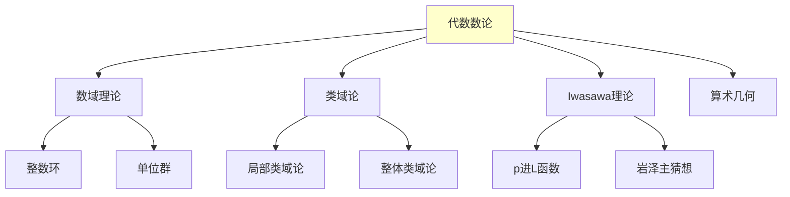

# 代数数论理论框架

---

**文档编号**: FM.L3.LOG.05  
**理论名称**: 代数数论理论框架  
**MSC分类**: @ (代数数论)  
**创建日期**: 2026年4月3日  
**版本**: 1.0

---

## 一、理论概述

### 1.1 理论定位

代数数论研究**代数整数环**和**数域的算术性质**，是数论的核心分支。从理想分解的唯一性到**类域论**的互反律，代数数论建立了代数、分析和几何的深刻联系。

---

## 二、核心定义(L1)清单

| 定义名称 | 数学表述 | 层次 |
|---------|---------|-----|
| **数域** | Q的有限扩张 | L1 |
| **整数环** | O_K: K中的代数整数 | L1 |
| **理想类群** | Cl(K) = I(K)/P(K) | L1 |
| **判别式** | D_{K/Q} | L1 |
| **范数** | N_{K/Q}(α) = ∏σ_i(α) | L1 |
| **迹** | Tr_{K/Q}(α) = ∑σ_i(α) | L1 |
| **分歧指数** | e(P|p) | L1 |
| **剩余次数** | f(P|p) | L1 |
| **Adele环** | A_K = ∏'_v K_v | L1 |
| **Idele群** | I_K = ∏'_v K_v^× | L1 |

---

## 三、支撑定理(L2)清单

| 定理名称 | 陈述 | 重要性 |
|---------|------|-------|
| **理想唯一分解** | O_K中理想唯一分解 | 基本定理 |
| **有限类数** | |Cl(K)| < ∞ | 类数有限 |
| **Dirichlet单位定理** | O_K^× ≅ μ_K × Z^{r_1+r_2-1} | 单位结构 |
| **Minkowski界** | 每个类含范数≤M_K的理想 | 计算工具 |
| **局部互反律** | K_v^× ≅ Gal(K_v^{ab}/K_v) | 局部理论 |
| **Artin互反律** | I_K/K^× ≅ Gal(K^{ab}/K) | 整体理论 |

---

## 四、向L4前沿的开放问题

| 问题/方向 | 描述 | 状态 |
|----------|------|------|
| **类数问题** | 类数1的虚二次域 | 已解决(Heegner-Stark) |
| **BSD猜想** | 椭圆曲线的L函数与有理点 | 开放 |
| **岩泽主猜想** | p进L函数与类群 | 部分解决 |
| **Langlands纲领** | 数论-表示论对应 | L4 |

---

**文档信息**
- **创建日期**: 2026年4月3日

---

## 参考文献

- Timothy Gowers (ed.), *The Princeton Companion to Mathematics*, 1st ed., Princeton University Press, 2008, ISBN: 9780691118802 / MR2467561
- Daniel J. Velleman, *How to Prove It: A Structured Approach*, 2nd ed., Cambridge University Press, 2006, ISBN: 9780521675994 / MR2448845