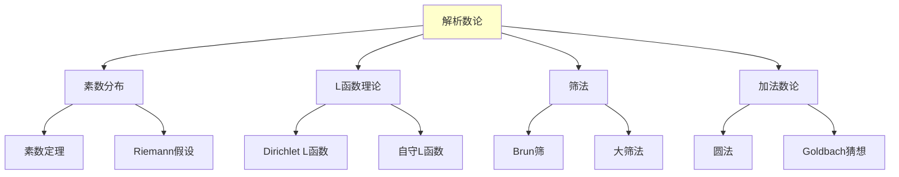

# 解析数论理论框架

---

**文档编号**: FM.L3.LOG.06  
**理论名称**: 解析数论理论框架  
**MSC分类**: 11Mxx, 11Nxx (解析数论)  
**创建日期**: 2026年4月3日  
**版本**: 1.0

---

## 1. 理论概述

### 1.1 理论定位

解析数论使用**分析方法**研究整数的性质，以**Riemann ζ函数**和**L函数**为核心工具。从素数定理到**Riemann假设**，解析数论揭示了算术与分析的深刻联系。

---

## 2. 核心定义(L1)清单

| 定义名称 | 数学表述 | 层次 |
|---------|---------|-----|
| **Riemann ζ函数** | ζ(s) = ∑n^{-s}, Re(s)>1 | L1 |
| **Dirichlet L函数** | L(s,χ) = ∑χ(n)n^{-s} | L1 |
| **Mangoldt函数** | Λ(n) = log p if n=p^k | L1 |
| **Chebyshev函数** | ψ(x) = ∑_{n≤x}Λ(n) | L1 |
| **特征标** | χ: (Z/qZ)^× → C^× | L1 |
| **显式公式** | ψ(x)与ζ零点关系 | L1 |

---

## 3. 支撑定理(L2)清单

| 定理名称 | 陈述 | 重要性 |
|---------|------|-------|
| **素数定理** | π(x) ~ x/log x | 里程碑 |
| **Dirichlet定理** | 等差数列中素数无穷 | 首次使用L函数 |
| **算术级数PNT** | π(x;q,a) ~ π(x)/φ(q) | 推广 |
| **Siegel-Walfisz** | 等差数列误差估计 | 有效结果 |
| **Vinogradov三素数** | 大奇数三素数和 | 圆法成功 |
| **Chen定理** | 1+2猜想 | 筛法高峰 |

---

## 4. 向L4前沿的开放问题

| 问题/方向 | 描述 | 状态 |
|----------|------|------|
| **Riemann假设** | ζ函数零点实部=1/2 | 开放 |
| **Goldbach猜想** | 偶数=两素数和 | 开放 |
| **孪生素数** | 素数对p, p+2 | 部分进展 |
| **Langlands纲领** | 解析数论版本 | L4 |

---

**文档信息**
- **创建日期**: 2026年4月3日
