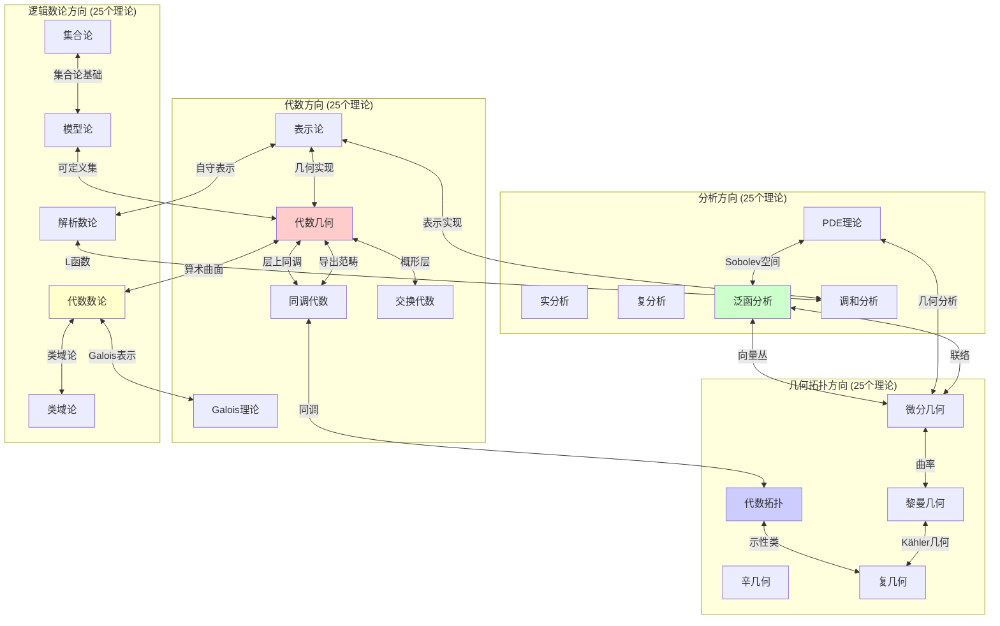
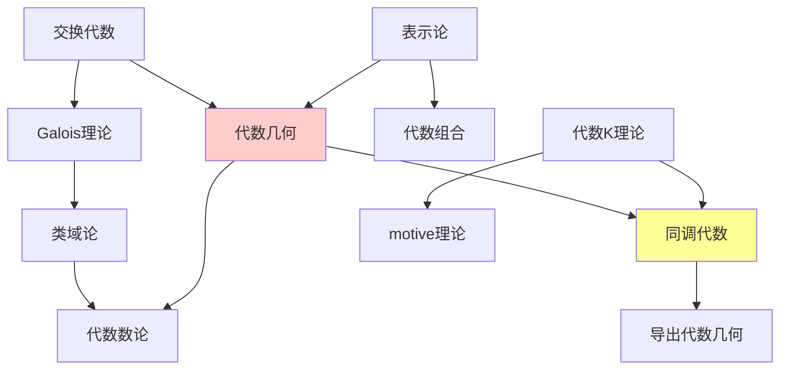
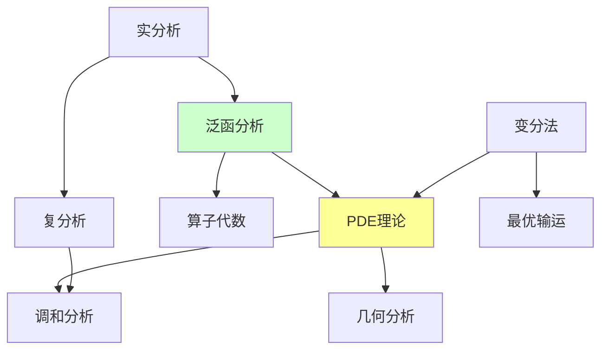
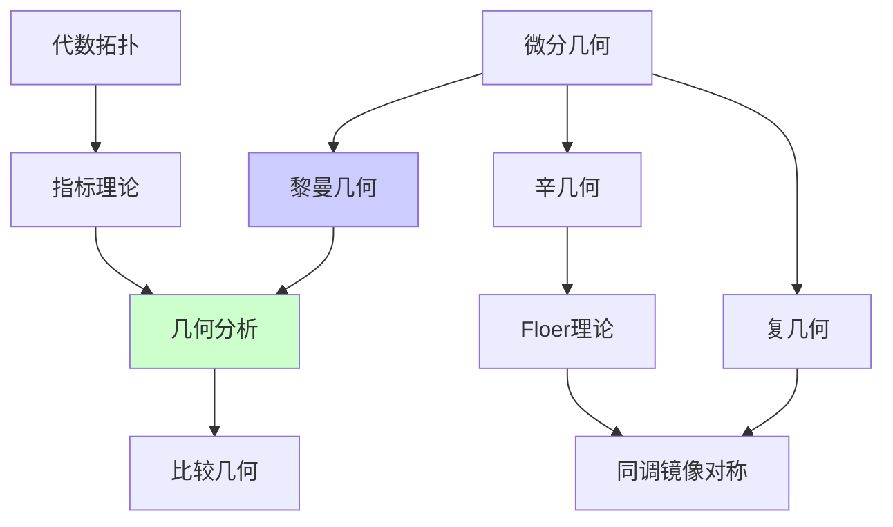
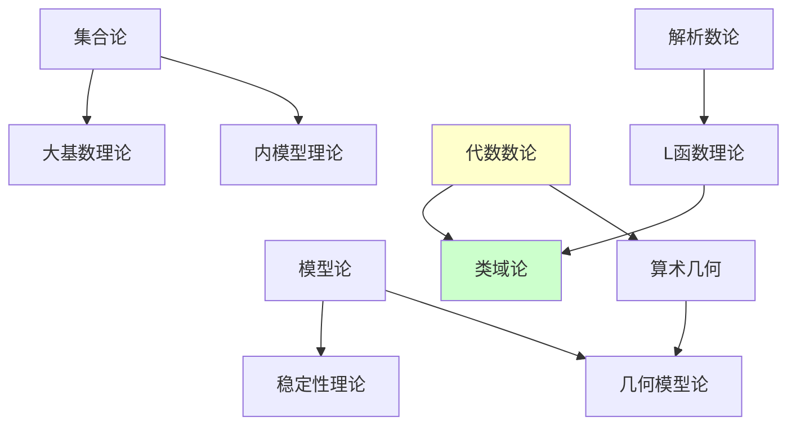
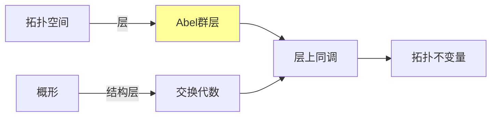
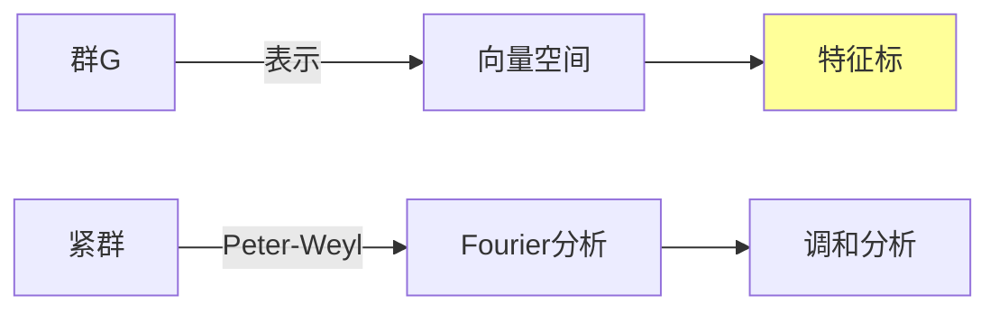
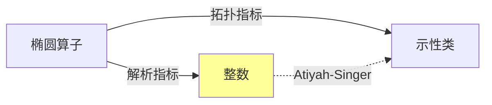
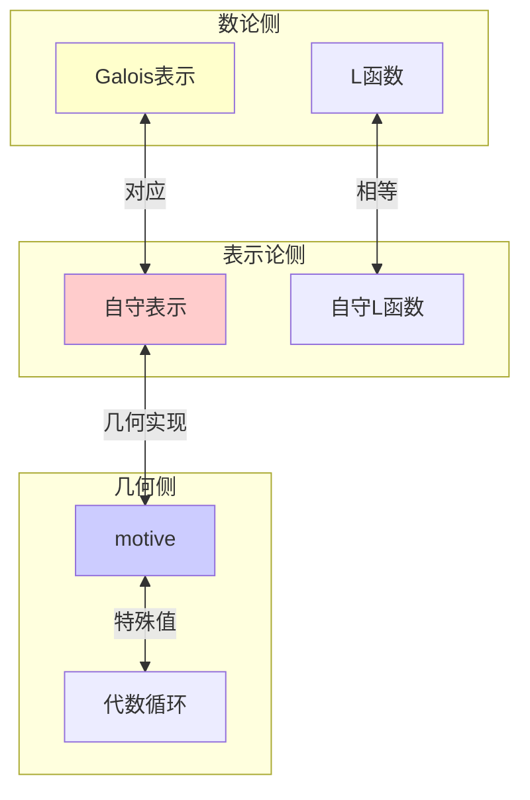
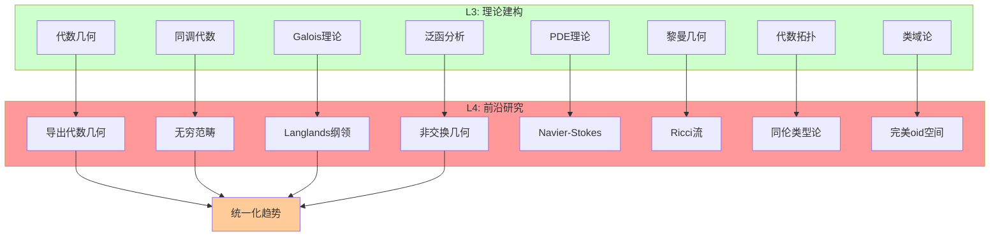

# L3理论间关联图

---

**文档编号**: FM.L3.RELATIONS  
**创建日期**: 2026年4月3日  
**版本**: 1.0

---

## 目录

1. [跨方向联系总览](#1-跨方向联系总览)
2. [四大方向内部关联](#2-四大方向内部关联)
3. [核心理论桥梁](#3-核心理论桥梁)
4. [L3→L4演进图](#4-l3l4演进图)

---

## 一、跨方向联系总览

### 1.1 四大方向全景关联图

### 1.2 联系强度矩阵

| 方向对 | 核心桥梁 | 联系强度 | 代表理论 |
|-------|---------|---------|---------|
| 代数 ↔ 几何 | 代数几何 | ★★★★★ | 概形理论 |
| 代数 ↔ 拓扑 | 同调代数 | ★★★★★ | 导出范畴 |
| 代数 ↔ 数论 | Galois理论 | ★★★★★ | 类域论 |
| 分析 ↔ 几何 | 几何分析 | ★★★★☆ | 偏微分方程 |
| 分析 ↔ 拓扑 | 指标理论 | ★★★★☆ | Atiyah-Singer |
| 几何 ↔ 拓扑 | 代数拓扑 | ★★★★★ | 示性类 |
| 逻辑 ↔ 数论 | 算术几何 | ★★★★☆ | 模型论应用 |
| 逻辑 ↔ 代数 | 范畴逻辑 | ★★★☆☆ | 类型论 |

---

## 二、四大方向内部关联

### 2.1 代数方向内部关联

### 2.2 分析方向内部关联

### 2.3 几何拓扑方向内部关联

### 2.4 逻辑数论方向内部关联

---

## 三、核心理论桥梁

### 3.1 层论：拓扑 ↔ 代数

**核心定理**: 
- Leray谱序列
- Serre对偶
- 高阶直接像

### 3.2 表示论：代数 ↔ 分析

**核心定理**:
- Maschke定理
- Peter-Weyl定理
- Weyl特征标公式

### 3.3 指标理论：拓扑 ↔ 分析

**核心定理**:
- Atiyah-Singer指标定理
- Riemann-Roch定理
- Hirzebruch符号差定理

### 3.4 Langlands纲领：数论 ↔ 表示论 ↔ 几何

---

## 四、L3→L4演进图

### 4.1 各方向前沿演进

### 4.2 开放问题聚类

| 前沿领域 | 核心问题 | 涉及方向 |
|---------|---------|---------|
| **Langlands纲领** | 高维对应、几何Langlands | 代数、数论、表示论 |
| **导出代数几何** | 无穷范畴、环谱几何 | 代数、拓扑 |
| **Ricci流** | 奇点分析、收敛性 | 几何、分析 |
| **非交换几何** | 谱三元组、量子物理 | 代数、分析、拓扑 |
| **同伦类型论** | Univalence公理、计算机证明 | 逻辑、拓扑 |
| **完美oid空间** | p进几何、倾斜等价 | 数论、代数几何 |

---

**文档信息**
- **创建日期**: 2026年4月3日
- **版本**: 1.0
- **关联文档**: 00-L3层次总览.md, 各方向理论文档
