# L3 理论建构层次 (L3-Theory)

## 概述

**L3-Theory** 是数学知识层次体系的第四个层级，代表数学从分散的定理走向**系统的理论建构**。在这一层次，数学家关注的是理论体系的整体架构、不同领域间的深层联系，以及数学思想的统一框架。

---

## 一、定义与核心特征

### 1.1 定义

L3 理论建构层次是指在掌握大量数学定理的基础上，对数学知识进行**系统化整合**、**框架化建构**和**理论化提升**的认知水平。这一层次的核心是"见木又见林"——既能深入细节，又能把握整体。

### 1.2 核心特征

#### 1.2.1 系统性

L3 层次强调整体大于部分之和：

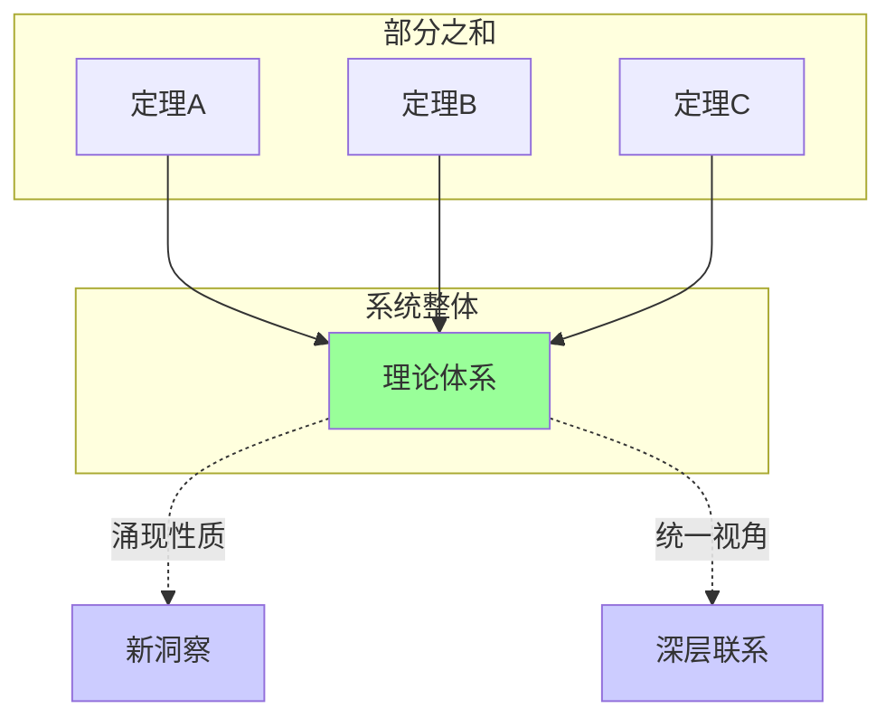

#### 1.2.2 统一性

理论建构寻求不同数学分支的**统一框架**：
- 代数与几何的统一（代数几何）
- 分析与代数的统一（泛函分析）
- 拓扑与代数的统一（代数拓扑）

#### 1.2.3 结构性

布尔巴基学派强调数学的**结构**本质：

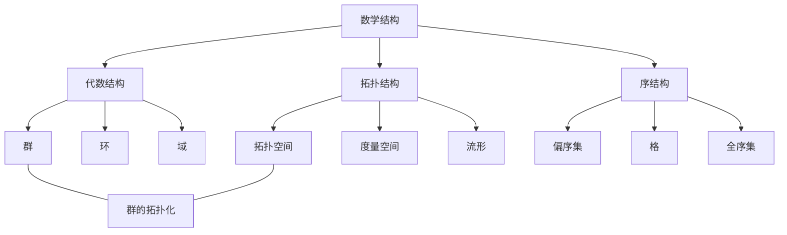

---

## 二、理论建构的维度

### 2.1 纵向深化

#### 2.1.1 从具体到抽象

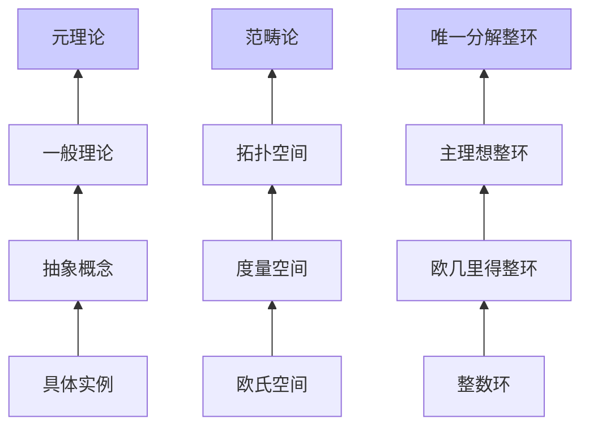

#### 2.1.2 抽象化的价值

| 层次 | 特点 | 价值 |
|-----|------|------|
| 具体 | 实例丰富 | 直观理解 |
| 抽象 | 共性提取 | 统一处理 |
| 一般 | 公理化 | 适用范围广 |
| 元理论 | 自我指涉 | 深层洞察 |

### 2.2 横向拓展

#### 2.2.1 跨领域联系

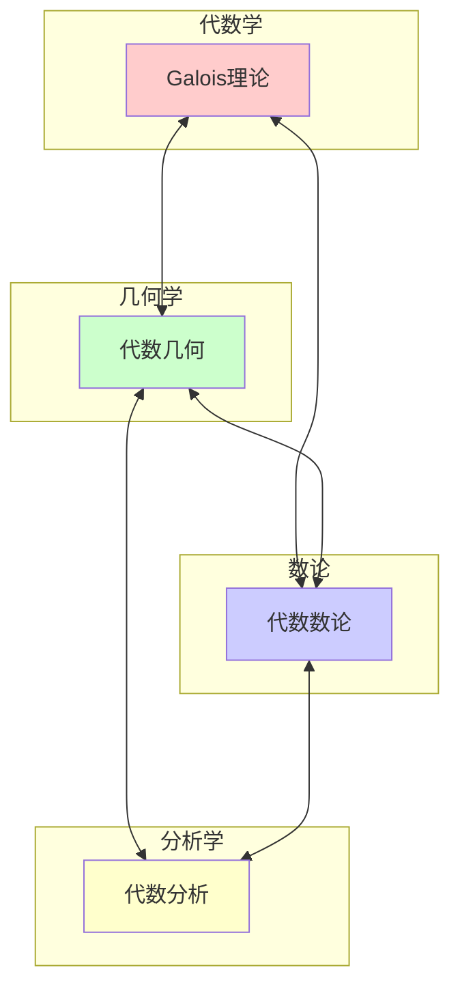

#### 2.2.2 典型桥梁

| 桥梁 | 连接领域 | 核心思想 |
|-----|---------|---------|
| Galois 理论 | 代数 ↔ 数论 | 域扩张 ↔ 群 |
| 层论 | 拓扑 ↔ 代数 | 局部 ↔ 整体 |
| 表示论 | 代数 ↔ 分析 | 抽象 ↔ 具体 |
| 同调代数 | 代数 ↔ 拓扑 | 不变量构造 |

### 2.3 历史演进

#### 2.3.1 理论发展的生命周期

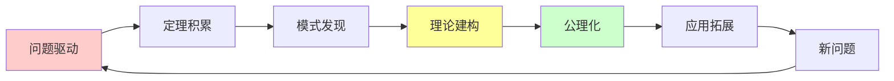

---

## 三、核心理论框架

### 3.1 范畴论：数学的元理论

#### 3.1.1 基本概念

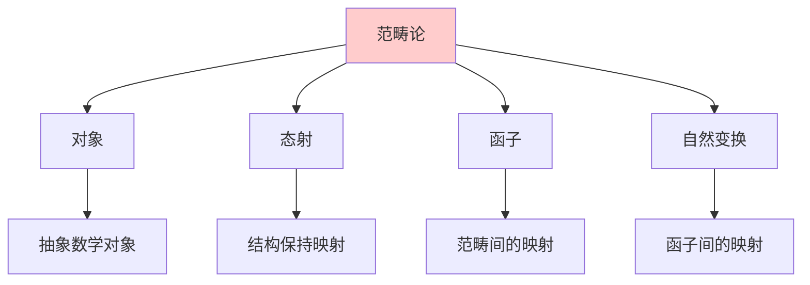

#### 3.1.2 统一力量

**Yoneda 引理**：一个对象由其与其他对象的关系完全确定。

```mermaid
graph LR
    A[对象X] --> B[Hom(X,-)]
    B --> C[可表函子]
    C --> D[普遍性质]
    
    style A fill:#ff9999
    style D fill:#99ff99

```

#### 3.1.3 范畴论视角下的结构

| 数学结构 | 范畴论表述 | 普遍构造 |
|---------|-----------|---------|
| 积 | 范畴积 | 终对象的泛性质 |
| 直和 | 余积 | 始对象的泛性质 |
| 自由群 | 自由函子 | 遗忘函子的左伴随 |
| 完备化 | 完备化函子 | 泛映射性质 |

### 3.2 同调代数：不变量理论

#### 3.2.1 核心思想

通过**同调函子**提取拓扑/代数对象的**不变量**。

```mermaid
graph TD
    A[拓扑空间X] --> B[链复形C(X)]
    B --> C[同调群H(X)]
    C --> D[拓扑不变量]
    
    E[代数对象A] --> F[分解]
    F --> G[导出函子]
    G --> H[代数不变量]
    
    style C fill:#99ff99
    style G fill:#99ff99

```

#### 3.2.2 长正合序列

```mermaid
graph LR
    A[短正合序列] --> B[长正合序列]
    B --> C[连接同态]
    C --> D[全局信息]
    
    A1[0→A→B→C→0] --> B1[...→Hₙ(A)→Hₙ(B)→Hₙ(C)→Hₙ₋₁(A)→...]

```

### 3.3 Galois 理论：对称与方程

#### 3.3.1 基本对应

```mermaid
graph TD
    subgraph 域[域扩张]
        A[K/F] --> B[中间域]
    end
    
    subgraph 群[Galois群]
        C[Gal(K/F)] --> D[子群]
    end
    
    B <---> D
    
    A -.->|对应| C
    
    style A fill:#ffcccc
    style C fill:#ccffcc

```

#### 3.3.2 理论框架

**Galois 理论的核心洞察**：多项式方程的可解性由其 Galois 群的结构决定。

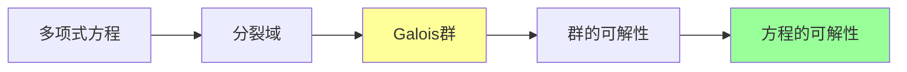

### 3.4 代数几何：代数与几何的统一

#### 3.4.1 基本对应

```mermaid
graph TD
    subgraph 代数[交换代数]
        A[环A] --> B[理想I]
        B --> C[商环A/I]
    end
    
    subgraph 几何[代数几何]
        D[仿射概形Spec A] --> E[闭子集V(I)]
        E --> F[子概形]
    end
    
    A <---> D
    B <---> E
    C <---> F
    
    style A fill:#ffcccc
    style D fill:#ccffcc

```

#### 3.4.2 概形理论

概形（Scheme）是代数几何的现代语言，统一了：
- 经典代数簇
- 算术几何（整数环上的几何）
- 退化情形和无穷小结构

```mermaid
graph BT
    A[概形] --> B[仿射概形]
    A --> C[射影概形]
    
    B --> D[Spec ℤ]:::arith
    B --> E[Spec k[x]]:::geom
    
    C --> F[ℙⁿ]:::geom
    C --> G[算术曲面]:::arith
    
    classDef arith fill:#ffcccc
    classDef geom fill:#ccffcc

```

---

## 四、理论建构的方法论

### 4.1 公理化方法

#### 4.1.1 公理化过程

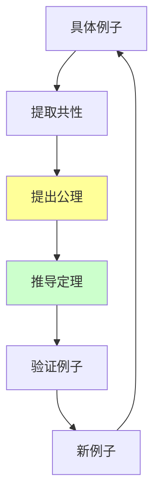

#### 4.1.2 公理化实例

| 理论 | 公理化先驱 | 关键公理 |
|-----|-----------|---------|
| 欧氏几何 | 希尔伯特 | 关联、顺序、合同、平行、连续 |
| 集合论 | ZFC | 外延、选择、无穷、替换等 |
| 概率论 | Kolmogorov | 测度论公理 |
| 量子力学 | von Neumann | 希尔伯特空间公理 |

### 4.2 函子ial 思维

#### 4.2.1 保持结构的映射

```mermaid
graph LR
    subgraph C1[范畴C]
        A1[对象A] --> B1[对象B]
    end
    
    subgraph C2[范畴D]
        A2[F(A)] --> B2[F(B)]
    end
    
    A1 -.->|F| A2
    B1 -.->|F| B2
    
    style A1 fill:#ffcccc
    style B1 fill:#ffcccc
    style A2 fill:#ccffcc
    style B2 fill:#ccffcc

```

#### 4.2.2 伴随函子

伴随函子对（F, G）捕获了"最优化"构造：
- 自由构造 ↔ 遗忘函子
- 完备化 ↔ 包含
- 张量积 ↔ Hom函子

### 4.3 对偶原理

#### 4.3.1 对偶的一般形式

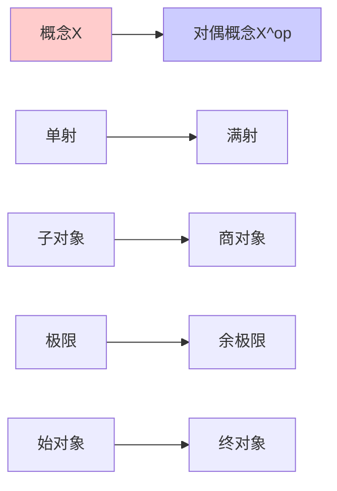

#### 4.3.2 Pontryagin 对偶

局部紧致阿贝尔群与它的特征标群之间的对偶：
$$G \cong \widehat{\widehat{G}}$$

---

## 五、理论建构的经典案例

### 5.1 从经典到现代的代数几何

#### 5.1.1 发展阶段

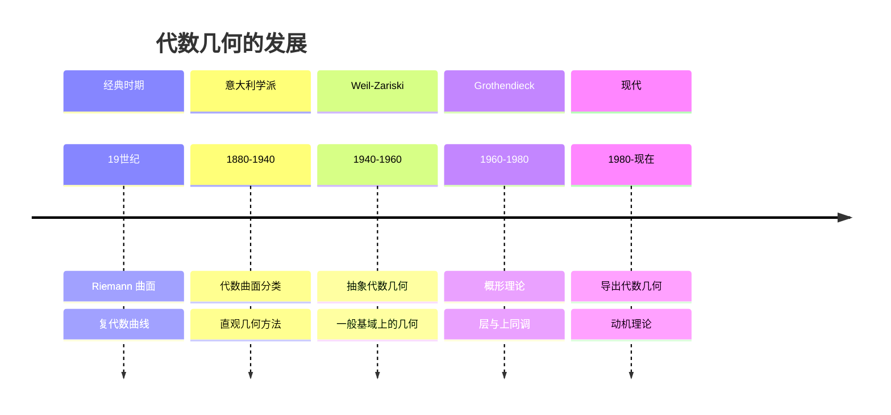

#### 5.1.2 理论跃迁

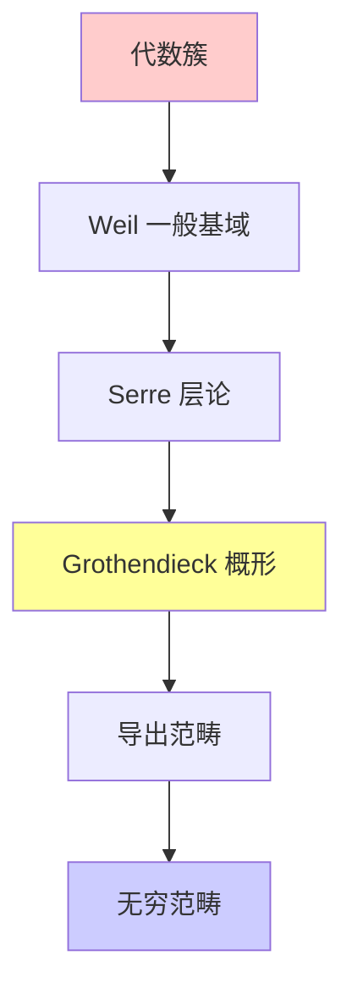

### 5.2 Langlands 纲领

#### 5.2.1 核心对应

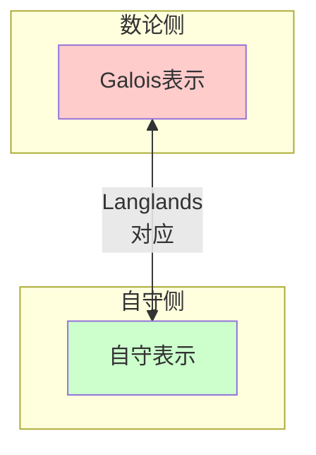

#### 5.2.2 理论地位

Langlands 纲领被誉为"数学的大统一理论"，连接：
- 数论（Galois 理论、L-函数）
- 代数几何（ motive 理论）
- 表示论（自守表示）
- 调和分析（迹公式）

### 5.3 物理与数学的交汇

#### 5.3.1 弦理论驱动的数学

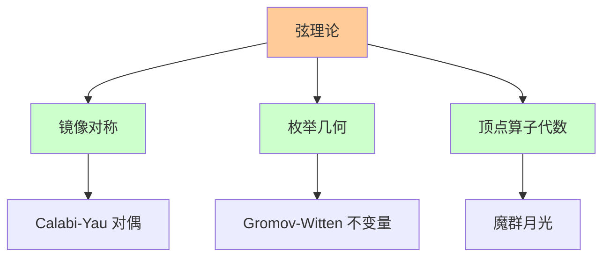

---

## 六、L3 层次的学习策略

### 6.1 宏观把握

#### 6.1.1 理论地图

```mermaid
graph TD
    A[核心概念] --> B[主要定理]
    B --> C[应用领域]
    B --> D[与其他理论的联系]
    
    A --> A1[定义]
    A --> A2[例子]
    A --> A3[动机]
    
    style A fill:#ffcccc
    style B fill:#ffff99

```

#### 6.1.2 历史脉络

理解理论发展的历史有助于把握其内在逻辑：
- 什么问题驱动了理论的产生？
- 关键突破是什么？
- 未来发展方向如何？

### 6.2 比较研究

| 理论 | 研究对象 | 核心方法 | 典型应用 |
|-----|---------|---------|---------|
| 同调代数 | 链复形 | 导出函子 | 拓扑不变量 |
| 层论 | 局部数据 | 整体粘合 | 复几何 |
| K-理论 | 向量丛 | 群完备化 | 指标定理 |
| 非交换几何 | 代数结构 | 泛函分析 | 量子物理 |

---

## 七、L3 层次与其他层次的关系

### 7.1 层次递进

```mermaid
graph TD
    A[L0 直观] -->|抽象化| B[L1 定义]
    B -->|定理化| C[L2 证明]
    C -->|系统化| D[L3 理论]
    D -->|前沿化| E[L4 研究]
    
    D -.->|反哺| B
    D -.->|整合| C
    
    style D fill:#ccffcc

```

### 7.2 与 L2 的区别

| 方面 | L2 定理证明 | L3 理论建构 |
|-----|------------|------------|
| 焦点 | 单个定理 | 理论体系 |
| 问题 | "如何证明？" | "理论如何组织？" |
| 成果 | 新定理 | 新框架 |
| 视野 | 局部 | 全局 |

---

## 八、L3 层次的判断标准

### 8.1 内容特征

- **系统性**：呈现完整的理论框架
- **统一性**：揭示不同概念的深层联系
- **层次性**：从基础到高级的递进结构
- **前瞻性**：指明未解决问题和发展方向

### 8.2 能力要求

**应具备的能力**：
- 理解抽象范畴和泛性质
- 掌握多种理论的统一框架
- 识别理论的核心结构和关键问题
- 评判理论的优美性和深刻性

---

## 九、理论建构的前沿方向

### 9.1 导出代数几何

将代数几何的对象提升到**导出范畴**层次，捕捉高阶信息。

### 9.2 无穷范畴论

用**无穷范畴**（∞-category）统一同伦论与范畴论。

### 9.3 动机理论

寻求统一所有上同调理论的**普适理论**。

---

## 十、总结

L3 理论建构层次代表数学的**成熟形态**。在这一层次：

- **体系化**是核心任务
- **统一性**是追求目标
- **结构性**是思维方式
- **创造性**是最高境界

正如格罗滕迪克所言："数学的本质不在于计算，而在于理解结构。"L3 层次正是这种结构理解的巅峰。

---

## 参考文献

1. Mac Lane, S. (1998). Categories for the Working Mathematician.
2. Hartshorne, R. (1977). Algebraic Geometry.
3. Weibel, C. A. (1994). An Introduction to Homological Algebra.
4. Bourbaki, N. (1968). Theory of Sets.
5. 李文威. (2018). 代数学方法.

---

*文档版本：1.0*
*创建日期：2026年4月*
*层次级别：L3-Theory*
