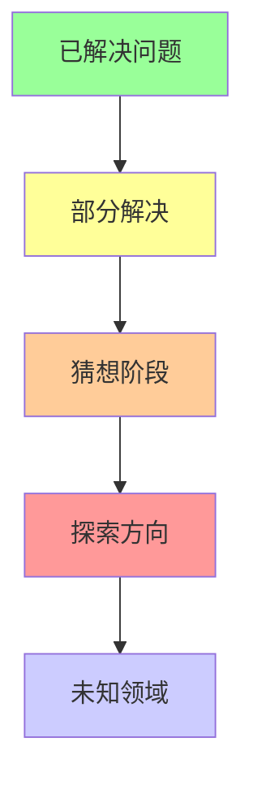
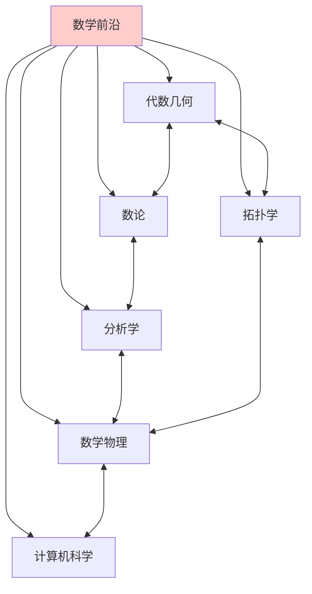
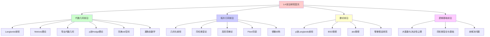
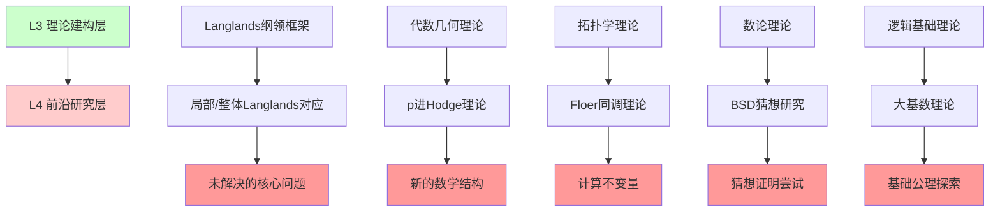
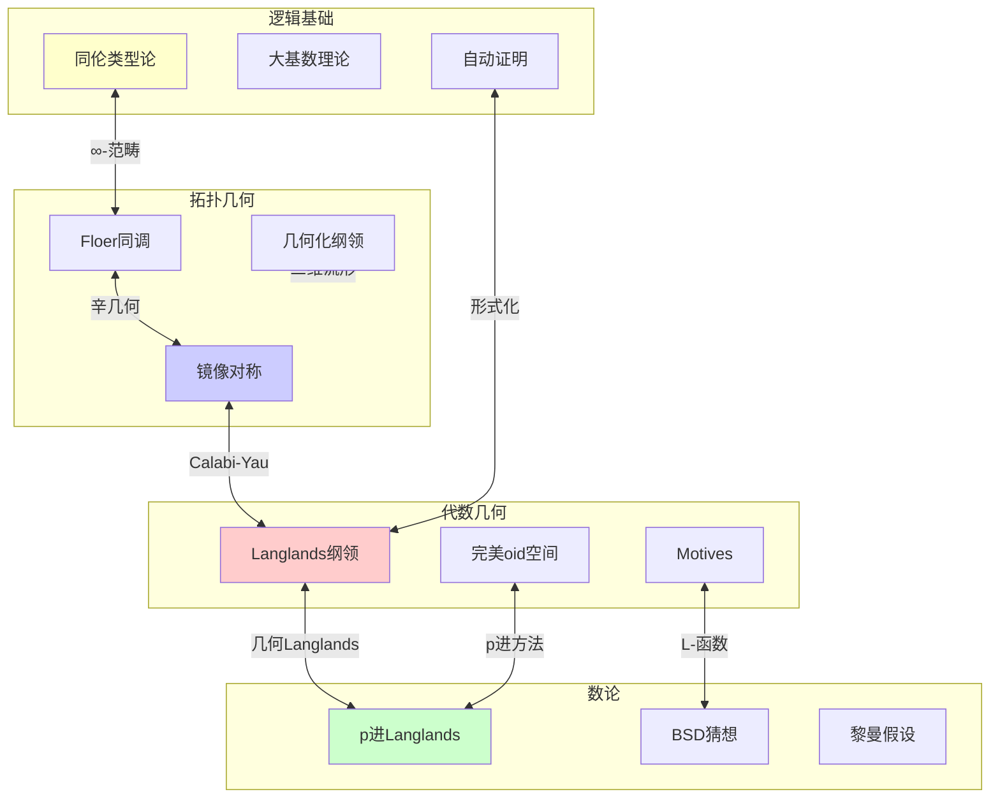
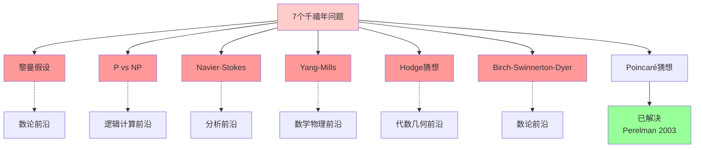
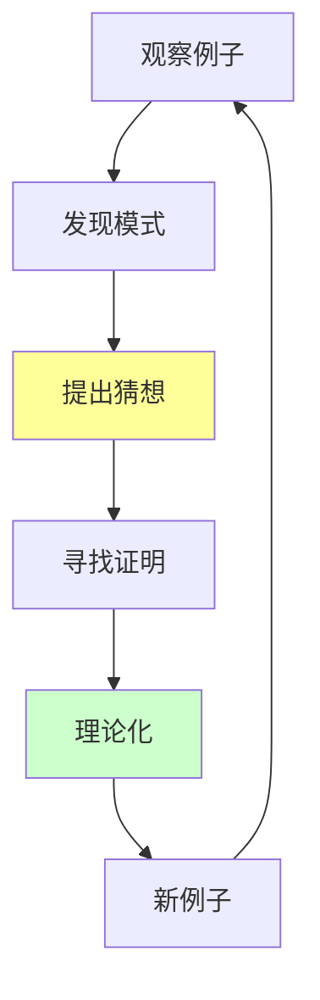
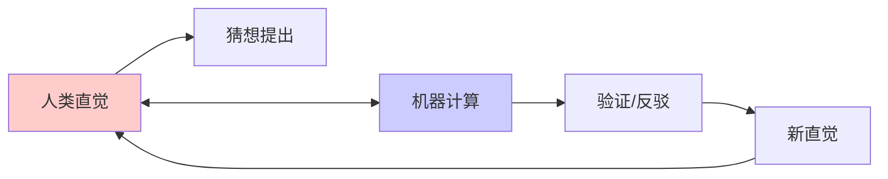
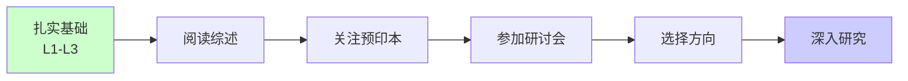
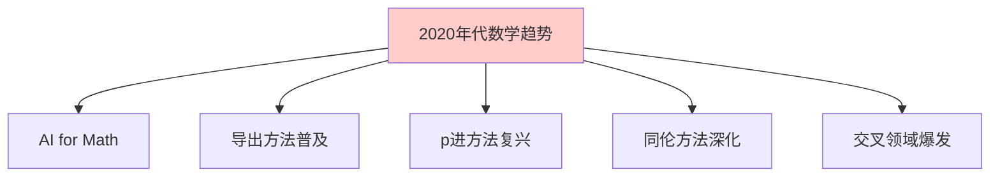

# L4 前沿研究层次总览 (L4-Frontier Overview)

## 概述

**L4-Frontier** 是数学知识层次体系的最高层级，代表当代数学的**前沿研究领域**、**未解决问题**以及**未来发展方向**。在这一层次，数学不再是已知的知识体系，而是正在创造中的科学前沿。

---

## 一、L4层次定义与核心特征

### 1.1 定义

L4 前沿研究层次是指处于数学知识边界、正在积极探索和发展的研究领域。这一层次的特点是**开放性**、**不确定性**和**创造性**——它面对的是尚未解决的问题，追求的是新的数学真理。

### 1.2 核心特征

#### 1.2.1 开放性

L4 层次的问题通常没有确定的答案：

#### 1.2.2 交叉性

现代数学前沿往往是多学科交叉的产物：

#### 1.2.3 研究性

L4 层次强调**研究过程**而非既定结果：

- 提出猜想
- 探索方法
- 部分进展
- 新问题的涌现

---

## 二、L4层次前沿领域全景

### 2.1 前沿领域分类架构

### 2.2 前沿领域目录

#### 2.2.1 代数几何前沿（15个）

| 序号 | 前沿领域 | 核心人物 | 关键问题 | 文档链接 |
|-----|---------|---------|---------|---------|
| 1 | [Langlands纲领（几何/数论侧）](./01-代数几何前沿/01-Langlands纲领-几何数论侧.md) | Langlands, Drinfeld, Lafforgue | 几何Langlands对应 | [链接](./01-代数几何前沿/01-Langlands纲领-几何数论侧.md) |
| 2 | [Motives理论](./01-代数几何前沿/02-Motives理论.md) | Grothendieck, Deligne, Voevodsky | 标准猜想 | [链接](./01-代数几何前沿/02-Motives理论.md) |
| 3 | [导出代数几何](./01-代数几何前沿/03-导出代数几何.md) | Toën, Lurie, Simpson | 导出代数栈 | [链接](./01-代数几何前沿/03-导出代数几何.md) |
| 4 | [p进Hodge理论（Scholze）](./01-代数几何前沿/04-p进Hodge理论.md) | Scholze, Fontaine, Faltings | 比较定理 | [链接](./01-代数几何前沿/04-p进Hodge理论.md) |
| 5 | [完美oid空间](./01-代数几何前沿/05-完美oid空间.md) | Scholze | 倾斜函子 | [链接](./01-代数几何前沿/05-完美oid空间.md) |
| 6 | [凝聚态数学](./01-代数几何前沿/06-凝聚态数学.md) | Clausen, Scholze | 凝聚态拓扑空间 | [链接](./01-代数几何前沿/06-凝聚态数学.md) |
| 7 | [非交换代数几何](./01-代数几何前沿/07-非交换代数几何.md) | Connes, Kontsevich | 非交换流形 | [链接](./01-代数几何前沿/07-非交换代数几何.md) |
| 8 | [热带几何](./01-代数几何前沿/08-热带几何.md) | Mikhalkin, Sturmfels | 枚举几何应用 | [链接](./01-代数几何前沿/08-热带几何.md) |
| 9 | [高维代数簇分类](./01-代数几何前沿/09-高维代数簇分类.md) | Kawamata, Kollár | 极小模型纲领 | [链接](./01-代数几何前沿/09-高维代数簇分类.md) |
| 10 | [有理连通簇](./01-代数几何前沿/10-有理连通簇.md) | Kollár, Miyaoka, Mori | 有理曲线存在性 | [链接](./01-代数几何前沿/10-有理连通簇.md) |
| 11 | [Shafarevich猜想](./01-代数几何前沿/11-Shafarevich猜想.md) | Shafarevich, Arakelov, Parshin | 曲线族参数化 | [链接](./01-代数几何前沿/11-Shafarevich猜想.md) |
| 12 | [刚性解析几何](./01-代数几何前沿/12-刚性解析几何.md) | Tate, Berkovich, Huber | 非阿基米德几何 | [链接](./01-代数几何前沿/12-刚性解析几何.md) |
| 13 | [动力系统与代数几何](./01-代数几何前沿/13-动力系统与代数几何.md) | McMullen, Silverman | 算术动力学 | [链接](./01-代数几何前沿/13-动力系统与代数几何.md) |
| 14 | [模空间紧化](./01-代数几何前沿/14-模空间紧化.md) | Deligne, Mumford | 稳定曲线模空间 | [链接](./01-代数几何前沿/14-模空间紧化.md) |
| 15 | [Hodge理论前沿](./01-代数几何前沿/15-Hodge理论前沿.md) | Cattani, Green, Griffiths | Hodge猜想 | [链接](./01-代数几何前沿/15-Hodge理论前沿.md) |

#### 2.2.2 拓扑/几何前沿（15个）

| 序号 | 前沿领域 | 核心人物 | 关键问题 | 文档链接 |
|-----|---------|---------|---------|---------|
| 1 | [几何化纲领（Perelman）](./02-拓扑几何前沿/01-几何化纲领.md) | Perelman, Thurston, Hamilton | 三维流形分类 | [链接](./02-拓扑几何前沿/01-几何化纲领.md) |
| 2 | [同伦类型论（HoTT）](./02-拓扑几何前沿/02-同伦类型论.md) | Voevodsky, Awodey, Lumsdaine | 计算基础 | [链接](./02-拓扑几何前沿/02-同伦类型论.md) |
| 3 | [高阶范畴论](./02-拓扑几何前沿/03-高阶范畴论.md) | Lurie, Baez, Dolan | ∞-范畴理论 | [链接](./02-拓扑几何前沿/03-高阶范畴论.md) |
| 4 | [Floer同调](./02-拓扑几何前沿/04-Floer同调.md) | Floer, Fukaya, Seidel | Arnold猜想 | [链接](./02-拓扑几何前沿/04-Floer同调.md) |
| 5 | [镜像对称](./02-拓扑几何前沿/05-镜像对称.md) | Kontsevich, Witten, Strominger | SYZ猜想 | [链接](./02-拓扑几何前沿/05-镜像对称.md) |
| 6 | [Heegaard Floer同调](./02-拓扑几何前沿/06-Heegaard-Floer同调.md) | Ozsváth, Szabó | 三维流形不变量 | [链接](./02-拓扑几何前沿/06-Heegaard-Floer同调.md) |
| 7 | [低维拓扑 surgery理论](./02-拓扑几何前沿/07-低维拓扑surgery理论.md) | Freedman, Donaldson, Gompf | 四维流形分类 | [链接](./02-拓扑几何前沿/07-低维拓扑surgery理论.md) |
| 8 | [度量几何与Gromov理论](./02-拓扑几何前沿/08-度量几何与Gromov理论.md) | Gromov, Cheeger, Colding | 塌缩理论 | [链接](./02-拓扑几何前沿/08-度量几何与Gromov理论.md) |
| 9 | [里奇流理论](./../../02-代数结构/02-核心理论/代数几何/09-霍奇理论入门.md) | Hamilton, Chen, Zhu | 奇点分析 | [链接](./../../02-代数结构/02-核心理论/代数几何/09-霍奇理论入门.md) |
| 10 | [负曲率群与几何群论](./../../../数学家理念体系/黎曼数学理念/02-数学内容深度分析/01-黎曼几何/16-几何群论.md) | Gromov, Bestvina, Mess | 双曲群分类 | [链接](./../../../数学家理念体系/黎曼数学理念/02-数学内容深度分析/01-黎曼几何/16-几何群论.md) |
| 11 | [配置空间与同伦不变量](./02-拓扑几何前沿/11-配置空间与同伦不变量.md) | Cohen, Gitler, Cohen | 环面构型 | [链接](./02-拓扑几何前沿/11-配置空间与同伦不变量.md) |
| 12 | [拓扑量子场论](./../L3-理论建构层/03-几何拓扑方向/24-拓扑量子场论.md) | Atiyah, Witten, Reshetikhin | 流形不变量 | [链接](./../L3-理论建构层/03-几何拓扑方向/24-拓扑量子场论.md) |
| 13 | [纽结同调理论](./../../04-几何与拓扑/03-拓扑学内容/16-纽结理论.md) | Khovanov, Ozsváth, Rasmussen | 纽结不变量范畴化 | [链接](./../../04-几何与拓扑/03-拓扑学内容/16-纽结理论.md) |
| 14 | [非交换几何拓扑](./../L3-理论建构层/03-几何拓扑方向/23-非交换几何拓扑.md) | Connes, Baum, Douglas |  Baum-Connes猜想 | [链接](./../L3-理论建构层/03-几何拓扑方向/23-非交换几何拓扑.md) |
| 15 | [辛几何与切触几何](./02-拓扑几何前沿/15-辛几何与切触几何.md) | Eliashberg, Gromov, Hofer | Weinstein猜想 | [链接](./02-拓扑几何前沿/15-辛几何与切触几何.md) |

#### 2.2.3 数论前沿（10个）

| 序号 | 前沿领域 | 核心人物 | 关键问题 | 文档链接 |
|-----|---------|---------|---------|---------|
| 1 | [p进Langlands纲领](./03-数论前沿/01-p进Langlands纲领.md) | Breuil, Kisin, Emerton | p进局部对应 | [链接](./03-数论前沿/01-p进Langlands纲领.md) |
| 2 | [BSD猜想](./03-数论前沿/02-BSD猜想.md) | Birch, Swinnerton-Dyer | L-函数零点 | [链接](./03-数论前沿/02-BSD猜想.md) |
| 3 | [abc猜想](./03-数论前沿/03-abc猜想.md) | Masser, Oesterlé, Mochizuki | 丢番图方程 | [链接](./03-数论前沿/03-abc猜想.md) |
| 4 | [黎曼假设相关研究](./03-数论前沿/04-黎曼假设相关研究.md) | Riemann, Montgomery, Odlyzko | 素数分布 | [链接](./03-数论前沿/04-黎曼假设相关研究.md) |
| 5 | [代数数论类域论推广](./../../../数学家理念体系/希尔伯特数学理念/02-数学内容深度分析/06-其他数学贡献/10-代数数论与类域论.md) | Langlands, Artin, Weil | 非阿贝尔类域论 | [链接](./../../../数学家理念体系/希尔伯特数学理念/02-数学内容深度分析/06-其他数学贡献/10-代数数论与类域论.md) |
| 6 | [自守形式与L-函数](./../../../数学家理念体系/庞加莱数学理念/02-数学内容深度分析/04-数论与算术/07-模形式与L函数.md) | Langlands, Shimura, Tate | 函子iality | [链接](./../../../数学家理念体系/庞加莱数学理念/02-数学内容深度分析/04-数论与算术/07-模形式与L函数.md) |
| 7 | [算术代数几何](./../../04-几何与拓扑/01-几何学基础/05-代数几何.md) | Faltings, Wiles, Taylor | 丢番图逼近 | [链接](./../../04-几何与拓扑/01-几何学基础/05-代数几何.md) |
| 8 | [Iwasawa理论](./../L3-理论建构层/04-逻辑数论方向/08-Iwasawa理论.md) | Iwasawa, Greenberg, Kato | 类群增长 | [链接](./../L3-理论建构层/04-逻辑数论方向/08-Iwasawa理论.md) |
| 9 | [椭圆曲线密码学](./../../应用案例库/02-计算机科学应用/06-椭圆曲线密码学.md) | Koblitz, Miller, Silverman | 离散对数 | [链接](./../../应用案例库/02-计算机科学应用/06-椭圆曲线密码学.md) |
| 10 | [Sato-Tate猜想](./03-数论前沿/10-Sato-Tate猜想.md) | Sato, Tate, Harris | L-函数分布 | [链接](./03-数论前沿/10-Sato-Tate猜想.md) |

#### 2.2.4 逻辑/基础前沿（10个）

| 序号 | 前沿领域 | 核心人物 | 关键问题 | 文档链接 |
|-----|---------|---------|---------|---------|
| 1 | [大基数与决定性公理](./04-逻辑基础前沿/01-大基数与决定性公理.md) | Woodin, Martin, Steel | 内模型纲领 | [链接](./04-逻辑基础前沿/01-大基数与决定性公理.md) |
| 2 | [同伦类型论与数学基础](./04-逻辑基础前沿/02-同伦类型论与数学基础.md) | Voevodsky, HoTT Book | 数学基础重构 | [链接](./04-逻辑基础前沿/02-同伦类型论与数学基础.md) |
| 3 | [P vs NP问题](./04-逻辑基础前沿/03-P-vs-NP问题.md) | Cook, Karp, Levin | 计算复杂性 | [链接](./04-逻辑基础前沿/03-P-vs-NP问题.md) |
| 4 | [自动定理证明与形式验证](./04-逻辑基础前沿/04-自动定理证明与形式验证.md) | de Bruijn, Constable, Harrison | 证明助手 | [链接](./04-逻辑基础前沿/04-自动定理证明与形式验证.md) |
| 5 | [描述集合论前沿](./../../../数学家理念体系/康托尔数学理念/01-核心理论/05-集合论公理化.md) | Moschovakis, Kechris, Woodin | 可定义性 | [链接](./../../../数学家理念体系/康托尔数学理念/01-核心理论/05-集合论公理化.md) |
| 6 | [递归论与可计算性](./../../../数学家理念体系/希尔伯特数学理念/02-数学内容深度分析/03-数理逻辑/02-递归论与可计算性.md) | Turing, Post, Soare | 图灵度结构 | [链接](./../../../数学家理念体系/希尔伯特数学理念/02-数学内容深度分析/03-数理逻辑/02-递归论与可计算性.md) |
| 7 | [模型论前沿应用](./../../../数学家理念体系/科恩数学理念/05-现代应用与拓展/02-在模型论中的应用.md) | Hrushovski, Zilber, Pillay | 代数模型论 | [链接](./../../../数学家理念体系/科恩数学理念/05-现代应用与拓展/02-在模型论中的应用.md) |
| 8 | [量子计算与逻辑](./04-逻辑基础前沿/08-量子计算与逻辑.md) | Deutsch, Shor, Preskill | 量子算法 | [链接](./04-逻辑基础前沿/08-量子计算与逻辑.md) |
| 9 | [范畴论语义学](./../../10-语义模型/范畴语义/04-范畴语义.md) | Lambek, Scott, Hyland | 类型论语义 | [链接](./../../10-语义模型/范畴语义/04-范畴语义.md) |
| 10 | [超图灵计算理论](./../../../数学家理念体系/冯诺依曼数学理念/02-数学内容深度分析/03-计算机科学贡献/03-计算理论.md) | Siegelmann, Copeland, Ord | 超越图灵极限 | [链接](./../../../数学家理念体系/冯诺依曼数学理念/02-数学内容深度分析/03-计算机科学贡献/03-计算理论.md) |

---

## 三、L4层次与L3层次的联系

### 3.1 层次递进关系

### 3.2 从L3到L4的典型演进路径

| L3理论框架 | L4前沿问题 | 演进动力 | 当前状态 |
|-----------|-----------|---------|---------|
| 代数几何标准理论 | Motives理论 | 统一上同调理论 | 部分进展 |
| 复几何 | 镜像对称 | 弦理论预言 | 活跃研究 |
| 代数拓扑 | 同伦类型论 | 计算基础需求 | 快速发展 |
| 类域论 | Langlands纲领 | 非阿贝尔推广 | 核心突破 |
| 集合论ZFC | 大基数理论 | 独立性现象 | 持续探索 |

---

## 四、前沿研究领域交叉网络

### 4.1 跨领域关联图

### 4.2 关键交叉点

| 交叉领域 | 参与分支 | 核心问题 | 代表人物 |
|---------|---------|---------|---------|
| 算术几何 | 代数几何+数论 | 丢番图方程 | Faltings, Wiles |
| 几何Langlands | 代数几何+表示论 | 几何对应 | Drinfeld, Gaitsgory |
| 辛拓扑 | 拓扑+几何+分析 | 全局不变量 | Floer, Fukaya |
| 同伦基础 | 拓扑+逻辑 | 数学基础 | Voevodsky, Lurie |
| 量子拓扑 | 拓扑+物理 | 量子不变量 | Witten, Jones |

---

## 五、千禧年大奖问题与L4层次

### 5.1 未解决的千禧年问题

### 5.2 问题状态追踪

| 问题 | 所属L4领域 | 当前状态 | 近期进展 |
|-----|-----------|---------|---------|
| 黎曼假设 | 数论前沿 | 未解决 | 随机矩阵联系 |
| P vs NP | 逻辑计算前沿 | 未解决 | 电路复杂性下界 |
| Navier-Stokes | 分析前沿 | 未解决 | 部分正则性 |
| Yang-Mills | 数学物理前沿 | 未解决 | 质量间隙问题 |
| Hodge猜想 | 代数几何前沿 | 未解决 | 特殊情形进展 |
| BSD猜想 | 数论前沿 | 未解决 | rank 0,1解决 |

---

## 六、L4层次研究方法论

### 6.1 研究模式

#### 6.1.1 从例子到理论

#### 6.1.2 类比与转移

| 源领域 | 目标领域 | 类比内容 | 成功案例 |
|-------|---------|---------|---------|
| 函数域 | 数域 | Weil猜想 | Deligne证明 |
| 拓扑弦 | 物理弦 | Gromov-Witten | 镜像对称 |
| 有限群 | 李群 | 表示论方法 | 分类定理 |
| 离散几何 | 连续几何 | 组合方法 | 度量几何 |

### 6.2 合作模式

#### 6.2.1 大规模合作

**Polymath 项目**：

- 开放协作的数学研究
- 众包解决数学问题
- 在线协作的新模式

#### 6.2.2 人机协作

---

## 七、如何接触L4层次

### 7.1 学习路径

### 7.2 资源推荐

#### 7.2.1 预印本平台

- **arXiv.org**：数学论文预印本
- **MathOverflow**：研究级问答
- **nLab**：范畴论与相关领域

#### 7.2.2 重要会议

- ICM（国际数学家大会）
- 各领域顶级会议
- 暑期学校和研讨会

---

## 八、前沿展望

### 8.1 2020年代的研究趋势

### 8.2 未来可能突破

| 领域 | 可能突破 | 意义 |
|-----|---------|------|
| 数论 | Langlands对应完整证明 | 数学大一统 |
| 拓扑 | 四维Poincaré猜想 | 低维拓扑 |
| 分析 | Navier-Stokes正则性 | 流体力学 |
| 计算 | P vs NP解决 | 计算理论 |
| AI | 自动定理证明 | 数学研究 |

---

## 九、总结

L4前沿研究层次代表数学的**活态**——它不断生长、不断突破边界。在这一层次：

- **未知**是常态
- **探索**是使命
- **创造**是价值
- **突破**是追求

数学前沿的研究者站在人类知识的边界，眺望未知的领域。正如希尔伯特在1900年巴黎国际数学家大会上所说："我们必须知道，我们必将知道。"（Wir müssen wissen, wir werden wissen.）

---

## 十、文档索引

### 10.1 按领域分类

- **代数几何前沿**：15个文档
- **拓扑几何前沿**：15个文档
- **数论前沿**：10个文档
- **逻辑基础前沿**：10个文档

### 10.2 总计

- **前沿领域总数**：50个
- **核心问题覆盖**：千禧年问题6/7（未解决）
- **交叉领域覆盖**：20+个交叉研究方向

---

## 参考文献

1. Carlson, J., et al. (2006). The Millennium Prize Problems.
2. Gowers, T., et al. (2008). The Princeton Companion to Mathematics.
3. Scholze, P. (2012). Perfectoid Spaces.
4. Voevodsky, V., et al. (2013). Homotopy Type Theory.
5. Langlands, R. P. (1970). Problems in the Theory of Automorphic Forms.
6. 席南华. (2020). 基础数学的一些过去和现状.

---

*文档版本：1.0*
*创建日期：2026年4月*
*层次级别：L4-Frontier*
*总文档数：50个前沿领域文档 + 1个总览文档*
