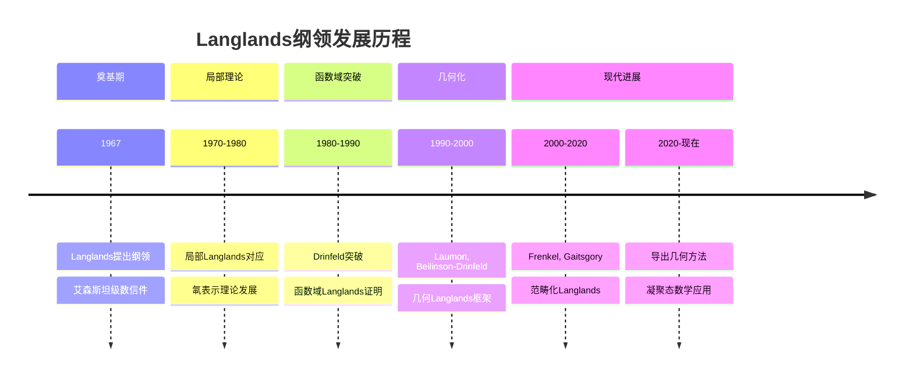
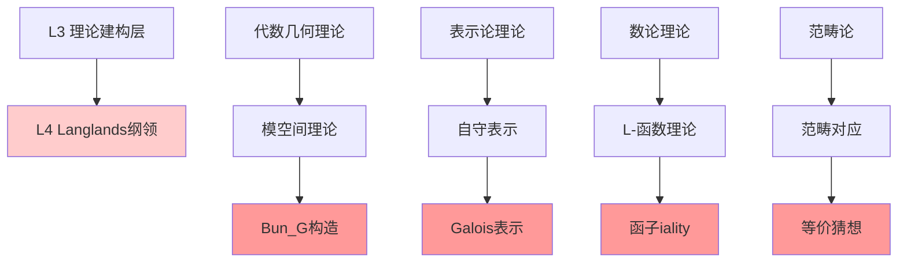
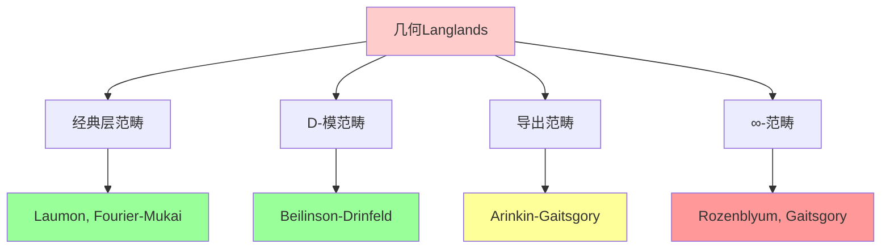
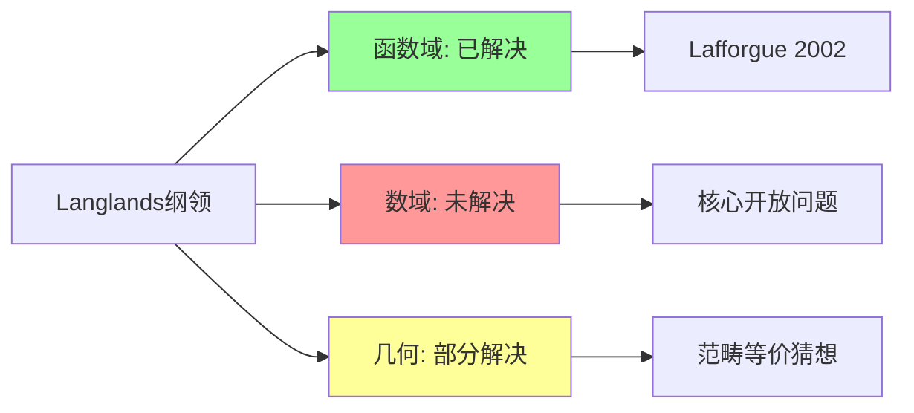
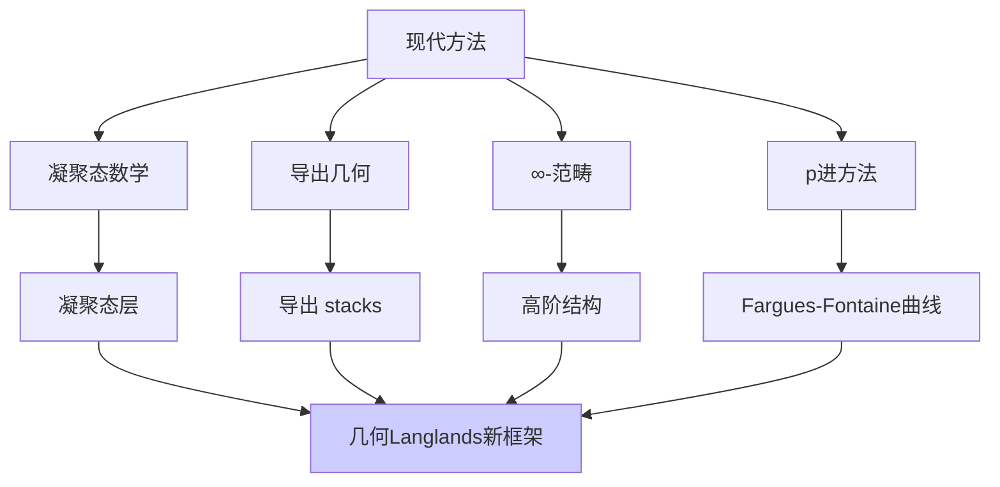
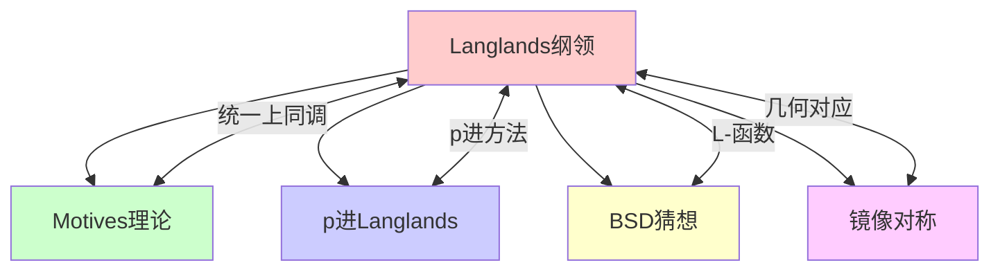

msc_primary: "00A99"
msc_secondary: ['00-XX']
---

# Langlands纲领（几何/数论侧）

## 前沿问题陈述

### 1.1 核心问题

**Langlands纲领**是数学中影响最深远的未解决问题之一，由Robert Langlands在1967年提出。它寻求数论、代数几何和表示论之间的深刻联系，被誉为"数学的大统一理论"。

**几何Langlands对应**是Langlands纲领在代数曲线上的几何版本，建立了以下对应关系：

```

G-丛的D-模范畴  ⟷  ˡG的局部系统范畴
(几何侧)          (表示论侧)

```

### 1.2 核心猜想

**几何Langlands猜想**：对于光滑射影曲线X和约化群G，存在一个范畴等价：

$$D(\text{Bun}_G(X)) \cong \text{QCoh}(\text{Loc}_{\check{G}}(X))$$

其中：
- $\text{Bun}_G(X)$：X上的G-主丛的模空间
- $\text{Loc}_{\check{G}}(X)$：X上的ˡG-局部系统的模空间
- D表示D-模范畴，QCoh表示拟凝聚层范畴

---

## 历史发展脉络

### 2.1 时间线



### 2.2 关键里程碑

| 年份 | 人物 | 突破 |
|-----|------|------|
| 1967 | Langlands | 纲领提出 |
| 1978 | Deligne | 证明函数域GL₂情形 |
| 1988 | Drinfeld | 证明函数域GLₙ情形 |
| 2002 | Lafforgue | 证明函数域所有约化群 |
| 2004 | Gaitsgory | 范畴化几何对应 |
| 2018 | V. Lafforgue | 自守到Galois方向的突破 |

---

## 与L3理论的联系

### 3.1 理论基础



### 3.2 依赖的L3理论

| L3理论 | 在Langlands中的应用 | 关键概念 |
|-------|-------------------|---------|
| 概形理论 | 模空间构造 | Bun_G的几何 |
| 层论 | D-模范畴 | 几何侧对象 |
| 表示论 | 自守形式 | 㲴表示 |
| 类域论 | 交换情形 | 阿贝尔对应 |
| 范畴论 | 对应表述 | 范畴等价 |

---

## 当前研究进展

### 4.1 已知结果

#### 4.1.1 函数域情形（已解决）

**Lafforgue定理（2002）**：对于函数域上的约化群，Langlands对应成立。

**关键工具**：
- shtuka构造
- 迹公式
- 几何方法

#### 4.1.2 数域情形（部分进展）

| 情形 | 状态 | 关键人物 |
|-----|------|---------|
| GL₁(类域论) | 完整解决 | Artin, Tate |
| GL₂ | 部分解决 | Langlands, Wiles |
| GLₙ | 函数域解决 | Lafforgue |
| 一般约化群 | 局部部分解决 | Arthur, Moeglin |

### 4.2 几何Langlands进展



### 4.3 当前活跃方向

| 方向 | 代表人物 | 核心问题 |
|-----|---------|---------|
| 量子几何Langlands | Gaitsgory | 形变量子化版本 |
| 导出几何化 | Arinkin, Rozenblyum | 导出范畴框架 |
| p进几何Langlands | Fargues, Scholze | p进情形对应 |
| 算术几何Langlands | V. Lafforgue | 数域到函数域 |

---

## 开放问题与猜想

### 5.1 核心开放问题

#### 5.1.1 整体Langlands对应（数域）

**问题**：建立数域上约化群的自守表示与Galois表示之间的完整对应。

**难点**：
- 无穷远处分析复杂
- 迹公式的不稳定谱
- 一般群的构造缺乏

#### 5.1.2 几何Langlands的算术版本

**猜想**：几何对应可以提升到算术设置，与p进Hodge理论结合。

### 5.2 千禧年相关问题



### 5.3 研究前沿问题列表

| 问题 | 难度 | 重要性 | 可能突破方向 |
|-----|------|-------|------------|
| 数域整体对应 | ★★★★★ | ★★★★★ | 导出方法, p进技术 |
| 函子iality证明 | ★★★★★ | ★★★★★ | 迹公式, 比较定理 |
| 几何对应算术化 | ★★★★☆ | ★★★★☆ | 完美oid空间 |
| 量子化版本 | ★★★★☆ | ★★★★☆ | 形变理论 |
| 高维推广 | ★★★★★ | ★★★☆☆ | 高维类域论 |

---

## 技术工具与方法

### 6.1 核心工具

| 工具 | 用途 | 关键文献 |
|-----|------|---------|
| shtuka | 函数域构造 | Drinfeld, Varshavsky |
| 迹公式 | 比较两侧 | Arthur-Selberg |
| Fourier-Mukai变换 | 几何对应 | Laumon, Rothstein |
| 导出代数几何 | 范畴提升 | Toën, Lurie |

### 6.2 现代方法



---

## 与其他前沿领域的联系

### 7.1 交叉领域



### 7.2 统一性意义

Langlands纲领的解决将统一以下数学分支：
- **数论**：Galois表示、L-函数、类域论
- **代数几何**：Motives、模空间、D-模
- **表示论**：自守形式、㲴表示、李群
- **调和分析**：迹公式、谱分解

---

## 学习资源

### 8.1 经典文献

1. **Langlands, R. P.** (1970). Problems in the Theory of Automorphic Forms.
2. **Gelbart, S.** (1984). An Elementary Introduction to the Langlands Program.
3. **Frenkel, E.** (2005). Lectures on the Langlands Program and Conformal Field Theory.
4. **Gaitsgory, D.** (2015). Outline of the Proof of the Geometric Langlands Conjecture for GL(2).

### 8.2 现代综述

- Arinkin-Gaitsgory: Singular support of coherent sheaves
- Fargues-Scholze: Geometrization of the local Langlands correspondence

---

## 总结

Langlands纲领代表了当代数学最前沿的挑战之一。它不仅是数学的大统一理论，更是理解数学深层结构的钥匙。从1967年Langlands的信件到今天，这一纲领已经催生了无数重要的数学发展，但其核心问题——数域上的整体对应——仍然是开放的。

随着导出代数几何、凝聚态数学和p进方法的不断发展，我们正站在可能取得突破的历史节点上。

---

*文档版本：1.0*
*创建日期：2026年4月*
*层次级别：L4-Frontier*
*领域分类：代数几何前沿*
