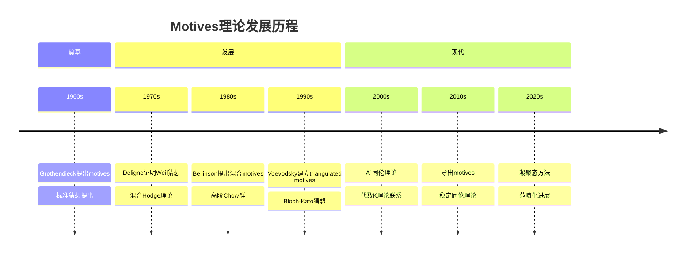
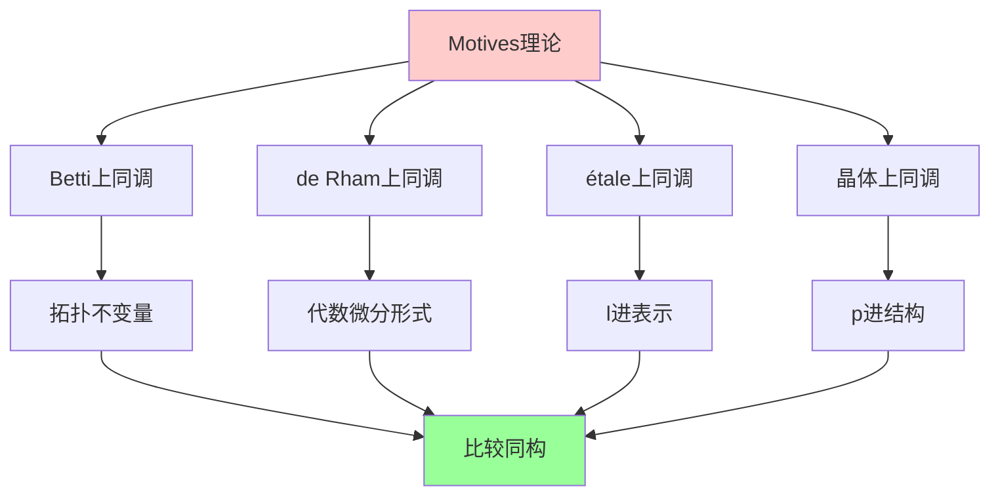
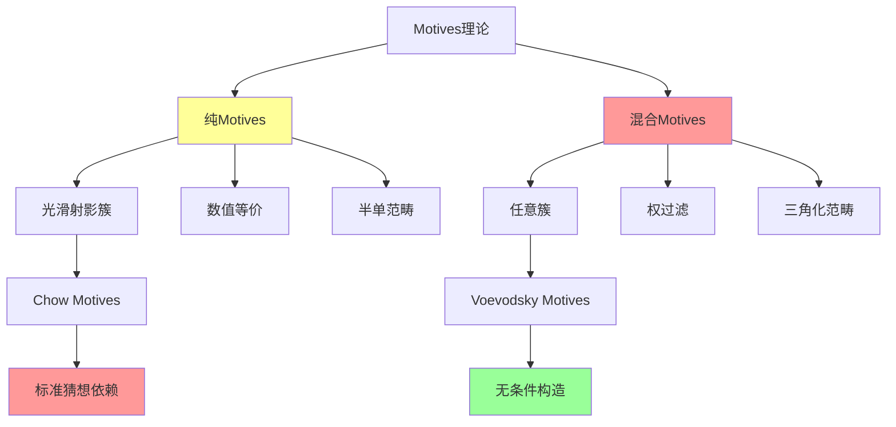
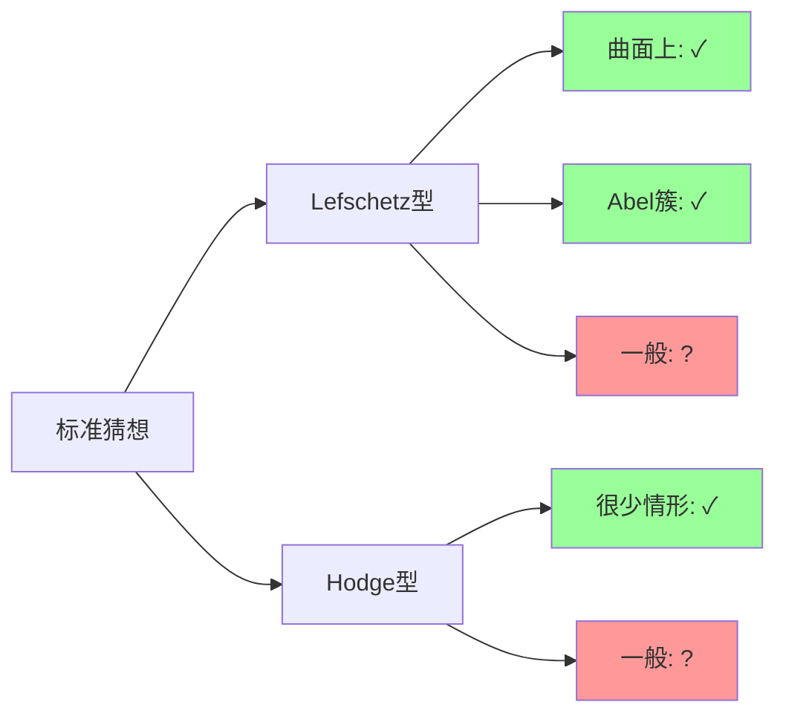
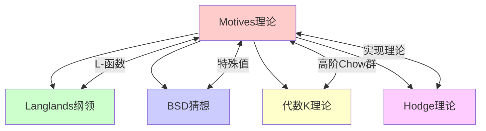

msc_primary: "00A99"
msc_secondary: ['00-XX']
---

# Motives理论

## 前沿问题陈述

### 1.1 核心问题

**Motives理论**（ motive 理论）由Grothendieck在1960年代提出，旨在为所有代数簇构建一个**普适的上同调理论**。这是代数几何中最深刻的未解决问题之一，被称为"数学的梦中之梦"。

**核心问题**：

1. **Motives的存在性**：是否存在一个阿贝尔范畴，使得每个代数簇对应一个motive，且所有上同调理论都可以从此范畴导出？

2. **标准猜想**：Grothendieck提出的标准猜想是否成立？这些猜想涉及代数闭链的结构性问题。

### 1.2 形式化表述

**猜想**：存在一个半单阿贝尔范畴 $\mathcal{M}_k$（纯motives范畴），使得：

$$h: \{\text{光滑射影簇}\} \to \mathcal{M}_k$$

是一个万有上同调理论，即对于任何Weil上同调理论 $H^*$，存在函子：

$$\omega_H: \mathcal{M}_k \to \text{Vec}_K$$

使得 $H^* = \omega_H \circ h$。

---

## 历史发展脉络

### 2.1 时间线



### 2.2 关键突破

| 年份 | 人物 | 突破 |
|-----|------|------|
| 1964 | Grothendieck | motives概念提出 |
| 1969 | Grothendieck | 标准猜想正式陈述 |
| 1982 | Bloch | 高阶Chow群，混合motives |
| 2000 | Voevodsky | 三角化motives范畴 |
| 2006 | Voevodsky | Bloch-Kato猜想证明 |
| 2015 | Ayoub, Cisinski-Déglise | 导出motives理论 |

---

## 与L3理论的联系

### 3.1 上同调理论的统一



### 3.2 依赖的L3理论

| L3理论 | 在Motives中的应用 | 关键结果 |
|-------|------------------|---------|
| Weil上同调 | motive的实化 | 比较定理 |
| 层论 | 构造方法 | Grothendieck拓扑 |
| 代数K理论 | 高阶Chow群 | Quillen构造 |
| 同调代数 | 导出范畴 | Voevodsky理论 |
| Hodge理论 | Hodge实现 | 混合Hodge结构 |

---

## 当前研究进展

### 4.1 理论架构



### 4.2 标准猜想详解

Grothendieck提出的标准猜想包括：

#### 4.2.1 Lefschetz标准猜想（B(X)）

**陈述**：代数闭链类在Hard Lefschetz定理中的作用可由代数闭链实现。

**状态**：
- 曲面上：证明（Lefschetz）
- 三维Abel簇：证明（Lieberman）
- 一般情形：开放

#### 4.2.2 Hodge标准猜想（I(X)）

**陈述**：某些闭链上的二次型是正定的。

**状态**：仅在少数情形证明。

### 4.3 Voevodsky的突破

**三角化Motives范畴（DM）**：

Voevodsky构造了一个三角化范畴，使得：
- 包含Chow motives作为完全子范畴
- 允许任意簇的motive
- 与代数K理论有深刻联系

**关键构造**：

```

DM(k) = 具有传递性的Nisnevich层复形的A¹-局部化

```

---

## 开放问题与猜想

### 5.1 核心开放问题

#### 5.1.1 Abel范畴的存在性

**问题**：是否存在一个阿贝尔范畴，其导出范畴等价于Voevodsky的DM？

这等价于问混合motives的"心"是否存在。

#### 5.1.2 标准猜想的证明



### 5.2 研究前沿问题

| 问题 | 状态 | 重要性 | 可能方向 |
|-----|------|-------|---------|
| Abel范畴构造 | 开放 | ★★★★★ | 导出代数几何 |
| 标准猜想 | 部分开放 | ★★★★★ | 表示论方法 |
| Tannaka对偶 | 发展中 | ★★★★☆ | Galois表示 |
| 周期猜想 | 开放 | ★★★★★ | 超越数论 |
| Tate猜想联系 | 研究中 | ★★★★☆ | étale上同调 |

### 5.3 与其他猜想的联系

**标准猜想蕴含**：
- Weil猜想（部分）
- Tate猜想
- Hodge猜想（部分）
- Bloch猜想（关于零闭链）

---

## 技术工具与方法

### 6.1 核心工具

| 工具 | 用途 | 代表人物 |
|-----|------|---------|
| 对应理论 | motive的态射 | Grothendieck, Manin |
| A¹同伦论 | 构造DM | Morel, Voevodsky |
| Nisnevich拓扑 | 局部理论 | Nisnevich, Suslin |
| 导出范畴 | 高阶结构 | Verdier, Beilinson |

### 6.2 现代进展

**凝聚态方法（Clausen-Scholze）**：

凝聚态数学为motives理论提供了新的视角：
- 凝聚态上同调作为新的实现
- 与p进几何的深刻联系
- 可能提供新的标准猜想证明路径

---

## 与其他前沿领域的联系

### 7.1 交叉网络



### 7.2 在算术几何中的作用

**特殊值猜想**（Beilinson-Deligne）：

L-函数在特殊点的值与motive的算术信息相关：

$$L(M, s) \sim \text{Regulator} \cdot \text{Period} \cdot \text{Arithmetic invariant}$$

这联系了：
- 算术信息（BSD、类数公式）
- 几何信息（周期、调节子）
- 分析信息（L-函数）

---

## 学习资源

### 8.1 经典文献

1. **Grothendieck, A.** (1969). Standard Conjectures on Algebraic Cycles.
2. **Kleiman, S. L.** (1968). Algebraic Cycles and the Weil Conjectures.
3. **Jannsen, U.** (1994). Motivic Sheaves and Filtrations on Chow Groups.
4. **André, Y.** (2004). Une Introduction aux Motifs.

### 8.2 现代综述

- Cisinski-Déglise: Triangulated Categories of Mixed Motives
- Voevodsky: Triangulated categories of motives over a field
- Ayoub: Les six opérations de Grothendieck et le formalisme des cycles évanescents dans le monde motivique

---

## 总结

Motives理论是Grothendieck留给数学界最深刻的遗产之一。它不仅是统一上同调理论的尝试，更是理解代数簇本质结构的终极追求。

虽然标准猜想和abel范畴的构造仍然开放，但Voevodsky的三角化motives理论已经在很大程度上实现了Grothendieck的愿景。随着导出代数几何和凝聚态数学的发展，我们或许正在接近这一伟大理论的最终完成。

---

*文档版本：1.0*
*创建日期：2026年4月*
*层次级别：L4-Frontier*
*领域分类：代数几何前沿*
