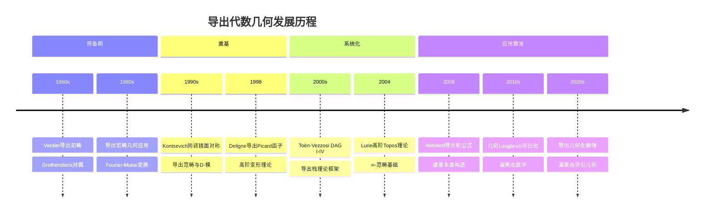
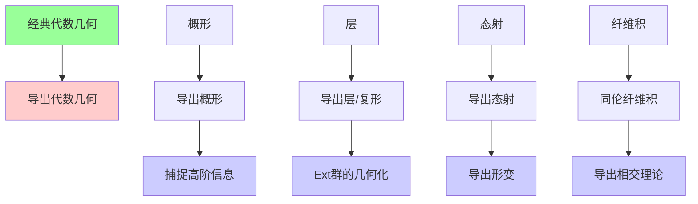
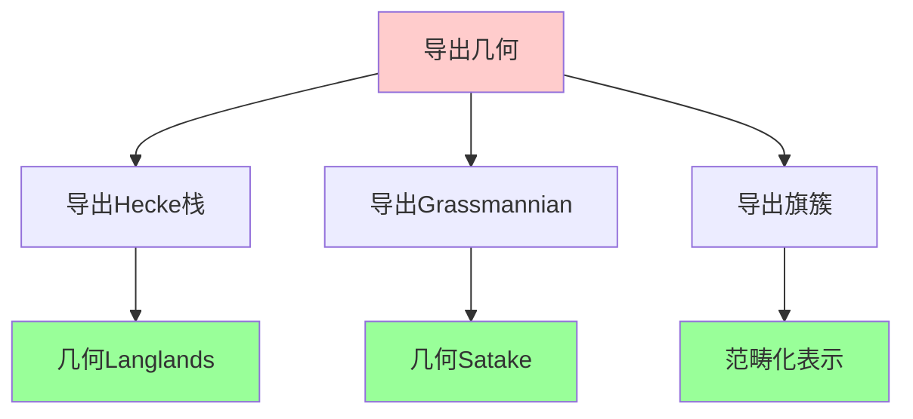
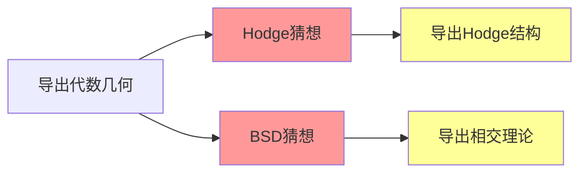
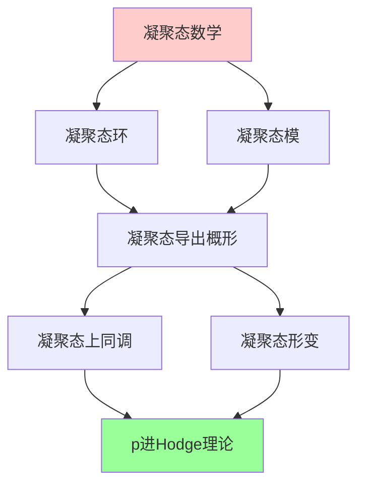
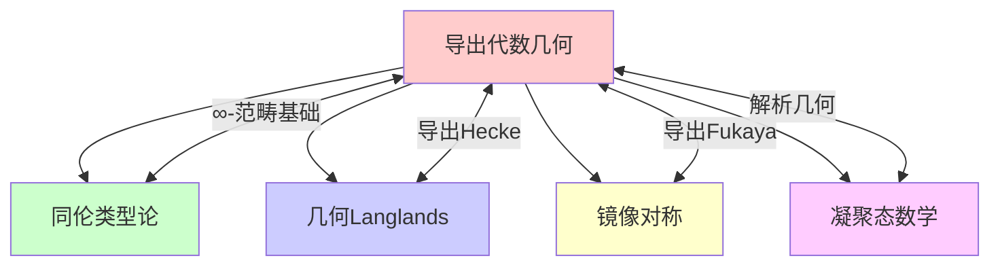

msc_primary: "00A99"
msc_secondary: ['00-XX']
---

# 导出代数几何

## 前沿问题陈述

### 1.1 核心问题

**导出代数几何**（Derived Algebraic Geometry）是将代数几何的基本对象从经典范畴提升到**导出范畴**层次的数学理论。它使得我们可以处理具有高阶同伦信息的"几何对象"。

**核心问题**：

1. **导出栈的构造与分类**：如何定义和研究具有高阶同伦信息的代数栈？

2. **虚基本类**：在导出几何框架下构造模空间的虚拟基本类，用于GW理论和Donaldson-Thomas理论。

3. **几何表示论**：导出几何为几何表示论提供了自然的语言框架。

### 1.2 形式化定义

**导出概形**：一个导出概形 $\mathbf{X}$ 是一个环化∞-topos，局部同构于导出仿射概形 $\text{Spec}(A)$，其中 $A$ 是一个导出环（simplicial commutative ring 或 $E_\infty$-ring）。

**关键图表**：

```

经典代数几何          导出代数几何
概形 X        →      导出概形 𝐗
层 𝒪_X       →      导出层 𝒪_𝐗
态射 f       →      导出态射 𝐟
纤维积       →      导出纤维积（同伦意义）

```

---

## 历史发展脉络

### 2.1 时间线



### 2.2 关键突破

| 年份 | 人物 | 突破 |
|-----|------|------|
| 1998 | Deligne | 导出Picard函子 |
| 2004 | Toën-Vezzosi | DAG系统化 |
| 2008 | Lurie | 高阶Topos理论 |
| 2009 | Behrend | 导出积公式 |
| 2011 | Lurie | Higher Algebra |
| 2015 | Toën | 导出代数几何专著 |
| 2020 | Clausen-Scholze | 凝聚态导出几何 |

---

## 与L3理论的联系

### 3.1 从经典到导出



### 3.2 依赖的L3理论

| L3理论 | 在导出几何中的应用 | 关键结果 |
|-------|------------------|---------|
| 同调代数 | 导出范畴几何 | Fourier-Mukai等价 |
| 代数栈 | 导出栈构造 | 模问题的导出解决 |
| 形变理论 | 导出形变函子 | 高阶切空间 |
| ∞-范畴论 | 理论框架 | Lurie的理论 |
| 代数拓扑 | 同伦方法 | 环谱的几何 |

---

## 当前研究进展

### 4.1 主要应用领域

#### 4.1.1 Gromov-Witten理论

**导出构造**：

$$\overline{\mathcal{M}}_{g,n}^{\text{der}}(X, \beta)$$

导出模空间具有自然的虚基本类，使得GW不变量的定义更加自然。

**Behrend定理**：GW不变量可以表示为导出态射0-截面的局部欧拉类。

#### 4.1.2 几何表示论



### 4.2 理论架构

| 层次 | 对象 | 特征 |
|-----|------|------|
| 经典层 | 概形 | 普通交换环 |
| 导出层 | 导出概形 | simplicial环 |
| 谱几何 | 谱概形 | $E_\infty$-环 |
| 凝聚态 | 凝聚态空间 | 凝聚拓扑 |

### 4.3 当前活跃方向

| 方向 | 代表人物 | 核心问题 |
|-----|---------|---------|
| 导出几何Langlands | Arinkin, Gaitsgory | 范畴化对应 |
| 凝聚态导出几何 | Clausen, Scholze | 解析几何导出化 |
| 导出SYZ镜像对称 | Auroux, Katzarkov | 特殊Lagrangian导出化 |
| 导出 motivic 同伦 | Röndigs, Østvær | A¹-同伦的导出化 |

---

## 开放问题与猜想

### 5.1 核心开放问题

#### 5.1.1 导出Hodge理论

**问题**：是否存在一个导出版本的Hodge理论，将导出de Rham上同调与导出Betti上同调联系起来？

**意义**：这将连接：
- 导出de Rham复形
- 导出周期映射
- 非交换Hodge结构

#### 5.1.2 导出标准猜想

**问题**：标准猜想在导出几何框架下如何表述？是否更容易证明？

### 5.2 研究前沿问题

| 问题 | 状态 | 重要性 | 可能突破方向 |
|-----|------|-------|------------|
| 导出范畴的坐标化 | 部分解决 | ★★★★☆ | 导出代数几何 |
| 非交换分解猜想 | 开放 | ★★★★★ | 导出等价 |
| 导出几何的算术 | 发展中 | ★★★★☆ | 凝聚态方法 |
| 导出辛几何 | 活跃 | ★★★★☆ | 变形量子化 |

### 5.3 与千禧年问题的联系



---

## 技术工具与方法

### 6.1 核心工具

| 工具 | 用途 | 关键文献 |
|-----|------|---------|
| simplicial环 | 导出概形局部 | Quillen, Toën |
| $E_\infty$-环 | 谱几何 | Lurie |
| 导出de Rham复形 | 导出微分形式 | Bhatt |
| 同伦下降 | 整体构造 | HAG I-IV |

### 6.2 现代方法

**凝聚态导出几何**：

Clausen-Scholze将导出几何与凝聚态数学结合：



---

## 与其他前沿领域的联系

### 7.1 交叉网络



### 7.2 在数学物理中的应用

**导出弦理论**：
- 导出D-膜
- 导出B-模型
- 导出范畴与超对称

---

## 学习资源

### 8.1 经典文献

1. **Toën, B.** (2014). Derived Algebraic Geometry.
2. **Lurie, J.** (2009). Higher Topos Theory.
3. **Lurie, J.** (2017). Higher Algebra.
4. **Toën, B., Vezzosi, G.** (2008). Homotopical Algebraic Geometry II.

### 8.2 现代综述

- Gaitsgory: Outline of the proof of the geometric Langlands conjecture for GL(2)
- Clausen-Scholze: Lectures on Condensed Mathematics
- Bhatt: The Hodge-Tate decomposition via perfectoid spaces

---

## 总结

导出代数几何代表了代数几何的现代化方向，它将经典几何与同伦理论、高阶范畴论有机结合，为解决模空间问题、几何表示论和数学物理中的深刻问题提供了强大的工具。

随着凝聚态数学的兴起和几何Langlands纲领的推进，导出代数几何正处于快速发展的黄金时期。

---

*文档版本：1.0*
*创建日期：2026年4月*
*层次级别：L4-Frontier*
*领域分类：代数几何前沿*
