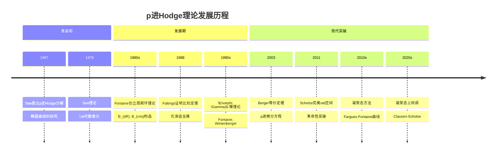
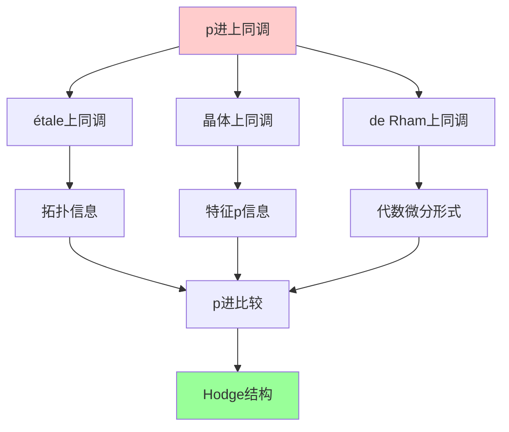
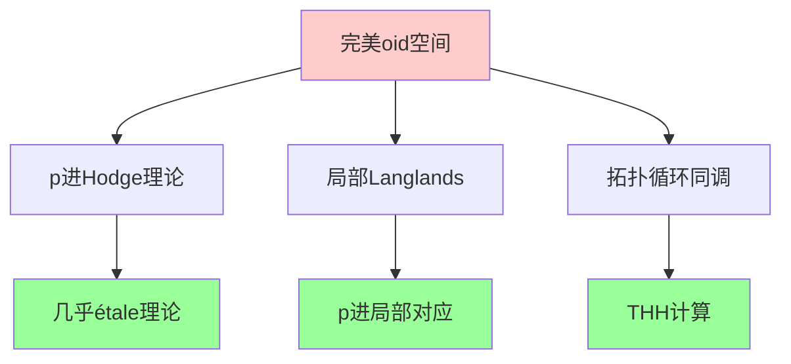
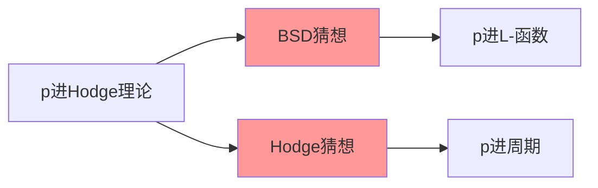
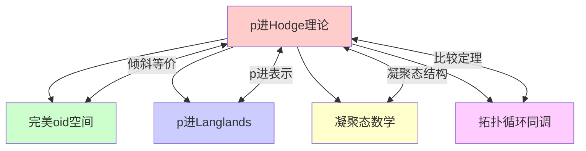

msc_primary: "00A99"
msc_secondary: ['00-00']
---

# p进Hodge理论

## 前沿问题陈述

### 1.1 核心问题

**p进Hodge理论**（p-adic Hodge Theory）是研究p进域上代数簇的上同调结构的理论，由Tate、Fontaine和Faltings等人发展起来。它是经典Hodge理论在p进情形的类比，但具有更加丰富和复杂的结构。

**核心问题**：

1. **比较定理**：p进étale上同调与代数de Rham上同调之间是否存在比较同构？

2. **p进表示分类**：如何用线性代数数据（如$(\varphi, \Gamma)$-模）分类Galois表示？

3. **p进周期环**：如何构造合适的p进周期环来桥接不同上同调理论？

### 1.2 核心猜想

**p进比较定理**：对于光滑真概形 $X/K$，存在典范同构：

$$H^n_{\text{ét}}(X_{\overline{K}}, \mathbb{Q}_p) \otimes_{\mathbb{Q}_p} B_{\text{dR}} \cong H^n_{\text{dR}}(X/K) \otimes_K B_{\text{dR}}$$

其中 $B_{\text{dR}}$ 是Fontaine的de Rham周期环。

---

## 历史发展脉络

### 2.1 时间线

### 2.2 关键突破

| 年份 | 人物 | 突破 |
|-----|------|------|
| 1967 | Tate | p进Hodge分解猜想 |
| 1982 | Fontaine | 周期环理论奠基 |
| 1988 | Faltings | 一般比较定理证明 |
| 1990 | Fontaine | $(\varphi, \Gamma)$-模 |
| 2003 | Berger | p进微分方程理论 |
| 2011 | Scholze | 完美oid空间 |
| 2018 | Fargues-Scholze | 凝聚态几何化 |

---

## 与L3理论的联系

### 3.1 比较同构网络

### 3.2 依赖的L3理论

| L3理论 | 在p进Hodge中的应用 | 关键结果 |
|-------|-------------------|---------|
| 代数几何 | 概形上同调 | 光滑适当性条件 |
| Galois理论 | 表示论框架 | p进Galois表示 |
| 同调代数 | 导出构造 | 高阶比较 |
| 泛函分析 | 凝聚态方法 | Banach空间 |
| 数论 | 局部域理论 | $p$进域结构 |

---

## 当前研究进展

### 4.1 完美oid革命

**Scholze的突破（2011）**：

完美oid空间在特征0和特征p之间建立了桥梁：

### 4.2 凝聚态方法

**Fargues-Fontaine曲线**：

为p进Hodge理论提供了几何化框架：

$$\text{FF}_K = \text{Proj}(\bigoplus_{d \geq 0} B_{\text{dR}}^{\varphi = \pi^d})$$

Galois表示对应于曲线上的向量丛。

### 4.3 当前活跃方向

| 方向 | 代表人物 | 核心进展 |
|-----|---------|---------|
| 凝聚态上同调 | Clausen, Scholze | 新框架建立 |
| p进局部Langlands | Fargues, Scholze | 几何对应 |
| 原始p进Hodge理论 | Bhatt, Morrow | 对数理论 |
| 高维理论 | Abbes-Gros-Tsuji | 几乎光滑簇 |

---

## 开放问题与猜想

### 5.1 核心开放问题

#### 5.1.1 p进Hodge-Tate分解的细化

**问题**：如何将p进比较定理推广到奇异簇和对数情形？

**意义**：这对于算术几何中的许多应用至关重要。

#### 5.1.2 凝聚态周期猜想

**问题**：在凝聚态框架下，周期映射是否满足某种"刚性"性质？

### 5.2 研究前沿问题

| 问题 | 状态 | 重要性 | 可能突破方向 |
|-----|------|-------|------------|
| 奇异簇比较定理 | 部分解决 | ★★★★☆ | 导出方法 |
| 对数p进Hodge | 进展中 | ★★★★☆ | 原始理论 |
| p进动机理论 | 开放 | ★★★★★ | 凝聚态 |
| 高维比较 | 发展中 | ★★★☆☆ | 完美oid |

### 5.3 与千禧年问题的联系

---

## 技术工具与方法

### 4.1 核心工具

| 工具 | 用途 | 关键文献 |
|-----|------|---------|
| $B_{\text{dR}}$ | de Rham周期 | Fontaine |
| $B_{\text{cris}}$ | 晶体周期 | Fontaine |
| $(\varphi, \Gamma)$-模 | 表示分类 | Fontaine, Berger |
| 完美oid空间 | 比较定理 | Scholze |
| Fargues-Fontaine曲线 | 几何化 | Fargues-Fontaine |

### 4.2 现代方法

**凝聚态p进Hodge理论**：

Clausen-Scholze的新框架：
- 用凝聚拓扑替代普通拓扑
- 用凝聚向量丛替代p进向量空间
- 提供全新的几何视角

---

## 与其他前沿领域的联系

### 4.1 交叉网络

### 4.2 应用网络

| 应用领域 | 关键联系 | 重要性 |
|---------|---------|-------|
| 算术几何 | Galois表示 | ★★★★★ |
| 代数几何 | 上同调比较 | ★★★★★ |
| 表示论 | p进Langlands | ★★★★☆ |
| 数论 | L-函数特殊值 | ★★★★☆ |

---

## 学习资源

### 4.1 经典文献

1. **Tate, J.** (1967). p-divisible Groups.
2. **Fontaine, J.-M.** (1982). Formes différentielles et modules de Tate.
3. **Faltings, G.** (1988). p-adic Hodge Theory.
4. **Scholze, P.** (2012). Perfectoid Spaces.

### 4.2 现代综述

- Fargues-Fontaine: Courbes et fibrés vectoriels en théorie de Hodge p-adique
- Bhatt-Morrow-Scholze: Integral p-adic Hodge Theory
- Clausen-Scholze: Lectures on Condensed Mathematics

---

## 总结

p进Hodge理论从Tate的最初猜想到Scholze的完美oid革命，经历了半个多世纪的深刻发展。它不仅是连接代数几何和数论的桥梁，更是现代算术几何的核心工具。

随着凝聚态数学的兴起，p进Hodge理论正在经历新一轮的范式转换，这为解决BSD猜想等深刻算术问题带来了新的希望。

---

*文档版本：1.0*
*创建日期：2026年4月*
*层次级别：L4-Frontier*
*领域分类：代数几何前沿*
