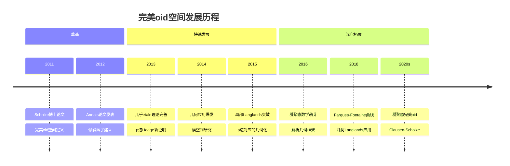
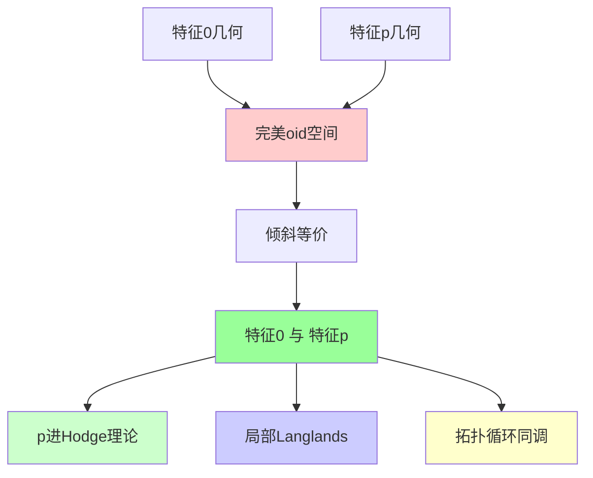
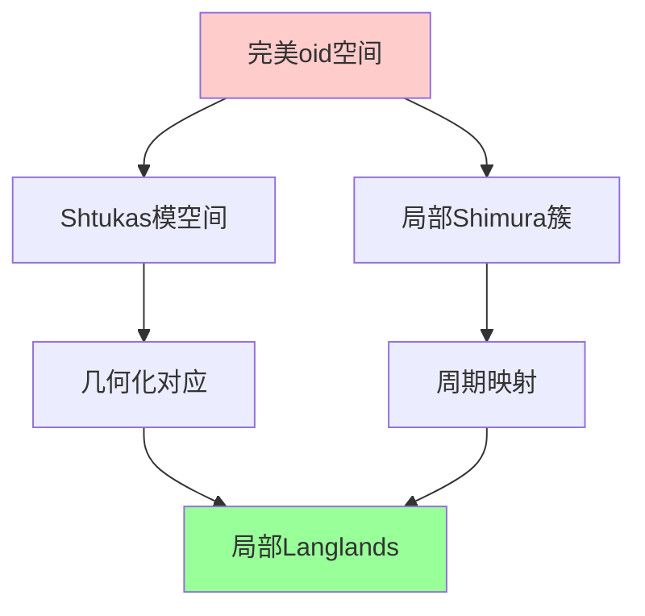
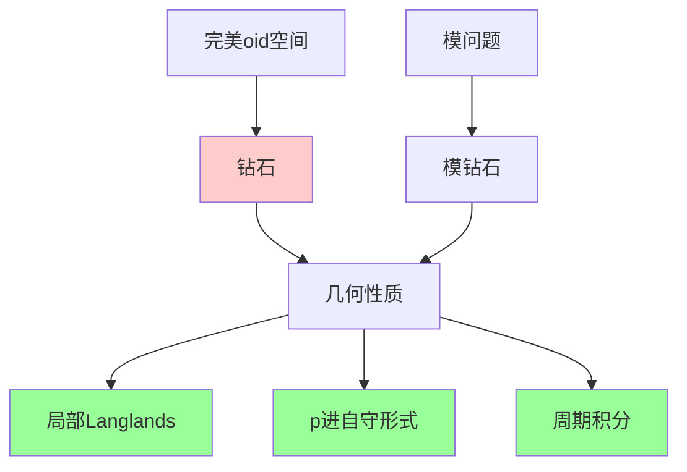
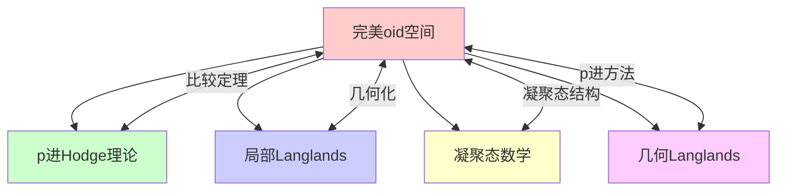

# 完美oid空间

## 前沿问题陈述

### 1.1 核心问题

**完美oid空间**（Perfectoid Spaces）是由Peter Scholze在2011年引入的革命性理论，在p进几何领域引发了范式转换。它在特征0和特征p之间建立了深刻的联系，为多个长期悬而未决的问题提供了全新的解决路径。

**核心问题**：

1. **倾斜等价**：完美oid空间的tilting等价如何在不同特征之间建立几何对应？

2. **几乎数学**：如何用几乎etale理论简化p进上同调的计算？

3. **应用拓展**：如何将完美oid方法应用于几何Langlands、p进自守形式等核心问题？

### 1.2 核心定义

**完美oid代数**：一个Banach Q_p-代数 R 称为完美oid，如果：
- R 是均匀的（uniform）
- 存在伪一致化子 w 属于 R 使得 w^p 整除 p
- Frobenius映射 R/w 到 R/w^p 是同构

**倾斜**：对于完美oid代数 R，其倾斜 R^flat 定义为：

R^flat = 逆极限 (x 映射到 x^p) R

这是一个完美 F_p-代数。

---

## 历史发展脉络

### 2.1 时间线

### 2.2 关键突破

| 年份 | 人物 | 突破 |
|-----|------|------|
| 2011 | Scholze | 完美oid空间引入 |
| 2012 | Scholze | 倾斜等价定理 |
| 2013 | Scholze | p进比较定理新证明 |
| 2015 | Scholze | 局部Langlands几何化 |
| 2017 | Scholze-Weinstein | 模空间完美oid化 |
| 2021 | Fargues-Scholze | 几何Langlands进展 |

---

## 与L3理论的联系

### 3.1 特征桥梁

### 3.2 依赖的L3理论

| L3理论 | 在完美oid中的应用 | 关键结果 |
|-------|------------------|---------|
| 刚性解析几何 | 基础框架 | Tate, Berkovich |
| Banach空间 | 分析结构 | 泛函分析 |
| 几乎数学 | 上同调计算 | Faltings, Gabber |
| 代数几何 | 概形理论 | Grothendieck |
| 表示论 | 局部Langlands | 㲴表示 |

---

## 当前研究进展

### 4.1 主要应用

#### 4.1.1 p进Hodge理论

**几乎纯性定理**：

对于完美oid空间之间的有限etale覆盖，几乎上同调是纯的。

这导出了p进比较定理的简洁证明。

#### 4.1.2 局部Langlands纲领

### 4.2 现代发展

**凝聚态完美oid理论**：

Clausen-Scholze将完美oid理论与凝聚态数学结合：
- 凝聚态结构层
- 凝聚态上同调
- 新的解析几何框架

### 4.3 当前活跃方向

| 方向 | 代表人物 | 核心进展 |
|-----|---------|---------|
| 凝聚态几何 | Clausen, Scholze | 新框架建立 |
| 几何Langlands | Fargues, Scholze | p进对应 |
| 模空间理论 | Hansen, Weinstein | 完美oid化 |
| 原始Hodge理论 | Bhatt, Li | 对数推广 |

---

## 开放问题与猜想

### 5.1 核心开放问题

#### 5.1.1 完美oid叠层

**问题**：能否定义完美oid叠层（stack），并建立相应的倾斜理论？

**意义**：这将完美oid方法推广到模问题。

#### 5.1.2 数域上的完美oid理论

**问题**：如何在数域（非局部域）上建立类似的理论？

### 5.2 研究前沿问题

| 问题 | 状态 | 重要性 | 可能突破方向 |
|-----|------|-------|------------|
| 完美oid叠层 | 部分解决 | 4星 | 导出几何 |
| 数域推广 | 开放 | 5星 | 全局理论 |
| 原始完美oid | 进展中 | 3星 | 对数方法 |
| 量子完美oid | 萌芽 | 3星 | 形变量子化 |

---

## 技术工具与方法

### 6.1 核心工具

| 工具 | 用途 | 关键文献 |
|-----|------|---------|
| 倾斜函子 | 特征对应 | Scholze |
| 几乎etale | 上同调计算 | Faltings |
| 均匀代数 | 结构控制 | Scholze |
| 钻石(Diamonds) | 商空间 | Scholze |
| 小v-拓扑 | 上同调 | Scholze |

### 6.2 钻石理论

**钻石**是完美oid空间在pro-etale拓扑下的商，是研究模空间的重要工具：

---

## 与其他前沿领域的联系

### 7.1 交叉网络

### 7.2 应用影响

完美oid理论的影响已经扩展到：
- **数论**：BSD猜想、L-函数特殊值
- **代数几何**：p进上同调、模空间
- **表示论**：p进Langlands、自守形式
- **拓扑**：拓扑循环同调、代数K理论

---

## 学习资源

### 8.1 经典文献

1. **Scholze, P.** (2012). Perfectoid Spaces.
2. **Scholze, P.** (2013). p-adic Hodge Theory for Rigid-Analytic Varieties.
3. **Scholze, P., Weinstein, J.** (2020). Berkeley Lectures on p-adic Geometry.
4. **Fargues, L., Scholze, P.** (2021). Geometrization of the Local Langlands Correspondence.

### 8.2 现代综述

- Caraiani-Scholze: On the generic part of the cohomology
- Hansen: Moduli of local shtukas
- Kaletha-Weinstein: On the Kottwitz conjecture

---

## 总结

完美oid空间是21世纪数学最重要的发现之一。Scholze的这一理论不仅解决了多个长期悬而未决的问题，更开创了全新的数学研究方向。

从p进Hodge理论到局部Langlands纲领，从凝聚态数学到几何表示论，完美oid理论的影响正在不断扩展。它代表了当代数学前沿最激动人心的发展方向之一。

---

*文档版本：1.0*
*创建日期：2026年4月*
*层次级别：L4-Frontier*
*领域分类：代数几何前沿*
