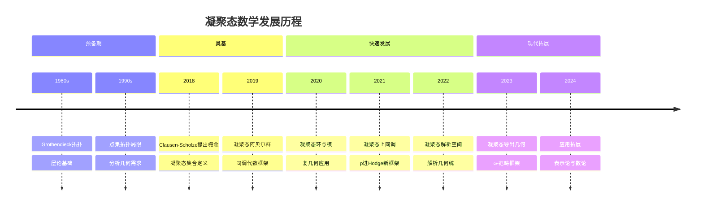
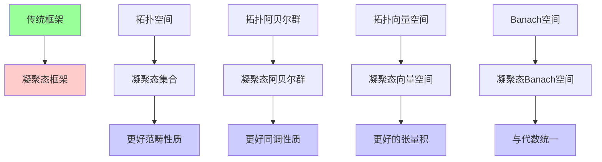
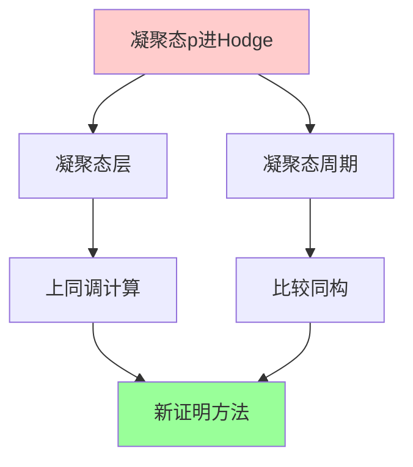
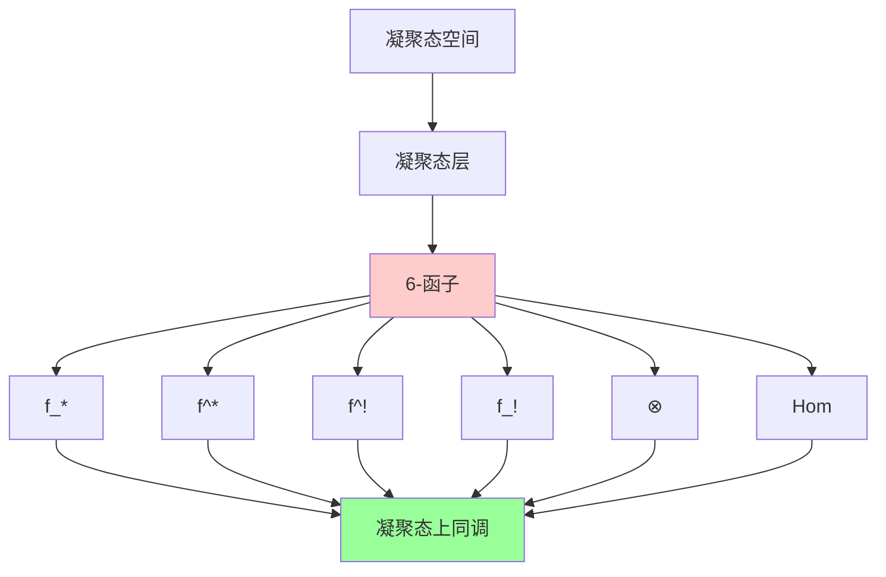
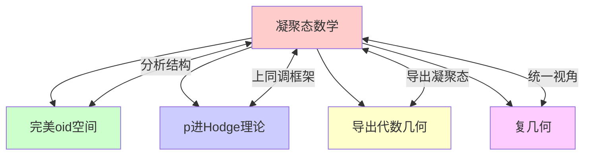

msc_primary: "00A99"
msc_secondary: ['00-XX']
---

# 凝聚态数学

## 前沿问题陈述

### 1.1 核心问题

**凝聚态数学**（Condensed Mathematics）是由Dustin Clausen和Peter Scholze在2018年左右提出的全新数学框架，旨在统一代数几何、泛函分析和拓扑学。它为分析几何问题提供了比传统拓扑方法更灵活的工具。

**核心问题**：

1. **凝聚态结构的普适性**：凝聚态数学能否成为代数几何和分析几何的统一语言？

2. **凝聚态上同调**：如何用凝聚态方法重新构建p进Hodge理论和复几何？

3. **与导出几何的融合**：凝聚态导出几何如何统一代数和分析对象？

### 1.2 核心定义

**凝聚态集合**：一个凝聚态集合是一个函子：

$$T: \{\text{Profinite集合}\}^{\text{op}} \to \{\text{集合}\}$$

满足对profinite集合的有限余极限保持。

**凝聚态阿贝尔群**：类似定义的取值在阿贝尔群范畴中的函子。

**关键洞察**：拓扑空间的信息可以通过profinite集合的极限来编码。

---

## 历史发展脉络

### 2.1 时间线

### 2.2 关键突破

| 年份 | 人物 | 突破 |
|-----|------|------|
| 2018 | Clausen, Scholze | 凝聚态概念提出 |
| 2019 | Clausen-Scholze | 凝聚态同调代数 |
| 2020 | Scholze | 凝聚态复几何 |
| 2021 | Clausen-Scholze | 凝聚态上同调论 |
| 2022 | Mann | 6-函子形式化 |
| 2023 | 多人 | 凝聚态导出几何 |

---

## 与L3理论的联系

### 3.1 从传统到凝聚态

### 3.2 依赖的L3理论

| L3理论 | 在凝聚态中的应用 | 关键结果 |
|-------|------------------|---------|
| 层论 | 凝聚态层 | Grothendieck拓扑 |
| 同调代数 | 导出凝聚态 | 凝聚态Ext |
| 泛函分析 | 分析对象凝聚态化 | Banach空间 |
| 代数几何 | 凝聚态概形 | 结构层 |
| ∞-范畴论 | 高阶结构 | Lurie理论 |

---

## 当前研究进展

### 4.1 主要应用领域

#### 4.1.1 p进Hodge理论

**凝聚态p进Hodge理论**：

用凝聚态方法重构p进Hodge理论：
- 凝聚态周期环
- 凝聚态比较定理
- 更自然的几何框架

#### 4.1.2 复几何

**凝聚态复几何**：
- 凝聚态复流形
- 凝聚态全纯函数
- 与代数几何的统一视角

### 4.2 理论架构

| 层次 | 凝聚态对象 | 传统类比 | 优势 |
|-----|-----------|---------|------|
| 集合 | 凝聚态集合 | 拓扑空间 | 更好范畴性质 |
| 代数 | 凝聚态环 | 拓扑环 | 统一框架 |
| 几何 | 凝聚态空间 | 拓扑空间 | 包含分析几何 |
| 导出 | 凝聚态导出 | 导出范畴 | 高阶结构 |

### 4.3 当前活跃方向

| 方向 | 代表人物 | 核心进展 |
|-----|---------|---------|
| 6-函子形式化 | Mann, Scholze | 凝聚态上同调公理 |
| 凝聚态解析几何 | Clausen | 非阿基米德几何 |
| 凝聚态D-模 | 多人 | 微分方程新框架 |
| 凝聚态表示论 | Fargues | p进表示新视角 |

---

## 开放问题与猜想

### 5.1 核心开放问题

#### 5.1.1 凝聚态标准猜想

**问题**：标准猜想在凝聚态框架下是否有更自然的表述和证明？

**意义**：这可能为标准猜想提供新视角。

#### 5.1.2 凝聚态与导出几何的融合

**问题**：凝聚态导出几何能否统一所有几何对象？

### 5.2 研究前沿问题

| 问题 | 状态 | 重要性 | 可能突破方向 |
|-----|------|-------|------------|
| 凝聚态标准猜想 | 开放 | ★★★★★ | 新框架 |
| 全局凝聚态理论 | 发展中 | ★★★★☆ | 数域推广 |
| 凝聚态算术几何 | 萌芽 | ★★★★☆ | BSD猜想 |
| 凝聚态动力系统 | 萌芽 | ★★★☆☆ | 遍历理论 |

---

## 技术工具与方法

### 6.1 核心工具

| 工具 | 用途 | 关键文献 |
|-----|------|---------|
| Profinite集合 | 基础构建块 | Clausen-Scholze |
| 凝聚态层 | 几何结构 | Scholze |
| 凝聚态Ext | 同调计算 | Clausen |
| 凝聚态张量积 | 代数结构 | Clausen-Scholze |
| v-拓扑 | 上同调 | Scholze |

### 6.2 现代方法

**6-函子形式化**：

Mann发展的凝聚态上同调公理化：

---

## 与其他前沿领域的联系

### 7.1 交叉网络

### 7.2 统一性意义

凝聚态数学试图统一：
- **代数几何**：概形、叠层
- **复几何**：复流形、复空间
- **p进几何**：刚性解析空间、完美oid空间
- **泛函分析**：Banach空间、Fréchet空间

---

## 学习资源

### 8.1 经典文献

1. **Clausen, D., Scholze, P.** (2019). Lectures on Condensed Mathematics.
2. **Clausen, D., Scholze, P.** (2022). Lectures on Analytic Geometry.
3. **Scholze, P.** (2020). Condensed Mathematics.
4. **Mann, L.** (2022). A p-adic 6-Functor Formalism.

### 8.2 现代综述

- Lucas Mann: 6-functor formalisms and analytic geometry
- Analytic rings ( ongoing work by Clausen-Scholze )
- Condensed mathematics and its applications

---

## 总结

凝聚态数学是近年来数学基础理论最重要的发展之一。它试图为代数几何、分析几何和拓扑学提供一个统一的语言框架。

虽然这一理论仍在快速发展中，但它已经显示出解决深层数学问题的潜力。从p进Hodge理论到复几何，从表示论到数论，凝聚态方法正在改变我们理解和研究数学的方式。

---

*文档版本：1.0*
*创建日期：2026年4月*
*层次级别：L4-Frontier*
*领域分类：代数几何前沿*
