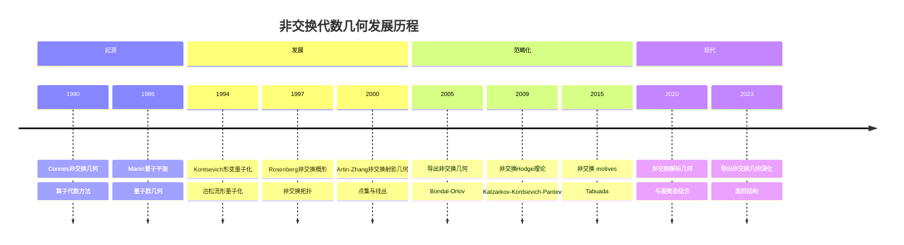
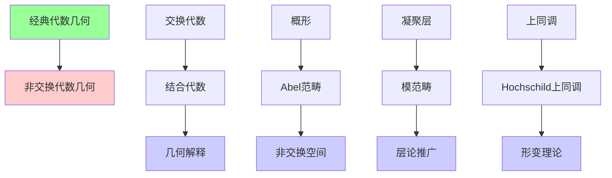
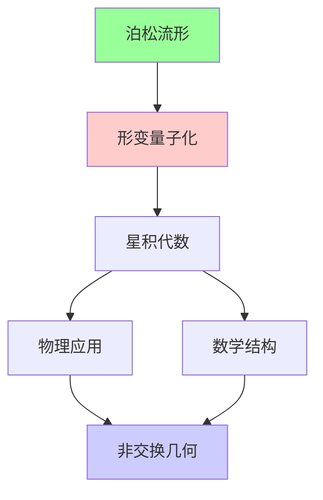
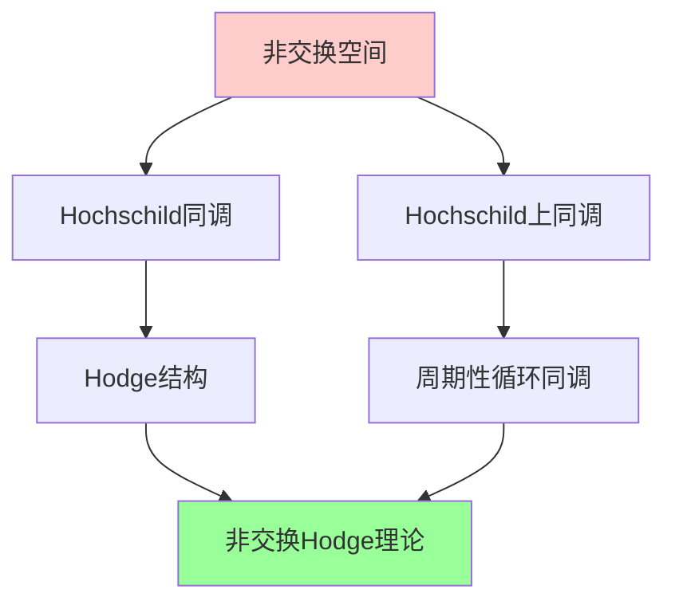
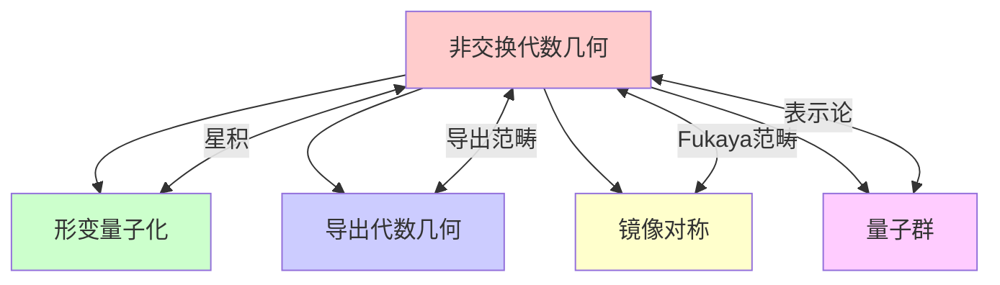

# 非交换代数几何

## 前沿问题陈述

### 1.1 核心问题

**非交换代数几何**（Noncommutative Algebraic Geometry）是将代数几何的方法和思想推广到非交换代数的数学分支。它起源于对量子群、D-模和算子代数的研究，现已发展成为一个独立而深刻的数学领域。

**核心问题**：

1. **非交换空间的定义**：如何为结合代数赋予"几何"意义？

2. **非交换对应**：非交换空间之间是否存在类似经典对应理论的联系？

3. **非交换不变量**：如何构造非交换空间的不变量，并将其与经典几何联系起来？

### 1.2 核心定义

**非交换概形**：一个非交换空间可以形式化地定义为一个Abel范畴，通常表现为：
- 左模范畴 $A$-mod（对于结合代数 $A$）
- 凝聚层范畴 Coh(X)（对于经典概形X）
- 导出范畴 $D^b(\text{Coh}(X))$

**非交换形变**：对于交换代数 $A_0$，非交换形变是一族代数 $A_\hbar$ 使得：

$$A_\hbar/(\hbar) \cong A_0, \quad [a, b]_\hbar = \hbar \cdot \text{Poisson bracket}$$

---

## 历史发展脉络

### 2.1 时间线

### 2.2 关键突破

| 年份 | 人物 | 突破 |
|-----|------|------|
| 1980 | Connes | 非交换微分几何奠基 |
| 1994 | Kontsevich | 形变量子化定理 |
| 1997 | Rosenberg | 非交换概形理论 |
| 2000 | Artin-Zhang | 非交换射影几何 |
| 2005 | Bondal-Orlov | 导出非交换几何 |
| 2015 | Tabuada | 非交换 motives |

---

## 与L3理论的联系

### 3.1 非交换化路径

### 3.2 依赖的L3理论

| L3理论 | 在非交换几何中的应用 | 关键结果 |
|-------|---------------------|---------|
| 同调代数 | Hochschild上同调 | 形变理论 |
| 范畴论 | 导出范畴方法 | Bondal-Orlov等价 |
| 代数几何 | 对应理论 | Fourier-Mukai变换 |
| K-理论 | 非交换K-理论 | 指标定理 |
| D-模理论 | 微分算子代数 | Riemann-Hilbert |

---

## 当前研究进展

### 4.1 主要应用领域

#### 4.1.1 形变量子化

**Kontsevich定理**：任何泊松流形都存在形变量子化。

#### 4.1.2 导出非交换几何

**Bondal-Orlov等价**：

导出范畴可以捕获非交换信息：

$$D^b(\text{Coh}(X)) \cong D^b(\text{mod-}A)$$

其中 $A$ 是非交换代数。

### 4.2 理论架构

| 层次 | 经典对象 | 非交换类比 | 核心问题 |
|-----|---------|-----------|---------|
| 代数 | 交换代数 | 结合代数 | 表示论 |
| 几何 | 概形 | Abel范畴 | 点集重构 |
| 上同调 | 层上同调 | Hochschild | 形变理论 |
| K-理论 | 代数K-理论 | 非交换K-理论 | 指标定理 |

### 4.3 当前活跃方向

| 方向 | 代表人物 | 核心进展 |
|-----|---------|---------|
| 非交换Hodge理论 | Katzarkov, Kontsevich | KKP理论 |
| 非交换 motives | Tabuada | 范畴化理论 |
| 非交换解析几何 | Bambozzi | 与凝聚态结合 |
| 非交换镜像对称 | Auroux | Fukaya范畴 |

---

## 开放问题与猜想

### 5.1 核心开放问题

#### 5.1.1 非交换标准猜想

**问题**：Grothendieck的标准猜想在非交换几何中如何表述？

**意义**：这将连接非交换几何与算术几何。

#### 5.1.2 非交换Bloch猜想

**问题**：非交换簇上的零闭链理论如何建立？

### 5.2 研究前沿问题

| 问题 | 状态 | 重要性 | 可能突破方向 |
|-----|------|-------|------------|
| 非交换标准猜想 | 开放 | ★★★★★ | 表示论方法 |
| 非交换Bloch猜想 | 开放 | ★★★★☆ | K-理论 |
| 非交换BSD | 萌芽 | ★★★★☆ | 椭圆曲线 |
| 非交换Hodge | 进展中 | ★★★★☆ | KKP理论 |

---

## 技术工具与方法

### 6.1 核心工具

| 工具 | 用途 | 关键文献 |
|-----|------|---------|
| Hochschild上同调 | 形变理论 | Gerstenhaber |
| 循环上同调 | 非交换微分形式 | Connes |
| 导出范畴 | 几何不变量 | Bondal-Orlov |
| Calabi-Yau代数 | 非交换对偶 | Ginzburg |
| A∞-代数 | 同伦不变量 | Kontsevich |

### 6.2 现代方法

**非交换Hodge结构（KKP）**：

Katzarkov-Kontsevich-Pantev理论：

---

## 与其他前沿领域的联系

### 7.1 交叉网络

### 7.2 物理应用

非交换几何在理论物理中的应用：
- **弦理论**：D-膜的非交换几何
- **量子场论**：非交换时空
- **凝聚态物理**：量子霍尔效应

---

## 学习资源

### 8.1 经典文献

1. **Connes, A.** (1994). Noncommutative Geometry.
2. **Kontsevich, M.** (2003). Deformation Quantization of Poisson Manifolds.
3. **Ginzburg, V.** (2007). Calabi-Yau Algebras.
4. **Tabuada, G.** (2015). Noncommutative Motives.

### 8.2 现代综述

- Katzarkov-Kontsevich-Pantev: Hodge theoretic aspects of mirror symmetry
- Orlov: Derived categories of coherent sheaves and triangulated categories of singularities
- Stafford-Van den Bergh: Noncommutative curves and noncommutative surfaces

---

## 总结

非交换代数几何是连接代数几何、表示论和理论物理的桥梁。从Connes的非交换微分几何到Kontsevich的形变量子化，这一领域已经发展出丰富的理论和深刻的应用。

随着导出范畴方法和KKP非交换Hodge理论的发展，非交换几何正在进入一个新的发展阶段。它不仅在数学内部有深刻应用，也为理解量子物理中的基本问题提供了新的视角。

---

*文档版本：1.0*
*创建日期：2026年4月*
*层次级别：L4-Frontier*
*领域分类：代数几何前沿*
