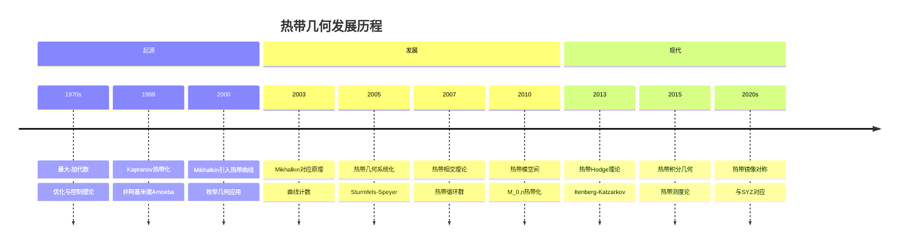
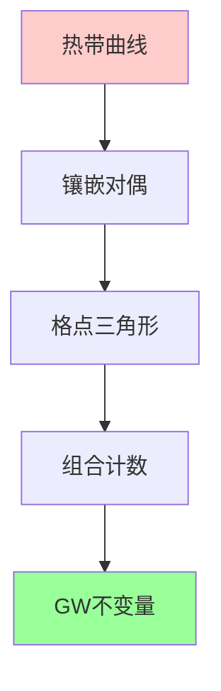
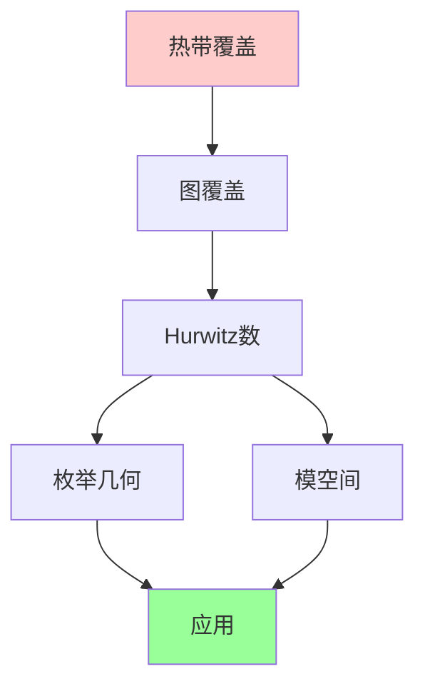
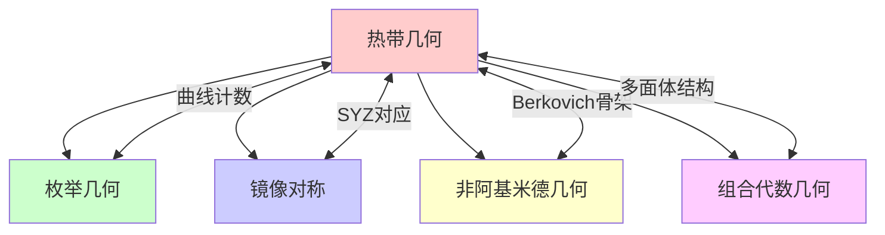

msc_primary: "00A99"
msc_secondary: ['00-00']
---

# 热带几何

## 前沿问题陈述

### 1.1 核心问题

**热带几何**（Tropical Geometry）是近年来发展迅速的数学分支，它将代数几何的问题转化为分段线性几何（多面体几何）的问题。热带几何的名字来源于巴西计算机科学家Imre Simon（热带指热带化的巴西）。

**核心问题**：

1. **对应原理**：热带曲线/簇与代数曲线/簇之间的对应关系是什么？

2. **枚举几何**：如何用热带方法计算Gromov-Witten不变量？

3. **模空间**：热带模空间与代数模空间的关系是什么？

### 1.2 核心定义

**热带半环**：热带半环 $\mathbb{T}$ 定义为：

$$\mathbb{T} = \mathbb{R} \cup \{-\infty\}$$

运算定义为：
- 加法（热带）：$a \oplus b = \max(a, b)$
- 乘法（热带）：$a \odot b = a + b$

**热带多项式**：对于多项式 $f = \bigoplus_i a_i \odot x^{\odot i}$，其热带零点集为：

$$V(f) = \{x \in \mathbb{T}^n : \text{最大值至少两次达到}\}$$

---

## 历史发展脉络

### 2.1 时间线



### 2.2 关键突破

| 年份 | 人物 | 突破 |
|-----|------|------|
| 2000 | Mikhalkin | 热带曲线枚举 |
| 2003 | Mikhalkin | 对应原理证明 |
| 2005 | Sturmfels-Speyer | 热带Grassmannian |
| 2007 | Allermann-Rau | 热带相交理论 |
| 2013 | Abramovich-Caporaso-Payne | 热带模空间 |
| 2019 | Crowley-Huh-Larson-Wang | 热带Hodge猜想 |

---

## 与L3理论的联系

### 3.1 热带化过程

```mermaid
graph TD
    A[代数簇X] --> B[非阿基米德Amoeba]
    B --> C[热带化Trop(X)]
    
    C --> D1[分段线性结构]
    C --> D2[多面体复形]
    C --> D3[组合不变量]
    
    D1 --> E[计算简化]
    D2 --> E
    D3 --> E
    
    style A fill:#99ff99
    style C fill:#ffcccc
    style E fill:#ccccff

```

### 3.2 依赖的L3理论

| L3理论 | 在热带几何中的应用 | 关键结果 |
|-------|-------------------|---------|
| 环面几何 | 热带化构造 | Amoeba理论 |
| 非阿基米德几何 | 解析热带化 | Berkovich空间 |
| 枚举几何 | 曲线计数 | GW不变量 |
| 多面体几何 | 组合结构 | 多面体细分 |
| 代数几何 | 对应原理 | Mikhalkin定理 |

---

## 当前研究进展

### 4.1 主要应用领域

#### 4.1.1 枚举几何

**Mikhalkin对应原理**：

对于一般位置的点，平面曲线的热带计数等于代数计数：

$$N_{g,d}^{\text{trop}} = N_{g,d}^{\text{alg}}$$



#### 4.1.2 热带模空间

**热带 $\overline{M}_{0,n}$**：

热带模空间是模空间的非阿基米德骨架，具有重要的组合结构。

### 4.2 理论架构

| 经典概念 | 热带类比 | 特征 |
|---------|---------|------|
| 代数曲线 | 热带曲线 | 度量图 |
| 除子 | 热带除子 | 点集带重数 |
| 线性系统 | 热带线性系统 | 分段线性函数 |
| Jacobian | 热带Jacobian | 图Laplacian核 |
| 相交数 | 热带相交 | 稳定相交 |

### 4.3 当前活跃方向

| 方向 | 代表人物 | 核心进展 |
|-----|---------|---------|
| 热带镜像对称 | Castano-Bernard-Matessi | SYZ热带化 |
| 热带Hodge理论 | Itenberg, Mikhalkin | 热带同调 |
| 热带相交理论 | Allermann, Rau | 稳定相交 |
| 热带几何逻辑 | Maclagan, Sturmfels | 热带簇理论 |

---

## 开放问题与猜想

### 5.1 核心开放问题

#### 5.1.1 热带Hodge猜想

**问题**：热带上同调类何时可以由热带代数循环表示？

**进展**：Crowley-Huh-Larson-Wang在特殊情形取得突破。

#### 5.1.2 对应原理推广

**问题**：如何将Mikhalkin对应原理推广到高维簇和高亏格曲线？

### 5.2 研究前沿问题

| 问题 | 状态 | 重要性 | 可能突破方向 |
|-----|------|-------|------------|
| 高维对应原理 | 部分解决 | ★★★★☆ | 多面体方法 |
| 热带标准猜想 | 开放 | ★★★★★ | 组合代数 |
| 热带BSD猜想 | 萌芽 | ★★★★☆ | 热带椭圆曲线 |
| 热带Kontsevich公式 | 已解决 | ★★★★☆ | 稳定映射 |

---

## 技术工具与方法

### 6.1 核心工具

| 工具 | 用途 | 关键文献 |
|-----|------|---------|
| 非阿基米德Amoeba | 热带化构造 | Kapranov |
| Berkovich骨架 | 解析热带化 | Berkovich |
| 子除法 | 模空间结构 | Kapranov |
| 图Laplacian | 热带Jacobian | Baker-Norine |
| 多面体细分 | 组合计算 | De Loera-Rambau-Santos |

### 6.2 现代方法

**热带Hurwitz理论**：



---

## 与其他前沿领域的联系

### 7.1 交叉网络



### 7.2 应用网络

| 应用领域 | 关键联系 | 重要性 |
|---------|---------|-------|
| 枚举几何 | GW不变量计算 | ★★★★★ |
| 镜像对称 | SYZ对应 | ★★★★☆ |
| 组合优化 | 最大-加代数 | ★★★☆☆ |
| 生物信息 | 系统发育树 | ★★★☆☆ |

---

## 学习资源

### 8.1 经典文献

1. **Mikhalkin, G.** (2003). Enumerative Tropical Algebraic Geometry in $\mathbb{R}^2$.
2. **Maclagan, D., Sturmfels, B.** (2015). Introduction to Tropical Geometry.
3. **Itenberg, I., Mikhalkin, G., Shustin, E.** (2009). Tropical Algebraic Geometry.
4. **Baker, M., Norine, S.** (2007). Riemann-Roch and Abel-Jacobi Theory on a Finite Graph.

### 8.2 现代综述

- Abramovich-Caporaso-Payne: The tropicalization of the moduli space of curves
- Gathmann: Tropical algebraic geometry
- Mikhalkin: Tropical geometry and its applications

---

## 总结

热带几何是将代数几何问题组合化、计算化的强大工具。通过将复杂的代数结构转化为分段线性结构，热带几何使得许多原本难以计算的问题变得可处理。

从Mikhalkin的曲线计数到现代的热带Hodge理论，这一领域正在快速发展。它不仅在纯数学中有深刻应用，也为组合优化、生物信息学等应用领域提供了新的工具。

---

*文档版本：1.0*
*创建日期：2026年4月*
*层次级别：L4-Frontier*
*领域分类：代数几何前沿*
