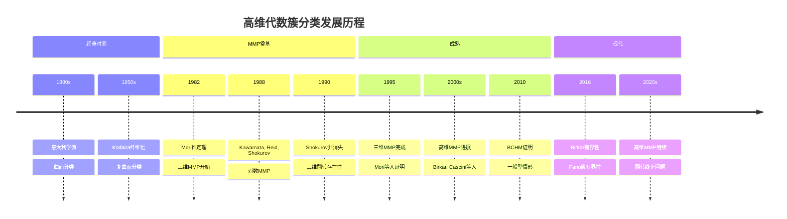
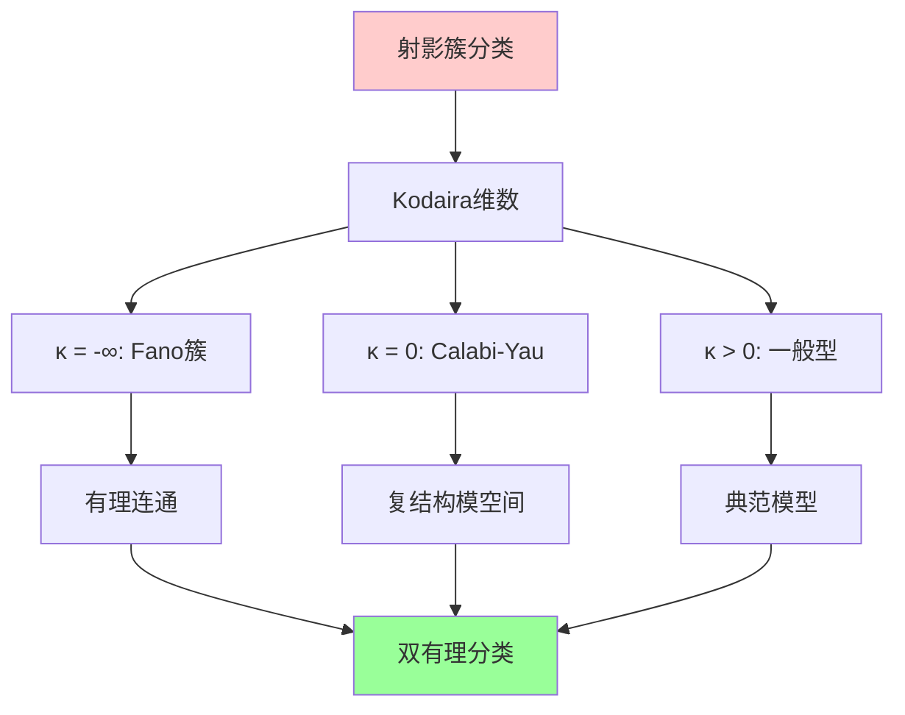
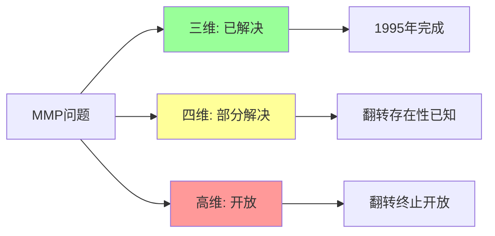
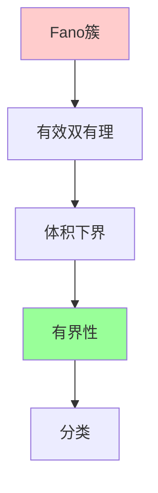
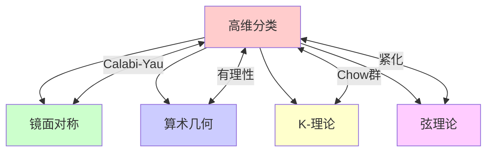

# 高维代数簇分类

## 前沿问题陈述

### 1.1 核心问题

**高维代数簇分类**是代数几何中的核心问题，旨在将代数簇按照双有理等价类进行分类。这一纲领由意大利学派在19世纪末提出，经过20世纪的发展，尤其是Mori的极小模型纲领（MMP），已经成为当代代数几何的中心课题之一。

**核心问题**：

1. **极小模型存在性**：任意双有理等价类中是否存在极小模型或Mori纤维空间？

2. **翻转（Flip）的存在性和终止性**：翻转操作是否总是存在？翻转序列是否一定终止？

3. **高维簇的精细分类**：如何对Fano簇、Calabi-Yau簇等进行完整分类？

### 1.2 核心猜想

**极小模型纲领（MMP）**：对于射影簇 $X$，通过以下操作序列：
- 收缩极端射线
- 执行翻转（如果需要）
- 最终到达极小模型或Mori纤维空间

**Borisov-Alexeev-Borisov猜想**：Fano簇在固定维数和epsilon-log典范条件下构成有界族。

---

## 历史发展脉络

### 2.1 时间线

### 2.2 关键突破

| 年份 | 人物 | 突破 |
|-----|------|------|
| 1982 | Mori | 锥定理，MMP奠基 |
| 1988 | Kawamata-Reid-Shokurov | 对数MMP |
| 1990 | Mori | 三维翻转存在性 |
| 1995 | Mori等人 | 三维MMP完成 |
| 2010 | BCHM | 一般型MMP |
| 2016 | Birkar | Fano簇有界性 |

---

## 与L3理论的联系

### 3.1 分类体系

### 3.2 依赖的L3理论

| L3理论 | 在分类中的应用 | 关键结果 |
|-------|---------------|---------|
| 层论 | 消失定理 | Kodaira消失 |
| 相交理论 | 数值性质 | 锥定理 |
| 奇点理论 | 对数典范奇点 | 极小模型存在 |
| 形变理论 | 模空间 | 簇的形变 |
| Hodge理论 | 不变量计算 | Hodge数 |

---

## 当前研究进展

### 4.1 主要结果

#### 4.1.1 一般型簇

**BCHM定理（Birkar-Cascini-Hacon-McKernan）**：

对于一般型射影簇，极小模型存在。

#### 4.1.2 Fano簇有界性

**Birkar定理（2016，2018）**：

Fano簇在固定维数和epsilon-log典范条件下构成有界族。

这解决了Borisov-Alexeev-Borisov猜想。

### 4.2 开放问题状态

### 4.3 当前活跃方向

| 方向 | 代表人物 | 核心进展 |
|-----|---------|---------|
| 高维翻转终止 | Shokurov | 进展中 |
| Fano分类 | Araujo, Corti | 低维分类 |
| Calabi-Yau分类 | Gross, Wilson | 镜面对称联系 |
| 对数MMP | Hacon, McKernan | 一般结果 |

---

## 开放问题与猜想

### 5.1 核心开放问题

#### 5.1.1 翻转终止猜想

**问题**：高维（≥4）情形的翻转序列是否一定终止？

**状态**：这是MMP中最大的未解决问题之一。

#### 5.1.2 极小模型唯一性

**问题**：同一双有理等价类中的极小模型是否唯一（在某种意义下）？

### 5.2 研究前沿问题

| 问题 | 状态 | 重要性 | 可能突破方向 |
|-----|------|-------|------------|
| 翻转终止 | 开放 | ★★★★★ | 离散不变量 |
| 高维Abundance | 部分开放 | ★★★★★ | 一般型情形 |
| Calabi-Yau分类 | 开放 | ★★★★☆ | 镜面对称 |
| 有理连通分类 | 开放 | ★★★★☆ | Graber-Harris-Starr |

---

## 技术工具与方法

### 6.1 核心工具

| 工具 | 用途 | 关键文献 |
|-----|------|---------|
| 锥定理 | 收缩理论 | Mori |
| 消失定理 | 上同调控制 | Kodaira, Kawamata |
| 非消失定理 | 存在性证明 | Shokurov |
| 对数技巧 | 归纳论证 | Kollár |
| 有界性技巧 | Fano分类 | Birkar |

### 6.2 现代方法

**Birkar的有界性证明**：

---

## 与其他前沿领域的联系

### 7.1 交叉网络

### 7.2 统一性意义

高维分类纲领试图统一：
- **双有理几何**：极小模型、翻转
- **模空间理论**：簇的形变分类
- **算术几何**：有理性、点分布
- **数学物理**：弦理论紧化

---

## 学习资源

### 8.1 经典文献

1. **Kollár, J., Mori, S.** (1998). Birational Geometry of Algebraic Varieties.
2. **Matsuki, K.** (2002). Introduction to the Mori Program.
3. **Birkar, C.** (2016). Singularities of Linear Systems and Boundedness of Fano Varieties.
4. **Hacon, C. D., McKernan, J.** (2010). Existence of Minimal Models.

### 8.2 现代综述

- Birkar: Singularities of linear systems and boundedness of Fano varieties
- Corti: 3-fold flips after Shokurov
- Hacon-Xu: On the three dimensional minimal model program

---

## 总结

高维代数簇分类是代数几何中历史最悠久、影响最深远的纲领之一。从Mori的锥定理到Birkar的Fano有界性证明，这一领域不断取得重大突破。

虽然翻转终止等高维问题仍然开放，但MMP已经成为理解代数簇结构的核心工具。它与镜面对称、算术几何和数学物理的深刻联系，使得这一领域在未来仍将保持活跃。

---

*文档版本：1.0*
*创建日期：2026年4月*
*层次级别：L4-Frontier*
*领域分类：代数几何前沿*
