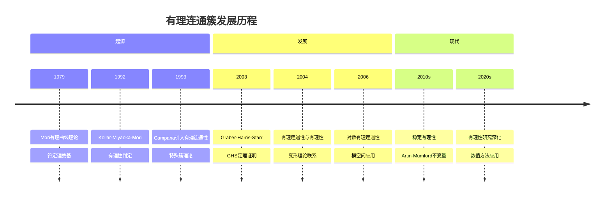
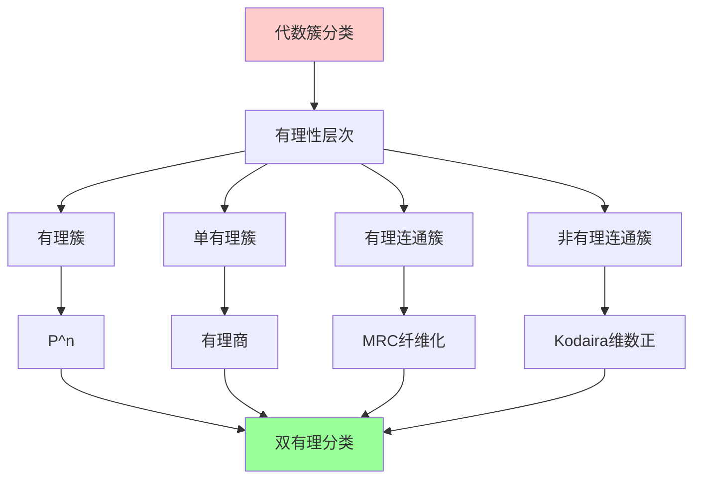
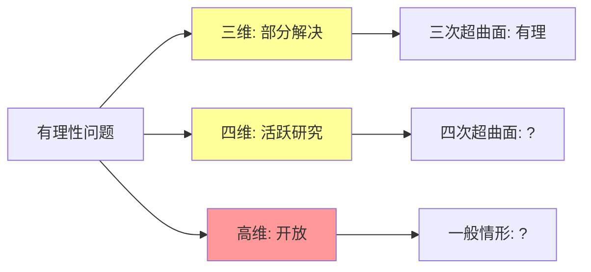
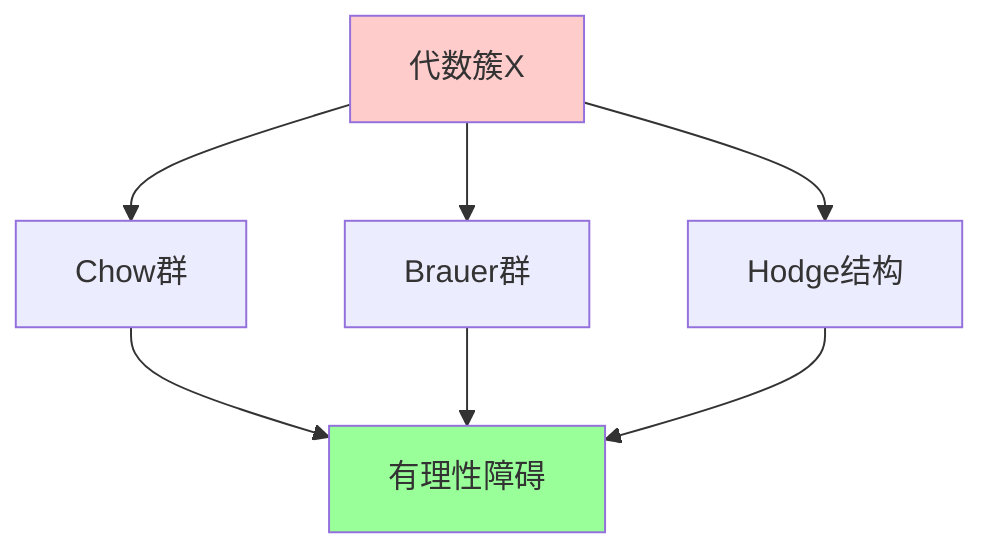
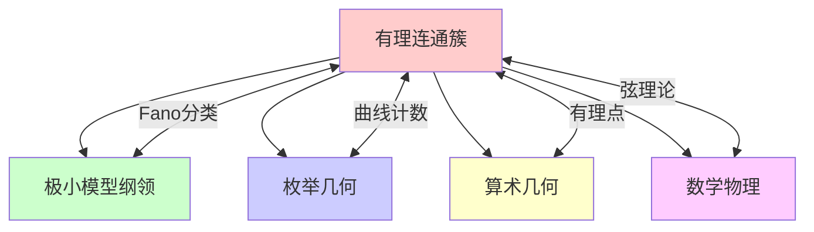

msc_primary: "00A99"
msc_secondary: ['00-XX']
---

# 有理连通簇

## 前沿问题陈述

### 1.1 核心问题

**有理连通簇**（Rationally Connected Varieties）是代数几何中的重要研究对象，指包含大量有理曲线的代数簇。这类簇在双有理分类中占据核心地位，与Fano簇、单有理簇等概念密切相关。

**核心问题**：

1. **有理性判定**：如何判断一个代数簇是否是有理连通的？

2. ** Graber-Harris-Starr定理**：有理连通纤维空间在基空间是有理曲线时，全空间是否单有理？

3. **弱有理性与有理性**：弱有理性是否蕴含单有理性？

### 1.2 核心定义

**有理连通簇**：光滑射影簇X称为有理连通的，如果对于一般点x, y属于X，存在有理曲线连接它们。

等价地，存在态射 f: P^1 到 X 使得 f^*T_X 是丰沛的。

**MRC纤维化**：任何光滑射影簇都有唯一的极大有理连通纤维化：

X --&gt; R(X)

其中一般纤维是有理连通的。

---

## 历史发展脉络

### 2.1 时间线

### 2.2 关键突破

| 年份 | 人物 | 突破 |
|-----|------|------|
| 1979 | Mori | 有理曲线理论 |
| 1992 | KMM | 有理性判据 |
| 1993 | Campana | 有理连通性定义 |
| 2003 | GHS | 纤维空间定理 |
| 2013 | Voisin | 稳定有理性不变量 |
| 2016 | Totaro | 有理性新问题 |

---

## 与L3理论的联系

### 3.1 分类体系

### 3.2 依赖的L3理论

| L3理论 | 在有理连通理论中的应用 | 关键结果 |
|-------|----------------------|---------|
| 形变理论 | 有理曲线存在性 | Mori理论 |
| 相交理论 | 数值判据 | KMM判据 |
| 层论 | 消失定理 | Kodaira消失 |
| Hodge理论 | 有理性障碍 | Artin-Mumford |
| 奇点理论 | 对数推广 | 对数有理连通 |

---

## 当前研究进展

### 4.1 主要结果

#### 4.1.1 GHS定理

**Graber-Harris-Starr定理**：

设 f: X 到 C 是纤维空间，C是有理曲线，一般纤维是有理连通的，则X是单有理的。

#### 4.1.2 有理性判据

**KMM判据**：Fano簇是有理连通的。

### 4.2 开放问题

### 4.3 当前活跃方向

| 方向 | 代表人物 | 核心进展 |
|-----|---------|---------|
| 稳定有理性 | Voisin, Totaro | 新不变量 |
| 有理性变形 | Kollar | 变形理论 |
| 对数有理性 | Chen, Jiang | 对数推广 |
| 有理性与K-理论 | Pirutka | K-理论障碍 |

---

## 开放问题与猜想

### 5.1 核心开放问题

#### 5.1.1 Luroth问题

**问题**：单有理簇是否一定是有理的？

**状态**：三维情形有反例（Clemens-Griffiths, Iskovskikh-Manin），四维以上开放。

#### 5.1.2 弱有理性蕴含单有理性

**问题**：弱有理性（uniruledness）是否蕴含单有理性？

### 5.2 研究前沿问题

| 问题 | 状态 | 重要性 | 可能突破方向 |
|-----|------|-------|------------|
| 四维有理性 | 开放 | 5星 | 不变量方法 |
| 稳定有理性 | 活跃 | 4星 | Chow群方法 |
| 有理性变形 | 进展中 | 4星 | 形变理论 |
| 对数有理性 | 活跃 | 3星 | 极小模型 |

---

## 技术工具与方法

### 6.1 核心工具

| 工具 | 用途 | 关键文献 |
|-----|------|---------|
| Mori理论 | 有理曲线 | Mori |
| 形变理论 | 曲线存在性 | Kollar |
| 相交理论 | 数值判据 | KMM |
| Chow群 | 有理性障碍 | Bloch |
| 上同调 | 拓扑障碍 | Artin-Mumford |

### 6.2 现代方法

**有理性不变量**：

---

## 与其他前沿领域的联系

### 7.1 交叉网络

---

## 学习资源

### 8.1 经典文献

1. **Kollar, J.** (1996). Rational Curves on Algebraic Varieties.
2. **Debarre, O.** (2001). Higher-Dimensional Algebraic Geometry.
3. **Araujo, C., Corti, A.** (2013). On Fano Varieties.
4. **Voisin, C.** (2015). Unirational Threefolds with no Universal Codimension 2 Cycle.

### 8.2 现代综述

- Totaro: Hypersurfaces that are not stably rational
- Pirutka: Varieties that are not stably rational

---

## 总结

有理连通簇理论是理解代数簇双有理结构的核心工具。从Mori的有理曲线理论到现代的稳定有理性研究，这一领域不断取得新的进展。

虽然许多基本问题仍然开放，但有理连通性已经成为代数几何中不可或缺的概念，与极小模型纲领、算术几何和数学物理有着深刻的联系。

---

*文档版本：1.0*
*创建日期：2026年4月*
*层次级别：L4-Frontier*
*领域分类：代数几何前沿*
