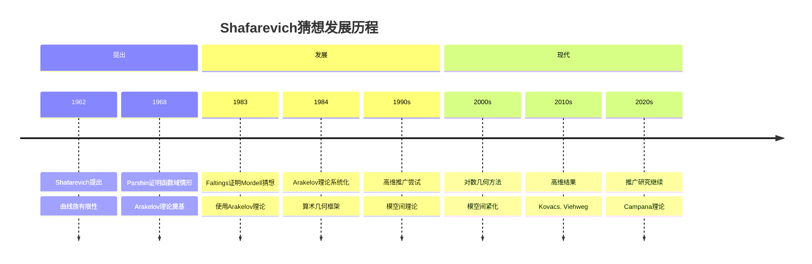
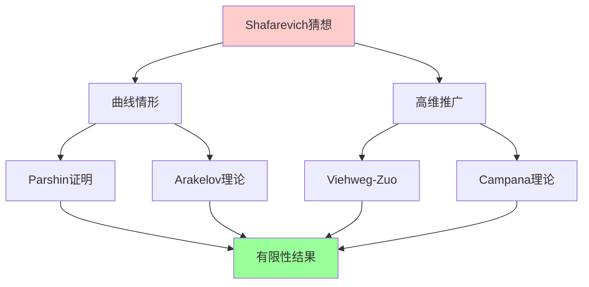
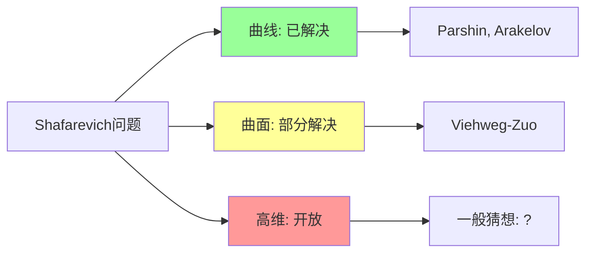
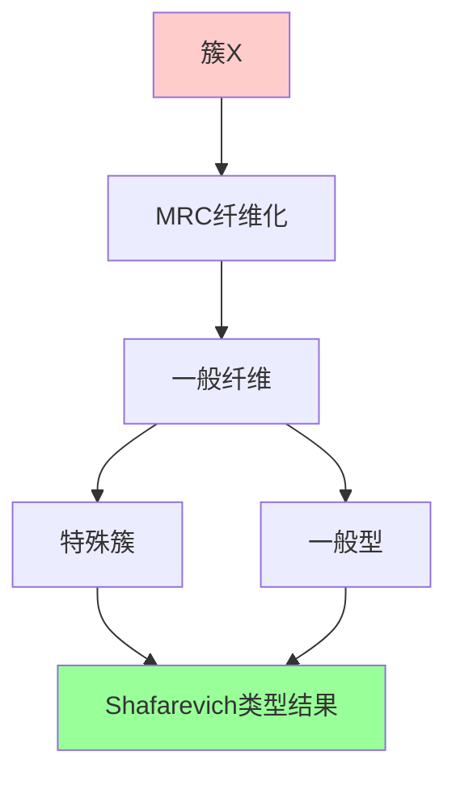
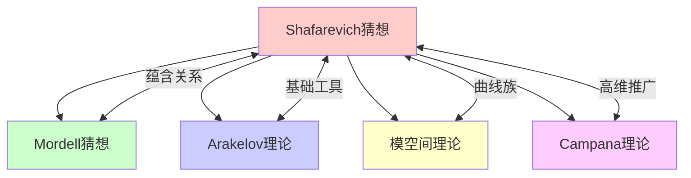

msc_primary: "00A99"
msc_secondary: ['00-XX']
---

# Shafarevich猜想

## 前沿问题陈述

### 1.1 核心问题

**Shafarevich猜想**是算术几何中的核心问题之一，涉及代数曲线族的参数化。它由Shafarevich在1962年提出，与Mordell猜想、Arakelov理论等密切相关。

**核心问题**：

1. **算术版本**：固定g, d, n，具有好约化的g亏格曲线族在数域上是否只有有限多个？

2. **几何版本**：固定亏格g，具有n个穿孔的曲线模空间中的曲线是否有限？

3. **高维推广**：如何将Shafarevich猜想推广到高维簇？

### 1.2 核心陈述

**Shafarevich猜想（几何版本）**：

设B是代数曲线，S是B上的有限点集。固定亏格g大于等于2，则B-S上的光滑曲线族（纤维亏格g）只有有限多个。

等价表述：从B-S到模空间M_g的态射只有有限多个。

---

## 历史发展脉络

### 2.1 时间线

### 2.2 关键突破

| 年份 | 人物 | 突破 |
|-----|------|------|
| 1962 | Shafarevich | 猜想提出 |
| 1968 | Parshin | 函数域证明 |
| 1983 | Faltings | Mordell猜想（相关） |
| 1995 | Viehweg-Zuo | 高维推广 |
| 2006 | Kovacs | 对数推广 |
| 2014 | Campana | 特殊簇理论 |

---

## 与L3理论的联系

### 3.1 理论框架

### 3.2 依赖的L3理论

| L3理论 | 在Shafarevich理论中的应用 | 关键结果 |
|-------|-------------------------|---------|
| Arakelov理论 | 算术几何基础 | 算术相交理论 |
| 模空间理论 | 曲线族参数化 | M_g构造 |
| 对数几何 | 紧化方法 | 稳定曲线 |
| Hodge理论 | 变化Hodge结构 | 周期映射 |
| 奇点理论 | 紧化边界 | 半稳定约化 |

---

## 当前研究进展

### 4.1 已知结果

#### 4.1.1 曲线情形

**Parshin定理**：函数域上的Shafarevich猜想成立。

**Faltings结果**：数域上的相关结果通过Mordell猜想。

#### 4.1.2 高维推广

**Viehweg-Zuo定理**：对于一般型簇，类似的有限性结果成立。

### 4.2 开放问题状态

### 4.3 当前活跃方向

| 方向 | 代表人物 | 核心进展 |
|-----|---------|---------|
| Campana特殊簇 | Campana | 特殊簇理论 |
| 对数Mori理论 | Fujino | 对数推广 |
| 模空间紧化 | Farkas | 稳定曲线 |
| 高维有界性 | Hacon | 一般型簇 |

---

## 开放问题与猜想

### 5.1 核心开放问题

#### 5.1.1 高维Shafarevich猜想

**问题**：对于高维簇，类似的有限性结果是否成立？

**状态**：一般型簇情形有结果，一般情形开放。

#### 5.1.2 数域上的精确表述

**问题**：在数域上，Shafarevich猜想的精确形式是什么？

### 5.2 研究前沿问题

| 问题 | 状态 | 重要性 | 可能突破方向 |
|-----|------|-------|------------|
| 高维有限性 | 部分解决 | 5星 | Campana理论 |
| 数域推广 | 开放 | 5星 | Arakelov方法 |
| 对数推广 | 进展中 | 4星 | 对数MMP |
| 超椭圆情形 | 已解决 | 3星 | 古典方法 |

---

## 技术工具与方法

### 6.1 核心工具

| 工具 | 用途 | 关键文献 |
|-----|------|---------|
| Arakelov理论 | 算术几何 | Arakelov, Faltings |
| 周期映射 | Hodge理论 | Griffiths |
| 模空间紧化 | 边界分析 | Deligne-Mumford |
| 对数几何 | 退化研究 | Kato |
| 高度理论 | 算术高度 | Faltings |

### 6.2 现代方法

**Campana特殊簇理论**：

---

## 与其他前沿领域的联系

### 7.1 交叉网络

---

## 学习资源

### 8.1 经典文献

1. **Shafarevich, I. R.** (1962). Algebraic Number Fields.
2. **Parshin, A. N.** (1968). Algebraic Curves over Function Fields.
3. **Arakelov, S. Yu.** (1974). Intersection Theory of Divisors on an Arithmetic Surface.
4. **Faltings, G.** (1983). Endlichkeitssatze fur abelsche Varietaten uber Zahlkorpern.

### 8.2 现代综述

- Viehweg-Zuo: Base spaces of non-isotrivial families
- Campana: Orbifolds, special varieties and classification theory
- Kovacs: Subvarieties of moduli stacks

---

## 总结

Shafarevich猜想是算术几何中影响深远的问题，它不仅本身具有深刻的数学意义，还催生了Arakelov理论等重要数学分支。

虽然曲线情形已基本解决，但高维推广仍然是活跃的研究领域。随着Campana特殊簇理论和现代模空间理论的发展，我们有望在这一方向上取得新的突破。

---

*文档版本：1.0*
*创建日期：2026年4月*
*层次级别：L4-Frontier*
*领域分类：代数几何前沿*
