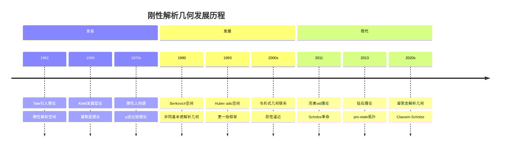
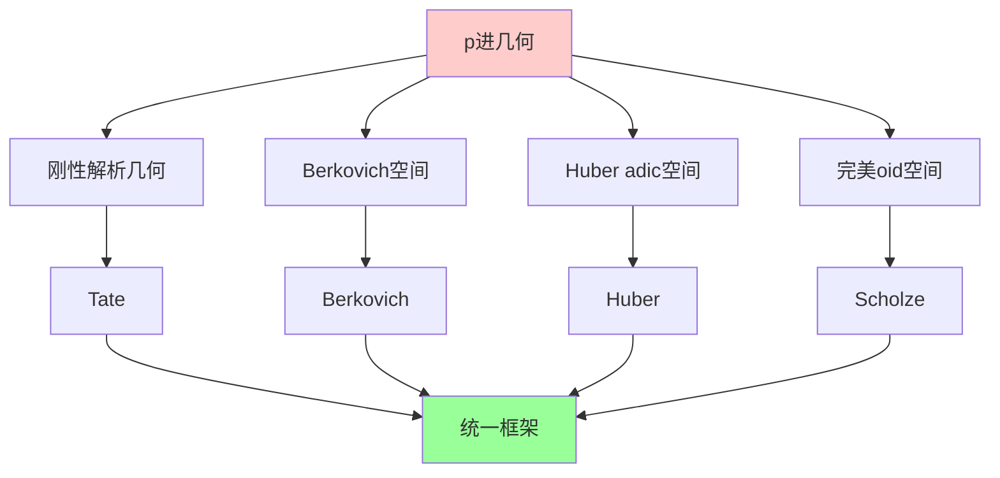
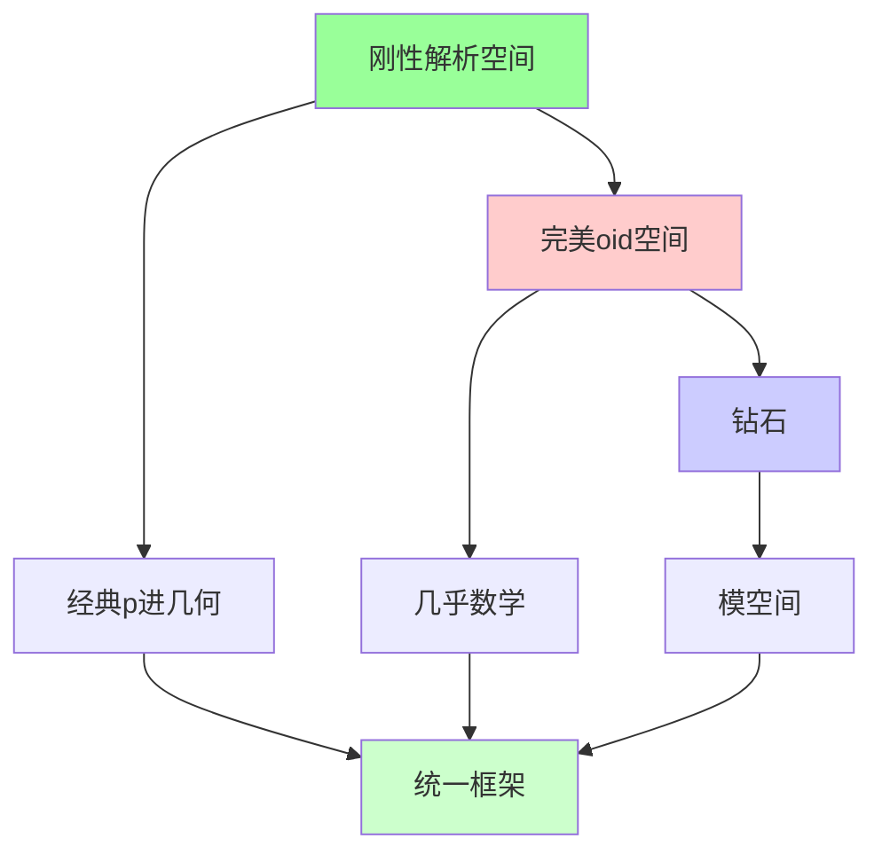
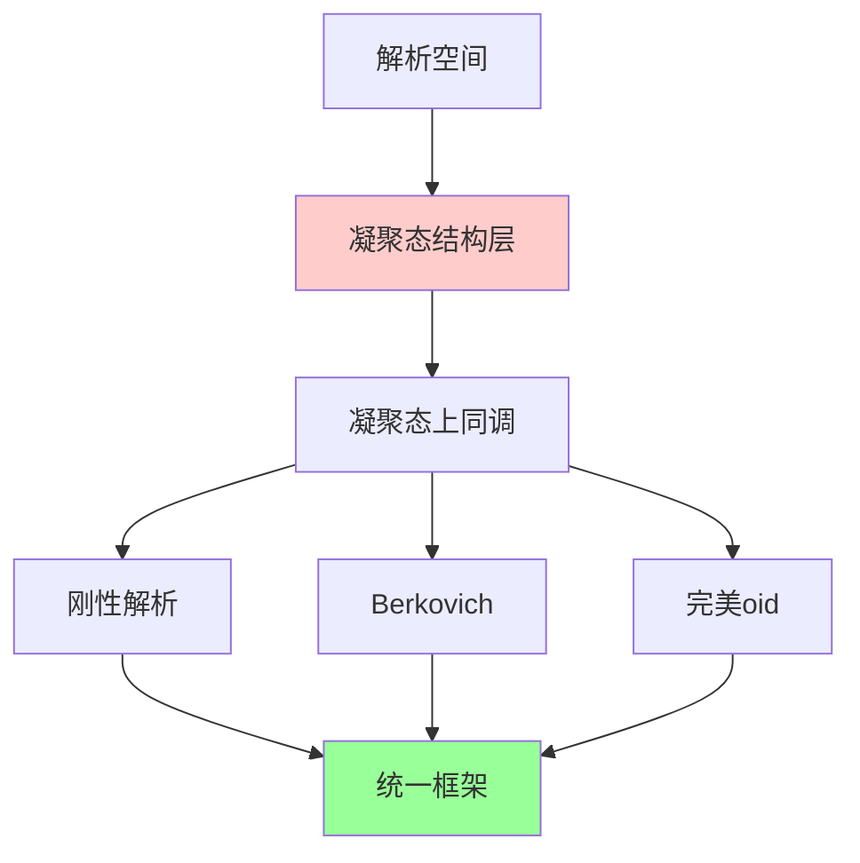
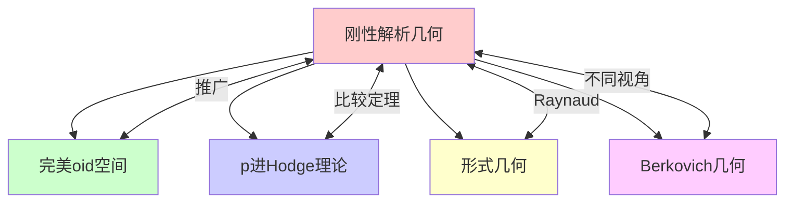

msc_primary: "00A99"
msc_secondary: ['00-00']
---

# 刚性解析几何

## 前沿问题陈述

### 1.1 核心问题

**刚性解析几何**（Rigid Analytic Geometry）是p进几何的基础理论，由John Tate在1962年引入。它为非阿基米德域（特别是p进数域）上的解析几何提供了严格的框架，是研究p进对称空间、p进模形式等对象的基础。

**核心问题**：

1. **与代数几何的联系**：刚性解析空间与形式概形之间的比较定理如何建立？

2. **上同调理论**：如何在刚性解析空间上建立合适的上同调理论？

3. **与完美oid理论的关系**：刚性解析几何如何与Scholze的完美oid理论融合？

### 1.2 核心定义

**刚性解析空间**：一个刚性解析空间是一个G-拓扑化的局部赋环空间，局部同构于affinoid空间 Sp(A)，其中 A 是Tate代数。

**Tate代数**：

$$T_n = K\langle x_1, ..., x_n \rangle = \{\sum a_\alpha x^\alpha : |a_\alpha| \to 0\}$$

这是K上收敛幂级数代数。

---

## 历史发展脉络

### 2.1 时间线

### 2.2 关键突破

| 年份 | 人物 | 突破 |
|-----|------|------|
| 1962 | Tate | 刚性解析几何奠基 |
| 1969 | Kiehl | 凝聚层理论 |
| 1990 | Berkovich | 非阿基米德解析几何 |
| 1993 | Huber | adic空间理论 |
| 2011 | Scholze | 完美oid空间 |
| 2013 | Scholze | 钻石理论 |

---

## 与L3理论的联系

### 3.1 几何框架比较

### 3.2 依赖的L3理论

| L3理论 | 在刚性解析几何中的应用 | 关键结果 |
|-------|---------------------|---------|
| 层论 | G-拓扑 | Tate, Kiehl |
| 形式几何 | 比较定理 | Raynaud |
| 上同调理论 | 刚性上同调 | Berthelot |
| 非阿基米德分析 | 收敛级数 | Tate代数 |
| 代数几何 | 形式概形 | Grothendieck |

---

## 当前研究进展

### 4.1 主要理论

#### 4.1.1 Raynaud逼近

**Raynaud定理**：刚性解析空间可以被形式概形的特殊纤维逼近。

这为刚性解析几何与代数几何建立了桥梁。

#### 4.1.2 p进比较定理

**刚性比较定理**：

对于适当的刚性解析空间，刚性上同调与etale上同调之间存在比较同构。

### 4.2 现代发展

**与完美oid理论的关系**：

完美oid空间是刚性解析空间的推广，允许"无限远"的adic点。

### 4.3 当前活跃方向

| 方向 | 代表人物 | 核心进展 |
|-----|---------|---------|
| 凝聚态解析几何 | Clausen, Scholze | 新框架 |
| 钻石理论 | Scholze | 商空间 |
| p进模形式 | Hansen | 完美oid化 |
| 刚性上同调 | Le Stum | 理论完善 |

---

## 开放问题与猜想

### 5.1 核心开放问题

#### 5.1.1 刚性标准猜想

**问题**：标准猜想在刚性解析几何中如何表述？

**意义**：这将连接刚性上同调与算术几何。

#### 5.1.2 全局刚性几何

**问题**：如何在全局（非局部）设置上建立刚性解析几何？

### 5.2 研究前沿问题

| 问题 | 状态 | 重要性 | 可能突破方向 |
|-----|------|-------|------------|
| 刚性标准猜想 | 开放 | 4星 | 完美oid方法 |
| 全局理论 | 进展中 | 4星 | 凝聚态框架 |
| 刚性motive | 萌芽 | 3星 | 导出范畴 |
| 与复几何联系 | 开放 | 3星 | 周期映射 |

---

## 技术工具与方法

### 6.1 核心工具

| 工具 | 用途 | 关键文献 |
|-----|------|---------|
| Tate代数 | 局部模型 | Tate |
| G-拓扑 | 层论基础 | Tate, Kiehl |
| 形式概形 | 比较理论 | Raynaud |
| 钻石 | 商空间 | Scholze |
| v-拓扑 | 上同调 | Scholze |

### 6.2 现代方法

**凝聚态解析几何**：

Clausen-Scholze的新框架统一了各种p进几何：

---

## 与其他前沿领域的联系

### 7.1 交叉网络

---

## 学习资源

### 8.1 经典文献

1. **Tate, J.** (1971). Rigid Analytic Spaces.
2. **Bosch, S., Guentzer, U., Remmert, R.** (1984). Non-Archimedean Analysis.
3. **Fresnel, J., van der Put, M.** (2004). Rigid Analytic Geometry.
4. **Huber, R.** (1996). Etale Cohomology of Rigid Analytic Varieties.

### 8.2 现代综述

- Scholze: p-adic Hodge theory for rigid-analytic varieties
- Scholze-Weinstein: Berkeley lectures on p-adic geometry

---

## 总结

刚性解析几何是p进几何的基石理论，从Tate的原始定义到Scholze的完美oid革命，这一领域经历了深刻的发展。

作为理解p进模形式、p进自守表示和算术几何的基础工具，刚性解析几何仍然是活跃的研究领域。随着凝聚态数学和钻石理论的发展，我们正在见证p进几何的新范式形成。

---

*文档版本：1.0*
*创建日期：2026年4月*
*层次级别：L4-Frontier*
*领域分类：代数几何前沿*
