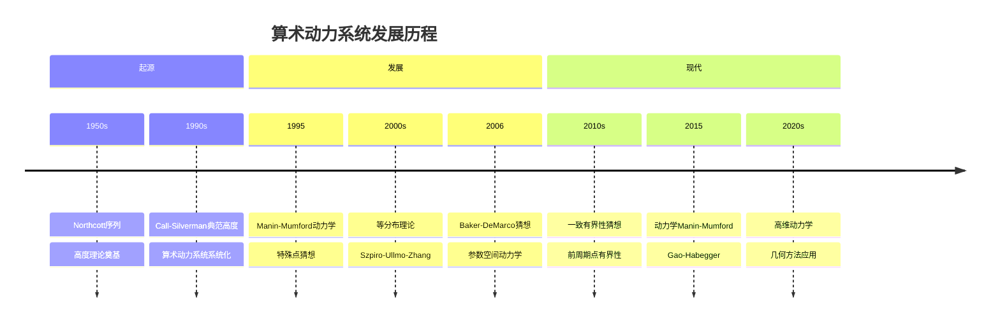
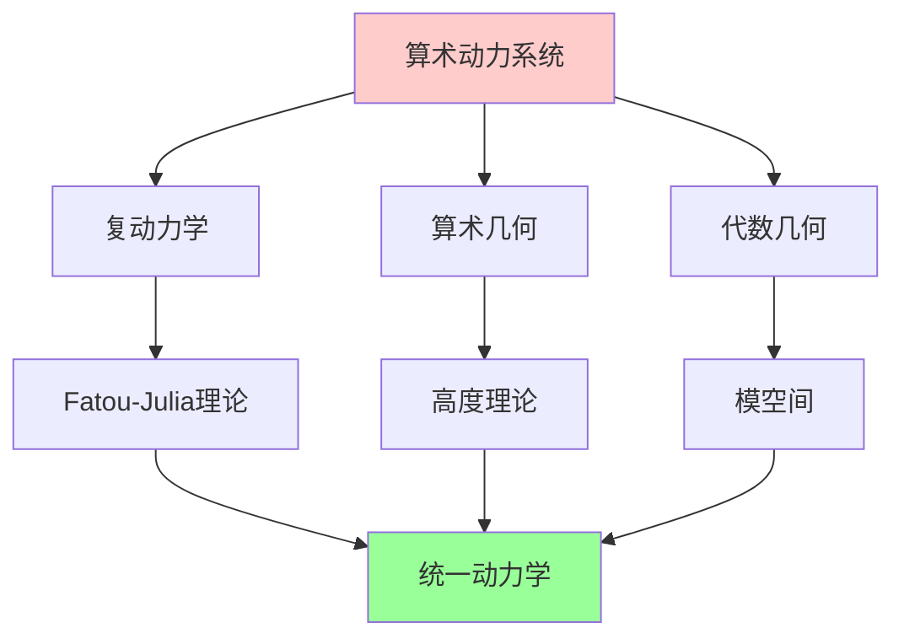
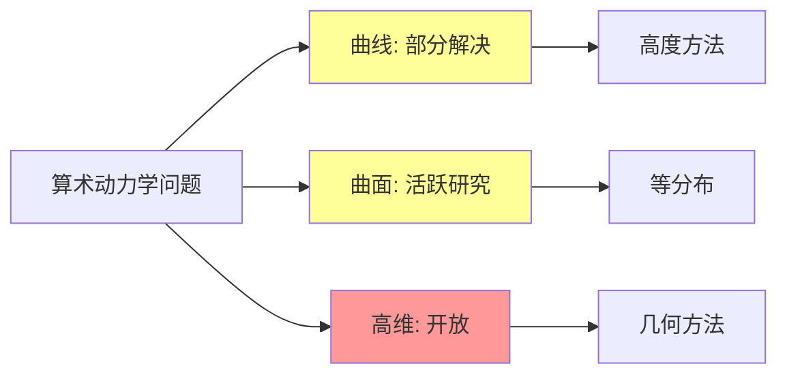
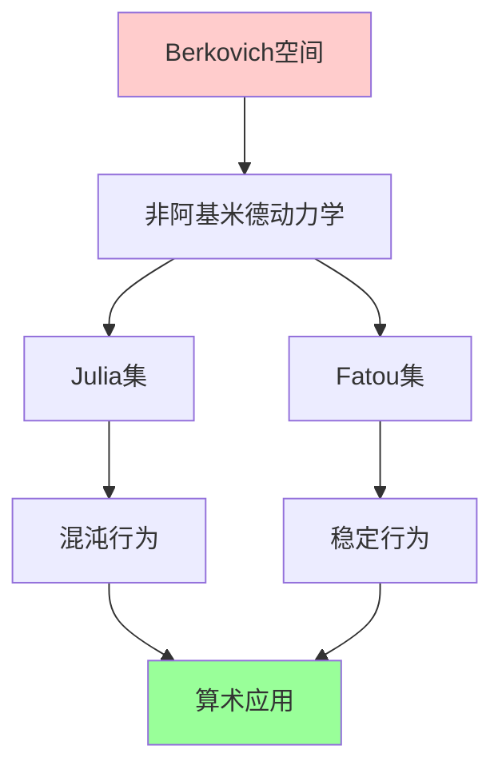
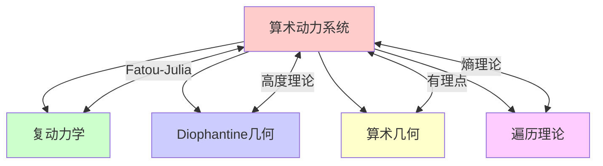

msc_primary: "00A99"
msc_secondary: ['00-XX']
---

# 动力系统与代数几何

## 前沿问题陈述

### 1.1 核心问题

**动力系统与代数几何的交叉**（Arithmetic Dynamics）是近年来快速发展的数学分支，研究代数簇上的自映射的动力学性质，特别是有理点在这些映射下的轨道行为。

**核心问题**：

1. **轨道分布**：有理点在自映射下的轨道如何分布？

2. **Manin-Mumford猜想的动力学版本**：动力学的特殊点集是否有限？

3. **算术熵**：如何定义和研究代数动力系统的算术复杂性？

### 1.2 核心定义

**算术动力系统**：设X是代数簇，f: X -> X 是态射，则(X, f)构成一个算术动力系统。

**前周期点**：点P称为前周期的，如果其轨道 {f^n(P)} 是有限的。

**典范高度**：对于极化态射，可以定义典范高度 h_f，满足：

$$h_f(f(P)) = d \cdot h_f(P) + O(1)$$

其中d是态射的次数。

---

## 历史发展脉络

### 2.1 时间线

### 2.2 关键突破

| 年份 | 人物 | 突破 |
|-----|------|------|
| 1950 | Northcott | 高度有限性 |
| 1993 | Call-Silverman | 典范高度理论 |
| 2006 | Baker-Rumely | 等分布理论 |
| 2011 | Ghioca-Tucker-Zieve | 动力学MM猜想 |
| 2015 | Gao-Habegger | 高维结果 |
| 2020 | 多人 | 一致有界性进展 |

---

## 与L3理论的联系

### 3.1 理论框架

### 3.2 依赖的L3理论

| L3理论 | 在算术动力系统中的应用 | 关键结果 |
|-------|---------------------|---------|
| 高度理论 | 算术复杂性 | Weil高度 |
| 复动力学 | 几何直觉 | Fatou-Julia |
| Diophantine逼近 | 轨道分析 | Roth定理 |
| 代数几何 | 模空间 | 参数空间 |
| 等分布理论 | 极限分布 | Szpiro-Ullmo-Zhang |

---

## 当前研究进展

### 4.1 主要结果

#### 4.1.1 动力学Manin-Mumford猜想

**Ghioca-Tucker-Zieve定理**：对于某些动力系统，特殊点集是有限的。

#### 4.1.2 一致有界性猜想

**猜想**：固定度d和维数n，P^N上的度d态射的前周期点个数有一致上界。

**状态**：低维情形有结果，一般情形开放。

### 4.2 开放问题状态

### 4.3 当前活跃方向

| 方向 | 代表人物 | 核心进展 |
|-----|---------|---------|
| 一致有界性 | Poonen, Stoll | 猜想研究 |
| 动力学MM | Ghioca, Tucker | 部分结果 |
| 参数空间 | DeMarco | 分歧轨迹 |
| 高维动力学 | Dinh, Sibony | 复方法 |

---

## 开放问题与猜想

### 5.1 核心开放问题

#### 5.1.1 一致有界性猜想

**问题**：前周期点个数是否有仅依赖于度的一致上界？

**状态**：这是算术动力系统中的核心未解决问题。

#### 5.1.2 动力学Andre-Oort

**问题**：动力学模空间中的特殊子簇分类。

### 5.2 研究前沿问题

| 问题 | 状态 | 重要性 | 可能突破方向 |
|-----|------|-------|------------|
| 一致有界性 | 开放 | 5星 | Galois理论 |
| 动力学AO | 开放 | 4星 | o-极小性 |
| 等分布 | 进展中 | 4星 | 测度论 |
| 算术熵 | 萌芽 | 3星 | 遍历理论 |

---

## 技术工具与方法

### 6.1 核心工具

| 工具 | 用途 | 关键文献 |
|-----|------|---------|
| 高度理论 | 算术复杂性 | Call-Silverman |
| 等分布 | 极限行为 | Baker-Rumely |
| Berkovich空间 | 非阿基米德动力学 | Rivera-Letelier |
| Galois表示 | 轨道结构 | Jones |
| 复动力学 | 几何直觉 | Milnor |

### 6.2 现代方法

**Berkovich动力学**：

---

## 与其他前沿领域的联系

### 7.1 交叉网络

---

## 学习资源

### 8.1 经典文献

1. **Silverman, J. H.** (2007). The Arithmetic of Dynamical Systems.
2. **Call, G. S., Silverman, J. H.** (1993). Canonical Heights on Varieties.
3. **Baker, M., Rumely, R.** (2010). Potential Theory on the Berkovich Projective Line.
4. **Zannier, U.** (2012). Some Problems of Unlikely Intersections in Arithmetic and Geometry.

### 8.2 现代综述

- DeMarco: Dynamics and moduli
- Ghioca-Tucker: Dynamical systems in finite characteristic
- Poonen: Rational points on varieties

---

## 总结

算术动力系统是代数几何与动力系统的交叉领域，它将复动力学的几何直觉与算术几何的高度理论相结合，产生了丰富的数学问题。

从一致有界性猜想到动力学Manin-Mumford问题，这一领域充满了挑战性的开放问题。随着Berkovich空间等工具的发展，我们有望在这一领域取得更多突破。

---

*文档版本：1.0*
*创建日期：2026年4月*
*层次级别：L4-Frontier*
*领域分类：代数几何前沿*
