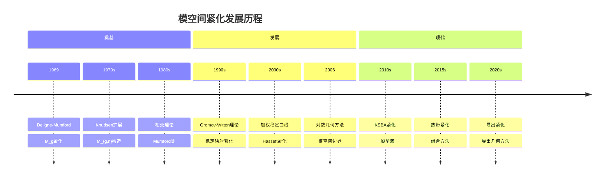
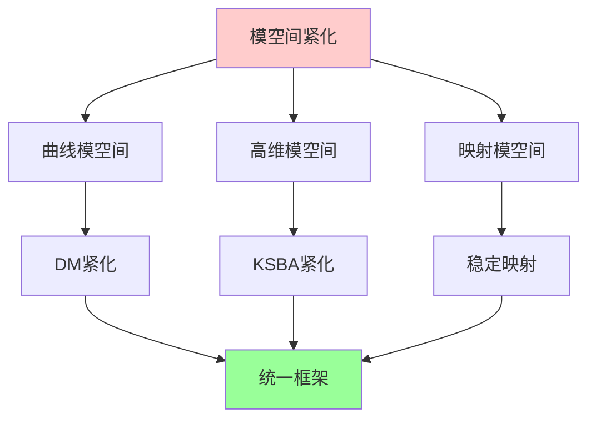
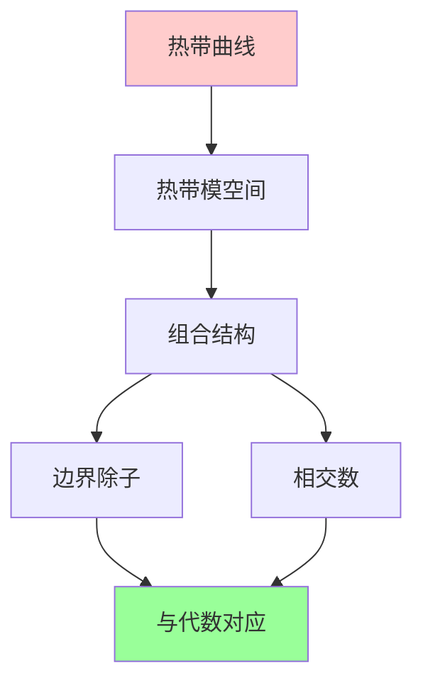
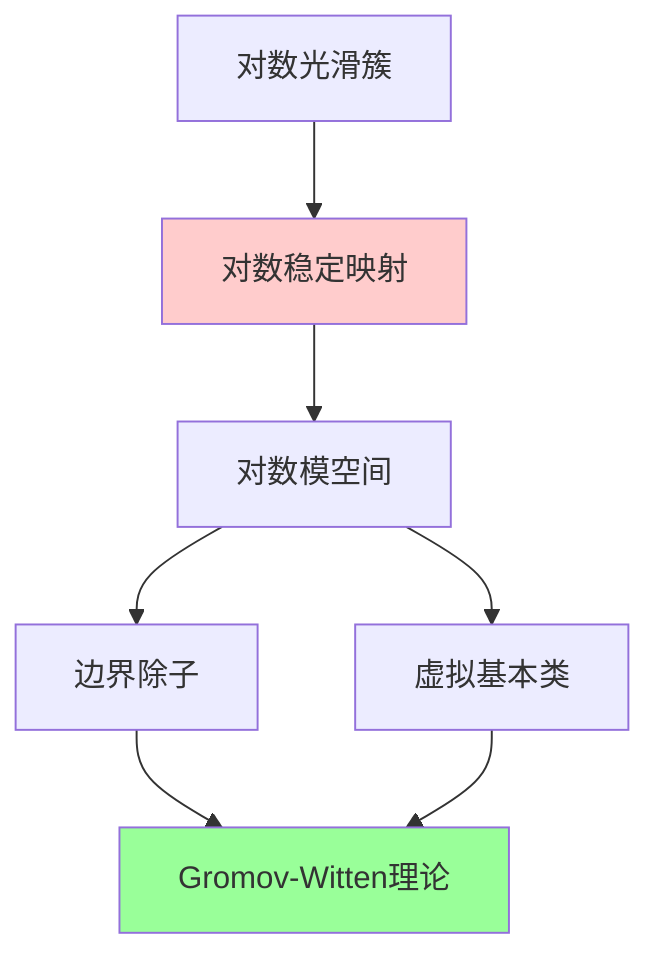
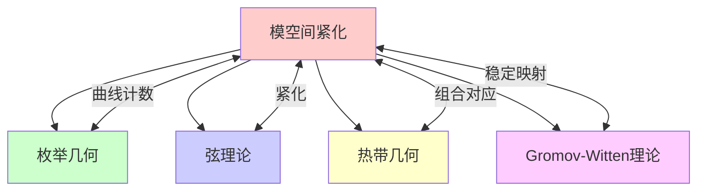

# 模空间紧化

## 前沿问题陈述

### 1.1 核心问题

**模空间紧化**是代数几何中的核心问题，涉及如何将模空间（参数化几何对象的代数簇）扩展到包含退化情形的紧空间。这是研究模空间几何性质、相交理论和枚举几何的基础。

**核心问题**：

1. **稳定约化**：如何在模空间边界添加稳定的退化对象？

2. **加权稳定曲线**：不同权重的稳定曲线模空间如何联系？

3. **高维推广**：如何紧化高维簇的模空间（如稳定对、KSBA紧化）？

### 1.2 核心定义

**稳定曲线**：一个亏格g的连通曲线C称为稳定的，如果：

- C只有节点奇点
- 自同构群有限（即没有有理尾巴或椭圆尾巴）
- $\omega_C$ 是丰沛的

**模空间 M_{g,n}**：n个标记点的亏格g光滑曲线的模空间。

**Deligne-Mumford紧化**：$\overline{M}_{g,n}$ 包含所有稳定曲线。

---

## 历史发展脉络

### 2.1 时间线

### 2.2 关键突破

| 年份 | 人物 | 突破 |
|-----|------|------|
| 1969 | Deligne-Mumford | 曲线模空间紧化 |
| 1983 | Mumford | 相交理论 |
| 1995 | Kontsevich | 稳定映射紧化 |
| 2003 | Hassett | 加权稳定曲线 |
| 2011 | Alexeev | 对数典范紧化 |
| 2015 | Cavalieri-Markwig-Ranganathan | 热带紧化 |

---

## 与L3理论的联系

### 3.1 紧化体系

### 3.2 依赖的L3理论

| L3理论 | 在模空间紧化中的应用 | 关键结果 |
|-------|-------------------|---------|
| 形变理论 | 边界结构 | 节点形变 |
| 奇点理论 | 稳定性判据 | 对数典范奇点 |
| 相交理论 | 积分计算 | Mumford类 |
| 对数几何 | 边界描述 | Kato对数结构 |
| 几何不变量理论 | 构造方法 | GIT商 |

---

## 当前研究进展

### 4.1 主要理论

#### 4.1.1 DM紧化

**Deligne-Mumford定理**：$\overline{M}_{g,n}$ 是紧致的Deligne-Mumford叠。

维数公式：

$$\dim \overline{M}_{g,n} = 3g - 3 + n$$

#### 4.1.2 加权稳定曲线

**Hassett紧化**：通过给标记点赋予权重，得到一系列紧化空间。

### 4.2 现代发展

**热带紧化**：

### 4.3 当前活跃方向

| 方向 | 代表人物 | 核心进展 |
|-----|---------|---------|
| 对数紧化 | Ascher, Molcho | 对数几何方法 |
| 导出紧化 | Schmitt | 导出几何 |
| 热带紧化 | Cavalieri | 组合方法 |
| KSBA紧化 | Kollar, Shepherd-Barron | 一般型簇 |

---

## 开放问题与猜想

### 5.1 核心开放问题

#### 5.1.1 高维模空间紧化

**问题**：对于一般型簇，是否存在典范的紧化？

**进展**：KSBA紧化提供了部分答案。

#### 5.1.2 紧化之间的关系

**问题**：不同紧化之间的明确关系是什么？

### 5.2 研究前沿问题

| 问题 | 状态 | 重要性 | 可能突破方向 |
|-----|------|-------|------------|
| 高维紧化 | 进展中 | 5星 | 极小模型 |
| 导出紧化 | 萌芽 | 4星 | 导出几何 |
| 热带对应 | 活跃 | 4星 | 组合方法 |
| Calabi-Yau紧化 | 开放 | 5星 | 镜面对称 |

---

## 技术工具与方法

### 6.1 核心工具

| 工具 | 用途 | 关键文献 |
|-----|------|---------|
| 稳定约化 | 紧化构造 | Deligne-Mumford |
| GIT | 几何构造 | Mumford |
| 对数几何 | 边界结构 | Kato |
| 热带几何 | 组合计算 | Mikhalkin |
| 导出范畴 | 高阶结构 | Bridgeland |

### 6.2 现代方法

**对数紧化方法**：

---

## 与其他前沿领域的联系

### 7.1 交叉网络

---

## 学习资源

### 8.1 经典文献

1. **Deligne, P., Mumford, D.** (1969). The Irreducibility of the Space of Curves.
2. **Harris, J., Morrison, I.** (1998). Moduli of Curves.
3. **Hassett, B.** (2003). Moduli Spaces of Weighted Pointed Stable Curves.
4. **Kollar, J.** (2013). Singularities of the Minimal Model Program.

### 8.2 现代综述

- Farkas: The geometry of the moduli space of curves
- Pandharipande: A compactification over the moduli space of stable curves
- Cavalieri: Moduli spaces of curves and tropical geometry

---

## 总结

模空间紧化是代数几何的核心课题，从Deligne-Mumford的经典工作到现代的热带紧化和导出几何方法，这一领域不断发展。

模空间的紧化不仅是理论研究的基础，也是枚举几何、弦理论和数学物理中的关键工具。随着高维簇紧化理论的推进，我们有望对代数簇的模空间有更深入的理解。

---

*文档版本：1.0*
*创建日期：2026年4月*
*层次级别：L4-Frontier*
*领域分类：代数几何前沿*
