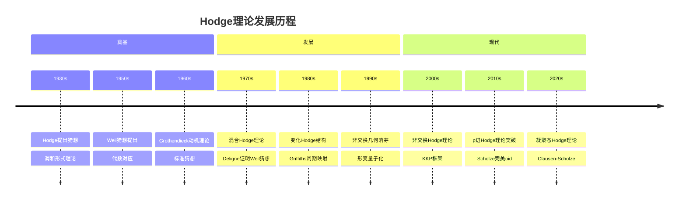
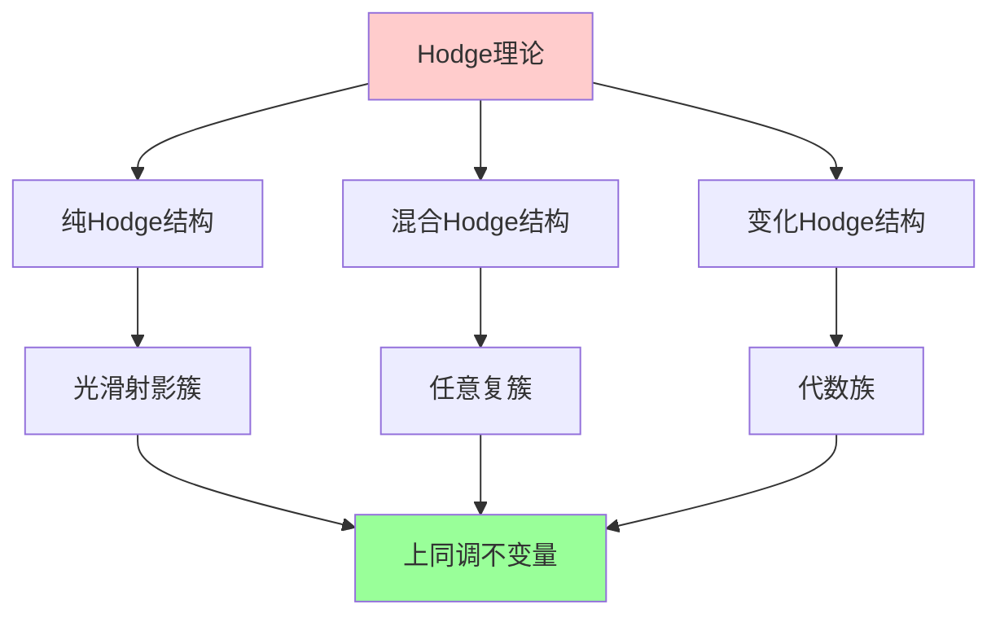
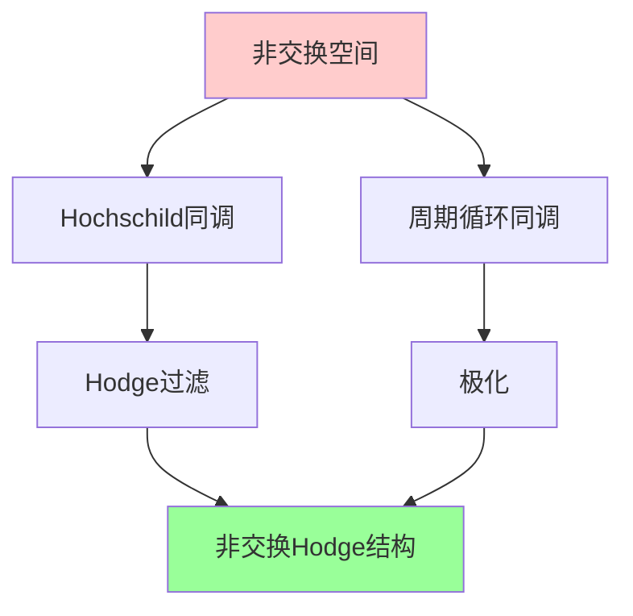
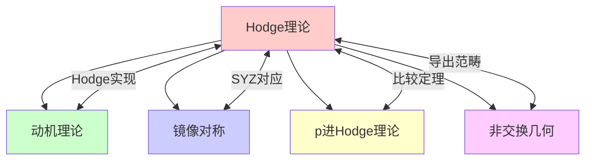

msc_primary: "00A99"
msc_secondary: ['00-XX']
---

# Hodge理论前沿

## 前沿问题陈述

### 1.1 核心问题

**Hodge理论**是连接代数几何、复分析和拓扑学的桥梁，研究代数簇上同调的Hodge结构。Hodge猜想是千禧年大奖问题之一，代表了这一领域最核心的未解决问题。

**核心问题**：

1. **Hodge猜想**：每个Hodge类是否都是代数闭链类的有理线性组合？

2. **变化Hodge结构**：如何理解代数族中Hodge结构的变化？

3. **非交换Hodge理论**：如何将Hodge理论推广到非交换几何？

### 1.2 核心猜想

**Hodge猜想**：设X是光滑射影复簇，则：

$$\text{Hdg}^k(X) \cap H^{2k}(X, \mathbb{Q}) = \text{Im}(CH^k(X) \otimes \mathbb{Q} \to H^{2k}(X, \mathbb{Q}))$$

即每个有理Hodge类都是代数闭链类的线性组合。

---

## 历史发展脉络

### 2.1 时间线



### 2.2 关键突破

| 年份 | 人物 | 突破 |
|-----|------|------|
| 1930 | Hodge | Hodge猜想提出 |
| 1971 | Deligne | 混合Hodge理论 |
| 1975 | Griffiths | 变化Hodge结构 |
| 2008 | Katzarkov-Kontsevich-Pantev | 非交换Hodge理论 |
| 2012 | Scholze | p进Hodge理论革命 |
| 2020 | Clausen-Scholze | 凝聚态Hodge理论 |

---

## 与L3理论的联系

### 3.1 Hodge结构网络



### 3.2 依赖的L3理论

| L3理论 | 在Hodge理论中的应用 | 关键结果 |
|-------|-------------------|---------|
| 复几何 | Hodge分解 | Kähler几何 |
| 代数几何 | 代数闭链 | Chow群 |
| 表示论 | 极化Hodge结构 | Mumford-Tate群 |
| D-模理论 | Riemann-Hilbert | 变化Hodge结构 |
| 导出范畴 | 非交换Hodge | KKP理论 |

---

## 当前研究进展

### 4.1 Hodge猜想状态

```mermaid
graph LR
    A[Hodge猜想] --> B[Abel簇: 部分解决]
    A --> C[曲面: 已解决]
    A --> D[四维以上: 开放]

    B --> B1[Tate, Deligne]
    C --> C1[Lefschetz (1,1)]
    D --> D1[核心开放问题]

    style B fill:#ffff99
    style C fill:#99ff99
    style D fill:#ff9999

```

### 4.2 主要结果

#### 4.2.1 Lefschetz (1,1) 定理

**定理**：对于复曲面，Hodge猜想成立。

这是Hodge猜想的唯一完全解决情形。

#### 4.2.2 Abel簇情形

**Tate定理**：对于在有限域上定义的Abel簇，类 Tate 猜想（类比Hodge猜想）成立。

### 4.3 当前活跃方向

| 方向 | 代表人物 | 核心进展 |
|-----|---------|---------|
| 热带Hodge理论 | Itenberg, Mikhalkin | 组合方法 |
| 非交换Hodge | Katzarkov, Kontsevich | KKP理论 |
| p进Hodge | Scholze, Bhatt | 完美oid方法 |
| 凝聚态Hodge | Clausen, Scholze | 新框架 |

---

## 开放问题与猜想

### 5.1 核心开放问题

#### 5.1.1 Hodge猜想（千禧年问题）

**问题**：每个Hodge类是否都是代数闭链类的有理线性组合？

**状态**：除Lefschetz (1,1) 外，一般情形完全开放。

#### 5.1.2 Tate猜想（类比）

**问题**：étale上同调中的Tate类是否来自代数闭链？

**状态**：Abel簇情形解决，一般情形开放。

### 5.2 研究前沿问题

| 问题 | 状态 | 重要性 | 可能突破方向 |
|-----|------|-------|------------|
| Hodge猜想 | 开放 | 5星 | 动机理论 |
| Tate猜想 | 部分解决 | 5星 | Galois表示 |
| 非交换Hodge | 进展中 | 4星 | 导出范畴 |
| 热带Hodge | 活跃 | 4星 | 组合方法 |

---

## 技术工具与方法

### 6.1 核心工具

| 工具 | 用途 | 关键文献 |
|-----|------|---------|
| 调和形式 | Hodge分解 | Hodge, Weyl |
| D-模 | Riemann-Hilbert | Kashiwara, Mebkhout |
| 周期映射 | Hodge结构变化 | Griffiths |
| 母题理论 | 统一理论 | Grothendieck |
| 完美oid | p进Hodge | Scholze |

### 6.2 现代方法

**非交换Hodge理论（KKP）**：



---

## 与其他前沿领域的联系

### 7.1 交叉网络



---

## 学习资源

### 8.1 经典文献

1. **Hodge, W. V. D.** (1952). The Topological Invariants of Algebraic Varieties.
2. **Griffiths, P., Harris, J.** (1978). Principles of Algebraic Geometry.
3. **Voisin, C.** (2002). Hodge Theory and Complex Algebraic Geometry.
4. **Deligne, P.** (1971). Theorie de Hodge.

### 8.2 现代综述

- Katzarkov-Kontsevich-Pantev: Hodge theoretic aspects of mirror symmetry
- Bhatt: The Hodge-Tate decomposition via perfectoid spaces
- Schnell: Recent developments in Hodge theory

---

## 总结

Hodge理论是代数几何中最深刻、最美丽的理论之一。从Hodge的经典工作到现代的非交换Hodge理论和p进Hodge理论，这一领域不断发展和深化。

Hodge猜想作为千禧年问题之一，至今仍然是数学中最具挑战性的未解决问题。随着动机理论、完美oid空间和非交换几何的发展，我们或许正在接近这一伟大猜想的解决。

---

*文档版本：1.0*
*创建日期：2026年4月*
*层次级别：L4-Frontier*
*领域分类：代数几何前沿*
