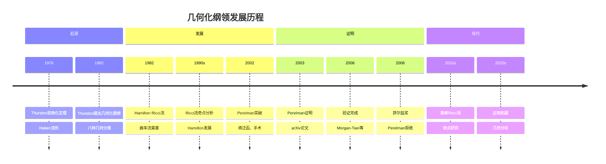
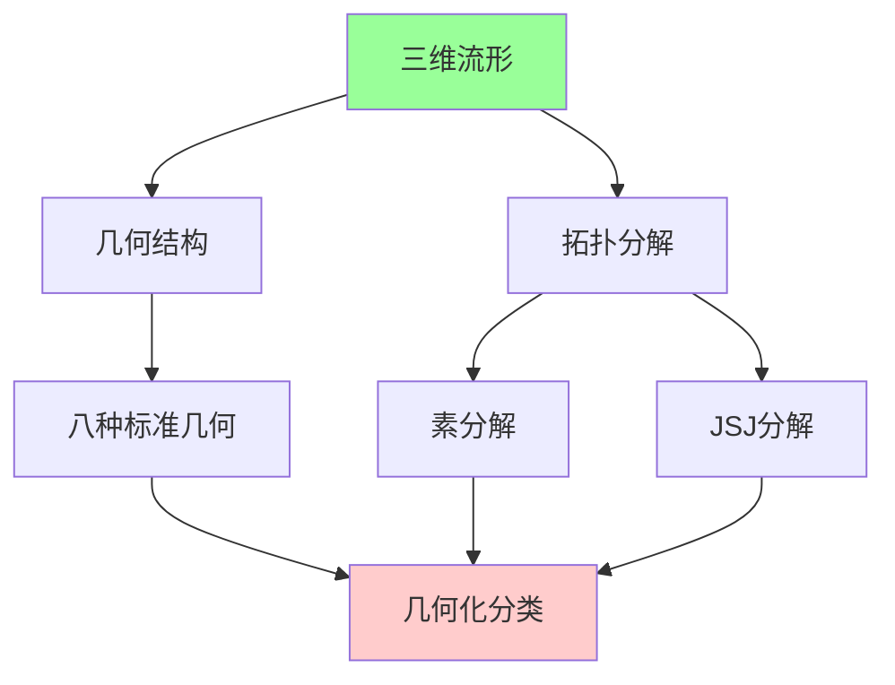
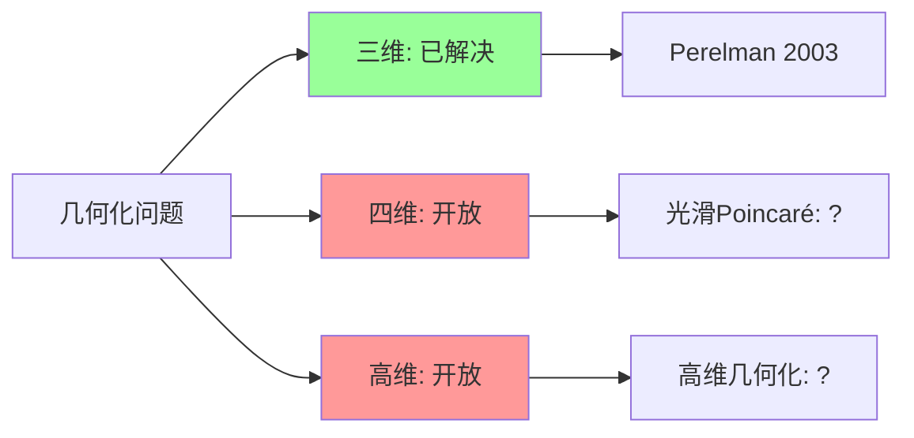
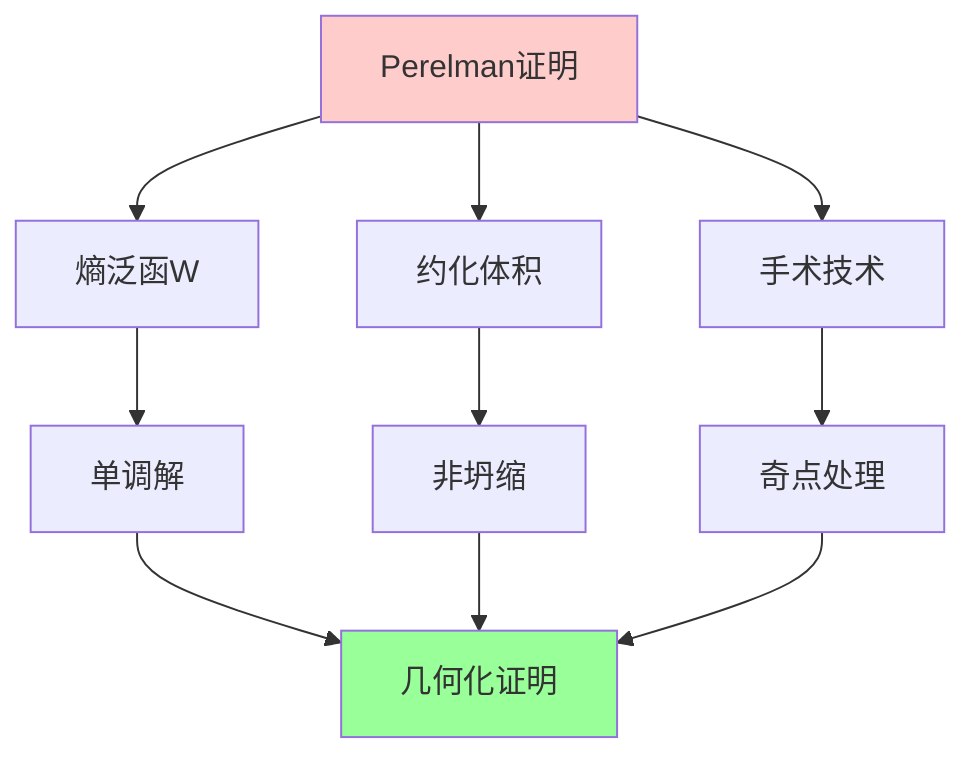
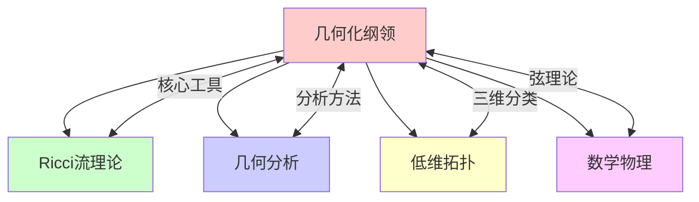

msc_primary: "00A99"
msc_secondary: ['00-00']
---

# 几何化纲领（Perelman）

## 前沿问题陈述

### 1.1 核心问题

**几何化纲领**（Geometrization Conjecture）是William Thurston在1980年代提出的关于三维流形分类的宏伟猜想。它断言每个闭三维流形都可以被切割成具有八种标准几何结构之一的 pieces。2003年，Grigori Perelman使用Ricci流理论证明了这一猜想，从而解决了著名的Poincaré猜想。

**核心问题**：

1. **几何化分类**：如何系统地将三维流形分类为八种标准几何？

2. **Ricci流奇点分析**：如何处理Ricci流中的奇点形成？

3. **高维推广**：几何化纲领能否推广到四维或更高维？

### 1.2 八种几何

Thurston的八种标准几何结构：

| 几何 | 模型空间 | 例子 |
|-----|---------|------|
| S³ | 球面几何 | 球面空间形式 |
| E³ | 欧氏几何 | 三维环面 |
| H³ | 双曲几何 | 双曲三维流形 |
| S² × R | 乘积几何 | S² × S¹ |
| H² × R | 乘积几何 | 曲面丛 |
| Nil | Heisenberg群 | Nil流形 |
| Sol | 可解李群 | Sol流形 |
| SL(2,R) | 万有覆盖 | 特殊球丛 |

---

## 历史发展脉络

### 2.1 时间线

### 2.2 关键突破

| 年份 | 人物 | 突破 |
|-----|------|------|
| 1976 | Thurston | 双曲化定理 |
| 1982 | Thurston | 几何化猜想 |
| 1982 | Hamilton | Ricci流引入 |
| 2002 | Perelman | 非坍缩定理 |
| 2003 | Perelman | 几何化证明完成 |
| 2008 | Morgan-Tian | 详细证明发表 |

---

## 与L3理论的联系

### 3.1 几何-拓扑对应

### 3.2 依赖的L3理论

| L3理论 | 在几何化纲领中的应用 | 关键结果 |
|-------|-------------------|---------|
| 黎曼几何 | 曲率分析 | Ricci曲率 |
| 偏微分方程 | Ricci流 | Hamilton |
| 拓扑学 | 流形分解 | 素分解定理 |
| 李群理论 | 齐性空间 | 八种几何 |
| 几何群论 | 基本群 | 双曲群 |

---

## 当前研究进展

### 4.1 已解决问题

#### 4.1.1 Poincaré猜想

**Perelman定理**：每个单连通闭三维流形同胚于S³。

这是千禧年问题中第一个被解决的。

#### 4.1.2 几何化猜想

**完整分类**：所有三维流形的几何化分类已经完成。

### 4.2 开放问题

### 4.3 当前活跃方向

| 方向 | 代表人物 | 核心进展 |
|-----|---------|---------|
| 四维几何化 | Freedman, Donaldson | 光滑Poincaré |
| 高维Ricci流 | Bamler, Kleiner | 奇点分析 |
| 奇点手术 | Angenent | 技术完善 |
| 数值Ricci流 | Gu, Zeng | 计算方法 |

---

## 开放问题与猜想

### 5.1 核心开放问题

#### 5.1.1 四维光滑Poincaré猜想

**问题**：每个单连通光滑闭四维流形是否微分同胚于S⁴？

**状态**：这是四维拓扑中最大的未解决问题。

#### 5.1.2 高维几何化

**问题**：几何化纲领能否推广到四维或更高维？

### 5.2 研究前沿问题

| 问题 | 状态 | 重要性 | 可能突破方向 |
|-----|------|-------|------------|
| 四维光滑Poincaré | 开放 | 5星 | 规范理论 |
| 高维几何化 | 开放 | 4星 | Ricci流 |
| Ricci孤立子分类 | 进展中 | 4星 | 几何分析 |
| Kähler-Ricci流 | 活跃 | 3星 | 代数几何 |

---

## 技术工具与方法

### 6.1 核心工具

| 工具 | 用途 | 关键文献 |
|-----|------|---------|
| Ricci流 | 几何演化 | Hamilton |
| 熵泛函 | 非坍缩 | Perelman |
| L-几何 | 距离比较 | Perelman |
| 手术 | 奇点处理 | Perelman |
| 比较几何 | 曲率控制 | Cheeger-Gromoll |

### 6.2 Perelman的方法

**三大创新**：

---

## 与其他前沿领域的联系

### 7.1 交叉网络

---

## 学习资源

### 8.1 经典文献

1. **Thurston, W. P.** (1997). Three-Dimensional Geometry and Topology.
2. **Hamilton, R. S.** (1982). Three-Manifolds with Positive Ricci Curvature.
3. **Perelman, G.** (2002-2003). The Entropy Formula for the Ricci Flow.
4. **Morgan, J., Tian, G.** (2007). Ricci Flow and the Poincaré Conjecture.

### 8.2 现代综述

- Bamler-Kleiner: Ricci flow and diffeomorphism groups
- Brendle: Ricci flow and the sphere theorem
- Chow-Lu-Ni: Hamilton's Ricci Flow

---

## 总结

几何化纲领的解决是21世纪数学最伟大的成就之一。Perelman的工作不仅解决了Poincaré猜想和几何化猜想，更开创了Ricci流研究的新时代。

虽然三维问题已基本解决，但四维光滑Poincaré猜想和高维几何化仍然是开放的前沿问题。几何化纲领的方法和思想将继续影响几何分析、拓扑学和数学物理的发展。

---

*文档版本：1.0*
*创建日期：2026年4月*
*层次级别：L4-Frontier*
*领域分类：拓扑几何前沿*
