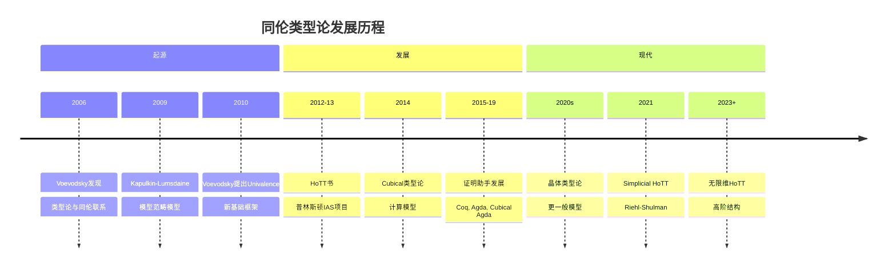
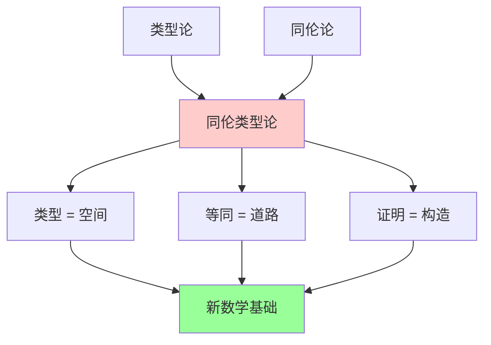
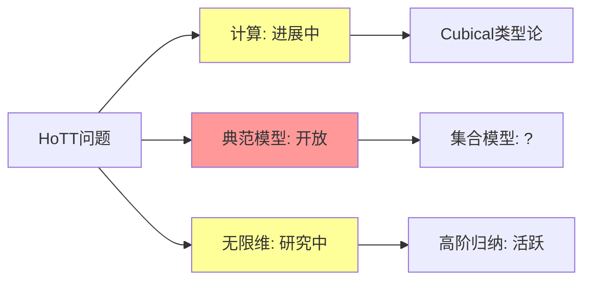
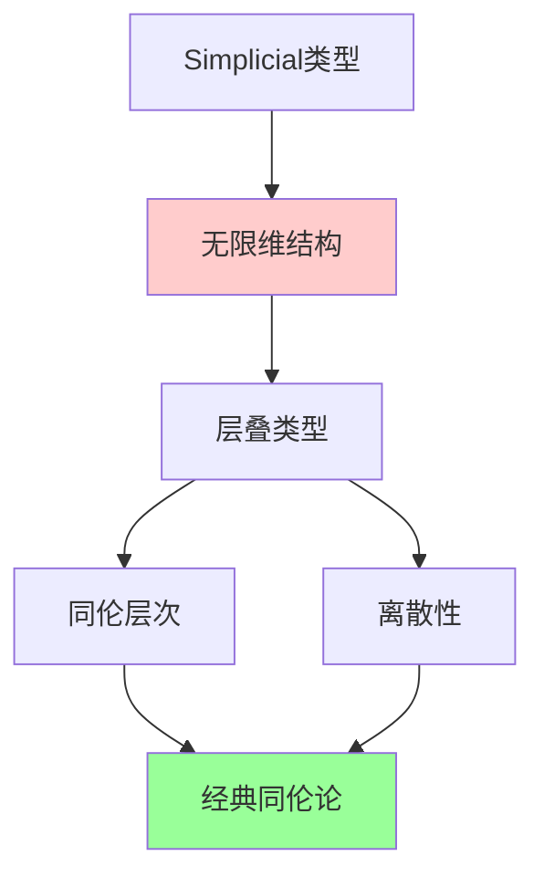
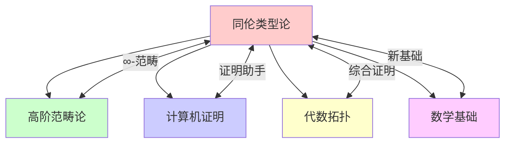

msc_primary: "00A99"
msc_secondary: ['00-XX']
---

# 同伦类型论（HoTT）

## 前沿问题陈述

### 1.1 核心问题

**同伦类型论**（Homotopy Type Theory, HoTT）是由Vladimir Voevodsky在2006-2010年间发展的新型数学基础，它将类型论与同伦论结合，为数学提供了全新的基础框架。

**核心问题**：

1. **计算内容**：HoTT中的证明是否具有计算意义？

2. **典范模型**：是否存在HoTT的典范集合模型？

3. **高阶归纳类型**：如何系统地理解和应用高阶归纳类型？

### 1.2 核心公理

**Univalence公理**：对于类型A, B，有：

$$(A = B) \simeq (A \simeq B)$$

即相等类型等价于等价类型。

**高阶归纳类型（HIT）**：允许通过生成元和关系直接构造高阶同伦类型。

---

## 历史发展脉络

### 2.1 时间线

### 2.2 关键突破

| 年份 | 人物 | 突破 |
|-----|------|------|
| 2006 | Voevodsky | 发现类型论-同伦联系 |
| 2009 | Kapulkin-Lumsdaine | 模型范畴基础 |
| 2010 | Voevodsky | Univalence公理 |
| 2012 | HoTT Book合作 | 系统阐述 |
| 2014 | Cohen-Coquand-Huber-Mortberg | Cubical类型论 |
| 2021 | Riehl-Shulman | Simplicial HoTT |

---

## 与L3理论的联系

### 3.1 类型-空间对应

### 3.2 依赖的L3理论

| L3理论 | 在HoTT中的应用 | 关键结果 |
|-------|--------------|---------|
| 类型论 | 基础语言 | Martin-Löf |
| 同伦论 | 语义解释 | Quillen模型 |
| 范畴论 | 模型构造 | 局部笛卡尔闭 |
| 高阶范畴论 | 无限结构 | ∞-topos |
| 证明论 | 计算内容 | 正规化 |

---

## 当前研究进展

### 4.1 主要应用

#### 4.1.1 证明助手

**Cubical Agda**：支持Univalence的计算型证明助手。

**Lean 4**：正在集成HoTT功能。

#### 4.1.2 同伦综合

在HoTT中可以综合地证明经典同伦论定理：

- π₁(S¹) = Z
- Hopf纤维化
- Freudenthal悬垂定理

### 4.2 开放问题

### 4.3 当前活跃方向

| 方向 | 代表人物 | 核心进展 |
|-----|---------|---------|
| 晶体类型论 | Weaver, Licata | 计算模型 |
| Simplicial HoTT | Riehl, Shulman | 无限维结构 |
| 综合同伦论 | Buchholtz | 形式化证明 |
| 定理证明器 | von Glehn | 实现技术 |

---

## 开放问题与猜想

### 5.1 核心开放问题

#### 5.1.1 典范模型存在性

**问题**：是否存在HoTT的典范集合模型？

**意义**：这关系到HoTT作为数学基础的合理性。

#### 5.1.2 计算解释完全性

**问题**：是否所有HoTT证明都有计算内容？

### 5.2 研究前沿问题

| 问题 | 状态 | 重要性 | 可能突破方向 |
|-----|------|-------|------------|
| 典范模型 | 开放 | 5星 | 范畴语义 |
| 无限维HoTT | 进展中 | 4星 | 高阶范畴 |
| HIT通用理论 | 活跃 | 4星 | 代数规范 |
| 构造性HoTT | 活跃 | 3星 | 证明论 |

---

## 技术工具与方法

### 6.1 核心工具

| 工具 | 用途 | 关键文献 |
|-----|------|---------|
| 依赖类型 | 基础语言 | Martin-Löf |
| 等同类型 | 道路空间 | Hofmann-Streicher |
| Univalence | 结构等同 | Voevodsky |
| HIT | 高阶构造 | Lumsdaine, Shulman |
| 纤维化 | 语义模型 | Kapulkin-Lumsdaine |

### 6.2 现代方法

**Simplicial HoTT**：

---

## 与其他前沿领域的联系

### 7.1 交叉网络

---

## 学习资源

### 8.1 经典文献

1. **The Univalent Foundations Program** (2013). Homotopy Type Theory.
2. **Voevodsky, V.** (2010). The Equivalence Axiom.
3. **Kapulkin, C., Lumsdaine, P. L.** (2012). The Simplicial Model.
4. **Cohen, C., et al.** (2016). Cubical Type Theory.

### 8.2 现代综述

- Riehl-Shulman: A type theory for synthetic ∞-categories
- Cavallo-Harper: Higher inductive types
- Angiuli-Favonia-Harper: Cartesian cubical type theory

---

## 总结

同伦类型论代表了数学基础的重要范式转变。它将类型论、同伦论和范畴论统一在一个框架下，为数学提供了新的基础和新的证明方法。

随着计算模型（如Cubical类型论）的发展和证明助手的成熟，HoTT正在从理论走向实践。虽然许多理论问题仍然开放，但HoTT已经在改变我们对数学基础、证明和计算的理解。

---

*文档版本：1.0*
*创建日期：2026年4月*
*层次级别：L4-Frontier*
*领域分类：拓扑几何前沿*
