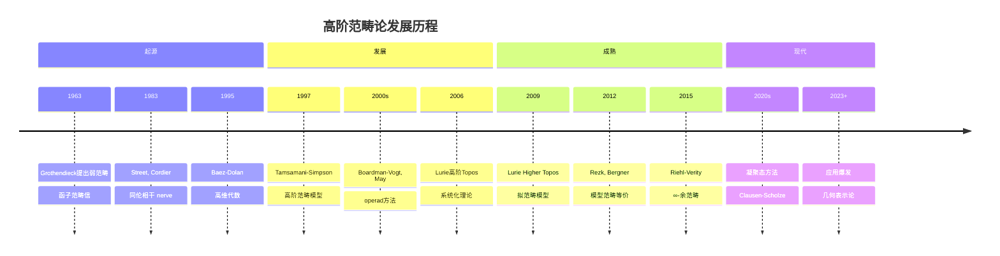
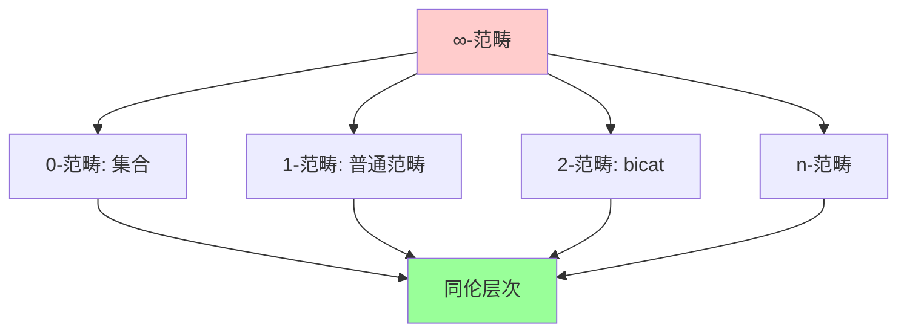
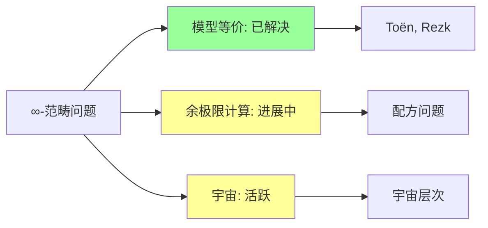
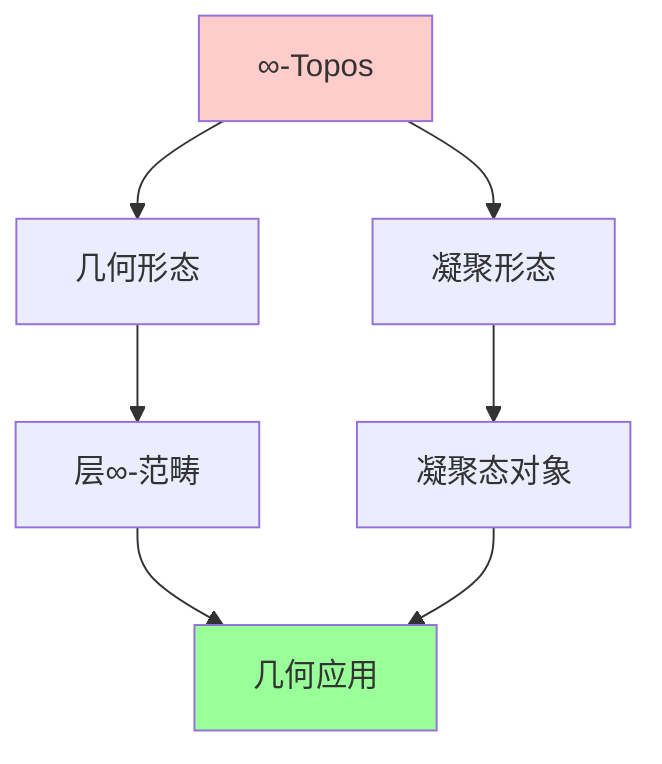
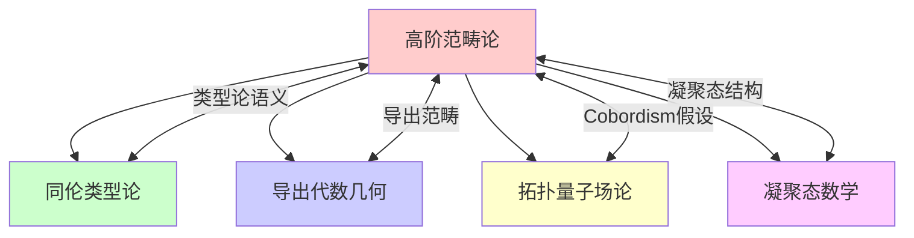

# 高阶范畴论

## 前沿问题陈述

### 1.1 核心问题

**高阶范畴论**（Higher Category Theory）是将范畴论从1-范畴推广到n-范畴和∞-范畴的数学理论。它为同伦论、代数几何和数学物理提供了统一的语言框架。

**核心问题**：

1. **∞-范畴的定义**：如何正确定义和研究∞-范畴？

2. **同论假设**：拓扑空间与∞-群胚之间的等价如何形式化？

3. **高阶代数结构**：如何在∞-范畴中处理结合性的高阶同伦？

### 1.2 核心概念

**∞-范畴**：一个∞-范畴是一个单纯集合（或类似的结构），其中所有高于1维的态射都是可逆的（在拟范畴模型中）。

**同伦假设**：拓扑空间的同伦类型等价于∞-群胚。

---

## 历史发展脉络

### 2.1 时间线

### 2.2 关键突破

| 年份 | 人物 | 突破 |
|-----|------|------|
| 1983 | Street-Cordier | Homotopy coherent nerve |
| 1995 | Baez-Dolan | Higher-dimensional algebra |
| 2006 | Lurie | Higher topos theory |
| 2009 | Lurie | Quasicategories |
| 2012 | Rezk | Complete Segal spaces |
| 2020 | Clausen-Scholze | Condensed mathematics |

---

## 与L3理论的联系

### 3.1 层次结构

### 3.2 依赖的L3理论

| L3理论 | 在∞-范畴中的应用 | 关键结果 |
|-------|-----------------|---------|
| 单纯同伦论 | 模型构造 | Quillen |
| 模型范畴 | 表述框架 | Hovey |
| Operad | 代数结构 | May |
| 层论 | ∞-Topos | Lurie |
| 导出范畴 | 三角化 | Verdier |

---

## 当前研究进展

### 4.1 主要模型

| 模型 | 特征 | 代表人物 |
|-----|------|---------|
| 拟范畴 | Joyal, Lurie | 单纯集合 |
| 完备Segal空间 | Rezk | 空间值单纯对象 |
| 相对范畴 | Barwick-Kan | 二元对 |
| 单纯范畴 | Bergner | 范畴的 enrich |
| 双∞-范畴 | Riehl-Verity | 余方向 |

### 4.2 开放问题

### 4.3 当前活跃方向

| 方向 | 代表人物 | 核心进展 |
|-----|---------|---------|
| 双∞-范畴 | Riehl, Verity | 余方向结构 |
| ∞-Operad | Lurie, Chu | 高阶代数 |
| 晶体∞-范畴 | Riehl, Shulman | 定向结构 |
| 凝聚态∞-范畴 | Clausen | 新框架 |

---

## 开放问题与猜想

### 5.1 核心开放问题

#### 5.1.1 余极限计算

**问题**：如何在∞-范畴中有效计算余极限？

**状态**：理论存在，实际计算困难。

#### 5.1.2 宇宙层次

**问题**：如何在∞-范畴中处理不同宇宙层次？

### 5.2 研究前沿问题

| 问题 | 状态 | 重要性 | 可能突破方向 |
|-----|------|-------|------------|
| 余极限计算 | 进展中 | 4星 | 配方理论 |
| 宇宙问题 | 活跃 | 4星 | 类型论 |
| 几何应用 | 活跃 | 5星 | 导出几何 |
| 凝聚态结合 | 萌芽 | 4星 | 新框架 |

---

## 技术工具与方法

### 6.1 核心工具

| 工具 | 用途 | 关键文献 |
|-----|------|---------|
| 单纯集合 | 拟范畴 | Joyal |
| Kan复形 | ∞-群胚 | Quillen |
| 余极限 | 普遍构造 | Lurie |
| 伴随 | 函子关系 | Riehl |
| 局部化 | 逆变 | Dwyer-Kan |

### 6.2 现代方法

**∞-Topos理论**：

---

## 与其他前沿领域的联系

### 7.1 交叉网络

---

## 学习资源

### 8.1 经典文献

1. **Lurie, J.** (2009). Higher Topos Theory.
2. **Lurie, J.** (2017). Higher Algebra.
3. **Riehl, E.** (2014). Categorical Homotopy Theory.
4. **Riehl, E., Verity, D.** (2022). Elements of ∞-Category Theory.

### 8.2 现代综述

- Cisinski: Higher categories and homotopical algebra
- Morava: Higher category theory in geometry and physics
- Schreiber: Differential cohomology in a cohesive ∞-topos

---

## 总结

高阶范畴论是现代数学的基础设施，为代数几何、同伦论和数学物理提供了统一的语言。从Lurie的系统性工作到Riehl-Verity的双∞-范畴理论，这一领域正在快速发展。

随着与HoTT、导出几何和凝聚态数学的深入融合，∞-范畴论正在成为连接纯粹数学和应用数学的核心桥梁。

---

*文档版本：1.0*
*创建日期：2026年4月*
*层次级别：L4-Frontier*
*领域分类：拓扑几何前沿*
