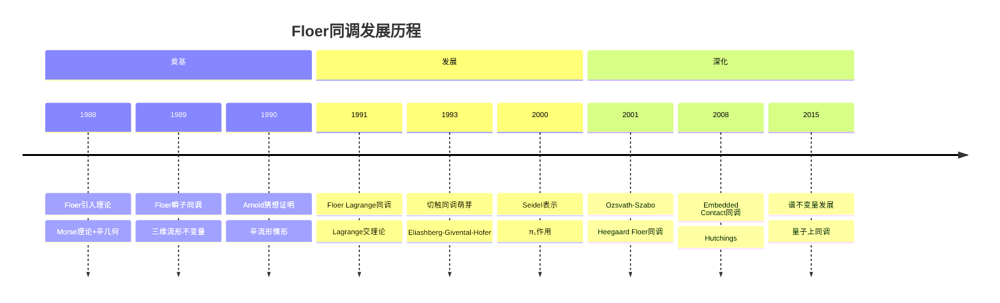
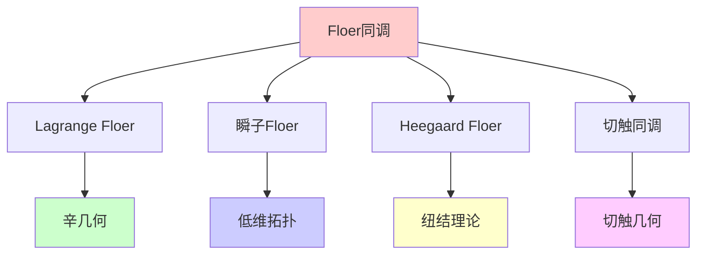
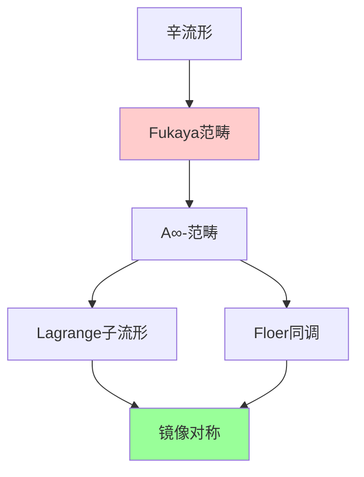
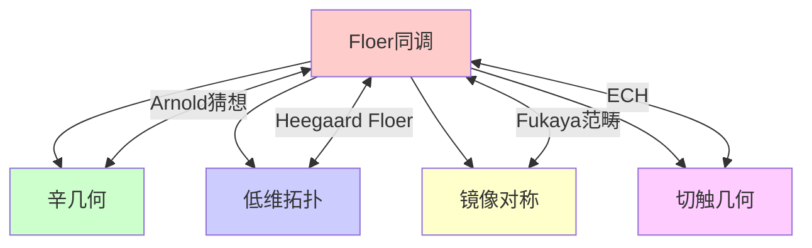

# Floer同调

## 前沿问题陈述

### 1.1 核心问题

**Floer同调**是由Andreas Floer在1988年引入的同调理论，结合了无限维Morse理论和辛几何。它已成为辛几何、低维拓扑和数学物理中最强大的工具之一。

**核心问题**：

1. **Arnold猜想**：Hamiltonian微分同胚的不动点个数是否有下界？

2. **Atiyah-Floer猜想**：瞬子Floer同调与Lagrange Floer同调是否同构？

3. **同调级别分类**：Floer同调能否完全区分辛流形或Legendrian纽结？

### 1.2 核心定义

**Lagrange Floer同调**：对于辛流形(M, ω)中的Lagrange子流形L₀, L₁，Floer同调定义为：

$$HF(L_0, L_1) = H(CF(L_0, L_1), \partial)$$

其中链复形由L₀ ∩ L₁的交点生成，微分由全纯带计数。

---

## 历史发展脉络

### 2.1 时间线

### 2.2 关键突破

| 年份 | 人物 | 突破 |
|-----|------|------|
| 1988 | Floer |  Floer同调引入 |
| 1989 | Floer | 瞬子Floer同调 |
| 1990 | Floer | Arnold猜想证明 |
| 2001 | Ozsvath-Szabo | Heegaard Floer同调 |
| 2008 | Hutchings | ECH |
| 2015 | Abouzaid | 生成性结果 |

---

## 与L3理论的联系

### 3.1 理论网络

### 3.2 依赖的L3理论

| L3理论 | 在Floer同调中的应用 | 关键结果 |
|-------|------------------|---------|
| Morse理论 | 无限维推广 | Witten变形 |
| 辛几何 | Lagrange子流形 | Arnold猜想 |
| 规范理论 | 瞬子模空间 | Donaldson理论 |
| 复几何 | 全纯曲线 | Gromov紧化 |
| 同调代数 | A∞-结构 | Fukaya范畴 |

---

## 当前研究进展

### 4.1 Arnold猜想

**定理**：对于闭辛流形(M, ω)，非退化Hamiltonian微分同胚的不动点个数至少为：

$$\sum_i \dim H_i(M)$$

**证明**：Floer使用Floer同调证明了这一猜想。

### 4.2 主要变体

| 变体 | 对象 | 关键应用 |
|-----|------|---------|
| Lagrange Floer | Lagrange交 | 辛嵌入 |
| 瞬子Floer | 三维流形 | 纽结同调 |
| Heegaard Floer | 纽结/三维流形 | 纽结不变量 |
| ECH | 切触三维流形 | 动力学 |

### 4.3 当前活跃方向

| 方向 | 代表人物 | 核心进展 |
|-----|---------|---------|
| 谱不变量 | Polterovich | 辛动力学 |
| 定量同调 | Biran-Cornea | 辛 Packing |
| Fukaya范畴 | Seidel, Abouzaid | HMS |
| 纽结同调 | Manolescu | 新不变量 |

---

## 开放问题与猜想

### 5.1 核心开放问题

#### 5.1.1 Atiyah-Floer猜想

**问题**：瞬子Floer同调 HF^{inst}(Y) 与 Lagrange Floer同调是否同构？

**状态**：部分情形已证明，一般情形开放。

#### 5.1.2 同调级别分类

**问题**：Floer同调能否完全区分辛流形？

### 5.2 研究前沿问题

| 问题 | 状态 | 重要性 | 可能突破方向 |
|-----|------|-------|------------|
| Atiyah-Floer | 部分解决 | 5星 | 规范理论 |
| 分类问题 | 活跃 | 4星 | Fukaya范畴 |
| 高维推广 | 开放 | 4星 | 全纯曲线 |
| 量子化 | 进展中 | 4星 | 形变理论 |

---

## 技术工具与方法

### 6.1 核心工具

| 工具 | 用途 | 关键文献 |
|-----|------|---------|
| 全纯曲线 | 微分定义 | Gromov |
| Gromov紧化 | 模空间紧化 | Kontsevich |
| A∞-代数 | 同伦不变量 | Fukaya |
| 谱序列 | 计算工具 | Oh |
| Novikov环 | 系数环 | Hofer-Salamon |

### 6.2 现代方法

**Fukaya范畴**：

---

## 与其他前沿领域的联系

### 7.1 交叉网络

---

## 学习资源

### 8.1 经典文献

1. **Floer, A.** (1988). Morse Theory for Lagrangian Intersections.
2. **Floer, A.** (1989). Symplectic Fixed Points and Holomorphic Spheres.
3. **Ozsvath, P., Szabo, Z.** (2004). Holomorphic Disks and Three-Manifold Invariants.
4. **Seidel, P.** (2008). Fukaya Categories and Picard-Lefschetz Theory.

### 8.2 现代综述

- Hutchings: Lecture notes on embedded contact homology
- Abouzaid: The family Floer functor is faithful
- Biran-Cornea: Lagrangian topology and enumerative geometry

---

## 总结

Floer同调是连接辛几何、低维拓扑和数学物理的强有力工具。从Floer的原始工作到Ozsvath-Szabo的Heegaard Floer同调，这一理论不断发展和深化。

虽然Atiyah-Floer猜想等核心问题仍然开放，但Floer同调及其变体（如Fukaya范畴）已经成为现代几何学中不可或缺的工具。

---

*文档版本：1.0*
*创建日期：2026年4月*
*层次级别：L4-Frontier*
*领域分类：拓扑几何前沿*
