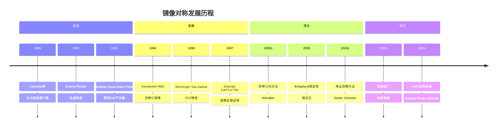
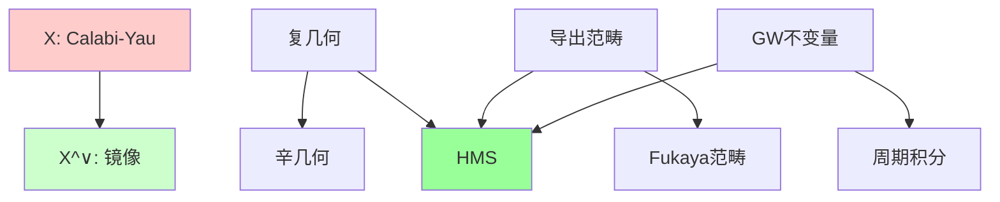
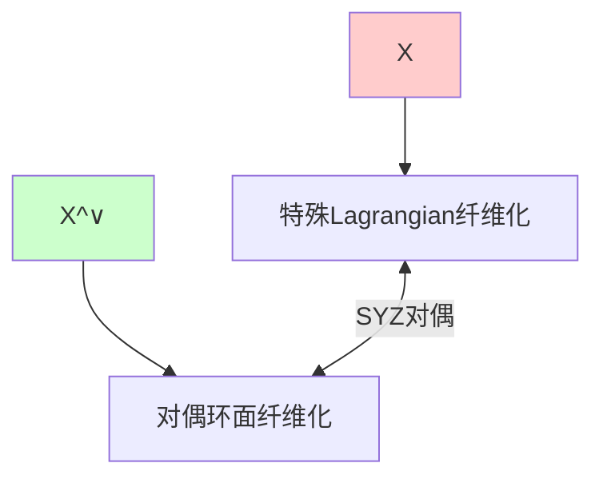
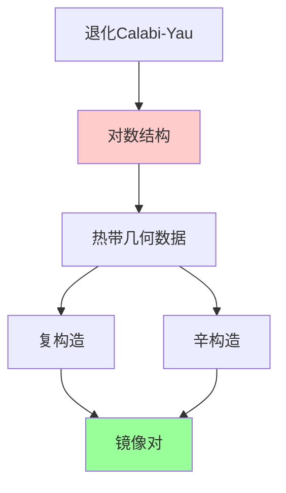
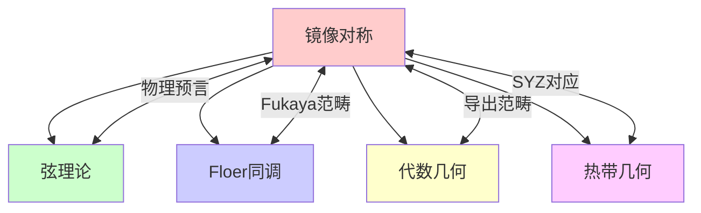

# 镜像对称

## 前沿问题陈述

### 1.1 核心问题

**镜像对称**（Mirror Symmetry）是弦理论预言的数学现象，断言两个Calabi-Yau流形在复几何和辛几何方面存在深刻的对偶关系。它已成为连接代数几何、辛几何和数学物理的桥梁。

**核心问题**：

1. **SYZ猜想**：镜像对称是否由特殊Lagrangian纤维化的对偶解释？

2. **HMS猜想**：Fukaya范畴与导出范畴是否等价？

3. **GW/DT对应**：Gromov-Witten理论与Donaldson-Thomas理论是否等价？

### 1.2 核心陈述

**HMS猜想（Kontsevich）**：对于镜像对(X, X^∨)，有范畴等价：

$$D^b(\text{Coh}(X^\vee)) \cong \text{Fuk}(X)$$

即镜像的复几何（导出范畴）对应原型的辛几何（Fukaya范畴）。

---

## 历史发展脉络

### 2.1 时间线

### 2.2 关键突破

| 年份 | 人物 | 突破 |
|-----|------|------|
| 1989 | Candelas等 | 镜面对称发现 |
| 1994 | Kontsevich | HMS猜想 |
| 1996 | SYZ | 几何解释 |
| 1997 | Givental, LLY | 镜像定理 |
| 2005 | Bridgeland | 稳定性条件 |
| 2022 | GPS | HMS部分证明 |

---

## 与L3理论的联系

### 3.1 对偶对应

### 3.2 依赖的L3理论

| L3理论 | 在镜像对称中的应用 | 关键结果 |
|-------|------------------|---------|
| 复几何 | Hodge结构 | 周期映射 |
| 辛几何 | Lagrange子流形 | Fukaya范畴 |
| 代数几何 | 导出范畴 | Bridgeland稳定性 |
| 枚举几何 | GW不变量 | 镜像定理 |
| 热带几何 | 退化分析 | 对应原理 |

---

## 当前研究进展

### 4.1 HMS进展

**Ganatra-Pardon-Shende定理（2022）**：对于某些局部Calabi-Yau，HMS成立。

**部分结果**：

- 椭圆曲线：证明
- Abel簇：证明
- 某些曲面：证明
- 一般情形：开放

### 4.2 SYZ进展

**对偶特殊Lagrangian纤维化**：

### 4.3 当前活跃方向

| 方向 | 代表人物 | 核心进展 |
|-----|---------|---------|
| HMS证明 | GPS | 部分结果 |
| 对数镜像 | Gross-Siebert | 退化方法 |
| 广义镜像 | Katzarkov | 非交换情形 |
| 量化镜像 | Gukov | 物理方法 |

---

## 开放问题与猜想

### 5.1 核心开放问题

#### 5.1.1 一般HMS

**问题**：HMS猜想对一般Calabi-Yau是否成立？

**状态**：部分情形已证明，一般Calabi-Yau开放。

#### 5.1.2 SYZ对偶的构造

**问题**：如何在构造层面上实现SYZ对偶？

### 5.2 研究前沿问题

| 问题 | 状态 | 重要性 | 可能突破方向 |
|-----|------|-------|------------|
| HMS一般情形 | 部分解决 | 5星 | 谱序列 |
| SYZ构造 | 进展中 | 5星 | 热带几何 |
| 高维推广 | 活跃 | 4星 | 导出几何 |
| Fano镜像 | 进展中 | 4星 | Landau-Ginzburg |

---

## 技术工具与方法

### 6.1 核心工具

| 工具 | 用途 | 关键文献 |
|-----|------|---------|
| Fukaya范畴 | 辛侧 | Seidel |
| 导出范畴 | 复侧 | Bondal-Orlov |
| 稳定性条件 | 墙交叉 | Bridgeland |
| 热带几何 | 退化 | Mikhalkin |
| 簇代数 | 组合 | Fomin-Zelevinsky |

### 6.2 现代方法

**Gross-Siebert程序**：

---

## 与其他前沿领域的联系

### 7.1 交叉网络

---

## 学习资源

### 8.1 经典文献

1. **Cox, D. A., Katz, S.** (1999). Mirror Symmetry and Algebraic Geometry.
2. **Hori, K., et al.** (2003). Mirror Symmetry.
3. **Auroux, D.** (2009). Mirror Symmetry and T-Duality in the Complement of an Anticanonical Divisor.
4. **Gross, M., Huybrechts, D., Joyce, D.** (2003). Calabi-Yau Manifolds and Related Geometries.

### 8.2 现代综述

- Ganatra-Pardon-Shende: Microlocal sheaves and HMS
- Gross-Siebert: Theta functions and mirror symmetry
- Sheridan: On the Fukaya category of a Fano hypersurface

---

## 总结

镜像对称是当代数学最激动人心的前沿领域之一，它将代数几何、辛几何和数学物理深刻联系在一起。从Candelas等人的数值发现到Kontsevich的范畴化预言，再到Gross-Siebert的几何构造，这一领域不断取得突破。

虽然HMS猜想等核心问题仍然部分开放，但镜像对称已经成为连接不同数学分支的核心范例，其影响将继续扩展。

---

*文档版本：1.0*
*创建日期：2026年4月*
*层次级别：L4-Frontier*
*领域分类：拓扑几何前沿*
