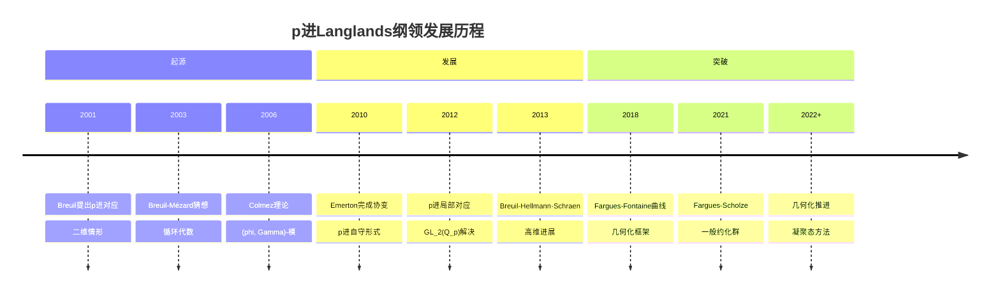
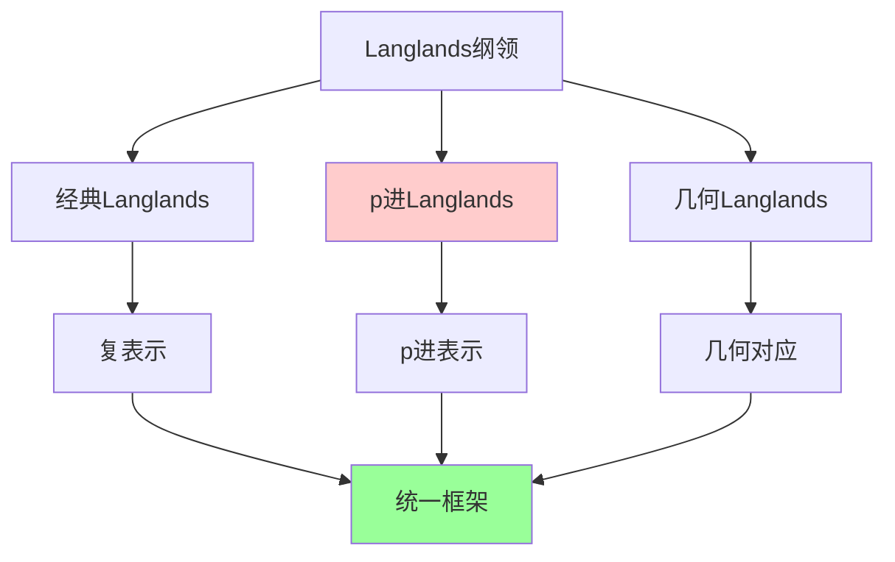
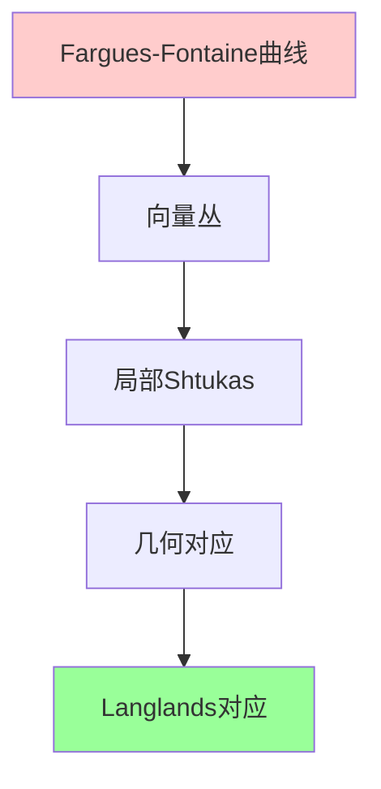
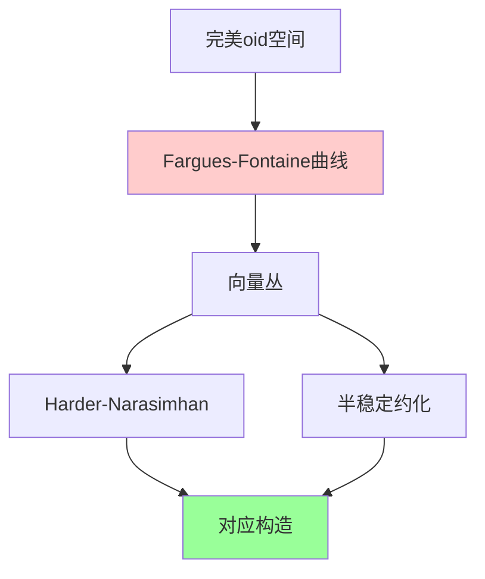
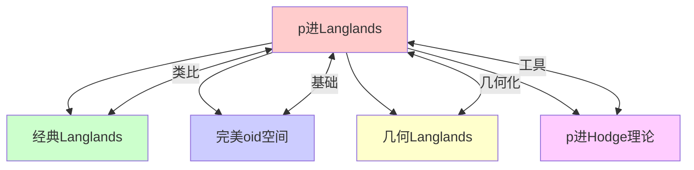

msc_primary: "00A99"
msc_secondary: ['00-XX']
---

# p进Langlands纲领

## 前沿问题陈述

### 1.1 核心问题

**p进Langlands纲领**是经典Langlands纲领在p进域上的推广，由Christophe Breuil等人在2000年代初发展起来。它研究p进Galois表示与p进自守形式之间的对应关系，是当代数论最活跃的研究领域之一。

**核心问题**：

1. **p进局部对应**：对于GL_n(Q_p)，是否存在p进局部Langlands对应？

2. **p进局部整体相容**：p进局部对应如何与整体对应相容？

3. **模p表示**：在特征p情形下，对应关系如何建立？

### 1.2 核心猜想

**p进局部Langlands对应（GL_n）**：存在双射：

$$\{\text{n维p进Galois表示}\} \longleftrightarrow \{\text{GL}_n(\mathbb{Q}_p)的p进表示}\}$$

满足某些自然条件。

---

## 历史发展脉络

### 2.1 时间线

### 2.2 关键突破

| 年份 | 人物 | 突破 |
|-----|------|------|
| 2001 | Breuil | p进Langlands提出 |
| 2010 | Colmez | GL_2对应 |
| 2013 | Kisin | 形变环 |
| 2018 | Fargues-Fontaine | 曲线构造 |
| 2021 | Fargues-Scholze | 几何化对应 |
| 2023 | 多人 | 继续推进 |

---

## 与L3理论的联系

### 3.1 对应网络

### 3.2 依赖的L3理论

| L3理论 | 在p进Langlands中的应用 | 关键结果 |
|-------|---------------------|---------|
| 类域论 | 交换情形 | 局部类域论 |
| (phi, Gamma)-模 | 表示分类 | Fontaine |
| 形变理论 | Galois形变 | Mazur, Kisin |
| p进Hodge理论 | 周期环 | Fontaine |
| 表示论 | 㲴表示 | Schneider, Teitelbaum |

---

## 当前研究进展

### 4.1 GL_2情形

**Colmez定理（2010）**：对于GL_2(Q_p)，p进局部对应完全建立。

**关键工具**：

- (phi, Gamma)-模
- p进局部分析
- 自守形式

### 4.2 一般约化群

**Fargues-Scholze定理（2021）**：使用完美oid和几何化方法，建立了Fargues-Fontaine曲线上的对应。

### 4.3 当前活跃方向

| 方向 | 代表人物 | 核心进展 |
|-----|---------|---------|
| 几何化 | Fargues, Scholze | 曲线方法 |
| 模p表示 | Herzig, Henniart | 特征p |
| 局部整体 | Emerton, Hellmann | 相容性 |
| 凝聚态 | Clausen | 新框架 |

---

## 开放问题与猜想

### 5.1 核心开放问题

#### 5.1.1 显式对应

**问题**：能否显式描述p进局部对应？

**状态**：GL_2情形有显式公式，高维情形开放。

#### 5.1.2 模p对应

**问题**：特征p表示的分类和对应。

### 5.2 研究前沿问题

| 问题 | 状态 | 重要性 | 可能突破方向 |
|-----|------|-------|------------|
| 显式对应 | 部分解决 | 5星 | 计算方法 |
| 模p对应 | 进展中 | 4星 | 几何方法 |
| 局部整体 | 活跃 | 5星 | 整体对应 |
| 几何化 | 进展中 | 5星 | 完美oid |

---

## 技术工具与方法

### 6.1 核心工具

| 工具 | 用途 | 关键文献 |
|-----|------|---------|
| (phi, Gamma)-模 | 表示分类 | Fontaine, Colmez |
| Breuil-Kisin模 | 晶体型表示 | Kisin |
| Fargues-Fontaine曲线 | 几何化 | Fargues-Fontaine |
| 完美oid空间 | 上同调 | Scholze |
| 凝聚态 | 新框架 | Clausen-Scholze |

### 6.2 现代方法

**Fargues-Scholze几何化**：

---

## 与其他前沿领域的联系

### 7.1 交叉网络

---

## 学习资源

### 8.1 经典文献

1. **Breuil, C.** (2003). Sur quelques représentations modulaires et p-adiques de GL_2(Q_p).
2. **Colmez, P.** (2010). Représentations de GL_2(Q_p) et (phi, Gamma)-modules.
3. **Emerton, M.** (2006). A Local-Global Compatibility Conjecture.
4. **Fargues, L., Scholze, P.** (2021). Geometrization of the Local Langlands Correspondence.

### 8.2 现代综述

- Caraiani-Scholze: On the generic part of cohomology
- Hansen: Moduli of local shtukas
- Hellmann: On the derived category of the Iwahori-Hecke algebra

---

## 总结

p进Langlands纲领是当代数论最活跃、最前沿的领域之一。从Breuil的最初设想到Fargues-Scholze的几何化突破，这一领域经历了深刻的发展。

随着完美oid空间、凝聚态数学等工具的发展，p进Langlands纲领正在进入一个新的发展阶段。虽然许多核心问题仍然开放，但这一领域已经为理解算术几何和自守形式提供了全新的视角。

---

*文档版本：1.0*
*创建日期：2026年4月*
*层次级别：L4-Frontier*
*领域分类：数论前沿*
