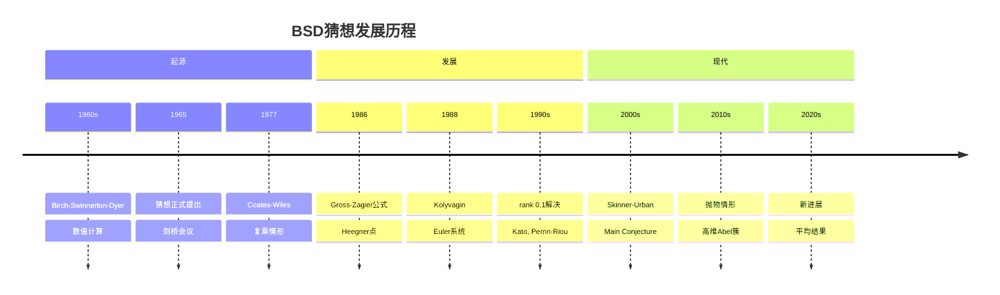
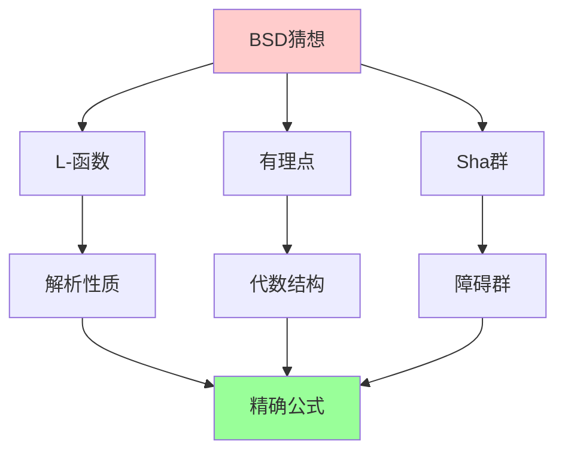
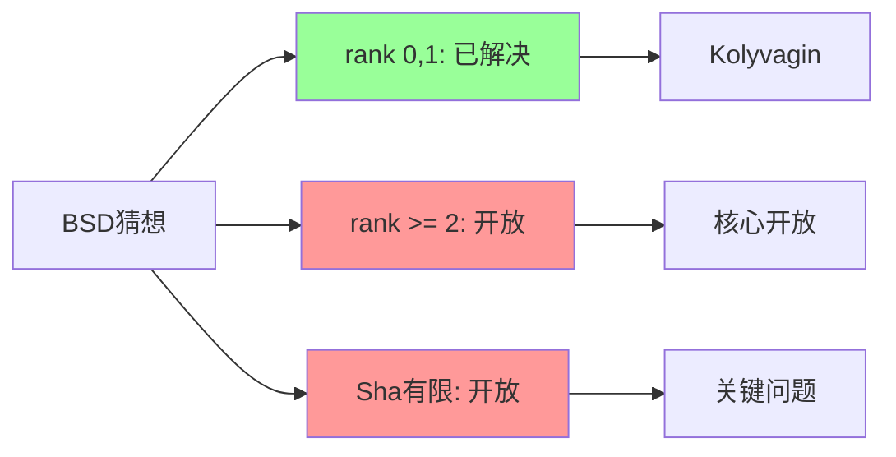
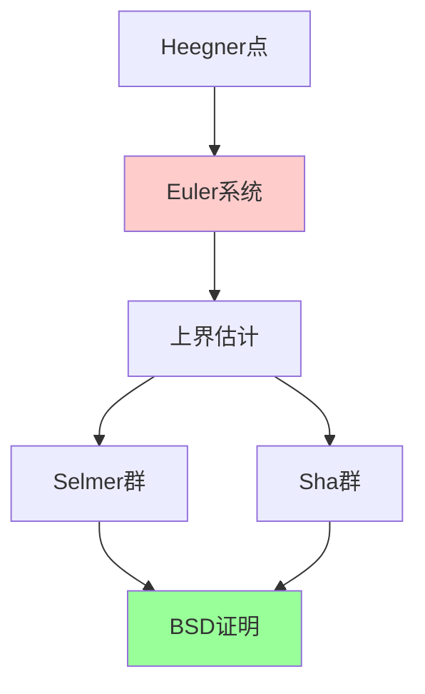
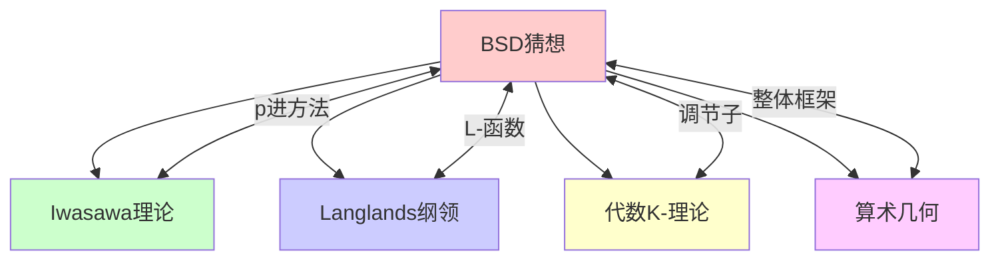

msc_primary: "00A99"
msc_secondary: ['00-XX']
---

# BSD猜想

## 前沿问题陈述

### 1.1 核心问题

**Birch-Swinnerton-Dyer猜想**（BSD猜想）是关于椭圆曲线有理点群结构的深刻猜想。它是千禧年大奖问题之一，被认为是数论中最重要的问题之一。

**核心问题**：

1. **解析秩与代数秩**：椭圆曲线的L-函数在s=1处的零点阶数是否等于有理点群的秩？

2. **Sha有限性**：Tate-Shafarevich群是否有限？

3. **精确公式**：L-函数的首项系数是否与椭圆曲线的算术不变量精确相关？

### 1.2 核心猜想

**BSD猜想**：设E/Q是椭圆曲线，则：

1. $r_{\text{an}} = r_{\text{alg}}$，其中 $r_{\text{an}}$ 是L-函数在s=1处的零点阶数，$r_{\text{alg}}$ 是E(Q)的秩。

2. 如果 $r_{\text{an}} = 0$，则：

$$L(E, 1) = \frac{\Omega_E \cdot \text{Reg}_E \cdot |Sha(E)| \cdot \prod_p c_p}{|E(\mathbb{Q})_{\text{tors}}|^2}$$

---

## 历史发展脉络

### 2.1 时间线

### 2.2 关键突破

| 年份 | 人物 | 突破 |
|-----|------|------|
| 1965 | BSD | 猜想提出 |
| 1977 | Coates-Wiles | 复乘rank 0 |
| 1986 | Gross-Zagier | Heegner点公式 |
| 1988 | Kolyvagin | Euler系统 |
| 2000 | Kato | p进BSD元素 |
| 2014 | Skinner-Urban | 大反变结果 |

---

## 与L3理论的联系

### 3.1 算术结构

### 3.2 依赖的L3理论

| L3理论 | 在BSD中的应用 | 关键结果 |
|-------|-------------|---------|
| 椭圆曲线 | 基本对象 | Mordell-Weil |
| L-函数 | 解析工具 | 函数方程 |
| Galois表示 | 模性 | Wiles-Taylor |
| Iwasawa理论 | p进方法 | Main Conjecture |
| 高斯Heegner点 | 构造方法 | Gross-Zagier |

---

## 当前研究进展

### 4.1 已知结果

#### 4.1.1 rank 0,1情形

**定理（Kolyvagin, Kato, Perrin-Riou）**：对于rank 0或1的椭圆曲线，BSD猜想的弱形式成立。

#### 4.1.2 精确公式

**Skinner-Urban定理**：在特定条件下，BSD公式的p进版本成立。

### 4.2 开放问题

### 4.3 当前活跃方向

| 方向 | 代表人物 | 核心进展 |
|-----|---------|---------|
| 抛物BSD | Skinner | 大反变 |
| 平均结果 | Bhargava | 统计方法 |
| 高维推广 | 多人 | Abel簇 |
| p进方法 | Kobayashi | Iwasawa理论 |

---

## 开放问题与猜想

### 5.1 核心开放问题

#### 5.1.1 一般秩的BSD

**问题**：对于任意秩的椭圆曲线，BSD猜想是否成立？

**状态**：rank 0,1解决，rank >= 2完全开放。

#### 5.1.2 Sha有限性

**问题**：Sha群是否总是有限的？

### 5.2 研究前沿问题

| 问题 | 状态 | 重要性 | 可能突破方向 |
|-----|------|-------|------------|
| 高秩BSD | 开放 | 5星 | Heegner点 |
| Sha有限性 | 开放 | 5星 | Iwasawa理论 |
| 精确公式 | 部分解决 | 5星 | p进方法 |
| 统计BSD | 进展中 | 4星 | 平均结果 |

---

## 技术工具与方法

### 6.1 核心工具

| 工具 | 用途 | 关键文献 |
|-----|------|---------|
| Heegner点 | 有理点构造 | Gross-Zagier |
| Euler系统 | 上界估计 | Kolyvagin |
| p进L-函数 | p进方法 | Mazur-Swinnerton-Dyer |
| Iwasawa理论 | 整体控制 | Main Conjecture |
| 模性定理 | Galois表示 | Wiles |

### 6.2 现代方法

**Euler系统方法**：

---

## 与其他前沿领域的联系

### 7.1 交叉网络

---

## 学习资源

### 8.1 经典文献

1. **Birch, B. J., Swinnerton-Dyer, H. P. F.** (1965). Notes on Elliptic Curves.
2. **Gross, B. H., Zagier, D. B.** (1986). Heegner Points and Derivatives of L-Series.
3. **Kolyvagin, V. A.** (1988). Finiteness of E(Q) and Sha(E/Q).
4. **Rubin, K.** (1999). Elliptic Curves with Complex Multiplication.

### 8.2 现代综述

- Skinner-Urban: The Iwasawa Main Conjectures for GL(2)
- Bhargava-Shankar: Average rank of elliptic curves
- Kato: p-adic Hodge theory and values of zeta functions

---

## 总结

BSD猜想是数论中最深刻、最具挑战性的问题之一。从Birch和Swinnerton-Dyer的数值发现到Gross-Zagier公式、Kolyvagin的Euler系统，再到现代的Iwasawa理论和p进方法，这一领域经历了深刻的发展。

虽然rank 0和1的情形已基本解决，但一般情形（特别是rank >= 2）仍然是完全开放的。BSD猜想代表了算术几何中最核心的挑战，其解决将深刻改变我们对椭圆曲线和L-函数的理解。

---

*文档版本：1.0*
*创建日期：2026年4月*
*层次级别：L4-Frontier*
*领域分类：数论前沿*
