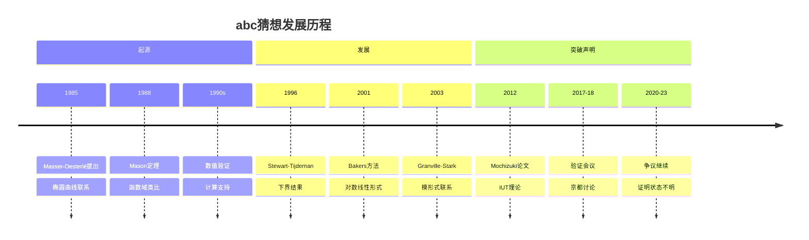
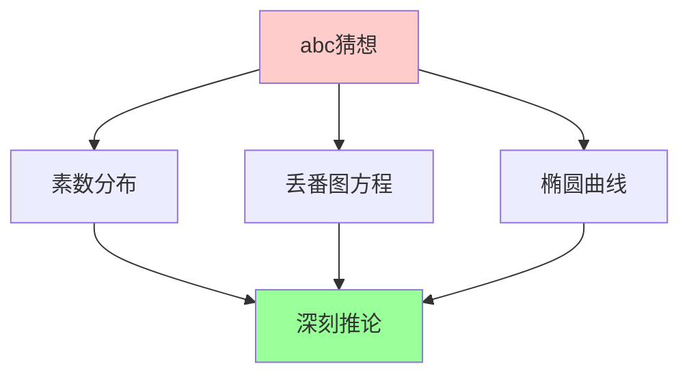
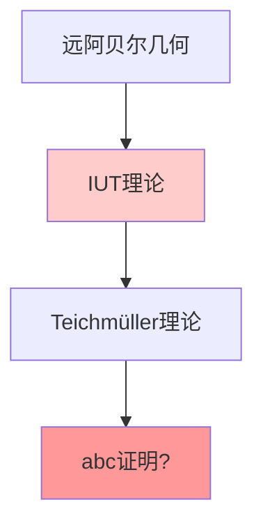
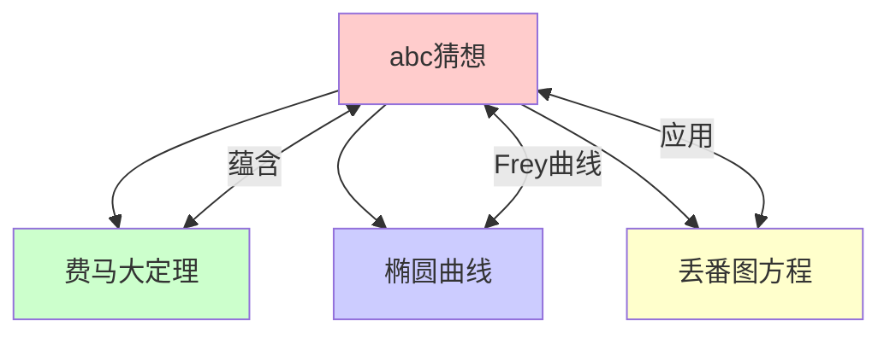

msc_primary: "00A99"
msc_secondary: ['00-XX']
---

# abc猜想

## 前沿问题陈述

### 1.1 核心问题

**abc猜想**是由David Masser和Joseph Oesterlé在1985年提出的关于丢番图方程的深刻猜想。它虽然形式简单，但蕴含着关于素数分布和丢番图逼近的深刻信息。

**核心问题**：

1. **abc猜想本身**：对于epsilon>0，是否存在常数C(epsilon)使得abc不等式成立？

2. **Mochizuki证明**：Shinichi Mochizuki宣称的证明是否正确？

3. **有效abc界限**：能否找到明确的常数C(epsilon)？

### 1.2 核心陈述

**abc猜想**：对于任意epsilon > 0，存在常数K(epsilon)，使得对于任意互素正整数a,b,c满足a+b=c，有：

$$c < K(\epsilon) \cdot \text{rad}(abc)^{1+\epsilon}$$

其中rad(n)是n的所有不同素因子的乘积。

---

## 历史发展脉络

### 2.1 时间线

### 2.2 关键突破

| 年份 | 人物 | 突破 |
|-----|------|------|
| 1985 | Masser-Oesterlé | 猜想提出 |
| 1988 | Mason | 函数域证明 |
| 2012 | Mochizuki | IUT理论宣称 |
| 2020 | Scholze-Stix | 质疑报告 |

---

## 与L3理论的联系

### 3.1 算术结构

### 3.2 依赖的L3理论

| L3理论 | 在abc中的应用 | 关键结果 |
|-------|-------------|---------|
| 数论 | 基本框架 | 素数理论 |
| 代数几何 | 椭圆曲线 | Frey曲线 |
| 对数线性形式 | 下界估计 | Baker理论 |
| 函数域 | 类比证明 | Mason定理 |
| IUT理论 | Mochizuki方法 | 远阿贝尔几何 |

---

## 当前研究进展

### 4.1 已知结果

#### 4.1.1 函数域情形

**Mason定理**：在函数域上，abc猜想成立。

#### 4.1.2 数值验证

对于大量例子，abc不等式经验证成立。

### 4.2 Mochizuki证明状态

**争议状态**：

- Mochizuki声称已证明
- 数学界存在分歧
- 证明尚未被普遍接受

### 4.3 当前活跃方向

| 方向 | 代表人物 | 核心进展 |
|-----|---------|---------|
| IUT验证 | Mochizuki, Yamashita | 继续推进 |
| 替代证明 | 多人 | 寻找新方法 |
| 有效界限 | Stewart | 显式估计 |
| 推广 | Vojta | 高维推广 |

---

## 开放问题与猜想

### 5.1 核心开放问题

#### 5.1.1 abc猜想的证明

**问题**：abc猜想是否成立？

**状态**：Mochizuki声称证明，但存在争议。

#### 5.1.2 有效常数

**问题**：能否找到明确的K(epsilon)？

### 5.2 研究前沿问题

| 问题 | 状态 | 重要性 | 可能突破方向 |
|-----|------|-------|------------|
| abc证明 | 争议 | 5星 | IUT或新方法 |
| 有效界限 | 进展中 | 4星 | 计算方法 |
| 高维推广 | 活跃 | 4星 | Vojta猜想 |

---

## 技术工具与方法

### 6.1 核心工具

| 工具 | 用途 | 关键文献 |
|-----|------|---------|
| 对数线性形式 | 下界 | Baker |
| Frey曲线 | 椭圆曲线联系 | Frey |
| IUT理论 | Mochizuki方法 | Mochizuki |
| 函数域方法 | 类比 | Mason |

### 6.2 现代方法

**IUT理论**：

---

## 与其他前沿领域的联系

### 7.1 交叉网络

---

## 学习资源

### 8.1 经典文献

1. **Masser, D. W., Oesterlé, J.** (1985). abc conjecture.
2. **Granville, A., Tucker, T. J.** (2002). It's As Easy As abc.
3. **Mochizuki, S.** (2012-2021). Inter-universal Teichmüller Theory.

### 8.2 现代综述

- Goldfeld: Modular forms, elliptic curves and the abc-conjecture
- Waldschmidt: Perfect Powers: Pillai's works and their developments

---

## 总结

abc猜想是数论中最简单表述但最深刻的问题之一。虽然Mochizuki的IUT理论声称证明了这一猜想，但证明的正确性仍然存在争议。

无论IUT理论是否最终被接受，abc猜想都将继续吸引数学家的关注，其解决将带来丢番图几何的重大突破。

---

*文档版本：1.0*
*创建日期：2026年4月*
*层次级别：L4-Frontier*
*领域分类：数论前沿*
