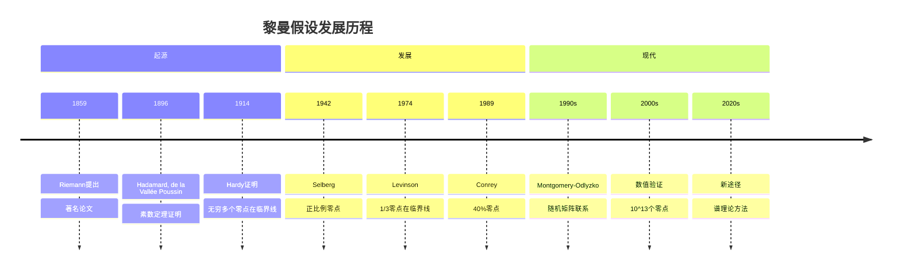
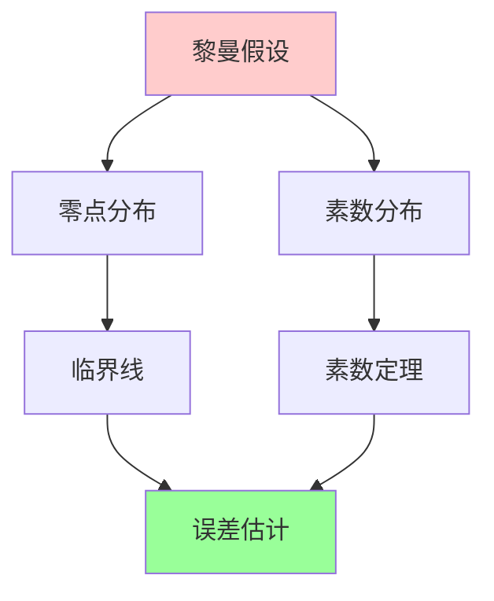
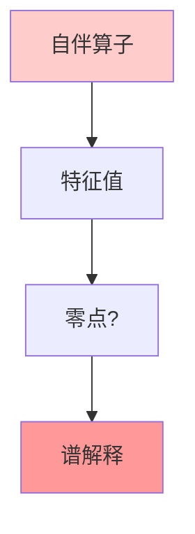
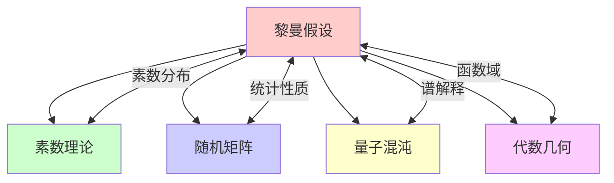

msc_primary: "00A99"
msc_secondary: ['00-XX']
---

# 黎曼假设相关研究

## 前沿问题陈述

### 1.1 核心问题

**黎曼假设**（Riemann Hypothesis, RH）是关于黎曼ζ函数零点分布的猜想，由Bernhard Riemann在1859年提出。它是数学中最著名的未解决问题之一，也是千禧年大奖问题之一。

**核心问题**：

1. **黎曼假设本身**：ζ函数的所有非平凡零点是否都具有实部1/2？

2. **随机矩阵联系**：零点分布与随机矩阵特征值的联系是什么？

3. **函数域类比**：函数域上的类比（Weil猜想）已证明，能否启发数域证明？

### 1.2 核心陈述

**黎曼假设**：黎曼ζ函数的所有非平凡零点都位于临界线Re(s) = 1/2上。

**等价表述**：素数分布的误差项为O(x^{1/2+epsilon})。

---

## 历史发展脉络

### 2.1 时间线

### 2.2 关键突破

| 年份 | 人物 | 突破 |
|-----|------|------|
| 1859 | Riemann | 猜想提出 |
| 1896 | Hadamard-Poussin | 素数定理 |
| 1914 | Hardy | 无穷多零点在1/2线 |
| 1974 | Levinson | 正比例结果 |
| 1990s | Montgomery | 随机矩阵联系 |
| 2004 | 数值验证 | 10^13个零点 |

---

## 与L3理论的联系

### 3.1 零点与素数

### 3.2 依赖的L3理论

| L3理论 | 在RH研究中的应用 | 关键结果 |
|-------|---------------|---------|
| 复分析 | ζ函数理论 | 解析延拓 |
| 调和分析 | Weil显式公式 | 对偶性 |
| 谱理论 | Hilbert-Pólya | 算子联系 |
| 随机矩阵 | 统计分布 | Montgomery-Odlyzko |
| 代数几何 | 函数域类比 | Weil证明 |

---

## 当前研究进展

### 4.1 数值验证

**当前记录**：超过10^13个零点已被验证在临界线上。

**Odlyzko计算**：大规模数值计算支持RH。

### 4.2 理论进展

| 结果 | 年份 | 作者 |
|-----|------|------|
| Hardy定理 | 1914 | Hardy |
| Levinson方法 | 1974 | Levinson |
| Conrey改进 | 1989 | Conrey |
| 最新比例 | 2011 | 多人 | ~40% |

### 4.3 当前活跃方向

| 方向 | 代表人物 | 核心进展 |
|-----|---------|---------|
| 随机矩阵 | Keating | 统计性质 |
| 谱方法 | Berry | 量子混沌 |
| 非交换几何 | Connes | 几何框架 |
| 代数几何 | 多人 | 函数域类比 |

---

## 开放问题与猜想

### 5.1 核心开放问题

#### 5.1.1 黎曼假设

**问题**：RH是否成立？

**状态**：千禧年问题，完全开放。

#### 5.1.2 Montgomery对偶性

**问题**：零点对关联是否与GUE随机矩阵一致？

### 5.2 研究前沿问题

| 问题 | 状态 | 重要性 | 可能突破方向 |
|-----|------|-------|------------|
| RH证明 | 开放 | 5星 | 新方法 |
| 零点比例 | 进展中 | 4星 | 筛法 |
| 简单零点 | 开放 | 4星 | 微分方程 |
| 谱解释 | 进展中 | 4星 | Hilbert-Pólya |

---

## 技术工具与方法

### 6.1 核心工具

| 工具 | 用途 | 关键文献 |
|-----|------|---------|
| 复分析 | ζ函数 | Titchmarsh |
| 围道积分 | 零点计数 | Levinson |
| mollifier | 正比例 | Conrey |
| 随机矩阵 | 统计 | Mehta |
| 谱理论 | 算子方法 | Connes |

### 6.2 现代方法

**Hilbert-Pólya猜想**：

---

## 与其他前沿领域的联系

### 7.1 交叉网络

---

## 学习资源

### 8.1 经典文献

1. **Riemann, B.** (1859). On the Number of Primes Less Than a Given Magnitude.
2. **Titchmarsh, E. C.** (1986). The Theory of the Riemann Zeta-Function.
3. **Edwards, H. M.** (1974). Riemann's Zeta Function.
4. **Ivic, A.** (2003). The Riemann Zeta-Function.

### 8.2 现代综述

- Conrey: The Riemann Hypothesis
- Borwein et al.: The Riemann Hypothesis: A Resource
- Bombieri: The Riemann Hypothesis

---

## 总结

黎曼假设是数学中最著名、最具挑战性的问题。从Riemann的原始论文到现代的随机矩阵联系，这一领域经历了深刻的发展。

虽然证明仍然遥不可及，但研究过程中发展的技术已经深刻影响了数论、分析和物理。黎曼假设的解决将是人类数学智慧的巅峰成就。

---

*文档版本：1.0*
*创建日期：2026年4月*
*层次级别：L4-Frontier*
*领域分类：数论前沿*
