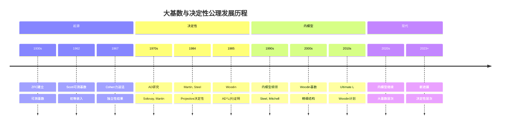
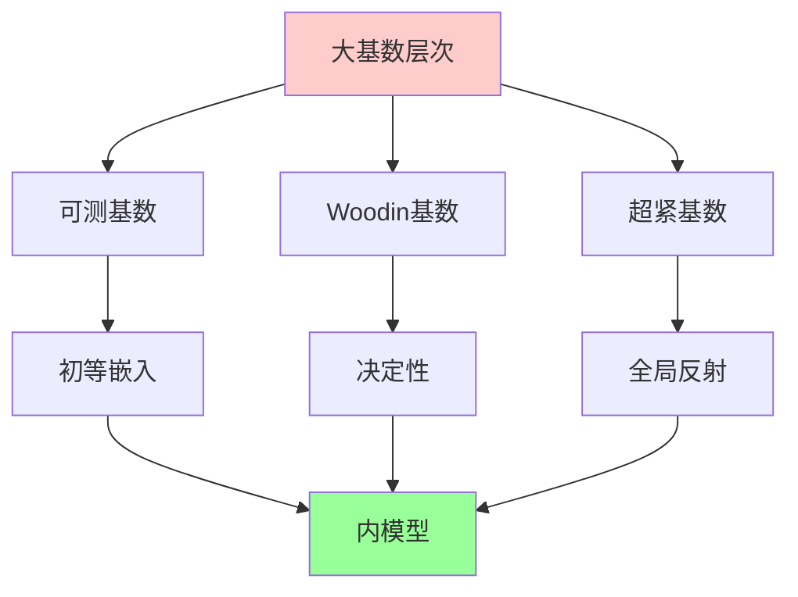
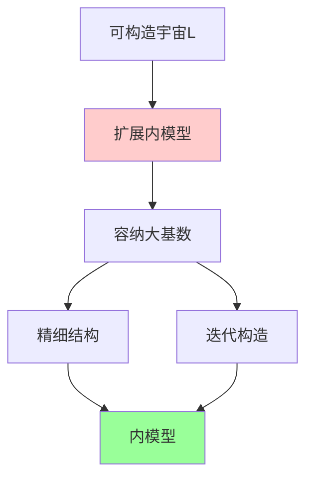
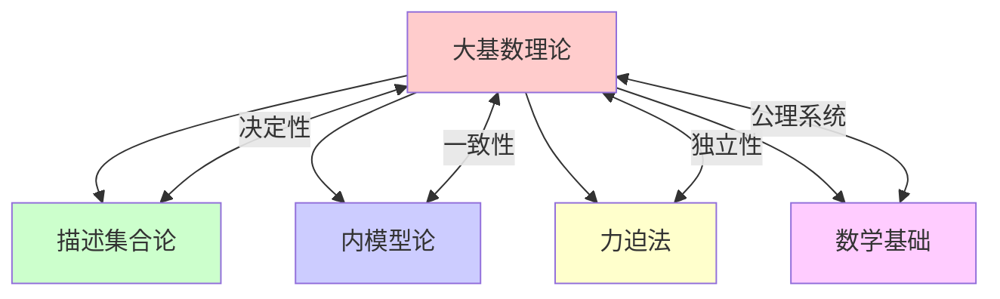

# 大基数与决定性公理

## 前沿问题陈述

### 1.1 核心问题

**大基数公理**和**决定性公理**是集合论中关于无穷层次的深刻假设。它们扩展了ZFC公理系统，为证明独立性结果提供了新的工具，也是理解数学宇宙结构的关键。

**核心问题**：

1. **内模型纲领**：如何为越来越大的基数构造内模型？

2. **决定性公理的一致性**：AD^L(R)是否在ZFC+大基数下成立？

3. **连续统假设**：大基数能否决定连续统的基数？

### 1.2 核心公理

**大基数层次**：

- 不可及基数
- 可测基数
- 强基数
- Woodin基数
- 超紧基数
- 巨大基数

**决定性公理（AD）**：每个实数集的无限博弈都有必胜策略。

---

## 历史发展脉络

### 2.1 时间线

### 2.2 关键突破

| 年份 | 人物 | 突破 |
|-----|------|------|
| 1961 | Scott | 可测基数与可构造性 |
| 1970 | Solovay | AD的正则性结果 |
| 1984 | Martin-Steel | PD从大基数 |
| 1985 | Woodin | AD^L(R)证明 |
| 1994 | Steel | 内模型理论 |
| 2010 | Woodin | Ultimate L猜想 |

---

## 与L3理论的联系

### 3.1 层次结构

### 3.2 依赖的L3理论

| L3理论 | 在大基数理论中的应用 | 关键结果 |
|-------|-------------------|---------|
| 公理集合论 | 基础框架 | ZFC |
| 力迫法 | 独立性 | Cohen |
| 描述集合论 | 决定性应用 | 正则性 |
| 内模型论 | 一致性 | 精细结构 |
| 大基数理论 | 强度测量 | 内模型纲领 |

---

## 当前研究进展

### 4.1 内模型纲领

**核心问题**：为所有大基数构造内模型。

**进展**：

- Woodin基数：已解决
- 超紧基数：部分进展
- 巨大基数：开放

### 4.2 决定性层次

**Martin-Steel定理**：从Woodin基数可以推出投影决定性（PD）。

**Woodin定理**：在ZFC+Woodin基数下，AD^L(R)成立。

### 4.3 当前活跃方向

| 方向 | 代表人物 | 核心进展 |
|-----|---------|---------|
| 内模型 | Sargsyan, Steel | 新内模型 |
| Ultimate L | Woodin | 计划推进 |
| 决定性 | Trang | 更强形式 |
| 选择公理 | 多人 | 无选择情形 |

---

## 开放问题与猜想

### 5.1 核心开放问题

#### 5.1.1 超紧内模型

**问题**：能否构造超紧基数的内模型？

**状态**：这是内模型纲领中的核心问题。

#### 5.1.2 CH的解决

**问题**：大基数能否决定连续统假设？

**Woodin的观点**：Ultimate L可能蕴含CH。

### 5.2 研究前沿问题

| 问题 | 状态 | 重要性 | 可能突破方向 |
|-----|------|-------|------------|
| 超紧内模型 | 进展中 | 5星 | 精细结构 |
| Ultimate L | 进展中 | 5星 | 公理系统 |
| CH确定性 | 开放 | 5星 | 内模型 |
| 无穷组合 | 活跃 | 4星 | 极值组合 |

---

## 技术工具与方法

### 6.1 核心工具

| 工具 | 用途 | 关键文献 |
|-----|------|---------|
| 初等嵌入 | 大基数刻画 | Scott |
| 精细结构 | 内模型构造 | Jensen, Steel |
| 迭代超幂 | 嵌入构造 | Kunen |
| 力迫法 | 独立性 | Cohen |
| 描述集合论 | 决定性应用 | Moschovakis |

### 6.2 现代方法

**内模型构造**：

---

## 与其他前沿领域的联系

### 7.1 交叉网络

---

## 学习资源

### 8.1 经典文献

1. **Kanamori, A.** (2003). The Higher Infinite.
2. **Jech, T.** (2003). Set Theory.
3. **Woodin, W. H.** (1999). The Axiom of Determinacy.
4. **Steel, J. R.** (1996). The Core Model Induction.

### 8.2 现代综述

- Sargsyan: On the iterability problem
- Woodin: The Continuum Hypothesis
- Koellner-Woodin: Large Cardinals from Determinacy

---

## 总结

大基数与决定性公理代表了集合论研究的最前沿。从Scott的可测基数到Martin-Steel的投影决定性，再到Woodin的内模型纲领，这一领域不断取得突破。

虽然许多核心问题（如超紧内模型、CH的最终决定）仍然开放，但大基数理论已经成为现代集合论的核心，深刻影响着我们对数学宇宙的理解。

---

*文档版本：1.0*
*创建日期：2026年4月*
*层次级别：L4-Frontier*
*领域分类：逻辑基础前沿*
