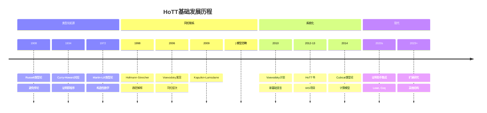
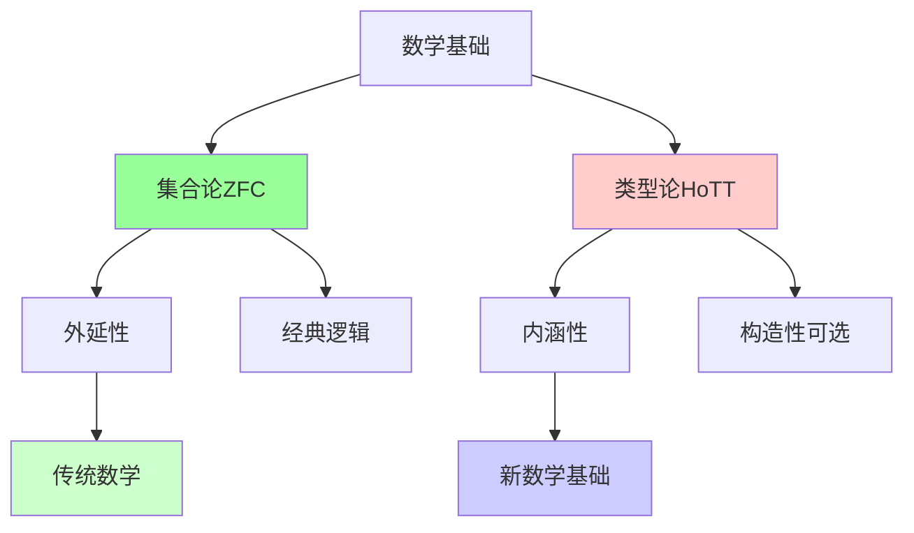
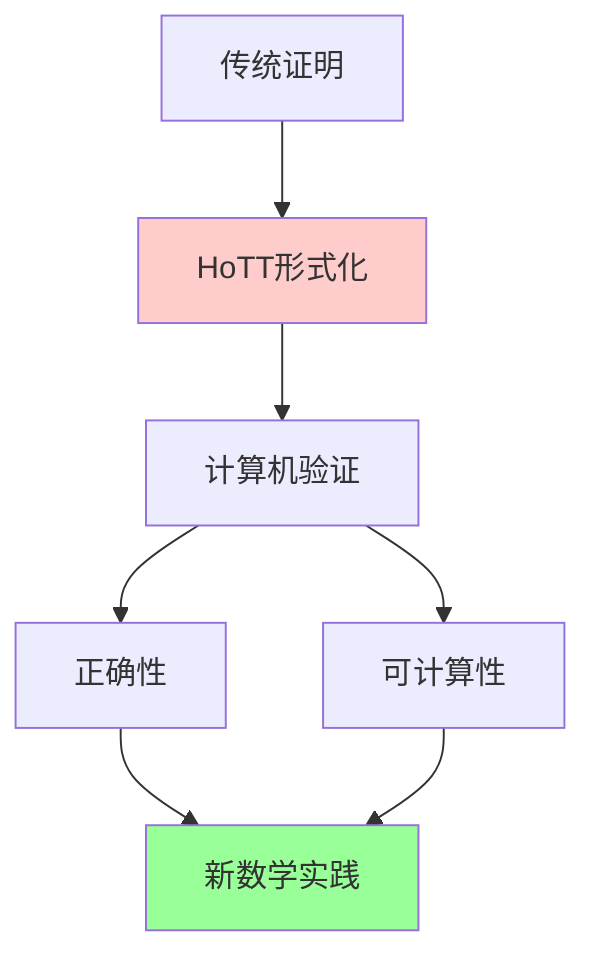
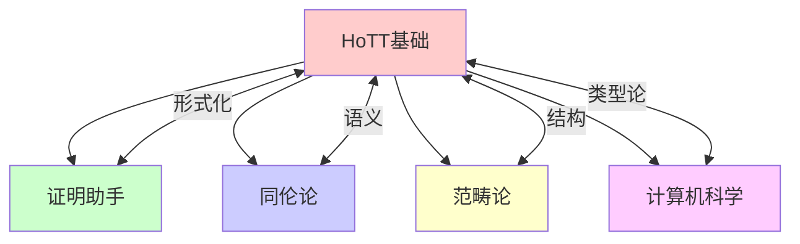

msc_primary: "00A99"
msc_secondary: ['00-00']
---

# 同伦类型论与数学基础

## 前沿问题陈述

### 1.1 核心问题

**同伦类型论**（Homotopy Type Theory, HoTT）作为数学基础的新范式，由Vladimir Voevodsky提出。它试图用类型论和同伦论的结合来重构数学的基础，解决集合论基础中的一些根本性问题。

**核心问题**：

1. **新基础的可行性**：HoTT能否成为比ZFC更合适的数学基础？

2. **计算内容**：Univalence公理是否具有计算解释？

3. **集合论的替代**：HoTT能否完全替代集合论作为数学基础？

### 1.2 核心概念

**单值基础（Univalent Foundations）**：

- 基于Martin-Löf类型论
- Univalence公理：等价即相等
- 高阶归纳类型

**与集合论的比较**：

| 特征 | ZFC | HoTT |
|-----|-----|------|
| 基本对象 | 集合 | 类型/空间 |
| 相等 | 命题 | 结构（道路） |
| 构造性 | 否 | 是（可选） |
| 高阶结构 | 外部 | 内部 |

---

## 历史发展脉络

### 2.1 时间线

### 2.2 关键突破

| 年份 | 人物 | 突破 |
|-----|------|------|
| 1972 | Martin-Löf | 构造类型论 |
| 1998 | Hofmann-Streicher | 群胚模型 |
| 2006 | Voevodsky | 同伦类型论 |
| 2010 | Voevodsky | 单值基础计划 |
| 2013 | HoTT Book | 系统阐述 |
| 2014 | CCHM | Cubical类型论 |

---

## 与L3理论的联系

### 3.1 基础比较

### 3.2 依赖的L3理论

| L3理论 | 在HoTT基础中的应用 | 关键结果 |
|-------|------------------|---------|
| 证明论 | 类型论 | Martin-Löf |
| 同伦论 | 语义解释 | Quillen模型 |
| 范畴论 | 结构数学 | 局部笛卡尔闭 |
| 计算理论 | 证明即程序 | Curry-Howard |
| 集合论 | 比较基准 | ZFC |

---

## 当前研究进展

### 4.1 证明助手集成

**主要系统**：

- **Coq/HoTT Library**: 经典HoTT
- **Cubical Agda**: 计算型HoTT
- **Lean 4**: 正在集成

### 4.2 与经典数学的关系

| 数学分支 | HoTT中的发展 | 状态 |
|---------|------------|------|
| 代数 | 群、环、模 | 成熟 |
| 分析 | 实数、度量空间 | 发展中 |
| 拓扑 | 同伦论 | 原生支持 |
| 集合论 | h-sets | 嵌入 |

### 4.3 当前活跃方向

| 方向 | 代表人物 | 核心进展 |
|-----|---------|---------|
| 计算解释 | Cohen, Huber | Cubical类型论 |
| 分析学基础 | Buchholtz | 实数构造 |
| 集合论语义 | Kapulkin | 模型理论 |
| 教学应用 | 多人 | 教育改革 |

---

## 开放问题与猜想

### 5.1 核心开放问题

#### 5.1.1 典范模型

**问题**：是否存在HoTT的典范集合模型？

**意义**：关系到与经典数学的兼容性。

#### 5.1.2 经典数学重构

**问题**：经典分析学能否完全在HoTT中重构？

### 5.2 研究前沿问题

| 问题 | 状态 | 重要性 | 可能突破方向 |
|-----|------|-------|------------|
| 典范模型 | 开放 | 5星 | 范畴语义 |
| 分析学重构 | 进展中 | 4星 | 构造性分析 |
| 教育应用 | 活跃 | 3星 | 课程设计 |
| 证明自动化 | 进展中 | 4星 | AI辅助 |

---

## 技术工具与方法

### 6.1 核心工具

| 工具 | 用途 | 关键文献 |
|-----|------|---------|
| 依赖类型 | 基础语言 | Martin-Löf |
| 等同类型 | 道路空间 | Hofmann-Streicher |
| Univalence | 结构相等 | Voevodsky |
| HIT | 高阶构造 | Lumsdaine |
| Cubical | 计算模型 | CCHM |

### 6.2 现代方法

**数学形式化**：

---

## 与其他前沿领域的联系

### 7.1 交叉网络

---

## 学习资源

### 8.1 经典文献

1. **The Univalent Foundations Program** (2013). Homotopy Type Theory.
2. **Voevodsky, V.** (2010). The Equivalence Axiom.
3. **Martin-Löf, P.** (1984). Intuitionistic Type Theory.
4. **Awodey, S.** (2012). Type Theory and Homotopy.

### 8.2 现代综述

- Angiuli et al.: Syntax and models of Cartesian cubical type theory
- Riehl: Homotopy type theory: A succinct introduction
- Grayson: An introduction to univalent foundations

---

## 总结

同伦类型论代表了数学基础的重要范式转变。它不仅是一种新的数学语言，更是对数学本质的重新思考。从Voevodsky的Vision到HoTT书的系统阐述，再到证明助手的实际应用，HoTT正在成为数学实践的重要工具。

虽然许多理论问题仍然开放，但HoTT已经在改变我们理解和实践数学的方式，特别是在形式化证明和计算机辅助数学方面。

---

*文档版本：1.0*
*创建日期：2026年4月*
*层次级别：L4-Frontier*
*领域分类：逻辑基础前沿*
