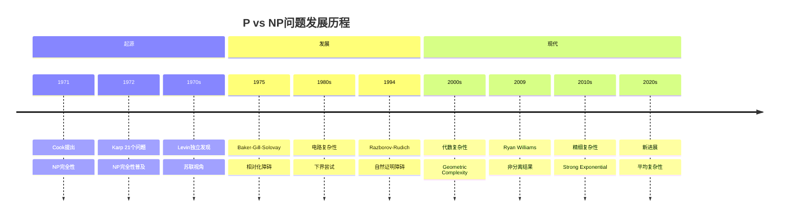
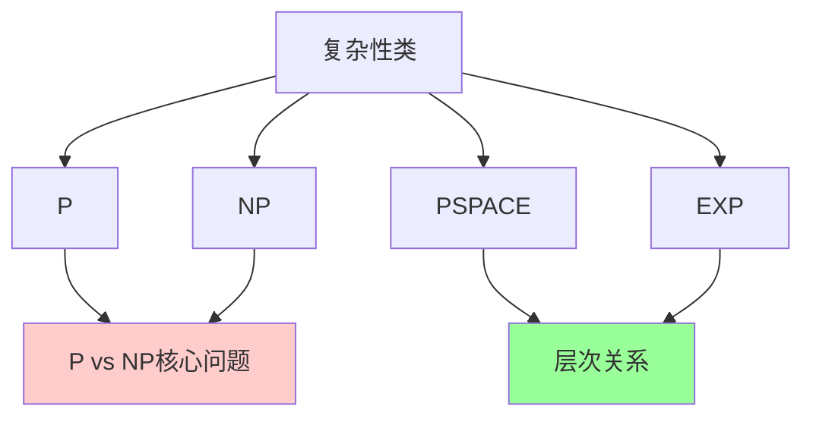
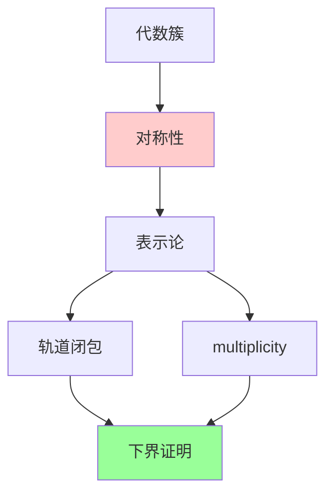
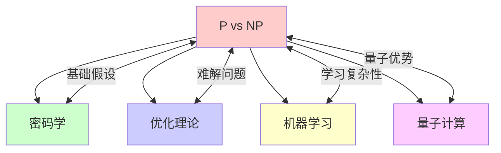

# P vs NP问题

## 前沿问题陈述

### 1.1 核心问题

**P vs NP问题**是计算机科学和数学中最著名的未解决问题之一，也是七个千禧年大奖问题之一。它询问：是否每个能在多项式时间内验证解的问题也能在多项式时间内找到解？

**核心问题**：

1. **P = NP?**：证明P=NP或P≠NP。

2. **电路复杂性下界**：能否证明NP问题的电路复杂性的下界？

3. **自然证明障碍**：如何克服Razborov-Rudich的自然证明障碍？

### 1.2 形式化定义

**P类**：能被确定性图灵机在多项式时间内解决的问题。

**NP类**：能被非确定性图灵机在多项式时间内解决的问题（或等价地，解能在多项式时间内验证的问题）。

**NP完全问题**：NP中最难的问题，如SAT、3-SAT、旅行商问题等。

---

## 历史发展脉络

### 2.1 时间线

### 2.2 关键突破

| 年份 | 人物 | 突破 |
|-----|------|------|
| 1971 | Cook | NP完全性理论 |
| 1972 | Karp | 21个NP完全问题 |
| 1975 | BGS | 相对化障碍 |
| 1994 | Razborov-Rudich | 自然证明障碍 |
| 2009 | Williams | NEXP vs ACC⁰ |
| 2015 | 多人 | 精细复杂性 |

---

## 与L3理论的联系

### 3.1 复杂性层次

### 3.2 依赖的L3理论

| L3理论 | 在P vs NP中的应用 | 关键结果 |
|-------|-----------------|---------|
| 计算理论 | 图灵机 | Turing |
| 复杂性理论 | 时间/空间 | Hartmanis-Stearns |
| 逻辑学 | 描述复杂性 | Fagin |
| 组合数学 | 电路下界 | Shannon |
| 信息论 | 熵方法 | Kolmogorov |

---

## 当前研究进展

### 4.1 障碍结果

#### 4.1.1 相对化障碍

**Baker-Gill-Solovay定理**：存在谕示A,B使得P^A=NP^A但P^B≠NP^B。

这意味着任何相对化证明技术都不能解决P vs NP。

#### 4.1.2 自然证明障碍

**Razborov-Rudich定理**：如果强伪随机生成器存在，则不存在"自然"的电路下界证明。

### 4.2 部分进展

| 结果 | 年份 | 作者 |
|-----|------|------|
| PARITY ∉ AC⁰ | 1984 | Furst-Saxe-Sipser |
| NEXP vs ACC⁰ | 2011 | Williams |
| 精细下界 | 2015s | 多人 |

### 4.3 当前活跃方向

| 方向 | 代表人物 | 核心进展 |
|-----|---------|---------|
| Geometric Complexity | Mulmuley-Sohoni | 代数几何方法 |
| 精细复杂性 | Williams | 更强下界 |
| 平均复杂性 | Bogdanov-Trevisan | 平均情形 |
| 量子复杂性 | 多人 | BQP vs NP |

---

## 开放问题与猜想

### 5.1 核心开放问题

#### 5.1.1 P vs NP

**问题**：P = NP 还是 P ≠ NP？

**共识**：绝大多数数学家相信 P ≠ NP。

**证据**：

- 尝试证明P=NP都失败了
- 大量NP完全问题没有已知多项式算法
- 密码学基于P≠NP的假设

#### 5.1.2 电路下界

**问题**：能否证明NP问题的电路复杂性下界？

### 5.2 研究前沿问题

| 问题 | 状态 | 重要性 | 可能突破方向 |
|-----|------|-------|------------|
| P vs NP | 开放 | 5星 | 新方法 |
| 电路下界 | 进展中 | 5星 | 非自然证明 |
| GCT | 进展中 | 4星 | 代数几何 |
| 量子优势 | 活跃 | 4星 | 量子计算 |

---

## 技术工具与方法

### 6.1 核心工具

| 工具 | 用途 | 关键文献 |
|-----|------|---------|
| 对角化 | 分离结果 | Turing |
| 电路复杂性 | 下界尝试 | Shannon |
| 概率方法 | 随机算法 | Rabin |
| 代数复杂性 | 多项式计算 | Valiant |
| GCT | 几何方法 | Mulmuley-Sohoni |

### 6.2 现代方法

**Geometric Complexity Theory**：

---

## 与其他前沿领域的联系

### 7.1 交叉网络

---

## 学习资源

### 8.1 经典文献

1. **Cook, S. A.** (1971). The Complexity of Theorem-Proving Procedures.
2. **Karp, R. M.** (1972). Reducibility Among Combinatorial Problems.
3. **Garey, M. R., Johnson, D. S.** (1979). Computers and Intractability.
4. **Wigderson, A.** (2019). Mathematics and Computation.

### 8.2 现代综述

- Mulmuley-Sohoni: Geometric Complexity Theory
- Aaronson: P=?NP
- Fortnow: The Golden Ticket

---

## 总结

P vs NP问题是计算机科学和数学中最具挑战性的未解决问题。从Cook和Karp的开创性工作到Williams的部分下界结果，再到Mulmuley-Sohoni的几何复杂性理论，这一领域不断取得进展。

虽然核心问题仍然开放，但研究过程中发展的技术（如复杂性理论、密码学、电路复杂性）已经深刻影响了计算机科学。P vs NP的解决将带来理论计算机科学的范式转变。

---

*文档版本：1.0*
*创建日期：2026年4月*
*层次级别：L4-Frontier*
*领域分类：逻辑基础前沿*
