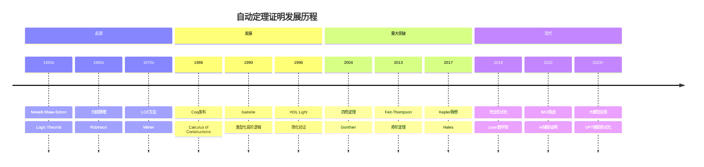
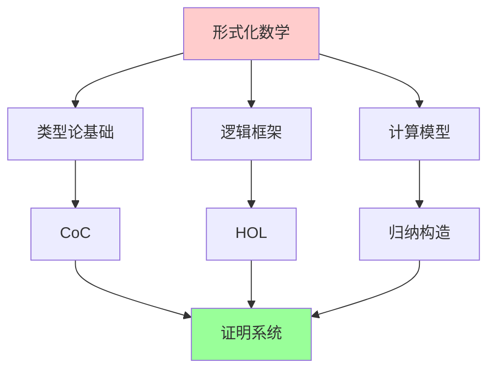
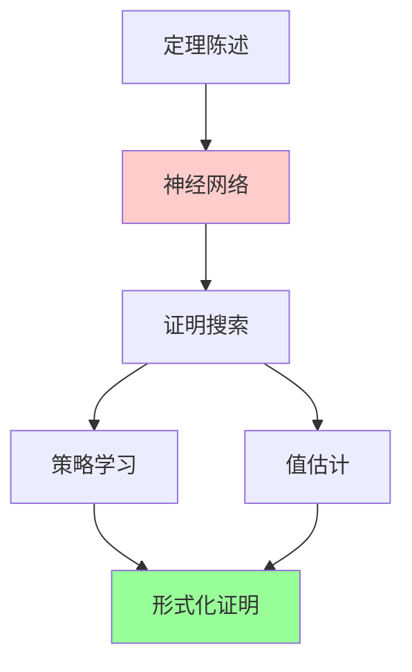
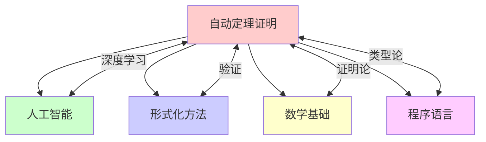

msc_primary: "00A99"
msc_secondary: ['00-XX']
---

# 自动定理证明与形式验证

## 前沿问题陈述

### 1.1 核心问题

**自动定理证明**（Automated Theorem Proving, ATP）和**形式验证**（Formal Verification）是计算机科学和数学交叉的前沿领域。它们使用严格的数学方法来验证数学证明和计算机系统的正确性。

**核心问题**：

1. **自动证明能力**：自动定理证明器能证明多复杂的数学定理？

2. **AI辅助证明**：机器学习如何辅助数学发现？

3. **大规模形式化**：如何形式化现代数学的主体？

### 1.2 核心概念

**证明助手**：交互式软件工具，帮助用户构造形式化证明。

**主要系统**：
- Coq
- Lean
- Isabelle/HOL
- Agda
- HOL Light

---

## 历史发展脉络

### 2.1 时间线

### 2.2 关键突破

| 年份 | 人物 | 突破 |
|-----|------|------|
| 1956 | Newell等 | Logic Theorist |
| 1986 | Coquand-Huet | Coq系统 |
| 2004 | Gonthier | 四色定理证明 |
| 2012 | Gonthier | Feit-Thompson |
| 2017 | Hales | Kepler猜想 |
| 2020 | mathlib | Lean数学库 |

---

## 与L3理论的联系

### 3.1 形式化体系

### 3.2 依赖的L3理论

| L3理论 | 在ATP中的应用 | 关键结果 |
|-------|-------------|---------|
| 数理逻辑 | 基础框架 | Gentzen |
| 类型论 | 证明表示 | Martin-Löf |
| λ演算 | 计算模型 | Church |
| 自动推理 | 搜索算法 | Robinson |
| 形式语言 | 语法分析 | Chomsky |

---

## 当前研究进展

### 4.1 重大形式化成果

| 定理 | 年份 | 系统 | 负责人 |
|-----|------|------|--------|
| 四色定理 | 2004 | Coq | Gonthier |
| 奇阶定理 | 2012 | Coq | Gonthier |
| Kepler猜想 | 2017 | HOL Light/Flyspeck | Hales |
| p进Langlands | 2020 | Lean | mathlib |

### 4.2 AI辅助证明

**机器学习应用**：
- 猜想生成
- 证明搜索
- 自动形式化

**近期突破**：
- GPT在数学中的应用
- AlphaGeometry (IMO金牌水平)
- LeanDojo (神经网络证明器)

### 4.3 当前活跃方向

| 方向 | 代表人物 | 核心进展 |
|-----|---------|---------|
| 大模型 | OpenAI, DeepMind | GPT-4, AlphaGeometry |
| 数学库 | mathlib社区 | 现代数学形式化 |
| 自动推理 | 多人 | 神经定理证明 |
| 形式化方法 | 工业界 | 硬件验证 |

---

## 开放问题与猜想

### 5.1 核心开放问题

#### 5.1.1 自动发现能力

**问题**：AI能否自动发现新的数学定理？

**状态**：部分进展，完全自动发现仍开放。

#### 5.1.2 数学全体形式化

**问题**：能否形式化现代数学的全部？

**进展**：mathlib正在推进。

### 5.2 研究前沿问题

| 问题 | 状态 | 重要性 | 可能突破方向 |
|-----|------|-------|------------|
| 自动猜想 | 进展中 | 5星 | 深度学习 |
| 自然语言理解 | 活跃 | 4星 | LLM |
| 大规模形式化 | 进展中 | 5星 | 众包 |
| 证明合成 | 活跃 | 4星 | 强化学习 |

---

## 技术工具与方法

### 6.1 核心工具

| 工具 | 用途 | 关键文献 |
|-----|------|---------|
| 归结 | 自动推理 | Robinson |
| 类型检查 | 证明验证 | Martin-Löf |
| 归纳构造 | 证明表示 | Coquand |
| 反射 | 元编程 | Harrison |
| 神经网络 | 证明搜索 | Bansal |

### 6.2 现代方法

**神经定理证明**：

---

## 与其他前沿领域的联系

### 7.1 交叉网络

---

## 学习资源

### 8.1 经典文献

1. **Harrison, J.** (2009). Handbook of Practical Logic and Automated Reasoning.
2. **Bertot, Y., Castéran, P.** (2004). Interactive Theorem Proving and Program Development.
3. **Nipkow, T., Klein, G.** (2014). Concrete Semantics with Isabelle/HOL.
4. **Avigad, J., Harrison, J.** (2014). Formally Verified Mathematics.

### 8.2 现代综述

- Rabe: Automated theorem proving
- Aygun et al.: Learned provability
- Polu-Sutskever: Generative language modeling for theorem proving

---

## 总结

自动定理证明和形式验证正在改变数学和计算机科学的实践方式。从Gonthier的四色定理证明到Lean数学库的大规模形式化，再到AlphaGeometry的IMO金牌表现，这一领域不断取得突破。

随着大语言模型和深度学习技术的发展，AI辅助数学发现正成为新的研究热点。虽然完全自动化的数学发现仍然是开放的挑战，但人机协作的数学研究模式正在形成。

---

*文档版本：1.0*
*创建日期：2026年4月*
*层次级别：L4-Frontier*
*领域分类：逻辑基础前沿*
