# L4 前沿研究层次 (L4-Frontier)

## 概述

**L4-Frontier** 是数学知识层次体系的最高层级，代表当代数学的**前沿研究领域**、**未解决问题**以及**未来发展方向**。在这一层次，数学不再是已知的知识体系，而是正在创造中的科学前沿。

---

## 一、定义与核心特征

### 1.1 定义

L4 前沿研究层次是指处于数学知识边界、正在积极探索和发展的研究领域。这一层次的特点是**开放性**、**不确定性**和**创造性**——它面对的是尚未解决的问题，追求的是新的数学真理。

### 1.2 核心特征

#### 1.2.1 开放性

L4 层次的问题通常没有确定的答案：

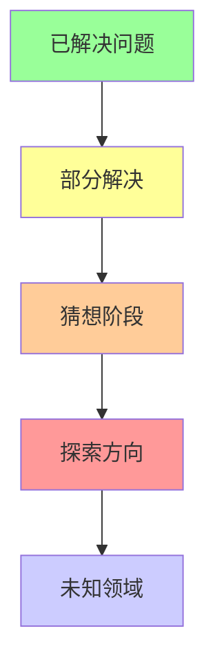

#### 1.2.2 交叉性

现代数学前沿往往是多学科交叉的产物：

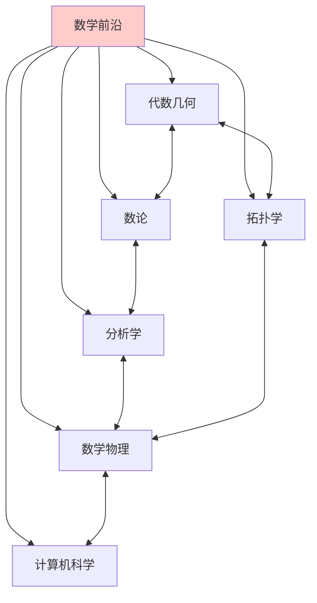

#### 1.2.3 研究性

L4 层次强调**研究过程**而非既定结果：

- 提出猜想
- 探索方法
- 部分进展
- 新问题的涌现

---

## 二、当代数学前沿领域

### 2.1 代数几何前沿

#### 2.1.1 核心问题

| 问题 | 状态 | 关键人物 |
|-----|------|---------|
| Hodge 猜想 | 未解决 | Hodge, Deligne |
| Tate 猜想 | 部分进展 | Tate, Faltings |
| 标准猜想 | 未解决 | Grothendieck |
| motive 理论 | 发展中 | Grothendieck, Voevodsky |

#### 2.1.2 完美oid空间

**完美oid空间（Perfectoid Spaces）** 是 Peter Scholze 在 2011 年引入的革新性理论：

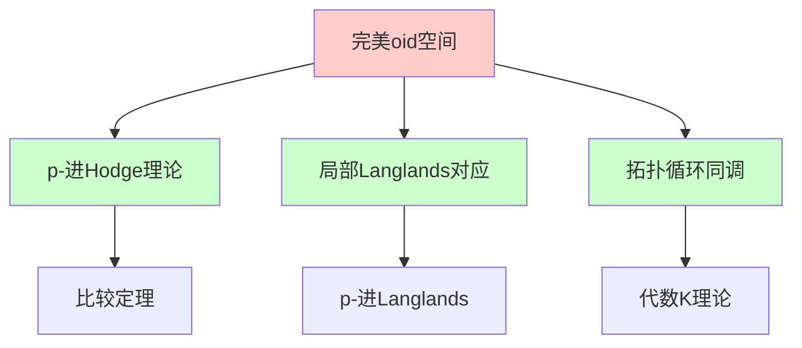

**核心思想**：在特征 p 和特征 0 之间建立桥梁，通过"倾斜（tilting）"函子实现不同特征域的几何统一。

### 2.2 数论前沿

#### 2.2.1 Langlands 纲领

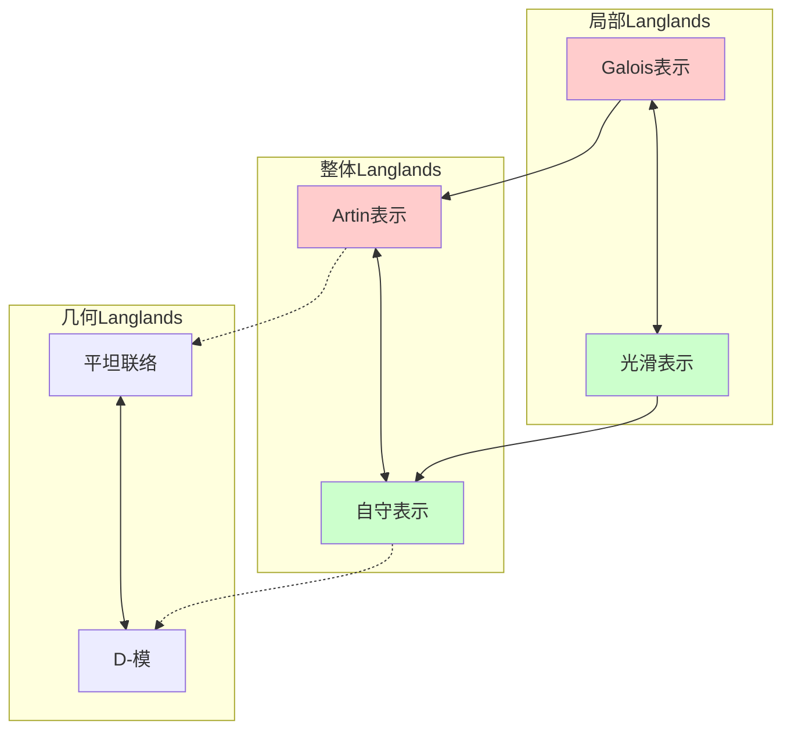

#### 2.2.2 Birch 和 Swinnerton-Dyer 猜想

**猜想**：椭圆曲线的有理点群的秩等于其 L-函数在 s=1 处的零点阶数。

**进展状态**：

- rank 0 和 rank 1 情形：Gross-Zagier, Kolyvagin 证明
- 一般情形：未解决，百万美元问题之一

### 2.3 拓扑学前沿

#### 2.3.1 几何群论

```mermaid
graph TD
    A[几何群论] --> B[双曲群]
    A --> C[CAT(0)空间]
    A --> D[映射类群]

    B --> B1[字问题]
    C --> C1[非正曲率]
    D --> D1[曲面同胚]

    A --> E[应用]
    E --> E1[低维拓扑]
    E --> E2[算法群论]

    style A fill:#ffcccc
```

#### 2.3.2 Floer 同调

**Floer 同调** 是连接辛几何、低维拓扑和规范理论的强大工具：

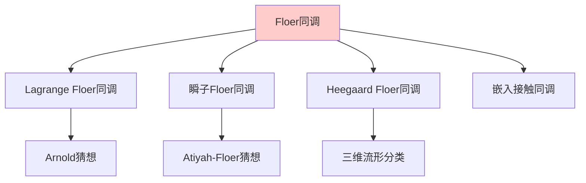

### 2.4 分析学前沿

#### 2.4.1 自由概率论

**自由概率论** 由 Dan Voiculescu 发展，是随机矩阵理论和算子代数的交叉：

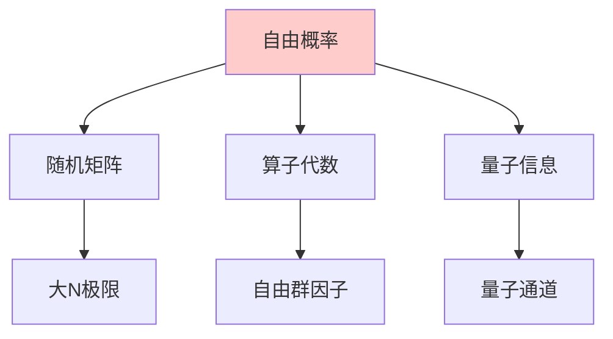

#### 2.4.2 非线性偏微分方程

| 问题 | 重要性 | 状态 |
|-----|--------|------|
| Navier-Stokes 方程 | 流体动力学基础 | 百万美元问题 |
| Yang-Mills 方程 | 规范场论 | 百万美元问题 |
| 爱因斯坦方程 | 广义相对论 | 活跃研究 |

### 2.5 数学物理前沿

#### 2.5.1 量子场论的数学基础

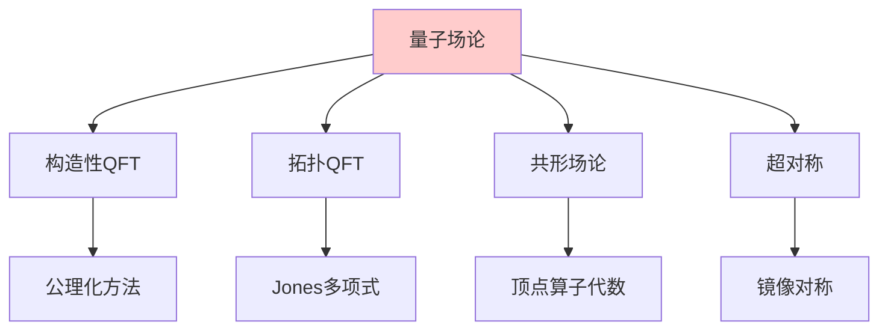

#### 2.5.2 弦理论数学

**镜像对称**（Mirror Symmetry）：

- 两个 Calabi-Yau 流形之间的对偶
- 复几何 ↔ 辛几何
- 枚举几何的革命性应用

---

## 三、未解决的重大问题

### 3.1 千禧年大奖问题

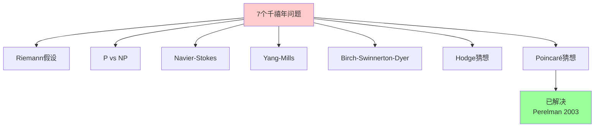

### 3.2 问题详述

#### 3.2.1 Riemann 假设

**猜想**：Riemann ζ 函数的所有非平凡零点实部都等于 1/2。

**意义**：

- 素数分布的深层规律
- 与随机矩阵理论的神秘联系
- 数以千计的数学命题以其为前提

**进展**：

- 10¹³ 个零点验证通过
- 函数域类比：Weil 证明
- 随机矩阵理论的联系

#### 3.2.2 P vs NP

**问题**：P = NP 是否成立？

**意义**：

- 计算复杂性的核心问题
- 密码学的基础
- 算法理论的终极问题

**视角**：

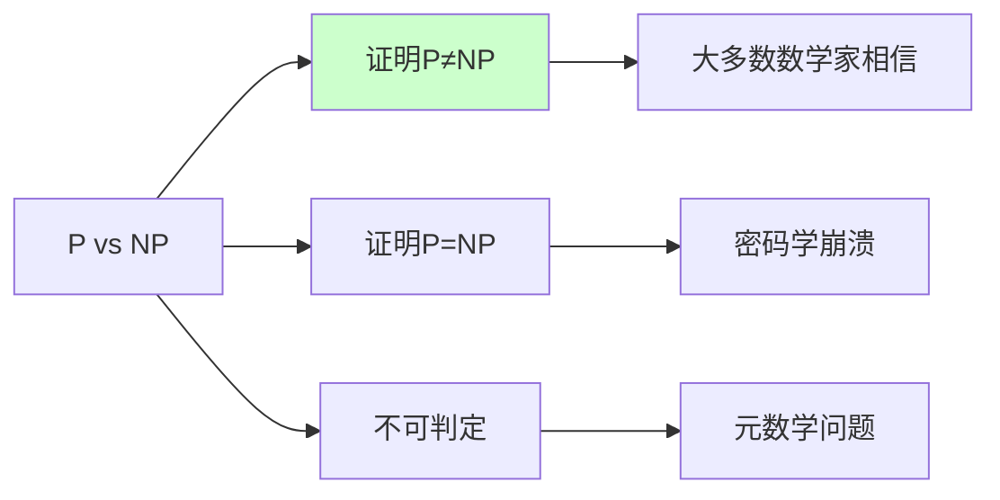

### 3.3 其他重大猜想

| 猜想 | 领域 | 提出者 | 重要性 |
|-----|------|--------|--------|
| Goldbach 猜想 | 数论 | Goldbach, 1742 | 素数加法结构 |
| Collatz 猜想 | 数论 | Collatz, 1937 | 简单规则复杂行为 |
| 哥德巴赫弱猜想 | 数论 | - | 三素数和 |
| Sato-Tate 猜想 | 数论 | Sato, Tate | L-函数分布 |

---

## 四、新兴研究方向

### 4.1 机器学习与数学

#### 4.1.1 AI 辅助数学发现

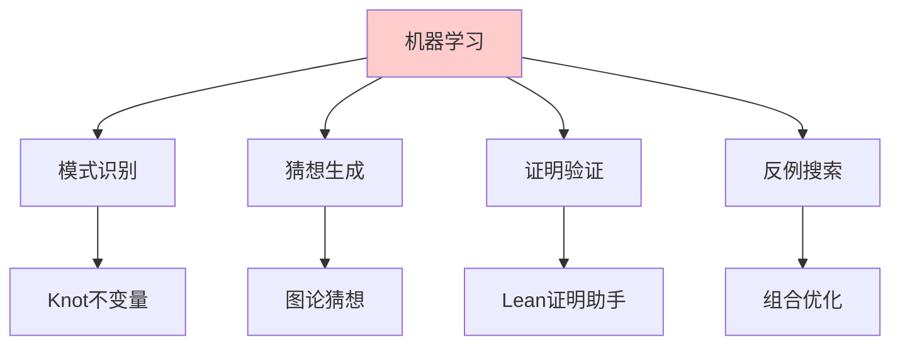

#### 4.1.2 深度学习的数学基础

- 神经网络的逼近理论
- 优化的几何结构
- 泛化的统计理论
- 动力学系统视角

### 4.2 导出与无穷范畴

#### 4.2.1 导出代数几何

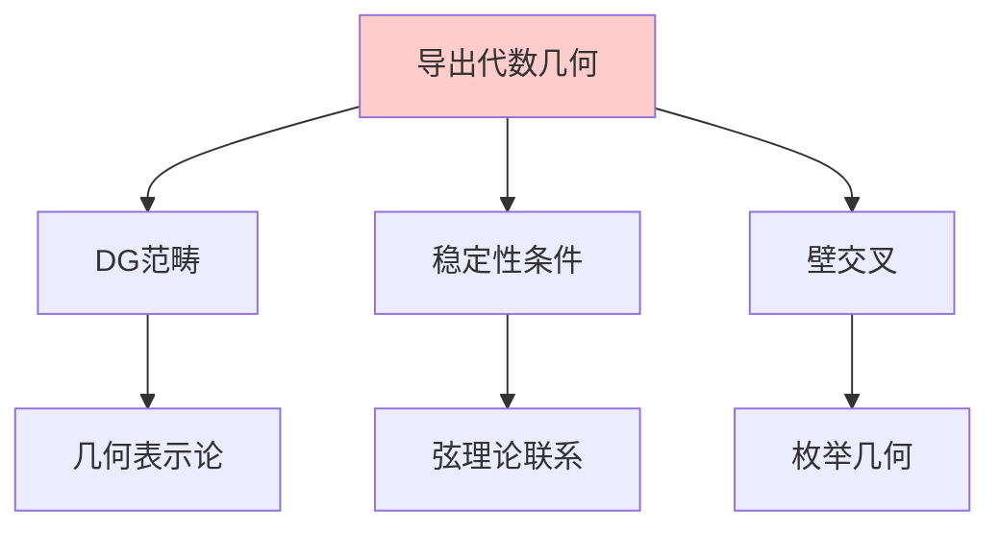

#### 4.2.2 无穷范畴论

**∞-范畴** 提供了：

- 同伦论与范畴论的统一
- 导出函子的自然框架
- 高阶代数结构的语言

### 4.3 同伦类型论

#### 4.3.1 Univalent Foundations

Vladimir Voevodsky 提出的**同伦类型论（HoTT）**：

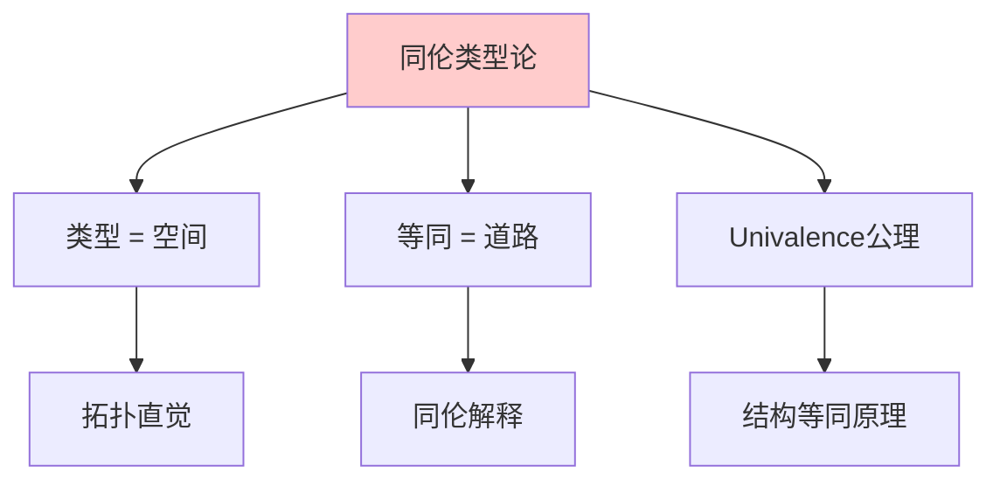

#### 4.3.2 计算意义

- 证明即程序（Curry-Howard 对应）
- 同论不变性的计算内容
- 新 foundations 的可能性

---

## 五、前沿研究的方法论

### 5.1 研究模式

#### 5.1.1 从例子到理论

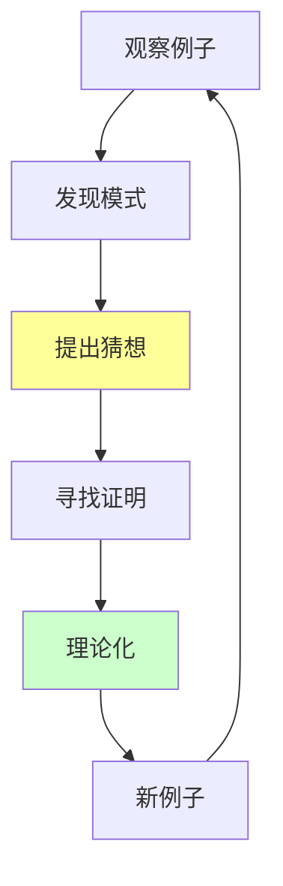

#### 5.1.2 类比与转移

| 源领域 | 目标领域 | 类比内容 |
|-------|---------|---------|
| 函数域 | 数域 | Weil 猜想 → Deligne 证明 |
| 拓扑弦 | 物理弦 | Gromov-Witten → 物理预言 |
| 有限群 | 李群 | 表示论方法 |
| 离散几何 | 连续几何 | 组合方法 |

### 5.2 合作模式

#### 5.2.1 大规模合作

**Polymath 项目**：

- 开放协作的数学研究
- 众包解决数学问题
- 在线协作的新模式

#### 5.2.2 人机协作

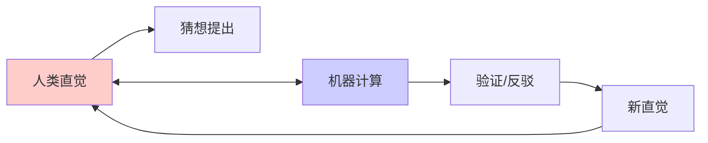

---

## 六、L4 与其他层次的关系

### 6.1 层次递进

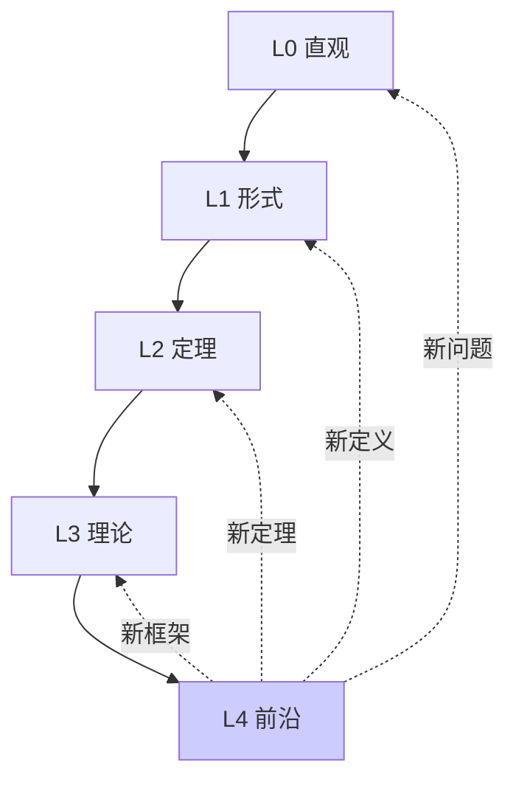

### 6.2 L4 的特殊性

| 特征 | L0-L3 | L4 |
|-----|-------|-----|
| 确定性 | 确定 | 不确定 |
| 答案 | 已知 | 未知 |
| 方法 | 标准化 | 探索性 |
| 结果 | 可预期 | 不可预期 |

---

## 七、如何接触 L4 层次

### 7.1 学习路径

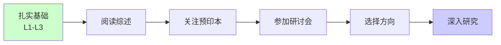

### 7.2 资源推荐

#### 7.2.1 预印本平台

- **arXiv.org**：数学论文预印本
- **MathOverflow**：研究级问答
- **nLab**：范畴论与相关领域

#### 7.2.2 重要会议

- ICM（国际数学家大会）
- 各领域顶级会议
- 暑期学校和研讨会

---

## 八、L4 层次的判断标准

### 8.1 内容特征

- **前沿性**：涉及当前研究热点
- **开放性**：问题尚未完全解决
- **交叉性**：跨学科特点明显
- **动态性**：内容持续更新

### 8.2 研究能力

**应具备的能力**：

- 阅读研究论文
- 提出研究问题
- 评估研究价值
- 跟踪领域进展

---

## 九、前沿展望

### 9.1 2020s 的研究趋势

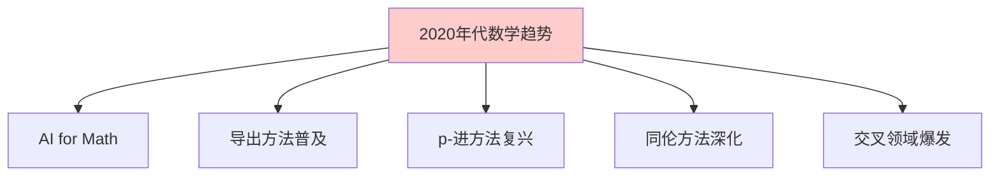

### 9.2 未来可能突破

| 领域 | 可能突破 | 意义 |
|-----|---------|------|
| 数论 | Langlands 对应完整证明 | 数学大一统 |
| 拓扑 | 四维 Poincaré 猜想 | 低维拓扑 |
| 分析 | Navier-Stokes 正则性 | 流体力学 |
| 计算 | P vs NP 解决 | 计算理论 |
| AI | 自动定理证明 | 数学研究 |

---

## 十、总结

L4 前沿研究层次代表数学的**活态**——它不断生长、不断突破边界。在这一层次：

- **未知**是常态
- **探索**是使命
- **创造**是价值
- **突破**是追求

数学前沿的研究者站在人类知识的边界，眺望未知的领域。正如希尔伯特在 1900 年巴黎国际数学家大会上所说："我们必须知道，我们必将知道。"（Wir müssen wissen, wir werden wissen.）

---

## 参考文献

1. Carlson, J., et al. (2006). The Millennium Prize Problems.
2. Gowers, T., et al. (2008). The Princeton Companion to Mathematics.
3. Scholze, P. (2012). Perfectoid Spaces.
4. Voevodsky, V., et al. (2013). Homotopy Type Theory.
5. 席南华. (2020). 基础数学的一些过去和现状.

---

*文档版本：1.0*
*创建日期：2026年4月*
*层次级别：L4-Frontier*
