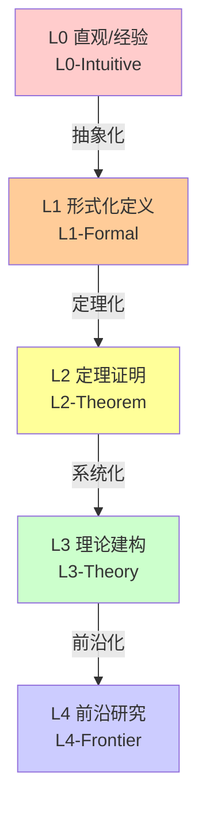
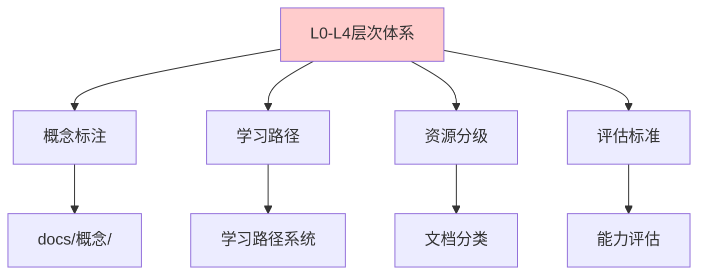

# FormalMath L0-L4 数学知识层次定义标准体系

## 体系概述

本目录包含 FormalMath 项目的**五层数学知识层次定义标准体系**，建立了从直观经验到前沿研究的完整知识框架。

---

## 文件清单

| 序号 | 文件名 | 层次 | 核心内容 | 估计字数 |
|-----|--------|------|---------|---------|
| 1 | `L0-直观经验层次.md` | L0 | 直觉认知、具体操作、经验归纳 | 5,452 |
| 2 | `L1-形式化定义层次.md` | L1 | 公理化、符号系统、严格定义 | 5,638 |
| 3 | `L2-定理证明层次.md` | L2 | 证明技巧、定理网络、逻辑推理 | 5,381 |
| 4 | `L3-理论建构层次.md` | L3 | 系统整合、统一框架、范畴论 | 5,856 |
| 5 | `L4-前沿研究层次.md` | L4 | 开放问题、研究方向、新兴领域 | 5,273 |
| 6 | `00-层次递进关系总图.md` | 总图 | 层次关系、依赖结构、标注规范 | 5,750 |

**总计：6 个文件，约 33,350 字**

---

## 层次体系结构



### 各层次定义

| 层次 | 定义 | 核心特征 | 典型内容 |
|-----|------|---------|---------|
| **L0** | 基于直觉、经验、具体实例的数学认知 | 无需严格定义，通过例子和直观理解 | 自然数计数、几何图形的直观认识 |
| **L1** | 严格的数学定义、符号系统 | 公理化、定义定理证明框架 | 群的定义、拓扑空间的定义 |
| **L2** | 基于定义的定理推导和证明 | 证明技巧、逻辑推理、定理网络 | Lagrange定理、中值定理证明 |
| **L3** | 理论体系的整体建构、框架整合 | 理论统一、不同视角的综合 | 范畴论框架、代数几何理论 |
| **L4** | 当代数学前沿、未解决问题、研究方向 | 开放性、研究性、交叉性 | Langlands纲领、完美oid空间 |

---

## 使用指南

### 为概念标注层次

每个数学概念应根据其呈现方式标注相应层次：

```markdown
---
level: L2-Theorem
domain: 代数结构
prerequisites: [L1-群定义]
next_level: L3-Galois理论
tags: ["证明", "群论", "核心定理"]
---
```

### 层次递进关系

- **L0 → L1**：从直觉到形式（抽象化）
- **L1 → L2**：从定义到定理（定理化）
- **L2 → L3**：从定理到理论（系统化）
- **L3 → L4**：从理论到前沿（前沿化）

---

## 颜色编码标准

| 层次 | 颜色名称 | HEX | 用途 |
|-----|---------|-----|------|
| L0 | 粉红 | `#FFCCCC` | 直观、经验 |
| L1 | 橙色 | `#FFCC99` | 形式、定义 |
| L2 | 黄色 | `#FFFF99` | 定理、证明 |
| L3 | 绿色 | `#CCFFCC` | 理论、系统 |
| L4 | 蓝色 | `#CCCCFF` | 前沿、研究 |

---

## 与项目其他模块的关系



---

## 参考文档

- [L0-直观经验层次](./L0-直观经验层次.md) - 直觉认知层次详解
- [L1-形式化定义层次](./L1-形式化定义层次.md) - 形式化定义层次详解
- [L2-定理证明层次](./L2-定理证明层次.md) - 定理证明层次详解
- [L3-理论建构层次](./L3-理论建构层次.md) - 理论建构层次详解
- [L4-前沿研究层次](./L4-前沿研究层次.md) - 前沿研究层次详解
- [00-层次递进关系总图](./00-层次递进关系总图.md) - 完整层次关系图

---

*创建日期：2026年4月*
*版本：1.0*
*所属项目：FormalMath*
