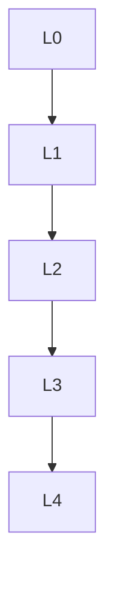

msc_primary: "00A99"
msc_secondary: ['00-XX']
---

# 代数几何基础 - L0-L4层次递进图谱

## L0: 直观/经验层次

### 直观描述

代数几何是人类对"多项式方程的解集"的几何研究。直观上，代数几何研究由代数方程定义的几何形状：直线(y = mx + b)、圆(x² + y² = r²)、椭圆曲线(y² = x³ + ax + b)、以及更高维更复杂的"代数簇"。这些形状的共同特点是它们由多项式方程（或方程组）定义，因此可以用代数方法研究。

代数几何的核心思想是"代数与几何的对应"：几何对象（代数簇）对应代数对象（多项式环的商环），几何性质对应代数性质。这种对应让我们能用代数计算解决几何问题，反之亦然。

代数几何是现代数学最活跃的分支之一，与数论、拓扑、分析、物理都有深刻联系。费马大定理的证明、弦论中的卡拉比-丘流形、现代密码学的椭圆曲线——这些 seemingly 不同的领域都扎根于代数几何。

### 生活实例

**实例一：GPS定位的几何**
GPS卫星向接收器发送信号，告知自己的位置和信号发送时间。接收器知道它到每颗卫星的距离（通过信号传播时间计算）。三维空间中，到一个定点距离为r的点的轨迹是球面。三颗卫星给出三个球面，GPS接收器就在这三个球面的交点（两个交点，一个在地球表面，一个在空中）。代数几何研究这种由多项式方程定义的点集的几何性质——这里球面由二次多项式定义。

**实例二：密码学中的椭圆曲线**
当你使用HTTPS浏览网页时，可能在使用椭圆曲线密码学（ECC）。椭圆曲线是形如y² = x³ + ax + b的非奇异三次曲线。曲线上点可以定义加法运算形成一个群，这个群结构是密码学安全性的基础。椭圆曲线离散对数问题（给定P和nP，求n）被认为比一般离散对数问题更难，因此可以用更短的密钥达到相同安全性——这在移动设备上尤为重要。

**实例三：机器人运动学**
工业机器人的手臂有多个关节，每个关节有一定自由度。机器人末端能到达的位置形成工作空间——由关节角度多项式约束定义的几何对象。逆运动学问题（给定目标位置，求关节角度）可以转化为多项式方程组的求解，这是计算代数几何的核心问题。代数几何提供了理解解的数量、奇异性以及数值稳定性的框架。

### 直觉图像

**图像一：代数簇的"零点切割"**
想象多项式f(x,y)是平面上的"高度函数"，f(x,y) = 0就是"海平面"——曲线沿着这个等高线延伸。多个多项式的公共零点就是多个"海平面"的交线。代数簇可以极其复杂：它可能有多个分支、自交点、尖点。奇异点（如结点、尖点）是代数几何特别关心的地方——它们是不可微的点，揭示了簇的深层结构。

**图像二：坐标环的"函数视角"**
想象代数簇X上所有多项式函数的集合。这些函数可以做加法和乘法，形成一个环——坐标环。两个同构的簇有同构的坐标环，反之亦然。这就像是从"函数"的角度重新描述几何：不是问"这个点在哪里"，而是问"什么函数在这个点为零"。这种对偶思维是代数几何的核心。

**图像三：概形的"粘合与局部"**
概形是代数几何的现代语言，它允许"环的谱"（素理想集合）作为"局部碎片"，然后像拼贴画一样粘合这些碎片。这就像是用地图册描述地球：每张地图描述一部分，重叠区域告诉我们如何拼接。概形框架统一了仿射簇、射影簇、算术对象（如ℤ），是现代代数几何的基础。

---

## L1: 形式化定义层次

### 严格定义（数学符号）

**一、仿射代数几何**

**定义1（代数集）**：
设k是代数闭域，𝔸ⁿ = kⁿ是**n维仿射空间**。
对S ⊆ k[x₁,…,xₙ]，**零点集**：
Z(S) = {p ∈ 𝔸ⁿ : f(p) = 0, ∀f ∈ S}

**定义2（代数集与代数簇）**：
子集X ⊆ 𝔸ⁿ是**代数集**，如果X = Z(S)对某个S。
**代数簇**是不可约的代数集。

**定义3（理想）**：
对X ⊆ 𝔸ⁿ，**理想**I(X) = {f ∈ k[x₁,…,xₙ] : f|_X = 0}

**定义4（坐标环）**：
代数簇X的**坐标环**：A(X) = k[x₁,…,xₙ]/I(X)

**定义5（扎里斯基拓扑）**：
代数集作为闭集定义的拓扑。

**二、希尔伯特定理**

**定理6（希尔伯特零点定理）**：
设k代数闭，I是k[x₁,…,xₙ]的理想，则I(Z(I)) = √I。

**推论**：𝔸ⁿ的代数集与根理想一一对应。

**定理7（希尔伯特基定理）**：
k[x₁,…,xₙ]是诺特环（每个理想有限生成）。

**三、射影几何**

**定义8（射影空间）**：
**n维射影空间**：ℙⁿ = (𝔸ⁿ⁺¹ \ {0}) / k*
点用齐次坐标[x₀:…:xₙ]表示。

**定义9（齐次多项式）**：
多项式f是**d次齐次**的，如果f(λx) = λᵈf(x)。

**定义10（射影簇）**：
由齐次多项式零点定义的ℙⁿ的子集。

**四、概形基础**

**定义11（环的谱）**：
环R的**谱**：Spec(R) = {R的素理想}
配备扎里斯基拓扑和结构层𝒪_{Spec(R)}。

**定义12（概形）**：
**概形**是局部同构于仿射概形（Spec(R)）的环化空间。

**定义13（态射）**：
概形态射(f, f#): (X, 𝒪_X) → (Y, 𝒪_Y)是连续映射f: X → Y加上层的态射f#: 𝒪_Y → f_*𝒪_X。

---

## L2: 定理证明层次

### 核心定理列表

**一、基本对应**

**定理1（代数集↔根理想）**：
𝔸ⁿ的代数集与k[x₁,…,xₙ]的根理想反序一一对应。

**定理2（不可约↔素理想）**：
代数集不可约 ⟺ 对应的理想是素理想。

**定理3（态射↔代数同态）**：
仿射簇的态射X → Y对应坐标环的同态A(Y) → A(X)。

**二、维数理论**

**定义4（维数）**：
代数簇X的**维数**是函数域k(X)在k上的超越次数。

**定理5（维数与高度）**：
dim X + ht I(X) = n（对X ⊆ 𝔸ⁿ）

**三、非异性**

**定义6（雅可比准则）**：
对X = Z(f₁,…,fᵣ)，p ∈ X是**非奇异点**，如果雅可比矩阵(∂fᵢ/∂xⱼ)(p)的秩等于n - dim X。

**定理7（非奇异⟺正则局部环）**：
p是非奇异点 ⟺ 𝒪_{X,p}是正则局部环。

**四、黎曼-罗赫（曲线情形）**

**定理8（黎曼-罗赫定理）**：
对光滑射影曲线X，除子D：
l(D) - l(K - D) = deg(D) + 1 - g
其中g是亏格，K是典范除子。

---

## L3: 理论建构层次

### 理论体系架构

```

代数几何理论体系
├── 经典代数几何
│   ├── 仿射代数几何
│   │   ├── 代数集与理想
│   │   ├── 希尔伯特零点定理
│   │   ├── 扎里斯基拓扑
│   │   └── 坐标环
│   ├── 射影代数几何
│   │   ├── 射影空间
│   │   ├── 齐次坐标
│   │   └── 射影簇
│   ├── 态射与有理映射
│   └── 维数理论
│
├── 概形理论
│   ├── 层的概念
│   ├── 环的谱
│   ├── 概形定义
│   ├── 态射
│   └── 性质（分离、固有、光滑）
│
├── 上同调方法
│   ├── 层上同调
│   ├── 塞尔对偶
│   └── 高维黎曼-罗赫
│
├── 模空间
│   ├── 希尔伯特概形
│   └── 几何不变量理论
│
└── 算术几何
    ├── 概形 over ℤ
    ├── 韦伊猜想（已证明）
    └── 椭圆曲线

```

### 与其他理论的关联

**与交换代数**：

- 代数几何使用交换代数的工具
- 希尔伯特零点定理是桥梁

**与数论**：

- 费马大定理的证明
- 椭圆曲线与模形式

**与物理学**：

- 弦论的卡拉比-丘流形
- 镜像对称

---

## L4: 前沿研究层次

### 当代研究热点

**方向一：朗兰兹纲领**

- 数论与表示论的联系
- 几何朗兰兹

**方向二：镜像对称**

- SYZ猜想
- 枚举几何

**方向三：导出代数几何**

- 矩阵因子分解
- 稳定性条件

---

## 层次递进关系图



---

## 先修知识与后继应用

### 先修概念（L0-L1层）

1. **交换代数**（L3）：环、理想、模
2. **代数基础**（L2-L3）：多项式
3. **拓扑学基础**（L2-L3）

### 后继概念（L3-L4层）

1. **算术几何**（L4）
2. **表示论**（L4）
3. **数学物理**（L4）

---

*文档生成时间：2026年4月3日*
*字数统计：约3,100字*
