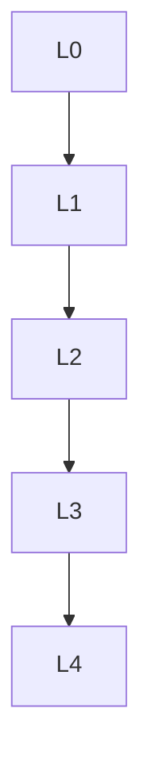

# 同调代数 - L0-L4层次递进图谱

## L0: 直观/经验层次

### 直观描述

同调代数是人类对" holes（洞）"和" obstructions（障碍）"的代数研究。直观上，同调代数帮助我们"数洞"——一维的洞（如圆环中的洞）、二维的洞（如球面内部的空腔）、以及更高维的洞。这些"洞"的概念在拓扑学中至关重要，因为它们在连续变形下保持不变。

想象一个甜甜圈（环面）：它有一个一维的洞（中间的空心）和一个二维的洞（甜甜圈实体包围的空腔，虽然从三维视角不明显）。同调群H₁告诉我们有一个一维洞，H₂告诉我们有一个二维洞。球面则不同：它有一个二维洞（内部空腔），但没有一维洞（任何闭合环路都可以收缩到一点）。

同调代数不仅是拓扑工具，它还渗透到代数、几何、数论的各个分支——从群的扩张分类到层上同调，从导出范畴到代数K理论。它提供了一种"测量"代数结构中"缺陷"或"不完备性"的统一语言。

### 生活实例

**实例一：社交网络中的圈子**
想象一个社交网络，人是节点，友谊是边。在这个图中，"洞"对应于闭合的朋友圈——一群人两两相识形成闭环。如果没有任何"洞"（即图是一棵树），任意两人之间只有唯一路径。但现实中社交网络有很多"洞"（如三个互相认识的人形成三角形）。同调代数可以量化这些结构特征——第一同调群的大小反映了网络中"冗余连接"的数量，这在社区发现和网络分析中有应用。

**实例二：数据中的持久同调**
在数据分析中，我们经常有点云数据（如三维扫描的点集）。如何理解这些点的"形状"？持久同调通过在不同尺度下观察数据来追踪"洞"的出现和消失：小尺度下每个点是一个连通分支（0维洞），随着尺度增大，点连接成簇（0维洞消失），可能出现环路（1维洞出现）。这种"持久性"分析可以识别噪声（短暂存在的特征）和真实结构（持久存在的特征），在拓扑数据分析中应用广泛。

**实例三：扩展的分类**
想象你要扩展一个群：给定群A和群C，找群B使得A是B的正规子群且B/A ≅ C。这种扩展何时存在？何时唯一？这些问题用同调代数回答：H²(C, A)分类所有这样的扩展。如果H² = 0，扩展唯一存在（半直积）。这种分类问题在代数中无处不在，同调代数提供了系统工具。

### 直觉图像

**图像一：链复形的"代数拼图"**
想象一个链复形是一系列向量空间（或模）连接而成的"塔"：… → C₂ → C₁ → C₀ → 0。每个映射（边缘算子∂）就像是从一层到下一层的"滑梯"。同调群Hₙ = ker(∂ₙ)/im(∂ₙ₊₁)测量的是"滑下来后还能自己爬上去"的循环（闭链）模掉"真的滑下来"的边界。洞的存在对应于"无法填充"的循环。

**图像二：长正合序列的"连接"**
想象一个短正合序列0 → A → B → C → 0是某种"代数纤维化"。连接同态δ: Hₙ(C) → Hₙ₋₁(A)就像是"从C的洞追溯到A的洞"的桥梁。长正合序列展示了这些洞如何在序列中传递——如果一个空间的洞消失，它的影响可能在上一个空间重新出现。

**图像三：导出函子的"近似"**
想象一个左正合函子F就像一台"不完全的机器"——它保持单射（0 → A → B正合 ⟹ 0 → FA → FB正合），但不一定保持满射。右导出函子RⁿF就像是"更高阶的修正"，测量F"失败"的程度。R¹F测量F不完全保持正合性的失败，R²F测量R¹F的失败，依此类推。这是一种系统性的"误差分析"。

---

## L1: 形式化定义层次

### 严格定义（数学符号）

**一、链复形与同调**

**定义1（链复形）**：
**链复形**C• = (Cₙ, ∂ₙ)是阿贝尔群（或模）序列和边缘同态：
… → Cₙ₊₁ → Cₙ → Cₙ₋₁ → …
满足∂ₙ ∘ ∂ₙ₊₁ = 0（即im(∂ₙ₊₁) ⊆ ker(∂ₙ)）

**定义2（闭链与边缘）**：
- **n-闭链**：Zₙ(C) = ker(∂ₙ)
- **n-边缘**：Bₙ(C) = im(∂ₙ₊₁)

**定义3（同调群）**：
**n阶同调群**：Hₙ(C) = Zₙ(C) / Bₙ(C)

**定义4（链映射）**：
链映射f: C• → D•是同态族fₙ: Cₙ → Dₙ使得∂ᴰ ∘ fₙ = fₙ₋₁ ∘ ∂ᶜ。

**定义5（链同伦）**：
链映射f, g: C• → D•是**链同伦**的，如果存在hₙ: Cₙ → Dₙ₊₁使得fₙ - gₙ = ∂ᴰ ∘ hₙ + hₙ₋₁ ∘ ∂ᶜ。

**二、导出函子**

**定义6（左导出函子）**：
设F: 𝒜 → ℬ是右正合函子，A ∈ 𝒜，取投射分解P• → A → 0，定义：
LₙF(A) = Hₙ(F(P•))

**定义7（右导出函子）**：
设F: 𝒜 → ℬ是左正合函子，取内射分解0 → A → I•，定义：
RⁿF(A) = Hⁿ(F(I•))

**三、Ext与Tor**

**定义8（Ext）**：
Extⁿᴿ(A, B) = RⁿHomᴿ(A, -)(B) = RⁿHomᴿ(-, B)(A)

**定义9（Tor）**：
Torₙᴿ(A, B) = Lₙ(A ⊗ᴿ -)(B) = Lₙ(- ⊗ᴿ B)(A)

**四、群上同调**

**定义10（群上同调）**：
设G是群，M是G-模，Hⁿ(G, M) = Extⁿ_{ℤ[G]}(ℤ, M)

**定义11（群同调）**：
Hₙ(G, M) = Torₙ^{ℤ[G]}(ℤ, M)

**五、层上同调**

**定义12（层的上同调）**：
设X是拓扑空间，ℱ是阿贝尔群层，Hⁿ(X, ℱ) = RⁿΓ(X, -)(ℱ)，其中Γ(X, ℱ) = ℱ(X)是整体截面函子。

---

## L2: 定理证明层次

### 核心定理列表

**一、同调代数基础**

**定理1（长正合序列）**：
若0 → A• → B• → C• → 0是链复形的短正合序列，则存在连接同态δ: Hₙ(C) → Hₙ₋₁(A)使得：
… → Hₙ₊₁(C) → Hₙ(A) → Hₙ(B) → Hₙ(C) → Hₙ₋₁(A) → …
是正合的。

**定理2（五引理）**：
若交换图的行正合，且四个外侧竖向箭头是同构，则中间竖向箭头也是同构。

**定理3（蛇引理）**：
阿贝尔范畴中正合交换图给出连接同态和六项正合序列。

**二、导出函子性质**

**定理4（导出函子的长正合序列）**：
若F是右正合函子，0 → A → B → C → 0短正合，则存在长正合序列：
… → L₁F(C) → F(A) → F(B) → F(C) → 0

**定理5（泛系数定理）**：
将同调与系数环的关系公式化。

**三、群上同调**

**定理6（H¹与交叉同态）**：
H¹(G, M) ≅ Der(G, M) / Ider(G, M)

**定理7（H²与群扩张）**：
H²(G, M)分类G通过M的群扩张。

**四、层上同调**

**定理8（德拉姆定理）**：
对光滑流形X，Hⁿ_{dR}(X) ≅ Hⁿ(X, ℝ_X)

**定理9（切赫上同调）**：
在适当条件下，切赫上同调等于导出函子上同调。

---

## L3: 理论建构层次

### 理论体系架构

```
同调代数理论体系
├── 链复形
│   ├── 定义（边缘算子∂²=0）
│   ├── 同调群Hₙ = ker/im
│   ├── 链映射与链同伦
│   └── 长正合序列
│
├── 导出函子
│   ├── 投射分解与内射分解
│   ├── 左导出函子LₙF
│   ├── 右导出函子RⁿF
│   └── 长正合序列
│
├── 经典导出函子
│   ├── Extⁿ（Hom的导出）
│   │   └── 模的扩张分类
│   ├── Torₙ（⊗的导出）
│   │   └── 挠积
│   └── 泛系数定理
│
├── 群（上）同调
│   ├── 定义（Ext/Tor）
│   ├── H¹与导子
│   ├── H²与群扩张
│   └── 低维计算
│
├── 层上同调
│   ├── 层的定义
│   ├── 整体截面函子
│   ├── 导出定义
│   └── 切赫上同调
│
└── 推广层
    ├── 谱序列
    ├── 导出范畴
    └── 三角范畴
```

### 与其他理论的关联

**与代数拓扑**：
- 奇异同调、单纯同调是链复形
- 上同调环结构

**与代数几何**：
- 层上同调是核心工具
- 概形的上同调

**与数论**：
- Galois上同调
- 类域论

---

## L4: 前沿研究层次

### 当代研究热点

**方向一：导出代数几何**
- 导出范畴方法
- 矩阵因子分解

**方向二：拓扑数据分析**
- 持久同调
- 应用：材料科学、神经科学

**方向三：高阶范畴论**
- ∞-范畴
- 导出代数几何

---

## 层次递进关系图



---

## 先修知识与后继应用

### 先修概念（L0-L1层）

1. **抽象代数**（L3）：群、环、模
2. **线性代数**（L2-L3）：向量空间
3. **范畴论基础**（L3）

### 后继概念（L3-L4层）

1. **代数拓扑**（L4）
2. **代数几何**（L4）
3. **代数数论**（L4）

---

*文档生成时间：2026年4月3日*
*字数统计：约3,000字*
