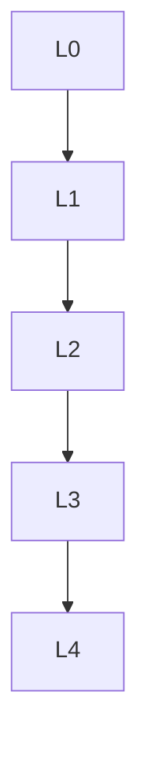

msc_primary: "00A99"
msc_secondary: ['00-XX']
---

# 复分析 - L0-L4层次递进图谱

## L0: 直观/经验层次

### 直观描述

复分析是人类对"复变函数"的数学研究。直观上，复数可以看作是平面上的点（实部是x坐标，虚部是y坐标），而复变函数就是平面上点到点的映射。但复可微函数（全纯函数）非常特殊——它们不只是光滑，而是"共形"的：保持角度不变。

想象你在地图上画一个小正方形，经过全纯函数变换后，它可能变成更大的正方形、旋转的正方形、或拉伸的长方形，但它仍然是"方形"——直角仍然是直角。这是因为全纯函数的导数在每个点是一个复数，复数乘法的几何意义是旋转加伸缩，因此局部保持形状（仅改变大小和方向）。

复分析之所以强大，是因为全纯函数受到极其严格的约束：它们由边界值完全决定（柯西积分公式），有任意阶导数，零点孤立，等等。这些性质让复分析成为解决实际问题的利器，从流体力学到数论，从信号处理到量子力学。

### 生活实例

**实例一：空气动力学与机翼设计**
当空气流过机翼时，工程师需要计算升力。在无旋、不可压缩的理想流体假设下，这个问题可以用复分析解决。复势函数将复杂的机翼外形映射为简单形状（如圆），然后解析求解。茹科夫斯基变换就是这样一个著名的共形映射，它将圆变换为翼型。这使得工程师能在设计阶段预测飞行性能，无需昂贵风洞实验。

**实例二：电阻网络的阻抗分析**
在交流电路中，电阻、电容、电感的响应可以用复数表示：电阻是纯实数，电容是纯虚负数（-i/ωC），电感是纯虚正数（iωL）。电路的总阻抗是这些复数的和。复分析让我们能计算任意复杂电路的频率响应——这在滤波器设计、音响工程、通信系统中无处不在。

**实例三：素数定理的证明**
素数定理描述素数的分布：小于n的素数个数约为n/ln(n)。这个看似纯粹的数论问题，最终是通过复分析证明的！黎曼ζ函数ζ(s) = Σ1/nˢ（s为复数）的零点分布与素数分布密切相关。黎曼猜想——数学最著名的未解问题——就是关于这些零点的位置的猜想。复分析揭示了数论中深层的分析结构。

### 直觉图像

**图像一：全纯函数的"角度保持"**
想象平面上画一个网格（水平和垂直线）。全纯函数将这个网格映射为另一个网格——虽然线可能弯曲，但在交点处仍然是垂直相交。这就是"共形性"——保持角度。反例是函数f(z) = z̄（复共轭），它将左手系变为右手系，反转角度，因此不是全纯的。

**图像二：柯西定理的"回路同伦"**
想象复平面上画一个闭合回路，全纯函数在回路内部无奇点。柯西定理告诉我们：沿回路的积分等于零。这就像是你背着"势能函数"爬山，回到起点时总能量变化为零。更深刻地说，如果两个回路可以连续变形为彼此而不穿过奇点，则沿它们的积分相等——积分只依赖于回路的"拓扑类"。

**图像三：留数的"奇点贡献"**
想象全纯函数在一点有奇点（如1/z在z=0）。围绕这个奇点画一个小回路，积分不为零——这个值就是"留数"。留数定理说：沿大回路的积分等于所有内部奇点留数之和。这就像是每个奇点都是一个"电荷"，回路积分计算的是包围的"总电荷"。

---

## L1: 形式化定义层次

### 严格定义（数学符号）

**一、复数基础**

**定义1（复数）**：
**复数**z = x + iy，其中x,y ∈ ℝ，i² = -1。

**定义2（实部与虚部）**：
Re(z) = x，Im(z) = y

**定义3（共轭）**：
z̄ = x - iy

**定义4（模）**：

|z| = √(x² + y²) = √(z·z̄)

**定义5（极坐标）**：
z = reⁱᶿ，其中r = |z|，θ = arg(z)

**二、全纯函数**

**定义6（复可微）**：
f在z₀**复可微**，如果极限存在：
f'(z₀) = lim_{z→z₀} (f(z)-f(z₀))/(z-z₀)

**定义7（全纯/解析）**：
f在区域Ω上是**全纯**（或**解析**）的，如果f在Ω的每点复可微。

**定义8（柯西-黎曼方程）**：
f(z) = u(x,y) + iv(x,y)全纯 ⟺
∂u/∂x = ∂v/∂y，∂u/∂y = -∂v/∂x

**三、复积分**

**定义9（轮廓积分）**：
设γ: [a,b] → ℂ是分段光滑曲线：
∫_γ f(z)dz = ∫_a^b f(γ(t))γ'(t)dt

**定义10（留数）**：
f在孤立奇点z₀的**留数**：
Res(f, z₀) = (1/2πi) ∮_{|z-z₀|=ε} f(z)dz

**四、级数展开**

**定义11（幂级数）**：
∑_{n=0}^∞ aₙ(z-z₀)ⁿ

**定义12（收敛半径）**：
R = 1/limsup |aₙ|^{1/n}

**定义13（洛朗级数）**：
∑_{n=-∞}^∞ aₙ(z-z₀)ⁿ

**五、奇点分类**

**定义14（可去奇点）**：
lim_{z→z₀} f(z) 存在且有限

**定义15（极点）**：
lim_{z→z₀} |f(z)| = +∞

极点的阶：洛朗级数中负幂的最高次

**定义16（本性奇点）**：
其他奇点（如e^{1/z}在z=0）

**六、共形映射**

**定义17（共形映射）**：
全纯且导数处处非零的映射（局部保持角度）。

**定义18（分式线性变换/莫比乌斯变换）**：
f(z) = (az+b)/(cz+d)，ad-bc ≠ 0

---

## L2: 定理证明层次

### 核心定理列表

**一、柯西理论**

**定理1（柯西定理）**：
设f在单连通区域Ω全纯，γ是Ω中闭合回路，则：
∮_γ f(z)dz = 0

**定理2（柯西积分公式）**：
设f在Ω全纯，γ是Ω中简单闭合正向回路，z在γ内部，则：
f(z) = (1/2πi) ∮_γ f(ζ)/(ζ-z) dζ

**定理3（高阶导数公式）**：
f⁽ⁿ⁾(z) = (n!/2πi) ∮_γ f(ζ)/(ζ-z)^{n+1} dζ

**推论**：全纯函数无限可微。

**定理4（莫雷拉定理）**：
若f连续且沿任意三角形的积分为零，则f全纯。

**二、留数理论**

**定理5（留数定理）**：
设f在简单闭合回路γ及其内部除有限奇点外全纯，则：
∮_γ f(z)dz = 2πi Σ Res(f, zₖ)

**定理6（辐角原理）**：
设f在γ及其内部亚纯，在γ上无零点和极点，则：
(1/2πi) ∮_γ f'(z)/f(z) dz = N - P
其中N是零点数，P是极点数（计重数）。

**定理7（儒歇定理）**：
设f,g在γ及其内部全纯，在γ上|g(z)| < |f(z)|，则f和f+g在γ内部零点数相同。

**三、级数理论**

**定理8（泰勒定理）**：
f在B(z₀,R)全纯 ⟹ f(z) = Σ aₙ(z-z₀)ⁿ，收敛半径至少为R。

**定理9（洛朗定理）**：
f在圆环r < |z-z₀| < R全纯 ⟹ f(z) = Σ aₙ(z-z₀)ⁿ（洛朗级数）。

**定理10（唯一性定理）**：
全纯函数由其在有聚点的集合上的值唯一确定。

**四、最大模原理**

**定理11（最大模原理）**：
设f在有界区域Ω全纯且在Ω̄连续，则|f|在Ω̄上的最大值在边界∂Ω上取得。

**推论（开映射定理）**：
非常数全纯函数是开映射。

**定理12（施瓦茨引理）**：
设f: 𝔻 → 𝔻全纯，f(0)=0，则|f(z)| ≤ |z|且|f'(0)| ≤ 1。

**五、共形映射**

**定理13（黎曼映射定理）**：
任何单连通真子集U ⊊ ℂ（U ≠ ℂ）共形等价于单位圆盘𝔻。

**定理14（延拓原理）**：
边界光滑的区域间的共形映射可延拓到边界。

---

## L3: 理论建构层次

### 理论体系架构

```

复分析理论体系
├── 基础理论
│   ├── 复数与复平面
│   │   ├── 复数运算
│   │   ├── 极坐标表示
│   │   └── 拓扑结构
│   ├── 全纯函数
│   │   ├── 复可微性
│   │   ├── 柯西-黎曼方程
│   │   └── 例子（多项式、指数、对数）
│   └── 复积分
│       ├── 轮廓积分
│       ├── 估计引理
│       └── 原函数
│
├── 柯西理论
│   ├── 柯西定理
│   │   ├── 单连通区域
│   │   ├── 同伦形式
│   │   └── 多连通区域
│   ├── 柯西积分公式
│   │   ├── 积分表示
│   │   └── 高阶导数
│   └── 应用
│       ├── 刘维尔定理
│       └── 代数基本定理
│
├── 级数理论
│   ├── 幂级数
│   │   ├── 收敛半径
│   │   └── 解析性
│   ├── 洛朗级数
│   │   ├── 圆环展开
│   │   └── 奇点分类
│   └── 留数理论
│       ├── 留数计算
│       ├── 留数定理
│       └── 实积分计算
│
├── 几何理论
│   ├── 共形映射
│   │   ├── 角度保持
│   │   ├── 莫比乌斯变换
│   │   └── 黎曼映射定理
│   ├── 最大模原理
│   │   ├── 开映射定理
│   │   └── 施瓦茨引理
│   └── 调和函数
│       ├── 与全纯函数的关系
│       └── 边值问题
│
└── 推广层
    ├── 多复变函数
    │   └── 全纯函数论
    ├── 黎曼曲面
    │   ├── 定义与例子
    │   └── 单值化定理
    └── 复几何
        ├── 复流形
        └── 层论方法

```

### 与其他理论的关联

**与实分析的关系**：

- 全纯函数比实可微函数更强
- 调和函数与位势理论

**与代数的关系**：

- 代数基本定理的复分析证明
- 黎曼曲面与代数曲线

**与数论的关系**：

- ζ函数与素数分布
- 模形式

**与物理学的关系**：

- 保角场论
- 弦论中的共形不变性

---

## L4: 前沿研究层次

### 当代研究热点

**方向一：泰希米勒理论**

- 黎曼曲面的模空间
- 拟共形映射

**方向二：双曲几何**

- 克莱因群
- 双曲三维流形

**方向三：随机共形几何**

- SLE（Schramm-Loewner演化）
- 统计物理模型

### 未解决问题

**问题一：黎曼猜想**
ζ函数的非平凡零点都在Re(s) = 1/2线上。

**问题二：双曲流形的体积猜想**
关于双曲三维流形体积的算术性质。

---

## 层次递进关系图



---

## 先修知识与后继应用

### 先修概念（L0-L1层）

1. **多元微积分**（L2-L3）
2. **线性代数**（L2-L3）
3. **实分析**（L3）：极限、连续性

### 后继概念（L3-L4层）

1. **黎曼曲面**（L4）
2. **代数几何**（L4）
3. **数论**（L4）：解析数论
4. **数学物理**（L4）：共形场论

---

*文档生成时间：2026年4月3日*
*字数统计：约3,800字*
