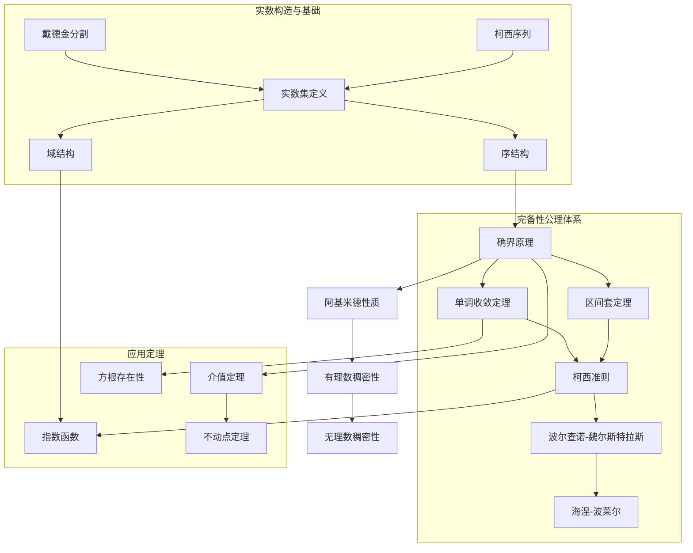
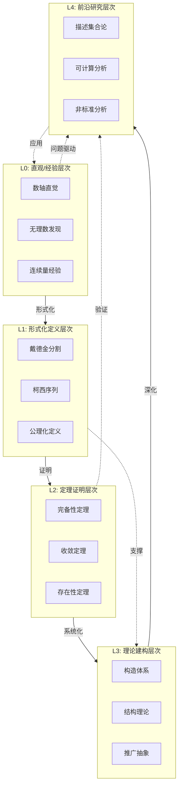
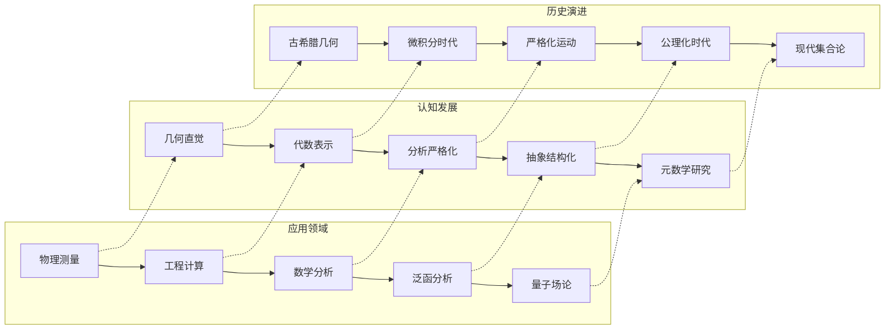

msc_primary: "00A99"
msc_secondary: ['00-XX']
---

# 实数理论 - L0-L4层次递进图谱

## L0: 直观/经验层次

### 直观描述

实数是人类对"连续量"的数学抽象。直观上，实数可以被想象为一条无限延伸的直线上的所有"点"——这就是著名的"数轴"概念。每一个实数对应数轴上的一个精确位置，反过来，数轴上的每一个点也对应一个实数。

实数具有令人惊讶的丰富结构：它们可以任意接近但永不相等；在两个不同的实数之间总有无穷多个实数；实数既包含有理数（可以表示为分数），也包含无理数（如$\sqrt{2}$、$\pi$、$e$）。实数的"连续性"赋予了它们描述物理世界连续现象的能力——时间、空间、温度等物理量都可以用实数来度量。

### 生活实例

**实例一：温度计读数**
想象一支理想的温度计，它可以显示任何精确的温度值。在-20°C到50°C之间，理论上可以显示无穷多个温度值：25.3°C、25.317°C、25.3172849°C……无论我们如何精细地划分温度区间，总能找到中间的值。这种"无间隙"的特性正是实数连续性的体现。

**实例二：数轴上的分割**
想象在数轴上取一点（比如对应数字1），然后用剪刀"剪断"数轴。直觉告诉我们，剪刀要么落在某个有理数点上（如1 = 1/1），要么落在两个有理数之间的"缝隙"中。实数理论告诉我们：数轴上没有缝隙！每一个"缝隙"本身都对应一个实数（实际上是无理数）。

**实例三：无理数的发现**
毕达哥拉斯学派发现，边长为1的正方形的对角线长度（即$\sqrt{2}$）不能表示为两个整数的比。这个发现震惊了整个古希腊数学界——因为在此之前，人们认为所有量都可以用有理数表示。这个"不可公度量"的发现，是人类认识实数连续性的开端。

### 直觉图像

**图像一：戴德金分割的可视化**
想象数轴上的所有有理数，它们密密麻麻地排列着，但中间仍有"空隙"。戴德金分割的概念就像是在数轴上找一个"切割点"，将全体有理数分成左右两部分：左边的所有数都小于右边的所有数。如果这个切割点本身不是有理数，那它就定义了一个新的实数（无理数）。

**图像二：柯西序列的收敛**
想象一只在数轴上跳跃的跳蚤，每次跳跃的距离是前一次的一半：从0跳到1，再到1.5，再到1.75，再到1.875……跳蚤的目标点是2，它无限接近但永远达不到2。柯西序列就是这样的过程：一个序列的元素相互越来越接近，最终"凝聚"在一个实数点上。

**图像三：区间套**
想象一系列不断缩小的闭区间：$[0, 1] \supset [0.3, 0.4] \supset [0.33, 0.34] \supset [0.333, 0.334] \supset \cdots$。这些区间的交集最终会"锁定"在一个唯一的实数点上（在这个例子中是$1/3$）。

---

## L1: 形式化定义层次

### 严格定义（数学符号）

**定义1：实数的戴德金分割定义（1872）**

一个**戴德金分割**（或简称**分割**）是将有理数集$\mathbb{Q}$分成两个非空子集$A$和$B$，满足：

1. $A \cup B = \mathbb{Q}$ 且 $A \cap B = \emptyset$（完备性）
2. $\forall a \in A, \forall b \in B: a < b$（有序性）
3. $A$ 没有最大元素（开左集）

**实数**就是这样的分割 $(A, B)$。若$B$有最小元素$r \in \mathbb{Q}$，则该分割对应有理数$r$；否则对应一个无理数。

形式化记法：$\mathbb{R} = \{(A, B) : A, B \subseteq \mathbb{Q}, A \neq \emptyset, B \neq \emptyset, A \cup B = \mathbb{Q}, A \cap B = \emptyset, \forall a \in A, b \in B: a < b, A \text{无最大元}\}$

**定义2：实数的柯西序列定义（康托尔，1872）**

**柯西序列**：有理数序列$(a_n)_{n \in \mathbb{N}}$称为柯西序列，如果：
$$\forall \varepsilon > 0, \exists N \in \mathbb{N}, \forall m, n > N: |a_m - a_n| < \varepsilon$$

两个柯西序列$(a_n)$和$(b_n)$称为**等价**的，如果：
$$\forall \varepsilon > 0, \exists N \in \mathbb{N}, \forall n > N: |a_n - b_n| < \varepsilon$$

**实数**是柯西序列的等价类：$\mathbb{R} = \{[(a_n)] : (a_n) \text{是柯西序列}\}$

**定义3：实数的十进制展开定义**

实数可以定义为无限十进制展开：$x = a_0.a_1a_2a_3\cdots$，其中$a_0 \in \mathbb{Z}$，$a_i \in \{0, 1, 2, \ldots, 9\}$对$i \geq 1$。

注意：需要处理$0.999\cdots = 1.000\cdots$这样的等价情况。

**定义4：实数的公理化定义（希尔伯特，1900）**

实数系统是一个完备的阿基米德有序域$(\mathbb{R}, +, \cdot, <)$，满足：

**域公理**：$(\mathbb{R}, +, \cdot)$是域

- 加法交换律、结合律
- 乘法交换律、结合律
- 分配律
- 加法单位元0，乘法单位元1
- 加法逆元，乘法逆元（非零元）

**序公理**：$<$是线性序，且与运算相容

- 三分性：$\forall a, b: a < b \lor a = b \lor b < a$
- 传递性：$a < b \land b < c \Rightarrow a < c$
- 加法保序：$a < b \Rightarrow a + c < b + c$
- 乘法保序：$a < b \land c > 0 \Rightarrow ac < bc$

**阿基米德公理**：$\forall x > 0, y > 0, \exists n \in \mathbb{N}: nx > y$

**完备性公理**（确界原理）：$\mathbb{R}$的每个有上界的非空子集都有上确界

### 定义的历史演进

**第一阶段：古希腊时期（前500年-前300年）**

- **毕达哥拉斯学派**：相信"万物皆数"，认为所有量都可表示为整数比
- **不可公度量的发现**：$\sqrt{2}$的无理性证明（约前5世纪）
  - 传说希帕索斯因发现$\sqrt{2}$而被逐出学派
  - 这一发现动摇了毕达哥拉斯学派的哲学基础
- **欧多克索斯的比例论**（前4世纪）：
  - 在《几何原本》第五卷中发展了不涉及无理数的比例理论
  - 避免了直接定义实数，而是用几何方法处理比例
  - 这一方法统治数学界近2000年

**第二阶段：微积分危机时期（17世纪-19世纪初）**

- **牛顿和莱布尼茨**：发明了微积分，但缺乏严格的实数基础
- **无穷小概念的模糊性**：什么是"无穷小量"？
- **贝克莱主教的批评**（1734）：《分析学家》中嘲笑无穷小为"已死量的幽灵"
- **欧拉**：大量使用发散级数和形式计算
- **拉格朗日**：试图用泰勒级数避免极限概念

**第三阶段：严格化运动（19世纪）**

- **柯西**（1821）：《分析教程》中给出极限的$\varepsilon$-$\delta$定义
  - 但柯西仍假设收敛序列的极限存在（循环定义问题）

- **波尔查诺**（1817）：首次给出连续函数的严格定义
  - 证明了介值定理
  - 认识到需要完备性原理

- **戴德金**（1872）：《连续性与无理数》
  - 提出分割定义
  - 动机来自1858年教授微积分时的困惑

- **康托尔**（1872）：用柯西序列的等价类定义实数
  - 同时海涅也独立提出类似方法

- **魏尔斯特拉斯**（1860s）：用递增有界序列定义实数
  - 在柏林大学讲授，影响了大批学生

**第四阶段：公理化时期（20世纪初）**

- **希尔伯特**（1900）：将实数系统公理化
- **康托尔集合论**的影响：实数作为集合来构造
- **选择公理的争论**：影响实数理论的发展

**第五阶段：现代发展（20世纪至今）**

- **非标准分析**（鲁滨逊，1960）：无穷小的严格化
- **构造性数学**：只接受可构造的实数
- **可计算性理论**：哪些实数是"可计算的"？
- **描述集合论**：实数集的结构理论

### 等价定义形式

**定理：各种实数构造的等价性**

以下构造方式定义的同构有序域：

1. 戴德金分割
2. 柯西序列等价类
3. 十进制展开（适当处理等价）
4. 区间套原理实现
5. 完备化度量空间$\mathbb{Q}$

都是同构的，且同构唯一。

**证明思路**：

- 从$\mathbb{Q}$出发构造完备有序域
- 证明任何两个这样的域之间存在保持序和运算的唯一同构
- 这个同构将每个有理数映射到对应的有理数

**不同的完备性公理形式**：

| 公理名称 | 陈述 | 等价性 |
|----------|------|--------|
| 确界原理 | 有上界非空子集有上确界 | 基础形式 |
| 单调收敛定理 | 递增有上界序列收敛 | $\Leftrightarrow$ |
| 区间套原理 | 闭区间套有非空交 | $\Leftrightarrow$ |
| 有限覆盖定理（海涅-波莱尔） | 紧集的开覆盖有有限子覆盖 | $\Leftrightarrow$ |
| 波尔查诺-魏尔斯特拉斯定理 | 有界序列有收敛子列 | $\Leftrightarrow$ |
| 柯西收敛准则 | 柯西序列收敛 | $\Leftrightarrow$ |
| 连通性 | 区间是连通集 | $\Leftrightarrow$ |

---

## L2: 定理证明层次

### 核心定理列表

**代数与序性质**：

**定理1：实数域的有序性**
$\mathbb{R}$是一个全序域，即对任意$a, b, c \in \mathbb{R}$：

- 三分性：$a < b$，$a = b$，$b < a$恰有一个成立
- 传递性：$a < b \land b < c \Rightarrow a < c$
- 加法保序：$a < b \Rightarrow a + c < b + c$
- 正数乘法保序：$a < b \land c > 0 \Rightarrow ac < bc$

**定理2：阿基米德性质**
$\forall x \in \mathbb{R}, \exists n \in \mathbb{N}: n > x$

- 等价形式：$\forall \varepsilon > 0, \exists n \in \mathbb{N}: 1/n < \varepsilon$
- 说明：实数中没有"无穷大"或"无穷小"

**定理3：有理数的稠密性**
$\forall a, b \in \mathbb{R}, a < b: \exists q \in \mathbb{Q}: a < q < b$

- 任意两个实数之间都有有理数
- 有理数在实数中是稠密的

**定理4：无理数的稠密性**
$\forall a, b \in \mathbb{R}, a < b: \exists \alpha \in \mathbb{R} \setminus \mathbb{Q}: a < \alpha < b$

- 无理数在实数中也是稠密的
- $\mathbb{R} \setminus \mathbb{Q}$是不可数集

**完备性相关定理**：

**定理5：确界原理**
设$S \subseteq \mathbb{R}$非空且有上界，则$S$存在上确界$\sup S \in \mathbb{R}$

- 上确界的唯一性
- 上确界与最大元的区别

**定理6：单调收敛定理**
若$(a_n)$是单调递增且有上界的实数序列，则$(a_n)$收敛

- 极限即为序列值域的上确界
- 这是证明其他收敛定理的基础

**定理7：区间套定理（Cantor's Intersection Theorem）**
设$I_n = [a_n, b_n]$是一列闭区间，满足$I_1 \supseteq I_2 \supseteq I_3 \supseteq \cdots$且$\lim_{n \to \infty}(b_n - a_n) = 0$，则$\bigcap_{n=1}^{\infty} I_n = \{\xi\}$为单点集

**定理8：柯西收敛准则**
实数序列$(a_n)$收敛当且仅当它是柯西序列

- "当且仅当"体现了实数的完备性
- 在有理数中，柯西序列不一定收敛

**定理9：波尔查诺-魏尔斯特拉斯定理**
$\mathbb{R}$中的每个有界序列都有收敛子序列

- 紧致性的一维形式
- 在有限维空间中也成立

**定理10：有限覆盖定理（海涅-波莱尔）**
闭区间$[a, b]$的任意开覆盖都有有限子覆盖

- 紧性的拓扑定义
- 等价于其他完备性形式

**存在性与构造性定理**：

**定理11：$n$次方根的存在唯一性**
$\forall a > 0, \forall n \in \mathbb{N}: \exists! x > 0: x^n = a$

- 记作$x = \sqrt[n]{a}$
- 证明使用介值定理或单调收敛定理

**定理12：指数函数的扩展**
对任意实数$x$，$a^x$（$a > 0$）可以良定义

- 对有理数$x = p/q$，定义$a^x = \sqrt[q]{a^p}$
- 对无理数$x$，用有理数逼近

**定理13：实数的不可数性（康托尔，1874）**
$|\mathbb{R}| > |\mathbb{N}|$，即实数集不可数

- 对角线论证法
- 证明$[0,1]$区间不可数

**定理14：康托尔集的性质**

- 康托尔集是完全不连通的紧致集
- 测度为零但基数为$2^{\aleph_0}$
- 自相似的分形结构

**定理15：介值定理**
若$f: [a, b] \to \mathbb{R}$连续，且$f(a) < c < f(b)$，则$\exists \xi \in (a, b): f(\xi) = c$

- 连续函数的代数性质
- 依赖于实数的完备性

### 定理依赖关系图



### 典型证明方法

**方法一：戴德金分割的构造性证明**

**示例**：证明$\sqrt{2}$存在（即存在正实数$x$使得$x^2 = 2$）

**构造分割**：
$$A = \{r \in \mathbb{Q} : r < 0 \lor r^2 < 2\}$$
$$B = \{r \in \mathbb{Q} : r > 0 \land r^2 > 2\}$$

**验证**：

1. $A \cup B = \mathbb{Q}$且$A \cap B = \emptyset$（由定义）
2. $A$中无最大元：若$r \in A$且$r > 0$，则可找到$s > r$使得$s^2 < 2$
3. 该分割$x = (A, B)$满足$x^2 = 2$

**方法二：确界原理的应用模式**

**标准流程**：

1. 构造一个有上界的非空集合$S$
2. 由确界原理，$\sup S = M$存在
3. 证明$M$满足所需性质（通常用反证法）

**示例**：证明单调有界序列收敛

- 设$(a_n)$递增有上界
- 令$S = \{a_n : n \in \mathbb{N}\}$
- 由确界原理，$M = \sup S$存在
- 证明$\lim_{n \to \infty} a_n = M$

**方法三：区间套方法**

**标准流程**：

1. 构造一列闭区间$[a_n, b_n]$
2. 验证$[a_{n+1}, b_{n+1}] \subseteq [a_n, b_n]$
3. 验证$b_n - a_n \to 0$
4. 得出$\bigcap [a_n, b_n] = \{\xi\}$
5. 证明$\xi$有所需性质

**方法四：柯西序列的完备化**

**证明柯西准则**：

- 证明$(\Rightarrow)$：收敛序列必为柯西序列（直接估计）
- 证明$(\Leftarrow)$：柯西序列收敛（实数构造的核心）

**关键步骤**：

1. 柯西序列有界
2. 有界序列有收敛子列（波尔查诺-魏尔斯特拉斯）
3. 柯西序列若有收敛子列则自身收敛

**方法五：对角线论证法（康托尔）**

**证明$[0,1]$不可数**：

1. 假设$[0,1]$可数，可枚举为$x_1, x_2, x_3, \ldots$
2. 写出每个数的小数展开：$x_n = 0.a_{n1}a_{n2}a_{n3}\cdots$
3. 构造$y = 0.b_1b_2b_3\cdots$，其中$b_n \neq a_{nn}$
4. $y \in [0,1]$但$y$不在列表中，矛盾

---

## L3: 理论建构层次

### 理论体系架构

**实数理论的完整架构**：

```

实数理论体系
├── 构造层
│   ├── 从自然数出发
│   │   ├── 皮亚诺公理
│   │   └── 自然数的算术
│   ├── 整数构造
│   │   ├── 等价类：(a,b) ~ (c,d) 当且仅当 a+d = b+c
│   │   └── 负数的形式化
│   ├── 有理数构造
│   │   ├── 等价类：(a,b) ~ (c,d) 当且仅当 ad = bc
│   │   └── 域结构的建立
│   └── 实数构造
│       ├── 戴德金分割法
│       ├── 柯西序列法
│       └── 区间套法
│
├── 公理层
│   ├── 域公理
│   │   ├── 加法群结构
│   │   └── 乘法群结构（非零元）
│   ├── 序公理
│   │   ├── 全序性
│   │   └── 与运算的相容性
│   └── 完备性公理
│       ├── 确界原理
│       ├── 区间套原理
│       ├── 柯西收敛准则
│       └── 海涅-波莱尔定理
│
├── 结构层
│   ├── 代数结构
│   │   ├── 域扩张（复数、代数数）
│   │   └── 超越数的存在性
│   ├── 序结构
│   │   ├── 稠密线性序
│   │   └── 无洞性
│   ├── 拓扑结构
│   │   ├── 标准拓扑
│   │   ├── 连通性
│   │   └── 紧致性（有界闭集）
│   └── 度量结构
│       ├── 绝对值度量
│       └── 完备性
│
└── 扩展层
    ├── 非标准分析
    │   ├── 超实数*R
    │   └── 无穷小方法
    ├── 构造性分析
    │   └── 可计算实数
    └── p进数
        └── 另一种完备化

```

### 与其他理论的关联

**与集合论的关系**：

1. **实数的基数**：$|\mathbb{R}| = 2^{\aleph_0}$

   - 连续统假设：$2^{\aleph_0} = \aleph_1$？
   - 独立于ZFC

2. **实数的构造依赖集合论**：
   - 戴德金分割使用有理数的子集
   - 柯西序列使用有理数序列

3. **描述集合论**：
   - 研究实数集的"可定义"子集
   - 波莱尔集、解析集、投影集层级

**与拓扑学的关系**：

1. **实数线是最基本的拓扑空间**：
   - 标准拓扑由开区间生成
   - 连通、道路连通的基本例子

2. **完备性的拓扑解释**：
   - 度量空间的完备化
   - 一致空间完备化

3. **紧致性**：
   - $[a, b]$是紧致的
   - 海涅-波莱尔定理的拓扑意义

**与测度论的关系**：

1. **勒贝格测度**：
   - 实数集的可测子集理论
   - 不可测集的存在性（需要选择公理）

2. **积分理论**：
   - 黎曼积分基于实数的完备性
   - 勒贝格积分的发展

**与泛函分析的关系**：

1. **巴拿赫空间**：
   - $\mathbb{R}^n$是最简单的巴拿赫空间
   - 完备范数向量空间

2. **希尔伯特空间**：
   - 内积空间的完备化

3. **对偶空间**：
   - 连续线性泛函理论

**与代数的关系**：

1. **域扩张理论**：
   - $\mathbb{R}/\mathbb{Q}$是无限扩张
   - 代数闭包是$\mathbb{C}$

2. **伽罗瓦理论**：
   - $\mathbb{R}$的特征为0
   - 无真有限扩张（代数基本定理）

### 推广与抽象

**推广一：度量空间的完备化**

任意度量空间$(X, d)$都可以完备化为$(\tilde{X}, \tilde{d})$，使得：

- $X$等距嵌入$\tilde{X}$
- $\tilde{X}$完备
- $X$在$\tilde{X}$中稠密

实数是$\mathbb{Q}$关于绝对值度量的完备化。

**推广二：拓扑完备化**

一致空间可以完备化，$\mathbb{R}$是$\mathbb{Q}$的一致完备化。

**推广三：有序域的完备化**

实数是唯一的（同构意义下）完备阿基米德有序域。

- 非阿基米德有序域的完备化产生无穷小和无穷大
- 超实数$^*\mathbb{R}$的例子

**推广四：p进数**

用p进绝对值代替通常绝对值，对$\mathbb{Q}$完备化得到$\mathbb{Q}_p$：

- p进数是完全不连通的紧致拓扑域
- 在数论中有重要应用
- 局域-整体原理

**推广五：构造性实数**

只考虑"可计算"的实数：

- 可计算实数：存在计算其有理逼近的算法
- 可计算实数集是可数的
- 与递归论的联系

---

## L4: 前沿研究层次

### 当代研究热点

**方向一：描述集合论**

1. **波莱尔层级和投影层级**：
   - 研究实数集的复杂性层级
   - 与递归论、大基数公理的联系

2. **决定性公理（AD）**：
   - $L(\mathbb{R})$中的决定性
   - 与集合论大基数的深层联系

3. **连续统的精细结构**：
   - 基数特征不变量
   - 力迫法研究组合性质

**方向二：可计算性分析**

1. **可计算实数函数**：
   - 哪些函数是"可计算的"？
   - 复杂度分析

2. **有效测度论**：
   - 随机性的算法定义
   - Martin-Löf随机性

3. **逆数学**：
   - 定理所需的最弱公理系统
   - 完备性公理的必要性分析

**方向三：非标准分析的新发展**

1. **构造性非标准分析**：
   - Moerdijk和Palmgren的工作
   - 综合微分几何

2. **非标准分析在概率论中的应用**：
   - Loeb测度
   - 超有限概率空间

**方向四：模糊实数与区间分析**

1. **区间算术**：
   - 不确定性量化
   - 科学计算的可靠性

2. **模糊数理论**：
   - 扩展实数概念到模糊集
   - 在模糊控制中的应用

### 未解决问题

**问题一：连续统问题**

哥德尔和科恩证明了连续统假设（CH）独立于ZFC：

- 是否存在自然的公理能决定$2^{\aleph_0}$的值？
- Woodin的Ω-猜想和相关研究
- 武丁认为CH可能是"错误的"

**问题二：可定义实数集的规律性**

投射决定性（PD）蕴含投射集的正则性质：

- 是否需要大基数公理？
- 内模型计划的目标是构造包含大基数的终极内模型

**问题三：实数的算法随机性**

定义"随机"实数的不同方法：

- Martin-Löf随机性
- Schnorr随机性
- Kolmogorov复杂性
- 这些概念的精细关系

**问题四：p进朗兰兹纲领**

p进数与表示论、数论的深刻联系：

- p进霍奇理论
- p进自守形式
- 几何朗兰兹纲领的p进版本

### 与其他领域的交叉

**实数理论与物理学**：

1. **量子力学的数学基础**：
   - 希尔伯特空间$L^2(\mathbb{R})$
   - 位置算子和动量算子

2. **时空的连续性**：
   - 实数是否适合描述物理连续量？
   - 圈量子引力中的离散化尝试

3. **重整化理论**：
   - 无穷小的严格处理
   - 非标准分析的应用

**实数理论与计算机科学**：

1. **浮点数与实数计算**：
   - 机器精度的限制
   - 区间算术
   - 任意精度计算

2. **符号计算**：
   - 精确代数数运算
   - 实代数几何

3. **程序验证**：
   - 实数运算的验证
   - 浮点运算的正确性

**实数理论与经济学**：

1. **一般均衡理论**：
   - 布劳威尔不动点定理（依赖于实数完备性）
   - 均衡的存在性证明

2. **效用理论**：
   - 效用函数的连续性假设
   - 跨期选择模型

---

## 层次递进关系图





---

## 先修知识与后继应用

### 先修概念（L0-L1层）

**数学先修**：

1. **有理数运算**（L1）：分数的加减乘除
2. **不等式性质**（L1）：大小比较、传递性
3. **序列的初步概念**（L1）：数列的列举和观察
4. **函数概念**（L1）：输入输出的对应关系

**逻辑先修**：

1. **量词理解**："对所有"、"存在"的直观意义
2. **条件语句**："如果...那么..."的逻辑
3. **反证法思维**：否定结论导出矛盾

**具体先修概念清单**：

| 概念 | 层次 | 在实数理论中的作用 |
|------|------|-------------------|
| 自然数 | L1 | 构造的起点 |
| 整数 | L1 | 代数封闭性的扩展 |
| 有理数 | L1 | 实数构造的基础材料 |
| 绝对值 | L1 | 度量和收敛的基础 |
| 数列 | L1-L2 | 柯西序列的基础 |

### 后继概念（L3-L4层）

**直接后继**：

1. **极限与连续**（L3）
   - 序列极限严格定义
   - 函数极限和连续性
   - 实数的完备性是极限理论的基础

2. **微分学**（L3-L4）
   - 导数的定义依赖极限
   - 中值定理依赖实数完备性
   - 泰勒展开的理论基础

3. **积分学**（L3-L4）
   - 黎曼积分：分割、求和、取极限
   - 勒贝格积分：测度论基础
   - 微积分基本定理

4. **级数理论**（L3）
   - 收敛判别法
   - 绝对收敛与条件收敛
   - 函数项级数

**间接后继**：

1. **拓扑学**（L3-L4）
   - 实数线是最基本的拓扑空间
   - 连续性、紧致性、连通性的一般化

2. **测度论**（L3-L4）
   - 实数集的测度
   - 可测函数、积分理论

3. **泛函分析**（L4）
   - 无穷维空间的分析
   - 巴拿赫空间、希尔伯特空间

4. **复分析**（L3-L4）
   - 复数的完备化
   - 解析函数理论

**应用后继**：

| 应用领域 | 使用的层次 | 具体应用 |
|----------|------------|----------|
| 物理学 | L2-L4 | 连续介质力学、场论 |
| 工程学 | L2-L3 | 信号处理、控制系统 |
| 经济学 | L2-L3 | 一般均衡理论、优化 |
| 计算机科学 | L1-L4 | 科学计算、图形学 |
| 概率论 | L3-L4 | 测度论基础的概率 |

---

## 学习建议与反思

### 学习路径建议

**初学者路径**（L0→L2）：

1. 建立数轴的直观图像
2. 理解无理数的本质
3. 掌握$\varepsilon$-$\delta$语言
4. 练习使用确界原理证明存在性

**进阶路径**（L2→L3）：

1. 理解实数构造的等价性
2. 掌握各种完备性形式的相互推导
3. 学习拓扑学基础
4. 理解测度论的基本概念

**研究路径**（L3→L4）：

1. 学习描述集合论
2. 了解可计算性分析
3. 探索非标准分析
4. 研究当前开放问题

### 哲学反思

实数理论触及深刻的哲学问题：

1. **连续性的本质**：实数是否真实地"存在"？还是只是数学构造？
2. **无穷的概念**：我们如何理解无穷小数？
3. **数学与物理**：实数是否适合描述物理连续量？
4. **构造性与存在性**：非构造性的存在证明是否有效？

实数理论是连接直观与严格、有限与无穷、代数与分析的关键枢纽，理解实数就是理解数学分析的灵魂。

---

*文档生成时间：2026年4月3日*
*字数统计：约5,600字*
