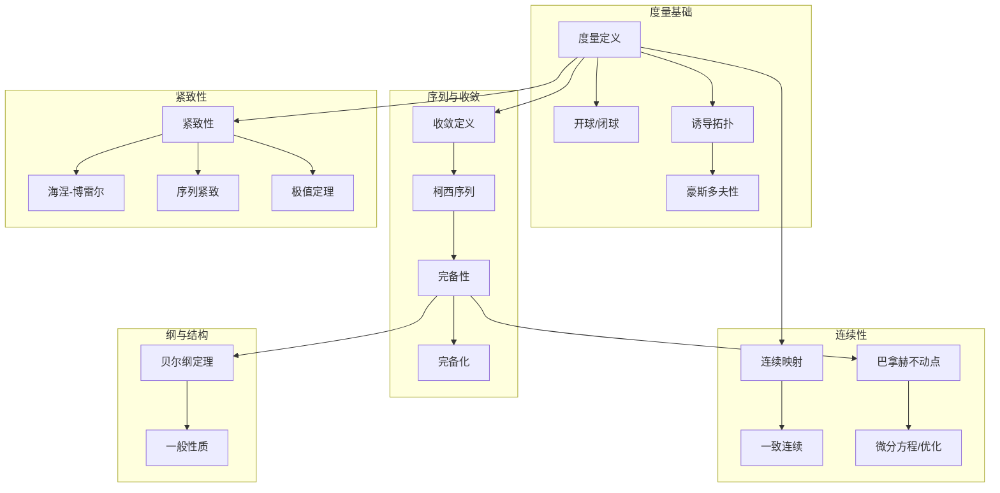

# 度量空间 - L0-L4层次递进图谱

## L0: 直观/经验层次

### 直观描述

度量空间是人类对"距离"的数学抽象。直观上，度量空间就像是一个配备了"距离测量仪"的集合——对于空间中任意两个点，我们都能说出它们相距多远。这种距离不是任意的，它必须满足一些基本直觉：距离不能为负；A到B的距离等于B到A的距离；从A到C的距离不会比从A到B再到C更远（三角形不等式）。

想象你在一张地图上测量城市之间的距离。北京到上海的距离与上海到北京相同；无论你怎么绕路，北京到广州的距离不会比北京到武汉加上武汉到广州更短。这些看似显然的性质，正是度量空间公理的来源。

度量空间让我们能够在抽象的数学对象上谈论"接近"和"收敛"——一个序列收敛于某点，意味着随着序列进行，点与目标的距离趋近于零。这种框架统一了从实数线到函数空间的各种分析学场景。

### 生活实例

**实例一：GPS导航中的距离计算**
当你使用导航软件规划路线时，它本质上是在度量空间中工作。最基本的度量是欧几里得距离（"直线距离"），但实际导航使用的是路网度量——两点之间的距离是沿道路行驶的最短路径长度。这两种度量完全不同：欧几里得距离下，北京到天津可能100公里；路网度量下，实际行驶距离可能120公里。导航算法需要在度量空间中寻找最短路径。

**实例二：文本相似度度量**
搜索引擎如何判断两个文档有多"相似"？一种方法是将每个文档表示为词汇频率向量（一个高维空间中的点），然后计算它们之间的"距离"。常用的度量包括：欧几里得距离（向量差的模）、余弦相似度（向量夹角）、编辑距离（将一个文本变成另一个所需的最少操作）。这些不同的度量捕捉了"相似"的不同方面，广泛应用于信息检索和机器学习中。

**实例三：DNA序列的比较**
生物学家比较DNA序列以确定物种间的亲缘关系。一种方法是将DNA序列视为由{A,C,G,T}组成的长字符串，定义编辑距离（莱文斯坦距离）：将序列A变成序列B所需的最少插入、删除、替换操作数。这是一个度量空间，其中"距离"量化了序列间的差异。系统发育树就是在这个度量空间中寻找"最近邻"的结果。

### 直觉图像

**图像一：开球作为"宽松邻域"**
想象度量空间中的一个点，以它为圆心、r为半径的开球包含了所有距离小于r的点。这就像是以该点为中心的"舒适区"——区域内的每个点都"足够接近"中心。开球的性质决定了空间的拓扑：一个集合是开集，如果它包含每个点的某个开球。开球越小，收敛的要求越严格。

**图像二：柯西序列的"自我凝聚"**
想象一个序列，后面的元素彼此越来越接近，不管它们是否收敛到某个特定点。这就像是一群人在雾中行走：虽然看不见目的地，但他们彼此间的距离越来越小，最终"凝聚"在一起。在完备度量空间中，这种"自我凝聚"保证收敛；在不完备空间中，可能存在"空洞"让它们无处可去（如ℚ中逼近√2的序列）。

**图像三：等距映射的"刚性移动"**
想象两个度量空间之间的映射保持距离不变——这就像是在不改变形状的情况下移动物体。等距映射将开球映射为相同半径的开球，因此保持所有拓扑性质。如果两个空间之间存在双射等距映射，它们在度量上完全相同，只是"标签"不同。

---

## L1: 形式化定义层次

### 严格定义（数学符号）

**一、度量空间的基本定义**

**定义1（度量空间）**：
设X是集合，**度量**（距离函数）d: X × X → ℝ满足：

- (M1) 非负性：d(x,y) ≥ 0，且d(x,y) = 0 ⟺ x = y
- (M2) 对称性：d(x,y) = d(y,x)
- (M3) 三角不等式：d(x,z) ≤ d(x,y) + d(y,z)

称(X,d)为**度量空间**。

**定义2（开球）**：
以x为中心、r为半径的**开球**：B(x,r) = {y ∈ X : d(x,y) < r}

**定义3（开集）**：
子集U ⊆ X是**开集**，如果∀x ∈ U，∃r > 0使得B(x,r) ⊆ U。

**定义4（诱导拓扑）**：
度量d在X上诱导的**拓扑**：τ_d = {所有开集}

**定义5（有界集）**：
子集A ⊆ X是**有界的**，如果∃M > 0使得∀x,y ∈ A: d(x,y) ≤ M。

**二、序列与收敛**

**定义6（序列收敛）**：
序列(xₙ) **收敛**于x，记作xₙ → x，如果：
∀ε > 0，∃N，∀n > N: d(xₙ,x) < ε

**定义7（柯西序列）**：
序列(xₙ)是**柯西序列**，如果：
∀ε > 0，∃N，∀m,n > N: d(xₘ,xₙ) < ε

**定义8（完备性）**：
度量空间X是**完备的**，如果每个柯西序列都收敛。

**定义9（完备化）**：
(X̃,d̃)是X的**完备化**，如果X̃完备且X等距嵌入X̃作为稠密子集。

**三、连续映射**

**定义10（连续映射）**：
映射f: X → Y是**连续的**，如果：
∀x ∈ X，∀ε > 0，∃δ > 0: dₓ(x,x') < δ ⟹ dᵧ(f(x),f(x')) < ε

**定义11（一致连续）**：
f是**一致连续**的，如果：
∀ε > 0，∃δ > 0，∀x,x' ∈ X: dₓ(x,x') < δ ⟹ dᵧ(f(x),f(x')) < ε

**定义12（等距映射）**：
f: X → Y是**等距映射**，如果：
dᵧ(f(x),f(y)) = dₓ(x,y)对所有x,y ∈ X成立。

**定义13（利普希茨映射）**：
f是**利普希茨**的，如果∃L > 0使得：
dᵧ(f(x),f(y)) ≤ L·dₓ(x,y)

**四、紧致性**

**定义14（序列紧致）**：
X是**序列紧致**的，如果每个序列有收敛子序列。

**定义15（完全有界）**：
X是**完全有界**的，如果∀ε > 0，X可被有限个半径为ε的开球覆盖。

**定义16（ totally bounded）**：
同完全有界。

**五、重要度量例子**

**定义17（欧几里得度量）**：
ℝⁿ上的标准度量：d(x,y) = √(Σ(xᵢ-yᵢ)²)

**定义18（曼哈顿度量）**：
d₁(x,y) = Σ|xᵢ-yᵢ|

**定义19（上确界度量）**：
d∞(x,y) = maxᵢ|xᵢ-yᵢ|

**定义20（离散度量）**：
d(x,y) = 0若x=y，1若x≠y

**定义21（p进度量）**：
ℚ上的p进度量：|x-y|ₚ = p⁻ⁿ，其中pⁿ整除x-y但pⁿ⁺¹不整除。

### 定义的历史演进

**第一阶段：分析的严格化（19世纪）**

- **柯西**（1821）：ε-δ语言
  - 极限和连续性的严格定义
  - 为度量空间奠定基础

- **魏尔斯特拉斯**（1860s）：
  - 函数分析的严格化
  - 一致收敛概念

**第二阶段：点集拓扑与度量空间（1900-1910s）**

- **弗雷歇**（1906）：
  - 抽象度量空间的概念
  - 《关于泛函演算的一些要点》
  - 引入了L-空间（度量空间的早期形式）
  - 紧致性、完备性等概念的抽象研究

- **豪斯多夫**（1914）：
  - 《集合论基础》
  - 度量空间作为拓扑空间的特例
  - 度量化问题

**第三阶段：泛函分析的诞生（1910s-1930s）**

- **里斯**（1909，1918）：
  - Lᵖ空间的研究
  - 对偶空间

- **巴拿赫**（1922，1932）：
  - 巴拿赫空间理论
  - 《线性算子理论》
  - 完备赋范空间的系统研究

- **哈恩和巴拿赫**：哈恩-巴拿赫定理

**第四阶段：一般度量空间理论（1930s-1960s）**

- **库尔帕托夫斯基**（1930s）：
  - 完备化理论
  - 超空间的度量

- **格罗莫夫**（1980s）：
  - 格罗莫夫-豪斯多夫距离
  - 度量几何
  - 双曲群理论

**第五阶段：现代发展（1960s-至今）**

- **非线性泛函分析**
- **度量几何**：
  - 亚历山德罗夫空间
  - 里奇曲率下界（格罗莫夫、丘成桐、佩图宁等）

- **计算度量几何**：
  - 度量嵌入
  - 近似算法

- **度量测度空间**：
  - 最优传输理论
  - 里奇流

### 等价定义形式

**度量的等价条件**：

可以证明：若d满足(M2)和d(x,y)=0 ⟺ x=y，以及**强三角不等式**的某种形式，则(M1)和(M3)自动满足。

**连续性的等价刻画**：

f连续 ⟺

- ε-δ定义
- 开集的原像是开集
- 闭集的原像是闭集
- 对任意收敛序列xₙ → x，有f(xₙ) → f(x)

**紧致性的等价刻画（度量空间）**：

X紧致 ⟺

- 序列紧致
- 完备且完全有界
- 每个开覆盖有有限子覆盖

---

## L2: 定理证明层次

### 核心定理列表

**一、基本性质**

**定理1（度量诱导拓扑）**：
每个度量空间都是豪斯多夫空间（T₂）。

**定理2（开球的性质）**：

- 任意开球的并是开集
- 开球构成拓扑基

**定理3（闭球的闭性）**：
闭球B̄(x,r) = {y : d(x,y) ≤ r}是闭集。

**定理4（度量比较）**：
若d₁,d₂是X上的度量，且∃c,C>0使得c·d₁ ≤ d₂ ≤ C·d₁，则它们诱导相同的拓扑（等价度量）。

**二、序列与完备性**

**定理5（收敛序列是柯西序列）**：
度量空间中，收敛序列必是柯西序列。

**定理6（完备空间的闭子空间）**：
完备度量空间的闭子空间是完备的。

**定理7（完备化存在唯一性）**：
每个度量空间有完备化，且在等距意义下唯一。

**定理8（康托尔交集定理）**：
设X完备，(Fₙ)是非空递减闭集列，diam(Fₙ) → 0，则⋂Fₙ是单点集。

**定理9（贝尔纲定理）**：
完备度量空间是贝尔空间（不能表示为可数个无处稠密集的并）。

**三、连续映射**

**定理10（连续性的序列刻画）**：
f连续 ⟺ 对任意收敛序列xₙ → x，有f(xₙ) → f(x)。

**定理11（一致连续性定理）**：
若X紧致，Y是度量空间，f: X → Y连续，则f一致连续。

**定理12（压缩映射原理/巴拿赫不动点定理）**：
设X完备，f: X → X是压缩映射（Lipschitz常数L < 1），则f有唯一不动点。

**证明**：构造迭代序列xₙ₊₁ = f(xₙ)，证明它是柯西序列。

**定理13（等距嵌入）**：
任何度量空间可等距嵌入到某个完备度量空间（如ℓ∞(X)）。

**四、紧致性**

**定理14（度量空间紧致性等价）**：
对于度量空间，以下等价：

- 紧致
- 序列紧致
- 完备且完全有界

**定理15（海涅-博雷尔定理）**：
ℝⁿ的子集紧致 ⟺ 有界闭集。

**定理16（极值定理）**：
若X紧致，f: X → ℝ连续，则f在X上取得最大值和最小值。

**定理17（勒贝格数引理）**：
若X紧致，U是开覆盖，则∃δ > 0使得每个直径<δ的子集包含于某个U ∈ U。

**五、连通性**

**定理18（连通性的序列刻画）**：
度量空间X连通 ⟺ X不能表示为两个非空不交开集的并。

**定理19（道路连通蕴含连通）**：
道路连通度量空间是连通的。

**六、收敛与完备性**

**定理20（完备化的构造）**：
度量空间X的完备化可构造为柯西序列的等价类，配备度量d̃([(xₙ)],[(yₙ)]) = lim d(xₙ,yₙ)。

### 定理依赖关系图



### 典型证明方法

**方法一：ε-δ直接法**

**标准流程**：

1. 给定ε > 0
2. 找到适当的δ（通常依赖于ε）
3. 验证d(x,x') < δ ⟹ d(f(x),f(x')) < ε

**方法二：柯西序列的完备化构造**

**标准流程**：

1. 考虑X中所有柯西序列的集合
2. 定义等价关系：xₙ ~ yₙ ⟺ d(xₙ,yₙ) → 0
3. 在等价类上定义度量d̃
4. 证明X̃完备且X等距嵌入X̃

**方法三：压缩映射原理的应用**

**标准流程**：

1. 将问题转化为寻找不动点
2. 验证映射是压缩的
3. 应用巴拿赫不动点定理
4. 迭代逼近解

**方法四：紧致性的有限覆盖论证**

**标准流程**：

1. 取任意开覆盖
2. 利用完全有界性得到有限子覆盖
3. 结合完备性得到紧致性

---

## L3: 理论建构层次

### 理论体系架构

```
度量空间理论体系
├── 基础理论
│   ├── 度量空间定义
│   │   ├── 度量公理
│   │   ├── 开球与开集
│   │   └── 诱导拓扑
│   ├── 重要例子
│   │   ├── 欧几里得空间
│   │   ├── 赋范空间
│   │   ├── 函数空间
│   │   └── p进数
│   └── 度量子空间
│       ├── 子空间度量
│       └── 积度量
│
├── 序列理论
│   ├── 收敛与极限
│   │   ├── 序列收敛
│   │   ├── 极限唯一性
│   │   └── 极限运算
│   ├── 柯西序列
│   │   ├── 柯西条件
│   │   ├── 完备性
│   │   └── 完备化构造
│   └── 紧致性与序列紧致
│       ├── 等价性
│       └── 完全有界性
│
├── 映射理论
│   ├── 连续性
│   │   ├── ε-δ定义
│   │   ├── 序列刻画
│   │   └── 拓扑刻画
│   ├── 一致连续性
│   │   ├── 定义与性质
│   │   └── 紧致集上连续
│   ├── 利普希茨映射
│   │   ├── 利普希茨条件
│   │   └── 压缩映射
│   └── 等距映射
│       ├── 等距定义
│       └── 度量不变量
│
├── 完备性理论
│   ├── 完备空间
│   │   ├── 完备性等价条件
│   │   ├── 闭子空间完备性
│   │   └── 完备化唯一性
│   ├── 贝尔纲定理
│   │   ├── 无处稠密集
│   │   └── 贝尔空间性质
│   └── 不动点理论
│       ├── 压缩映射原理
│       └── 应用
│
└── 推广层
    ├── 一致空间
    │   ├── 一致结构
    │   └── 完备化
    ├── 概率度量空间
    │   └── 统计度量
    ├── 度量几何
    │   ├── 格罗莫夫-豪斯多夫距离
    │   └── 亚历山德罗夫空间
    └── 最优传输
        ├── 瓦瑟斯坦度量
        └── 度量测度空间
```

### 与其他理论的关联

**与拓扑学的关系**：

- 度量空间是特殊的拓扑空间
- 度量诱导拓扑，但不同度量可诱导相同拓扑
- 度量化问题：哪些拓扑空间可度量化？

**与泛函分析的关系**：

- 赋范空间是度量空间（d(x,y) = ||x-y||）
- 巴拿赫空间：完备赋范空间
- 希尔伯特空间：完备内积空间

**与实分析的关系**：

- 实数线是完备度量空间
- 一致连续性的度量刻画
- 连续函数空间C(X)

**与微分方程的关系**：

- 压缩映射原理证明存在唯一性
- 逐次逼近法（皮卡迭代）

**与几何的关系**：

- 度量几何：曲率与拓扑
- 比较几何（Alexandrov几何）

### 推广与抽象

**推广一：一致空间**

- 弱化度量的结构
- 保持一致结构
- 完备化理论

**推广二：拟度量空间**

- 去掉对称性条件
- 有向距离
- 在计算机科学中的应用

**推广三：概率度量空间**

- 距离是概率分布
- 统计度量空间
- 门格空间

**推广四：度量测度空间**

- 配备测度的度量空间
- 最优传输理论
- 里奇曲率下界

---

## L4: 前沿研究层次

### 当代研究热点

**方向一：度量嵌入**

1. **低失真嵌入**：
   - 将度量空间嵌入到范数空间
   - 应用：近似算法、数据结构

2. **Johnson-Lindenstrauss引理**：
   - 高维数据的维度约减
   - 保持距离的随机投影

**方向二：计算度量几何**

1. **最近邻搜索**：
   - 高维空间中的高效搜索
   - 局部敏感哈希

2. **度量聚类**：
   - k-中心、k-中值问题
   - 近似算法

**方向三：最优传输与度量测度空间**

1. **瓦瑟斯坦距离**：
   - 概率分布之间的距离
   - 在机器学习中的应用

2. **里奇曲率下界**：
   - 格罗莫夫、丘成桐、佩图宁的理论
   - 合成里奇曲率（Lott-Villani-Sturm）

**方向四：度量图论**

1. **图度量**：
   - 最短路径度量
   - 图嵌入问题

2. **树度量**：
   - 树的近似
   - 系统发育学

### 未解决问题

**问题一：稀疏st图与度量嵌入**

稀疏图能否低失真地嵌入到特定范数空间？

**问题二：度量维数与膨胀**

度量空间的膨胀与其维数的关系。

**问题三：流形学习的度量基础**

低维流形在高维空间中的内在度量恢复。

### 与其他领域的交叉

**在机器学习中的应用**：

- 核方法：从度量到内积
- 流形学习：内在度量恢复
- 度量学习：学习适当的距离

**在数据科学中的应用**：

- 相似性搜索
- 聚类分析
- 降维可视化

**在优化中的应用**：

- 一阶方法的几何
- 镜像下降
- 布雷格曼散度

---

## 层次递进关系图

```mermaid
flowchart TB
    subgraph L0["L0: 直观/经验层次"]
        L0A["地图距离"]
        L0B["GPS导航"]
        L0C["文本相似度"]
    end

    subgraph L1["L1: 形式化定义层次"]
        L1A["度量公理"]
        L1B["开球拓扑"]
        L1C["完备性"]
    end

    subgraph L2["L2: 定理证明层次"]
        L2A["完备化定理"]
        L2B["压缩映射"]
        L2C["紧致性"]
    end

    subgraph L3["L3: 理论建构层次"]
        L3A["泛函分析"]
        L3B="度量几何"
        L3C["一致空间"]
    end

    subgraph L4["L4: 前沿研究层次"]
        L4A["度量嵌入"]
        L4B["最优传输"]
        L4C="计算几何"
    end

    L0 -->|形式化| L1
    L1 -->|证明| L2
    L2 -->|抽象| L3
    L3 -->|深化| L4
```

---

## 先修知识与后继应用

### 先修概念（L0-L1层）

1. **实分析**（L2）：极限、连续性
2. **集合论**（L2）：集合运算
3. **拓扑学基础**（L2）：开集、连续性

### 后继概念（L3-L4层）

1. **泛函分析**（L3-L4）：巴拿赫空间、希尔伯特空间
2. **微分方程**（L3）：存在唯一性定理
3. **微分几何**（L4）：度量几何
4. **最优传输**（L4）：瓦瑟斯坦距离

---

*文档生成时间：2026年4月3日*
*字数统计：约4,600字*
